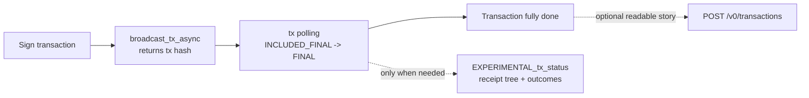
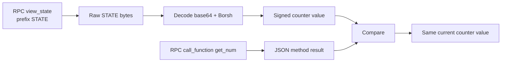
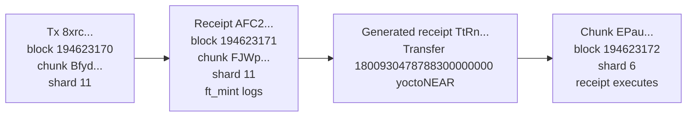

# RPC Examples

Use this page when you already know the answer lives in RPC and you want the shortest path to it. The goal is not to memorize every method. It is to start with the right RPC read or write, stop as soon as the response answers the question, and only switch to a higher-level API when that would save time.

## Transaction Submission and Tracking

Start here when the real question is not just “how do I send this?” but “which RPC endpoint should I use, and how do I track the transaction all the way to done?”

### Submit a transaction, then track it from hash to final execution

Use this when the user story is simple: “I have a signed transaction. Which endpoint do I call first, and what should I poll after I get the hash?” Not every tx question wants the same RPC method. The practical pattern is to submit fast, then track deliberately.

This walkthrough is intentionally pinned and historical. It uses one real mainnet transaction that wrote a NEAR Social follow edge:

- transaction hash: `FLLmTvFx9vCof79scy2uUviF5WwYmevkz9TZ8azPGVQb`
- signer: `mike.near`
- receiver: `social.near`
- included block height: `79574923`
- receipt execution block for the SocialDB write: `79574924`

Because this transaction is already old and finalized, you cannot literally replay its true pending window. That is fine. The point here is to teach the right submission and tracking pattern, then inspect one pinned transaction with the same tools.

<div className="fastnear-example-strategy">
  <div className="fastnear-example-strategy__header">
    <span className="fastnear-example-strategy__eyebrow">Strategy</span>
    <p className="fastnear-example-strategy__title">Submit fast, poll the simpler status path first, and only drop into the receipt tree when the headline status stops being enough.</p>
  </div>
  <div className="fastnear-example-strategy__items">
    <p className="fastnear-example-strategy__item"><span className="fastnear-example-strategy__step">01</span><span><span className="fastnear-example-strategy__code">RPC broadcast_tx_async</span> is the low-latency submission surface when your client will track separately.</span></p>
    <p className="fastnear-example-strategy__item"><span className="fastnear-example-strategy__step">02</span><span><span className="fastnear-example-strategy__code">RPC tx</span> is the default polling surface for included, optimistic, and final guarantees.</span></p>
    <p className="fastnear-example-strategy__item"><span className="fastnear-example-strategy__step">03</span><span><span className="fastnear-example-strategy__code">RPC EXPERIMENTAL_tx_status</span> is the deeper follow-up when you need the receipt tree, not the default loop.</span></p>
  </div>
</div>

**What you're deciding**

- which submission endpoint to reach for first
- what to poll after you have a tx hash
- how `wait_until` thresholds relate to included, optimistic, and final guarantees
- when to stop using `tx` and switch to `EXPERIMENTAL_tx_status`



| Method | Use it when | What comes back | Position here |
| --- | --- | --- | --- |
| [`broadcast_tx_async`](/rpc/transaction/broadcast-tx-async) | your client wants to own tracking after submission | just the tx hash | **default submit path** |
| [`send_tx`](/rpc/transaction/send-tx) | you want the node to wait to a chosen threshold for you | tx result up to `wait_until` | blocking alternative |
| [`broadcast_tx_commit`](/rpc/transaction/broadcast-tx-commit) | older code or quick one-call confirmation is the point | execution result with commit-style waiting | legacy convenience |
| [`tx`](/rpc/transaction/tx-status) | you already have the tx hash and want to know how far it got | status plus outcomes at the threshold you asked for | **default tracking path** |
| [`EXPERIMENTAL_tx_status`](/rpc/transaction/experimental-tx-status) | you need receipt-tree detail or a richer async story | full receipt tree and detailed outcomes | deep follow-up only |

**Status and wait map**

`wait_until` values are waiting thresholds, not a permanent lifecycle enum you should treat as the user's one true transaction status. The word `pending` is still useful in human conversation, but here it means “the transaction has been submitted and is not yet included.”

| Phase or threshold | What it means in practice | Best RPC surface |
| --- | --- | --- |
| pre-inclusion / pending | the client has submitted the tx, but it is not yet anchored in a block | your own submission state plus retry/backoff logic |
| `INCLUDED` | the tx is in a block, but that block may not be final yet | `tx` |
| `INCLUDED_FINAL` | the inclusion block is final | `tx` |
| `EXECUTED_OPTIMISTIC` | execution has happened with optimistic finality | `tx` or `send_tx` |
| `FINAL` | all relevant execution has completed and finalized | `tx` by default, `EXPERIMENTAL_tx_status` when you need more detail |

The key practical distinction is simple:

- use `broadcast_tx_async` when the tx hash is enough to keep going
- use `tx` as the normal tracking loop
- use `EXPERIMENTAL_tx_status` when the next question is about the receipt tree rather than the headline status

**What you're doing**

- Show what a live submission would look like with `broadcast_tx_async`.
- Poll the pinned tx with `tx` at two thresholds: `INCLUDED_FINAL` and `FINAL`.
- Only after that inspect the same tx with `EXPERIMENTAL_tx_status`.
- Optionally pivot to Transactions API if the human-readable story is what matters next.

```bash
RPC_URL=https://rpc.mainnet.fastnear.com
TX_BASE_URL=https://tx.main.fastnear.com
TX_HASH=FLLmTvFx9vCof79scy2uUviF5WwYmevkz9TZ8azPGVQb
SIGNER_ACCOUNT_ID=mike.near
RECEIVER_ID=social.near
```

1. If this were a live client flow, submit with `broadcast_tx_async` and keep the returned hash.

```bash
curl -s "$RPC_URL" \
  -H 'content-type: application/json' \
  --data '{
    "jsonrpc": "2.0",
    "id": "fastnear",
    "method": "broadcast_tx_async",
    "params": ["BASE64_SIGNED_TX"]
  }' \
  | jq .
```

In a real app, that response is the moment you stop waiting on submission and start tracking by tx hash.

2. Poll with `tx` at the first threshold that answers the user question.

```bash
curl -s "$RPC_URL" \
  -H 'content-type: application/json' \
  --data "$(jq -nc \
    --arg tx_hash "$TX_HASH" \
    --arg signer_account_id "$SIGNER_ACCOUNT_ID" '{
      jsonrpc: "2.0",
      id: "fastnear",
      method: "tx",
      params: {
        tx_hash: $tx_hash,
        sender_account_id: $signer_account_id,
        wait_until: "INCLUDED_FINAL"
      }
    }')" \
  | jq '{
      final_execution_status: .result.final_execution_status,
      status: .result.status,
      transaction_handoff: .result.transaction_outcome.outcome.status
    }'
```

What to notice:

- on a live tx, this threshold is useful when you care that the tx is safely included before you claim success to the user
- on this historical tx, it returns immediately because the transaction is long past inclusion
- `transaction_outcome.outcome.status` still tells you that the original action handed off into receipt execution

3. Poll again with `FINAL` when you want the completed transaction story rather than just safe inclusion.

```bash
curl -s "$RPC_URL" \
  -H 'content-type: application/json' \
  --data "$(jq -nc \
    --arg tx_hash "$TX_HASH" \
    --arg signer_account_id "$SIGNER_ACCOUNT_ID" '{
      jsonrpc: "2.0",
      id: "fastnear",
      method: "tx",
      params: {
        tx_hash: $tx_hash,
        sender_account_id: $signer_account_id,
        wait_until: "FINAL"
      }
    }')" \
  | jq '{
      final_execution_status: .result.final_execution_status,
      status: .result.status,
      receipts_outcome_count: (.result.receipts_outcome | length)
    }'
```

What to notice:

- for a historical tx, this call also returns immediately
- in a real tracking loop, this is the threshold that answers “is the transaction actually done?”
- for many apps, this is where you stop and move on

4. Only switch to `EXPERIMENTAL_tx_status` when you need the richer receipt tree.

```bash
curl -s "$RPC_URL" \
  -H 'content-type: application/json' \
  --data "$(jq -nc \
    --arg tx_hash "$TX_HASH" \
    --arg signer_account_id "$SIGNER_ACCOUNT_ID" '{
      jsonrpc: "2.0",
      id: "fastnear",
      method: "EXPERIMENTAL_tx_status",
      params: {
        tx_hash: $tx_hash,
        sender_account_id: $signer_account_id,
        wait_until: "FINAL"
      }
    }')" \
  | jq '{
      final_execution_status: .result.final_execution_status,
      status: .result.status,
      transaction_handoff: .result.transaction_outcome.outcome.status,
      receipts_outcome_count: (.result.receipts_outcome | length)
    }'
```

This is where you go when “did it finish?” turns into “show me the receipt tree and the full async execution story.”

5. Optional: pivot to Transactions API only when you want the readable story surface.

```bash
curl -s "$TX_BASE_URL/v0/transactions" \
  -H 'content-type: application/json' \
  --data "$(jq -nc --arg tx_hash "$TX_HASH" '{tx_hashes: [$tx_hash]}')" \
  | jq '{
      transaction: {
        hash: .transactions[0].transaction.hash,
        signer_id: .transactions[0].transaction.signer_id,
        receiver_id: .transactions[0].transaction.receiver_id,
        included_block_height: .transactions[0].execution_outcome.block_height
      },
      actions: (
        .transactions[0].transaction.actions
        | map(if type == "string" then . else keys[0] end)
      ),
      transaction_handoff: .transactions[0].transaction_outcome.outcome.status
    }'
```

That last step is intentionally optional. The RPC truth is already enough for submission and tracking. This is only the human-readable story surface when the next user question becomes “what actually happened?” instead of “how far did the tx get?”

**Recommended pattern**

- Use `broadcast_tx_async` plus `tx` polling when you want the best client control and the fastest feedback.
- Use `send_tx` when you really do want one blocking call to wait up to a chosen threshold.
- Use `EXPERIMENTAL_tx_status` when the normal polling loop stops being enough and the receipt tree becomes the real question.

## Account and Key Mechanics

Start here when the question is about exact permissions, exact key state, or one contract-level write flow.

### Audit and remove old Near Social function-call keys

Use this when you know an account has accumulated older `social.near` function-call keys and you want to inspect them, choose one intentionally, and remove it with raw RPC submission.

<div className="fastnear-example-strategy">
  <div className="fastnear-example-strategy__header">
    <span className="fastnear-example-strategy__eyebrow">Strategy</span>
    <p className="fastnear-example-strategy__title">Use exact key reads to narrow the target first, then sign exactly one delete.</p>
  </div>
  <div className="fastnear-example-strategy__items">
    <p className="fastnear-example-strategy__item"><span className="fastnear-example-strategy__step">01</span><span><span className="fastnear-example-strategy__code">RPC view_access_key_list</span> finds only the function-call keys scoped to <span className="fastnear-example-strategy__code">social.near</span>.</span></p>
    <p className="fastnear-example-strategy__item"><span className="fastnear-example-strategy__step">02</span><span><span className="fastnear-example-strategy__code">RPC view_access_key</span> double-checks the one key you plan to remove, and <span className="fastnear-example-strategy__code">POST /v0/account</span> is only for optional account-level context.</span></p>
    <p className="fastnear-example-strategy__item"><span className="fastnear-example-strategy__step">03</span><span><span className="fastnear-example-strategy__code">RPC send_tx</span> submits the <span className="fastnear-example-strategy__code">DeleteKey</span>, then <span className="fastnear-example-strategy__code">RPC view_access_key_list</span> closes the loop.</span></p>
  </div>
</div>

**What you're doing**

- Use RPC itself to list every access key on the account.
- Narrow that list to function-call keys scoped to `social.near`.
- Inspect one candidate key exactly before you delete it.
- Build and sign a `DeleteKey` transaction with a full-access key, then submit it through RPC and verify the key is gone.

Two caveats matter up front:

- The deleting key must be a full-access key. A function-call key cannot sign a `DeleteKey` action.
- This flow is about exact key state and cleanup. The optional Transactions API step below gives account-level context, not authoritative per-key “last used” forensics.

```bash
export NETWORK_ID=mainnet
export RPC_URL=https://rpc.mainnet.fastnear.com
export TX_BASE_URL=https://tx.main.fastnear.com
export ACCOUNT_ID=YOUR_ACCOUNT_ID
export SOCIAL_RECEIVER_ID=social.near
export DELETE_PUBLIC_KEY='ed25519:PASTE_THE_KEY_YOU_PLAN_TO_REMOVE'
export FULL_ACCESS_PUBLIC_KEY='ed25519:PASTE_THE_FULL_ACCESS_PUBLIC_KEY_YOU_WILL_SIGN_WITH'
export FULL_ACCESS_PRIVATE_KEY='ed25519:PASTE_THE_MATCHING_FULL_ACCESS_PRIVATE_KEY'
```

1. List all access keys on the account, then narrow to `social.near` function-call keys.

```bash
curl -s "$RPC_URL" \
  -H 'content-type: application/json' \
  --data "$(jq -nc --arg account_id "$ACCOUNT_ID" '{
    jsonrpc: "2.0",
    id: "fastnear",
    method: "query",
    params: {
      request_type: "view_access_key_list",
      account_id: $account_id,
      finality: "final"
    }
  }')" \
  | tee /tmp/fastnear-access-keys.json >/dev/null

jq -r --arg receiver "$SOCIAL_RECEIVER_ID" '
  .result.keys[]
  | select((.access_key.permission | type) == "object")
  | select(.access_key.permission.FunctionCall.receiver_id == $receiver)
  | {
      public_key,
      nonce: .access_key.nonce,
      receiver_id: .access_key.permission.FunctionCall.receiver_id,
      method_names: .access_key.permission.FunctionCall.method_names,
      allowance: (.access_key.permission.FunctionCall.allowance // "unlimited")
    }
' /tmp/fastnear-access-keys.json
```

Pick one `public_key` from that filtered list and set `DELETE_PUBLIC_KEY` to it.

2. Inspect the specific candidate key one more time before deleting it.

```bash
curl -s "$RPC_URL" \
  -H 'content-type: application/json' \
  --data "$(jq -nc \
    --arg account_id "$ACCOUNT_ID" \
    --arg public_key "$DELETE_PUBLIC_KEY" '{
      jsonrpc: "2.0",
      id: "fastnear",
      method: "query",
      params: {
        request_type: "view_access_key",
        account_id: $account_id,
        public_key: $public_key,
        finality: "final"
      }
    }')" \
  | jq '{nonce: .result.nonce, permission: .result.permission}'
```

3. Optional: pull recent function-call activity for the account to decide whether you want to investigate more before cleanup.

```bash
curl -s "$TX_BASE_URL/v0/account" \
  -H 'content-type: application/json' \
  --data "$(jq -nc --arg account_id "$ACCOUNT_ID" '{
    account_id: $account_id,
    is_function_call: true,
    limit: 10
  }')" \
  | jq '{
    account_txs: [
      .account_txs[]
      | {
          transaction_hash,
          tx_block_height,
          is_success
        }
    ]
  }'
```

That query helps answer “has this account still been doing function-call work recently?”, but it does not prove that a specific access key was the one used.

4. Sign a `DeleteKey` transaction for `DELETE_PUBLIC_KEY` with a full-access key.

Run this in a directory where `near-api-js@5` is installed. The command reads the environment variables above, fetches the latest nonce for `FULL_ACCESS_PUBLIC_KEY`, fetches a fresh final block hash, signs a `DeleteKey` action, and stores the resulting `signed_tx_base64` in `SIGNED_TX_BASE64`.

```bash
SIGNED_TX_BASE64="$(
  node --input-type=module <<'EOF'
import { InMemorySigner, KeyPair, transactions, utils } from 'near-api-js';

const {
  ACCOUNT_ID,
  NETWORK_ID = 'mainnet',
  RPC_URL = 'https://rpc.mainnet.fastnear.com',
  DELETE_PUBLIC_KEY,
  FULL_ACCESS_PUBLIC_KEY,
  FULL_ACCESS_PRIVATE_KEY,
} = process.env;

for (const name of [
  'ACCOUNT_ID',
  'DELETE_PUBLIC_KEY',
  'FULL_ACCESS_PUBLIC_KEY',
  'FULL_ACCESS_PRIVATE_KEY',
]) {
  if (!process.env[name]) {
    throw new Error(`Missing ${name}`);
  }
}

async function rpc(method, params) {
  const response = await fetch(RPC_URL, {
    method: 'POST',
    headers: { 'content-type': 'application/json' },
    body: JSON.stringify({
      jsonrpc: '2.0',
      id: 'fastnear',
      method,
      params,
    }),
  });
  const json = await response.json();
  if (json.error) {
    throw new Error(JSON.stringify(json.error));
  }
  return json.result;
}

const keyPair = KeyPair.fromString(FULL_ACCESS_PRIVATE_KEY);
const derivedPublicKey = keyPair.getPublicKey().toString();

if (derivedPublicKey !== FULL_ACCESS_PUBLIC_KEY) {
  throw new Error(
    `FULL_ACCESS_PUBLIC_KEY does not match FULL_ACCESS_PRIVATE_KEY (${derivedPublicKey})`
  );
}

const signer = await InMemorySigner.fromKeyPair(NETWORK_ID, ACCOUNT_ID, keyPair);

const accessKey = await rpc('query', {
  request_type: 'view_access_key',
  account_id: ACCOUNT_ID,
  public_key: FULL_ACCESS_PUBLIC_KEY,
  finality: 'final',
});

const block = await rpc('block', { finality: 'final' });

const transaction = transactions.createTransaction(
  ACCOUNT_ID,
  utils.PublicKey.fromString(FULL_ACCESS_PUBLIC_KEY),
  ACCOUNT_ID,
  BigInt(accessKey.nonce) + 1n,
  [transactions.deleteKey(utils.PublicKey.fromString(DELETE_PUBLIC_KEY))],
  utils.serialize.base_decode(block.header.hash)
);

const [, signedTx] = await transactions.signTransaction(
  transaction,
  signer,
  ACCOUNT_ID,
  NETWORK_ID
);

process.stdout.write(Buffer.from(signedTx.encode()).toString('base64'));
EOF
)"
```

5. Submit the signed transaction through raw RPC and wait for `FINAL`.

```bash
curl -s "$RPC_URL" \
  -H 'content-type: application/json' \
  --data "$(jq -nc --arg signed_tx_base64 "$SIGNED_TX_BASE64" '{
    jsonrpc: "2.0",
    id: "fastnear",
    method: "send_tx",
    params: {
      signed_tx_base64: $signed_tx_base64,
      wait_until: "FINAL"
    }
  }')" \
  | jq '{
    final_execution_status: .result.final_execution_status,
    transaction_hash: .result.transaction.hash,
    status: .result.status
  }'
```

6. Re-run the access-key list and verify that the deleted key is gone.

```bash
if curl -s "$RPC_URL" \
  -H 'content-type: application/json' \
  --data "$(jq -nc --arg account_id "$ACCOUNT_ID" '{
    jsonrpc: "2.0",
    id: "fastnear",
    method: "query",
    params: {
      request_type: "view_access_key_list",
      account_id: $account_id,
      finality: "final"
    }
  }')" \
  | jq -e --arg public_key "$DELETE_PUBLIC_KEY" '
      .result.keys[]
      | select(.public_key == $public_key)
    ' >/dev/null; then
  echo "Key is still present: $DELETE_PUBLIC_KEY"
else
  echo "Key deleted: $DELETE_PUBLIC_KEY"
fi
```

**Why this next step?**

Re-running `view_access_key_list` closes the loop on the same RPC method you used for discovery. If the delete succeeded there, you do not need an indexed API to prove the cleanup.

### Which transaction added this `social.near` function-call key, and who authorized it?

Use this when you can already see a live access key on the account, but you want to trace it back to the `AddKey` transaction that created it and identify which public key actually authorized that change.

<div className="fastnear-example-strategy">
  <div className="fastnear-example-strategy__header">
    <span className="fastnear-example-strategy__eyebrow">Strategy</span>
    <p className="fastnear-example-strategy__title">Start from the live key, then walk backward only as far as you need.</p>
  </div>
  <div className="fastnear-example-strategy__items">
    <p className="fastnear-example-strategy__item"><span className="fastnear-example-strategy__step">01</span><span><span className="fastnear-example-strategy__code">RPC view_access_key</span> gives the current stored nonce, which is the best historical clue you have.</span></p>
    <p className="fastnear-example-strategy__item"><span className="fastnear-example-strategy__step">02</span><span><span className="fastnear-example-strategy__code">POST /v0/account</span> turns that nonce into a tight candidate window instead of a whole-account search.</span></p>
    <p className="fastnear-example-strategy__item"><span className="fastnear-example-strategy__step">03</span><span><span className="fastnear-example-strategy__code">POST /v0/transactions</span> tells you whether the key was added directly or through delegated authorization, and <span className="fastnear-example-strategy__code">POST /v0/receipt</span> is only for the exact <span className="fastnear-example-strategy__code">AddKey</span> execution block.</span></p>
  </div>
</div>

**What you're doing**

- Read the exact key first with RPC and keep its current nonce as the clue.
- Convert that nonce into a tight block-height window for the likely `AddKey` receipt.
- Search account history only inside that window instead of scanning the whole account.
- Hydrate the candidate transaction and distinguish three different keys:
  - the key that got added
  - the top-level signer public key
  - the delegated authorizing public key, if the change was wrapped in a `Delegate` action

Three nonce details matter up front:

- New access keys start with a nonce derived from block height at roughly `block_height * 1_000_000`, so dividing the current nonce by `1_000_000` gives a useful search window.
- The `AddKey` action payload often shows `access_key.nonce: 0`. That is not the stored nonce you later see from `view_access_key`.
- If the key has been used heavily since creation, widen the search window a bit more.

```bash
export NETWORK_ID=mainnet
export RPC_URL=https://rpc.mainnet.fastnear.com
export TX_BASE_URL=https://tx.main.fastnear.com
export ACCOUNT_ID=YOUR_ACCOUNT_ID
export TARGET_PUBLIC_KEY='ed25519:PASTE_THE_ACCESS_KEY_YOU_WANT_TO_TRACE'

# Sample live key observed on April 18, 2026:
# export ACCOUNT_ID=mike.near
# export TARGET_PUBLIC_KEY='ed25519:7GZgXkMPEyGXqRhxaLvHxWn6fVfeyuQGMqnLVQAh7bs'
```

1. Read the exact key first, then turn its current nonce into a search window.

```bash
curl -s "$RPC_URL" \
  -H 'content-type: application/json' \
  --data "$(jq -nc \
    --arg account_id "$ACCOUNT_ID" \
    --arg public_key "$TARGET_PUBLIC_KEY" '{
      jsonrpc: "2.0",
      id: "fastnear",
      method: "query",
      params: {
        request_type: "view_access_key",
        account_id: $account_id,
        public_key: $public_key,
        finality: "final"
      }
    }')" \
  | tee /tmp/key-origin-view.json >/dev/null

CURRENT_NONCE="$(jq -r '.result.nonce' /tmp/key-origin-view.json)"
ESTIMATED_RECEIPT_BLOCK="$(( CURRENT_NONCE / 1000000 + 1 ))"
SEARCH_FROM="$(( ESTIMATED_RECEIPT_BLOCK - 20 ))"
SEARCH_TO="$(( ESTIMATED_RECEIPT_BLOCK + 5 ))"

jq -n \
  --arg account_id "$ACCOUNT_ID" \
  --arg target_public_key "$TARGET_PUBLIC_KEY" \
  --argjson current_nonce "$CURRENT_NONCE" \
  --argjson estimated_receipt_block "$ESTIMATED_RECEIPT_BLOCK" \
  --argjson search_from "$SEARCH_FROM" \
  --argjson search_to "$SEARCH_TO" \
  --arg permission "$(jq -c '.result.permission' /tmp/key-origin-view.json)" '{
    account_id: $account_id,
    target_public_key: $target_public_key,
    current_nonce: $current_nonce,
    estimated_receipt_block: $estimated_receipt_block,
    search_from_tx_block_height: $search_from,
    search_to_tx_block_height: $search_to,
    permission: ($permission | fromjson)
  }'
```

If you use the sample key above, the estimated receipt block should land at `112057392`.

2. Search account history only inside that block neighborhood.

```bash
curl -s "$TX_BASE_URL/v0/account" \
  -H 'content-type: application/json' \
  --data "$(jq -nc \
    --arg account_id "$ACCOUNT_ID" \
    --argjson from_tx_block_height "$SEARCH_FROM" \
    --argjson to_tx_block_height "$SEARCH_TO" '{
      account_id: $account_id,
      is_real_signer: true,
      from_tx_block_height: $from_tx_block_height,
      to_tx_block_height: $to_tx_block_height,
      desc: false,
      limit: 50
    }')" \
  | tee /tmp/key-origin-candidates.json >/dev/null

jq '{
  txs_count,
  candidate_txs: [
    .account_txs[]
    | {
        transaction_hash,
        tx_block_height,
        is_signer,
        is_real_signer,
        is_predecessor,
        is_receiver
      }
  ]
}' /tmp/key-origin-candidates.json
```

With the sample `mike.near` key above, this window returns one candidate transaction: `6ZT8UGPRC6L3NGs2qHnECPVexKWNQ5LWLK9w95tgj3tV` at outer tx block `112057390`.

3. Hydrate those candidates and keep only the transaction that actually added your target key.

```bash
TX_HASHES_JSON="$(
  jq -c '[.account_txs[].transaction_hash]' /tmp/key-origin-candidates.json
)"

curl -s "$TX_BASE_URL/v0/transactions" \
  -H 'content-type: application/json' \
  --data "$(jq -nc --argjson tx_hashes "$TX_HASHES_JSON" '{tx_hashes: $tx_hashes}')" \
  | tee /tmp/key-origin-transactions.json >/dev/null

jq --arg target_public_key "$TARGET_PUBLIC_KEY" '
  .transactions[]
  | . as $tx
  | (
      ($tx.transaction.actions[]?
        | .AddKey?
        | select(.public_key == $target_public_key)
        | {
            authorization_mode: "direct",
            top_level_signer_id: $tx.transaction.signer_id,
            top_level_signer_public_key: $tx.transaction.public_key,
            authorizing_public_key: $tx.transaction.public_key,
            added_public_key: .public_key,
            add_key_payload_nonce: .access_key.nonce,
            permission: .access_key.permission
          }),
      ($tx.transaction.actions[]?
        | .Delegate?
        | .delegate_action as $delegate
        | $delegate.actions[]?
        | .AddKey?
        | select(.public_key == $target_public_key)
        | {
            authorization_mode: "delegated",
            top_level_signer_id: $tx.transaction.signer_id,
            top_level_signer_public_key: $tx.transaction.public_key,
            authorizing_public_key: $delegate.public_key,
            added_public_key: .public_key,
            add_key_payload_nonce: .access_key.nonce,
            permission: .access_key.permission
          })
    )
  | {
      transaction_hash: $tx.transaction.hash,
      tx_block_height: $tx.execution_outcome.block_height,
      tx_block_hash: $tx.execution_outcome.block_hash,
      receiver_id: $tx.transaction.receiver_id
    } + .
' /tmp/key-origin-transactions.json | tee /tmp/key-origin-match.json
```

If `authorization_mode` is `direct`, the top-level signer public key and the authorizing public key are the same. If `authorization_mode` is `delegated`, the key that actually authorized the `AddKey` lives inside `Delegate.delegate_action.public_key`.

With the sample `mike.near` key above, the match is delegated:

- `transaction_hash`: `6ZT8UGPRC6L3NGs2qHnECPVexKWNQ5LWLK9w95tgj3tV`
- `top_level_signer_public_key`: `ed25519:Ez817Dgs2uYP5a6GoijzFarcS3SWPT5eEB82VJXsd4oM`
- `authorizing_public_key`: `ed25519:GaYgzN1eZUgwA7t8a5pYxFGqtF4kon9dQaDMjPDejsiu`
- `added_public_key`: `ed25519:7GZgXkMPEyGXqRhxaLvHxWn6fVfeyuQGMqnLVQAh7bs`

4. Optional: if you need the exact `AddKey` receipt block too, pivot one more time by receipt ID.

```bash
ADD_KEY_RECEIPT_ID="$(
  jq -r --arg target_public_key "$TARGET_PUBLIC_KEY" '
    .transactions[]
    | .receipts[]
    | select(any((.receipt.receipt.Action.actions // [])[]; .AddKey.public_key? == $target_public_key))
    | .receipt.receipt_id
  ' /tmp/key-origin-transactions.json | head -n 1
)"

curl -s "$TX_BASE_URL/v0/receipt" \
  -H 'content-type: application/json' \
  --data "$(jq -nc --arg receipt_id "$ADD_KEY_RECEIPT_ID" '{receipt_id: $receipt_id}')" \
  | jq '{
      receipt_id: .receipt.receipt_id,
      receipt_block_height: .receipt.block_height,
      tx_block_height: .receipt.tx_block_height,
      predecessor_id: .receipt.predecessor_id,
      receiver_id: .receipt.receiver_id,
      transaction_hash: .receipt.transaction_hash
    }'
```

For the sample key above, the exact `AddKey` receipt is `C5jsTftYwPiibyxdoDKd4LXFFru8n4weDKLV4cfb1bcX` in receipt block `112057392`, while the outer transaction landed earlier in block `112057390`.

**Why this next step?**

Start with exact current key state because it gives you the nonce clue. A tight `/v0/account` window turns that clue into a small candidate set. `/v0/transactions` tells you whether the key was added directly or through delegated authorization. `/v0/receipt` is the optional last step when you need the exact `AddKey` receipt block, not just the outer transaction.

### Register FT storage if needed, then transfer tokens

Use this when the user story is “send fungible tokens safely, but first prove whether the receiver is already registered for storage on that FT contract.”

<div className="fastnear-example-strategy">
  <div className="fastnear-example-strategy__header">
    <span className="fastnear-example-strategy__eyebrow">Strategy</span>
    <p className="fastnear-example-strategy__title">Read storage first, then spend the minimum write calls needed to make the transfer stick.</p>
  </div>
  <div className="fastnear-example-strategy__items">
    <p className="fastnear-example-strategy__item"><span className="fastnear-example-strategy__step">01</span><span><span className="fastnear-example-strategy__code">RPC call_function storage_balance_of</span> tells you whether the receiver is already registered.</span></p>
    <p className="fastnear-example-strategy__item"><span className="fastnear-example-strategy__step">02</span><span><span className="fastnear-example-strategy__code">RPC call_function storage_balance_bounds</span> only matters if you need the exact minimum deposit before writing.</span></p>
    <p className="fastnear-example-strategy__item"><span className="fastnear-example-strategy__step">03</span><span><span className="fastnear-example-strategy__code">RPC send_tx</span> submits <span className="fastnear-example-strategy__code">storage_deposit</span> and <span className="fastnear-example-strategy__code">ft_transfer</span>, then <span className="fastnear-example-strategy__code">RPC call_function ft_balance_of</span> proves the result.</span></p>
  </div>
</div>

**Network**

- testnet

**Official references**

- [FT storage and transfer](https://docs.near.org/integrations/fungible-tokens)
- [Pre-deployed FT contract](https://docs.near.org/tutorials/fts/predeployed-contract)

This walkthrough uses the safe public contract `ft.predeployed.examples.testnet`. Before you start, make sure the sender already holds some `gtNEAR` there. If not, mint a small balance first with the pre-deployed contract guide above and then come back to this flow.

**What you're doing**

- Use exact RPC view calls to check whether the receiver already has FT storage on the contract.
- If needed, fetch the minimum storage requirement.
- Sign and submit `storage_deposit`, then `ft_transfer`.
- Verify the receiver balance with the same contract’s own view method.

```bash
export NETWORK_ID=testnet
export RPC_URL=https://rpc.testnet.fastnear.com
export TOKEN_CONTRACT_ID=ft.predeployed.examples.testnet
export SENDER_ACCOUNT_ID=YOUR_ACCOUNT_ID.testnet
export RECEIVER_ACCOUNT_ID=YOUR_RECEIVER_ID.testnet
export SENDER_PUBLIC_KEY='ed25519:YOUR_FULL_ACCESS_PUBLIC_KEY'
export SENDER_PRIVATE_KEY='ed25519:YOUR_MATCHING_PRIVATE_KEY'
export AMOUNT_YOCTO_GTNEAR='10000000000000000000000'
```

1. Check whether the receiver is already registered on the FT contract.

```bash
STORAGE_BALANCE_ARGS_BASE64="$(
  jq -nc --arg account_id "$RECEIVER_ACCOUNT_ID" '{
    account_id: $account_id
  }' | base64 | tr -d '\n'
)"

curl -s "$RPC_URL" \
  -H 'content-type: application/json' \
  --data "$(jq -nc \
    --arg account_id "$TOKEN_CONTRACT_ID" \
    --arg args_base64 "$STORAGE_BALANCE_ARGS_BASE64" '{
      jsonrpc: "2.0",
      id: "fastnear",
      method: "query",
      params: {
        request_type: "call_function",
        account_id: $account_id,
        method_name: "storage_balance_of",
        args_base64: $args_base64,
        finality: "final"
      }
    }')" \
  | tee /tmp/ft-storage-balance.json >/dev/null

jq '{
  registered: ((.result.result | implode | fromjson) != null),
  storage_balance: (.result.result | implode | fromjson)
}' /tmp/ft-storage-balance.json
```

2. If the receiver is not registered yet, fetch the minimum storage deposit.

```bash
MIN_STORAGE_YOCTO="$(
  curl -s "$RPC_URL" \
    -H 'content-type: application/json' \
    --data "$(jq -nc --arg account_id "$TOKEN_CONTRACT_ID" '{
      jsonrpc: "2.0",
      id: "fastnear",
      method: "query",
      params: {
        request_type: "call_function",
        account_id: $account_id,
        method_name: "storage_balance_bounds",
        args_base64: "e30=",
        finality: "final"
      }
    }')" \
    | tee /tmp/ft-storage-bounds.json \
    | jq -r '.result.result | implode | fromjson | .min'
)"

printf 'Minimum storage deposit: %s yoctoNEAR\n' "$MIN_STORAGE_YOCTO"
```

3. Define one reusable signer for contract function calls.

Run this in a directory where `near-api-js@5` is installed. The function below reads the exported shell variables above and turns each function call into a signed payload for raw RPC submission.

```bash
sign_function_call() {
  METHOD_NAME="$1" \
  ARGS_JSON="$2" \
  DEPOSIT_YOCTO="$3" \
  GAS_TGAS="$4" \
  node --input-type=module <<'EOF'
import { InMemorySigner, KeyPair, transactions, utils } from 'near-api-js';

const {
  NETWORK_ID = 'testnet',
  RPC_URL = 'https://rpc.testnet.fastnear.com',
  TOKEN_CONTRACT_ID,
  SENDER_ACCOUNT_ID,
  SENDER_PUBLIC_KEY,
  SENDER_PRIVATE_KEY,
  METHOD_NAME,
  ARGS_JSON,
  DEPOSIT_YOCTO = '0',
  GAS_TGAS = '100',
} = process.env;

for (const name of [
  'TOKEN_CONTRACT_ID',
  'SENDER_ACCOUNT_ID',
  'SENDER_PUBLIC_KEY',
  'SENDER_PRIVATE_KEY',
  'METHOD_NAME',
  'ARGS_JSON',
]) {
  if (!process.env[name]) {
    throw new Error(`Missing ${name}`);
  }
}

async function rpc(method, params) {
  const response = await fetch(RPC_URL, {
    method: 'POST',
    headers: { 'content-type': 'application/json' },
    body: JSON.stringify({
      jsonrpc: '2.0',
      id: 'fastnear',
      method,
      params,
    }),
  });
  const json = await response.json();
  if (json.error) {
    throw new Error(JSON.stringify(json.error));
  }
  return json.result;
}

const keyPair = KeyPair.fromString(SENDER_PRIVATE_KEY);
const signer = await InMemorySigner.fromKeyPair(
  NETWORK_ID,
  SENDER_ACCOUNT_ID,
  keyPair
);

const derivedPublicKey = keyPair.getPublicKey().toString();
if (derivedPublicKey !== SENDER_PUBLIC_KEY) {
  throw new Error(
    `SENDER_PUBLIC_KEY does not match SENDER_PRIVATE_KEY (${derivedPublicKey})`
  );
}

const accessKey = await rpc('query', {
  request_type: 'view_access_key',
  account_id: SENDER_ACCOUNT_ID,
  public_key: SENDER_PUBLIC_KEY,
  finality: 'final',
});

const block = await rpc('block', { finality: 'final' });

const action = transactions.functionCall(
  METHOD_NAME,
  Buffer.from(ARGS_JSON),
  BigInt(GAS_TGAS) * 10n ** 12n,
  BigInt(DEPOSIT_YOCTO)
);

const transaction = transactions.createTransaction(
  SENDER_ACCOUNT_ID,
  utils.PublicKey.fromString(SENDER_PUBLIC_KEY),
  TOKEN_CONTRACT_ID,
  BigInt(accessKey.nonce) + 1n,
  [action],
  utils.serialize.base_decode(block.header.hash)
);

const [, signedTx] = await transactions.signTransaction(
  transaction,
  signer,
  SENDER_ACCOUNT_ID,
  NETWORK_ID
);

process.stdout.write(Buffer.from(signedTx.encode()).toString('base64'));
EOF
}
```

4. If needed, register the receiver for storage first.

```bash
if jq -e '.result.result | implode | fromjson == null' /tmp/ft-storage-balance.json >/dev/null; then
  SIGNED_TX_BASE64="$(
    sign_function_call \
      storage_deposit \
      "$(jq -nc --arg account_id "$RECEIVER_ACCOUNT_ID" '{
        account_id: $account_id,
        registration_only: true
      }')" \
      "$MIN_STORAGE_YOCTO" \
      100
  )"

  curl -s "$RPC_URL" \
    -H 'content-type: application/json' \
    --data "$(jq -nc --arg signed_tx_base64 "$SIGNED_TX_BASE64" '{
      jsonrpc: "2.0",
      id: "fastnear",
      method: "send_tx",
      params: {
        signed_tx_base64: $signed_tx_base64,
        wait_until: "FINAL"
      }
    }')" \
    | jq '{
        final_execution_status: .result.final_execution_status,
        transaction_hash: .result.transaction.hash
      }'
fi
```

5. Transfer the FT after storage is ready.

```bash
SIGNED_TX_BASE64="$(
  sign_function_call \
    ft_transfer \
    "$(jq -nc \
      --arg receiver_id "$RECEIVER_ACCOUNT_ID" \
      --arg amount "$AMOUNT_YOCTO_GTNEAR" '{
        receiver_id: $receiver_id,
        amount: $amount,
        memo: "FastNear RPC example"
      }')" \
    1 \
    100
)"

curl -s "$RPC_URL" \
  -H 'content-type: application/json' \
  --data "$(jq -nc --arg signed_tx_base64 "$SIGNED_TX_BASE64" '{
    jsonrpc: "2.0",
    id: "fastnear",
    method: "send_tx",
    params: {
      signed_tx_base64: $signed_tx_base64,
      wait_until: "FINAL"
    }
  }')" \
  | jq '{
      final_execution_status: .result.final_execution_status,
      transaction_hash: .result.transaction.hash,
      status: .result.status
    }'
```

6. Verify the receiver’s FT balance with the contract’s own view method.

```bash
RECEIVER_BALANCE_ARGS_BASE64="$(
  jq -nc --arg account_id "$RECEIVER_ACCOUNT_ID" '{
    account_id: $account_id
  }' | base64 | tr -d '\n'
)"

curl -s "$RPC_URL" \
  -H 'content-type: application/json' \
  --data "$(jq -nc \
    --arg account_id "$TOKEN_CONTRACT_ID" \
    --arg args_base64 "$RECEIVER_BALANCE_ARGS_BASE64" '{
      jsonrpc: "2.0",
      id: "fastnear",
      method: "query",
      params: {
        request_type: "call_function",
        account_id: $account_id,
        method_name: "ft_balance_of",
        args_base64: $args_base64,
        finality: "final"
      }
    }')" \
  | jq '{
      receiver_balance: (.result.result | implode | fromjson)
    }'
```

**Why this next step?**

This is a good RPC example because every step stays close to the contract itself: first check storage state, then send the minimum required change calls, then verify the post-transfer balance directly on the contract.

## Contract Reads and Raw State

Start here when the question is “does this contract method tell me enough?” versus “should I read the storage directly?”

### Read a counter straight from contract state, then confirm it with the view method

Use this when the user story is simple: “I know this contract exposes a counter, but can I read that number straight from storage without calling the contract code?”

This walkthrough uses the live public testnet contract `counter.near-examples.testnet`. The number can change over time. That is fine. The point is that both reads agree when you run them:

- `view_state` reads the raw `STATE` entry directly from contract storage
- `call_function get_num` asks the contract for the same current number through its public view API

<div className="fastnear-example-strategy">
  <div className="fastnear-example-strategy__header">
    <span className="fastnear-example-strategy__eyebrow">Strategy</span>
    <p className="fastnear-example-strategy__title">Read the raw storage first, decode the bytes you got back, then let the contract confirm the same answer through its view method.</p>
  </div>
  <div className="fastnear-example-strategy__items">
    <p className="fastnear-example-strategy__item"><span className="fastnear-example-strategy__step">01</span><span><span className="fastnear-example-strategy__code">RPC view_state</span> reads the raw <span className="fastnear-example-strategy__code">STATE</span> entry without running contract code.</span></p>
    <p className="fastnear-example-strategy__item"><span className="fastnear-example-strategy__step">02</span><span>Decode the base64 value into bytes, then interpret those bytes with the contract’s known Borsh layout.</span></p>
    <p className="fastnear-example-strategy__item"><span className="fastnear-example-strategy__step">03</span><span><span className="fastnear-example-strategy__code">RPC call_function get_num</span> is the friendly cross-check that the raw-state read and the view method still agree.</span></p>
  </div>
</div>

The mental model matters more than the counter itself:

- `view_state` is a direct storage read from the trie
- `call_function` executes a read-only method on the contract
- both can answer the same question, but they do different work to get there



**What you're doing**

- Read the raw `STATE` key from contract storage.
- Decode the returned bytes into the current signed counter value.
- Call `get_num` through the view method and confirm that the method answer matches the raw-state decode.

```bash
export NETWORK_ID=testnet
export RPC_URL=https://rpc.testnet.fastnear.com
export CONTRACT_ID=counter.near-examples.testnet
export STATE_PREFIX_BASE64=U1RBVEU=
```

1. Read the raw contract state first.

```bash
curl -s "$RPC_URL" \
  -H 'content-type: application/json' \
  --data "$(jq -nc \
    --arg account_id "$CONTRACT_ID" \
    --arg prefix_base64 "$STATE_PREFIX_BASE64" '{
      jsonrpc: "2.0",
      id: "fastnear",
      method: "query",
      params: {
        request_type: "view_state",
        account_id: $account_id,
        prefix_base64: $prefix_base64,
        finality: "final"
      }
    }')" \
  | tee /tmp/counter-view-state.json >/dev/null

jq '{
  block_height: .result.block_height,
  key_base64: .result.values[0].key,
  value_base64: .result.values[0].value
}' /tmp/counter-view-state.json

jq -r '.result.values[0].key | @base64d' /tmp/counter-view-state.json
```

That last command should print `STATE`. This is the key family you already knew ahead of time, so `view_state` can go straight to the raw storage entry without asking the contract to execute any method.

2. Decode the returned value bytes into the signed counter.

```bash
RAW_VALUE_BASE64="$(jq -r '.result.values[0].value' /tmp/counter-view-state.json)"

python3 - "$RAW_VALUE_BASE64" <<'PY' | jq .
import base64
import json
import sys

raw = base64.b64decode(sys.argv[1])

print(json.dumps({
    "value_base64": sys.argv[1],
    "bytes": list(raw),
    "hex": raw.hex(),
    "signed_i8": int.from_bytes(raw, "little", signed=True),
    "unsigned_u8": int.from_bytes(raw, "little", signed=False),
}))
PY
```

For this specific contract, one byte is enough because the Rust counter stores `val: i8` inside the contract state. That is why a raw value like `CQ==` decodes to one byte `0x09`, which reads as the signed integer `9`.

One small signed-value note is worth keeping in your head: if the counter were negative, the same one-byte payload would still decode correctly as a signed two's-complement `i8`. For example, `/w==` is the single byte `0xff`, which means `-1` as `signed_i8`, not `255`.

The reusable recipe is small:

- `view_state` gives you base64-encoded raw bytes
- you decode those bytes with the contract’s known storage layout
- for larger contracts, that layout may be more complex, but the idea is the same: bytes first, schema second

3. Now ask the contract the friendly way and compare.

```bash
curl -s "$RPC_URL" \
  -H 'content-type: application/json' \
  --data "$(jq -nc --arg account_id "$CONTRACT_ID" '{
    jsonrpc: "2.0",
    id: "fastnear",
    method: "query",
    params: {
      request_type: "call_function",
      account_id: $account_id,
      method_name: "get_num",
      args_base64: "e30=",
      finality: "final"
    }
  }')" \
  | tee /tmp/counter-call-function.json >/dev/null

jq '{
  block_height: .result.block_height,
  view_method_value: (.result.result | implode | fromjson)
}' /tmp/counter-call-function.json
```

4. Compare both answers directly.

```bash
RAW_STATE_NUMBER="$(
  python3 - "$RAW_VALUE_BASE64" <<'PY'
import base64
import sys

raw = base64.b64decode(sys.argv[1])
print(int.from_bytes(raw, "little", signed=True))
PY
)"

VIEW_METHOD_NUMBER="$(
  jq -r '.result.result | implode | fromjson' /tmp/counter-call-function.json
)"

jq -n \
  --argjson raw_state "$RAW_STATE_NUMBER" \
  --argjson view_method "$VIEW_METHOD_NUMBER" '{
    raw_state: $raw_state,
    view_method: $view_method,
    agrees_now: ($raw_state == $view_method)
  }'
```

If `agrees_now` is `true`, you have proved the point of the example:

- `view_state` answered the question by reading storage directly
- `call_function get_num` answered the same question by running the contract’s public read method

**Why this next step?**

Use `view_state` when the real question is about exact storage and you already know the key family. Use `call_function` when you want the contract’s public read API. If the next question becomes historical instead of “what is it right now?”, that is the moment to widen into [KV FastData API](/fastdata/kv).

## Chunk and Shard Tracing

Start here when the question is no longer just “did this transaction succeed?” but “which shard-local chunk actually executed each leg of the work?”

### Trace a generated transfer receipt from one shard chunk to another

Use this when the contract call itself was only the start of the story. In this pinned mainnet case, the signed transaction starts on shard `11`, then a generated `Transfer` receipt finishes on shard `6`. That cross-shard handoff is exactly why chunk-level inspection matters.

This walkthrough is pinned to:

- transaction `8xrcQU6Sr1jhnigenBbpfGzk9jN24rLmMqSWT7TF7xJP` from `7419369993.tg` to `game.hot.tg` calling `l2_claim`
- origin chunk `BfydTxiPbGY34pejscBytYSXpBsk9gWA2ixKoAe7VsVw` on shard `11` in block `194623170`
- first receipt chunk `FJWpAYzVXbZwqJUbGXELTnnBBkdvc6W8vWkwuUA3Zwz9` on shard `11` in block `194623171`
- generated `Transfer` receipt `TtRn4DzLKzFmGEn5YqoZ35ts411Hz6Ci6WQMjphPMn4`
- destination chunk `EPauY1GBaeAgGf1TikxFcPUhmYsVhLf1cwy14vAYsUuU` on shard `6` in block `194623172`

<div className="fastnear-example-strategy">
  <div className="fastnear-example-strategy__header">
    <span className="fastnear-example-strategy__eyebrow">Strategy</span>
    <p className="fastnear-example-strategy__title">Recover the receipt chain first, inspect the generated receipt directly, then map each leg back to the shard chunk that actually carried it.</p>
  </div>
  <div className="fastnear-example-strategy__items">
    <p className="fastnear-example-strategy__item"><span className="fastnear-example-strategy__step">01</span><span><span className="fastnear-example-strategy__code">RPC EXPERIMENTAL_tx_status</span> quickly shows the receipt graph and which later blocks the work moved into.</span></p>
    <p className="fastnear-example-strategy__item"><span className="fastnear-example-strategy__step">02</span><span><span className="fastnear-example-strategy__code">RPC EXPERIMENTAL_receipt</span> lets you inspect the generated receipt payload directly instead of inferring it from logs alone.</span></p>
    <p className="fastnear-example-strategy__item"><span className="fastnear-example-strategy__step">03</span><span><span className="fastnear-example-strategy__code">RPC chunk</span> by block-and-shard or by chunk hash proves which shard-local execution unit actually carried each step.</span></p>
  </div>
</div>

The two experimental methods here are a good fit for advanced tracing: `EXPERIMENTAL_tx_status` finds the receipt graph quickly, and `EXPERIMENTAL_receipt` shows the generated receipt body before you map it back to chunks.



**What you're doing**

- Recover the receipt chain from the transaction first.
- Inspect the generated `Transfer` receipt body directly.
- Use chunk coordinates when you know the block and shard.
- Use chunk hash when another tool already handed you the exact destination chunk.

```bash
export NETWORK_ID=mainnet
export RPC_URL=https://rpc.mainnet.fastnear.com
export TX_HASH=8xrcQU6Sr1jhnigenBbpfGzk9jN24rLmMqSWT7TF7xJP
export SIGNER_ACCOUNT_ID=7419369993.tg
export ORIGIN_BLOCK_HEIGHT=194623170
export ORIGIN_SHARD_ID=11
export RECEIPT_BLOCK_HEIGHT=194623171
export RECEIPT_SHARD_ID=11
export GENERATED_RECEIPT_ID=TtRn4DzLKzFmGEn5YqoZ35ts411Hz6Ci6WQMjphPMn4
export DESTINATION_CHUNK_HASH=EPauY1GBaeAgGf1TikxFcPUhmYsVhLf1cwy14vAYsUuU
```

1. Start with `EXPERIMENTAL_tx_status` so you can see the receipt graph before you think about chunks.

```bash
curl -s "$RPC_URL" \
  -H 'content-type: application/json' \
  --data "$(jq -nc \
    --arg tx_hash "$TX_HASH" \
    --arg signer_account_id "$SIGNER_ACCOUNT_ID" '{
      jsonrpc: "2.0",
      id: "fastnear",
      method: "EXPERIMENTAL_tx_status",
      params: [$tx_hash, $signer_account_id]
    }')" \
  | tee /tmp/chunk-trace-status.json >/dev/null

jq '{
  final_execution_status: .result.final_execution_status,
  transaction_handoff: .result.transaction_outcome.outcome.status,
  receipts: (
    .result.receipts_outcome
    | map({
        receipt_id: .id,
        executor_id: .outcome.executor_id,
        block_hash,
        status: .outcome.status
      })
  )
}' /tmp/chunk-trace-status.json
```

What to notice:

- the signed transaction hands off into receipt `AFC2xUPuuA6BKMMvAV47LLPtzsg3Moh7frvLSuyMeZ2Y`
- later in the same receipt graph, `TtRn4DzLKzFmGEn5YqoZ35ts411Hz6Ci6WQMjphPMn4` executes for `7419369993.tg`
- the high-level tx status is already enough to tell you that the real work continued after the original signed transaction

2. Inspect the generated receipt directly so you can prove that the follow-up object is a real `Transfer` receipt.

```bash
curl -s "$RPC_URL" \
  -H 'content-type: application/json' \
  --data "$(jq -nc --arg receipt_id "$GENERATED_RECEIPT_ID" '{
    jsonrpc: "2.0",
    id: "fastnear",
    method: "EXPERIMENTAL_receipt",
    params: {
      receipt_id: $receipt_id
    }
  }')" \
  | tee /tmp/chunk-trace-receipt.json >/dev/null

jq '{
  predecessor_id: .result.predecessor_id,
  receiver_id: .result.receiver_id,
  signer_id: .result.receipt.Action.signer_id,
  signer_public_key: .result.receipt.Action.signer_public_key,
  actions: .result.receipt.Action.actions
}' /tmp/chunk-trace-receipt.json
```

This is the point where the shard story becomes concrete: the contract flow generated a `Transfer` action receipt from `system` to `7419369993.tg` with deposit `1800930478788300000000`.

3. Use chunk by block and shard to locate the original signed transaction on shard `11`.

```bash
curl -s "$RPC_URL" \
  -H 'content-type: application/json' \
  --data "$(jq -nc \
    --argjson block_id "$ORIGIN_BLOCK_HEIGHT" \
    --argjson shard_id "$ORIGIN_SHARD_ID" '{
      jsonrpc: "2.0",
      id: "fastnear",
      method: "chunk",
      params: {
        block_id: $block_id,
        shard_id: $shard_id
      }
    }')" \
  | jq --arg tx_hash "$TX_HASH" '{
      header: {
        chunk_hash: .result.header.chunk_hash,
        shard_id: .result.header.shard_id,
        height_created: .result.header.height_created
      },
      matching_transaction: (
        .result.transactions[]
        | select(.hash == $tx_hash)
        | {
            hash,
            signer_id,
            receiver_id
          }
      )
    }'
```

This is the cleanest use of `chunk` by block and shard: you already know the coordinates, and you want the exact shard-local execution unit that carried the original signed transaction.

4. Stay on the same route for the next block and watch the first receipt execute on the same shard.

```bash
curl -s "$RPC_URL" \
  -H 'content-type: application/json' \
  --data "$(jq -nc \
    --argjson block_id "$RECEIPT_BLOCK_HEIGHT" \
    --argjson shard_id "$RECEIPT_SHARD_ID" '{
      jsonrpc: "2.0",
      id: "fastnear",
      method: "chunk",
      params: {
        block_id: $block_id,
        shard_id: $shard_id
      }
    }')" \
  | jq '{
      header: {
        chunk_hash: .result.header.chunk_hash,
        shard_id: .result.header.shard_id,
        height_created: .result.header.height_created,
        tx_root: .result.header.tx_root,
        gas_used: .result.header.gas_used
      },
      tx_count: (.result.transactions | length),
      receipt_count: (.result.receipts | length),
      matching_receipt: (
        .result.receipts[]
        | select(.receipt_id == "AFC2xUPuuA6BKMMvAV47LLPtzsg3Moh7frvLSuyMeZ2Y")
        | {
            receipt_id,
            predecessor_id,
            receiver_id
          }
      )
    }'
```

This is the chunk moment that makes the whole concept natural:

- the chunk has `tx_root = 11111111111111111111111111111111`
- `tx_count` is `0`
- but the shard still burned gas and executed receipt `AFC2...`

In other words, this shard did real work in that block even though no new signed transaction appeared directly inside the chunk.

5. Switch to chunk by hash once another tool has already given you the exact destination chunk.

```bash
curl -s "$RPC_URL" \
  -H 'content-type: application/json' \
  --data "$(jq -nc --arg chunk_id "$DESTINATION_CHUNK_HASH" '{
    jsonrpc: "2.0",
    id: "fastnear",
    method: "chunk",
    params: {
      chunk_id: $chunk_id
    }
  }')" \
  | jq --arg receipt_id "$GENERATED_RECEIPT_ID" '{
      header: {
        chunk_hash: .result.header.chunk_hash,
        shard_id: .result.header.shard_id,
        height_created: .result.header.height_created,
        tx_root: .result.header.tx_root,
        gas_used: .result.header.gas_used
      },
      tx_count: (.result.transactions | length),
      receipt_count: (.result.receipts | length),
      matching_receipt: (
        .result.receipts[]
        | select(.receipt_id == $receipt_id)
        | {
            receipt_id,
            predecessor_id,
            receiver_id
          }
      )
    }'
```

This confirms the cross-shard hop:

- the generated `Transfer` receipt executes in chunk `EPau...`
- that chunk lives on shard `6`, not shard `11`
- the signed transaction started on one shard, but the later receipt finished on another

**Why this next step?**

Use [`Chunk by Block and Shard`](/rpc/protocol/chunk-by-block-shard) when you know the block and shard coordinates and want to ask “what did this shard execute in this block?” Use [`Chunk by Hash`](/rpc/protocol/chunk-by-hash) when another tool has already handed you the exact chunk hash. Use [`EXPERIMENTAL_tx_status`](/rpc/transaction/experimental-tx-status) and [`EXPERIMENTAL_receipt`](/rpc/transaction/experimental-receipt) when the real question is receipt-driven tracing. If you also need state changes and produced receipts, widen to [Block Shard](/neardata/block-shard).

## NEAR Social and BOS Exact Reads

These stay on exact SocialDB reads and on-chain readiness checks until the question turns historical.

### Can this account still publish to NEAR Social right now?

Use this when the user story is “I’m about to publish a profile change, widget update, or graph write under `mike.near`, and I want a plain go/no-go answer before I open wallet signing.”

<div className="fastnear-example-strategy">
  <div className="fastnear-example-strategy__header">
    <span className="fastnear-example-strategy__eyebrow">Strategy</span>
    <p className="fastnear-example-strategy__title">Ask <span className="fastnear-example-strategy__code">social.near</span> for the two things that matter before you sign anything.</p>
  </div>
  <div className="fastnear-example-strategy__items">
    <p className="fastnear-example-strategy__item"><span className="fastnear-example-strategy__step">01</span><span><span className="fastnear-example-strategy__code">RPC view_account</span> makes sure the signer account exists and can actually submit a transaction.</span></p>
    <p className="fastnear-example-strategy__item"><span className="fastnear-example-strategy__step">02</span><span><span className="fastnear-example-strategy__code">RPC call_function get_account_storage</span> tells you whether the target account has room left on <span className="fastnear-example-strategy__code">social.near</span>.</span></p>
    <p className="fastnear-example-strategy__item"><span className="fastnear-example-strategy__step">03</span><span><span className="fastnear-example-strategy__code">RPC call_function is_write_permission_granted</span> only comes into play when a different signer is trying to write on that account’s behalf.</span></p>
  </div>
</div>

This is the same question real NEAR Social clients have to answer before they try a write:

- does the target account already have storage on `social.near`?
- if it does, is there still room left in that storage?
- if a different signer is trying to write under that account, has write permission already been granted?

**Official references**

- [SocialDB API and contract surface](https://github.com/NearSocial/social-db#api)

**What you're doing**

- Check that the signer account itself exists and can pay gas.
- Ask `social.near` how much storage the target account has left.
- If the signer differs from the target account, ask `social.near` whether that delegated write is already allowed.
- Turn those exact RPC answers into one simple “ready now” or “fix this first” summary.

```bash
export NETWORK_ID=mainnet
export RPC_URL=https://rpc.mainnet.fastnear.com
export SOCIAL_CONTRACT_ID=social.near
export ACCOUNT_ID=mike.near
export SIGNER_ACCOUNT_ID=mike.near
```

1. Check the signer account itself first.

```bash
curl -s "$RPC_URL" \
  -H 'content-type: application/json' \
  --data "$(jq -nc --arg account_id "$SIGNER_ACCOUNT_ID" '{
    jsonrpc: "2.0",
    id: "fastnear",
    method: "query",
    params: {
      request_type: "view_account",
      account_id: $account_id,
      finality: "final"
    }
  }')" \
  | tee /tmp/social-publish-signer.json >/dev/null

jq --arg signer_account_id "$SIGNER_ACCOUNT_ID" '{
  signer_account_id: $signer_account_id,
  amount: .result.amount,
  locked: .result.locked,
  storage_usage: .result.storage_usage
}' /tmp/social-publish-signer.json
```

If this query fails, you do not have a signer account to work with. If it succeeds, you know the signer exists and can at least pay gas.

2. Ask `social.near` how much storage is already available for the account you want to write under.

```bash
SOCIAL_STORAGE_ARGS_BASE64="$(
  jq -nc --arg account_id "$ACCOUNT_ID" '{
    account_id: $account_id
  }' | base64 | tr -d '\n'
)"

curl -s "$RPC_URL" \
  -H 'content-type: application/json' \
  --data "$(jq -nc \
    --arg account_id "$SOCIAL_CONTRACT_ID" \
    --arg args_base64 "$SOCIAL_STORAGE_ARGS_BASE64" '{
      jsonrpc: "2.0",
      id: "fastnear",
      method: "query",
      params: {
        request_type: "call_function",
        account_id: $account_id,
        method_name: "get_account_storage",
        args_base64: $args_base64,
        finality: "final"
      }
    }')" \
  | tee /tmp/social-account-storage.json >/dev/null

jq --arg account_id "$ACCOUNT_ID" '{
  account_id: $account_id,
  storage: (.result.result | implode | fromjson),
  storage_ready: ((.result.result | implode | fromjson | .available_bytes) > 0)
}' /tmp/social-account-storage.json
```

If `available_bytes` is greater than zero, storage is not the blocker. If this method returns `null` or `available_bytes` is zero, the account needs a `storage_deposit` top-up before a new write can land.

3. If the signer is different from the target account, check delegated write permission too.

```bash
if [ "$SIGNER_ACCOUNT_ID" = "$ACCOUNT_ID" ]; then
  jq -n --arg account_id "$ACCOUNT_ID" '{
    account_id: $account_id,
    signer_matches_target: true,
    permission_granted: true,
    reason: "owner write"
  }'
else
  WRITE_PERMISSION_ARGS_BASE64="$(
    jq -nc \
      --arg predecessor_id "$SIGNER_ACCOUNT_ID" \
      --arg key "$ACCOUNT_ID" '{
        predecessor_id: $predecessor_id,
        key: $key
      }' | base64 | tr -d '\n'
  )"

  curl -s "$RPC_URL" \
    -H 'content-type: application/json' \
    --data "$(jq -nc \
      --arg account_id "$SOCIAL_CONTRACT_ID" \
      --arg args_base64 "$WRITE_PERMISSION_ARGS_BASE64" '{
        jsonrpc: "2.0",
        id: "fastnear",
        method: "query",
        params: {
          request_type: "call_function",
          account_id: $account_id,
          method_name: "is_write_permission_granted",
          args_base64: $args_base64,
          finality: "final"
        }
      }')" \
    | jq '{
        signer_matches_target: false,
        permission_granted: (.result.result | implode | fromjson)
      }'
fi
```

4. Turn the storage and permission checks into one readable answer.

```bash
AVAILABLE_BYTES="$(
  jq -r '
    .result.result
    | if length == 0 then "0"
      else (implode | fromjson | .available_bytes // 0 | tostring)
      end
  ' /tmp/social-account-storage.json
)"

if [ "$SIGNER_ACCOUNT_ID" = "$ACCOUNT_ID" ]; then
  PERMISSION_GRANTED=true
else
  PERMISSION_GRANTED="$(
    curl -s "$RPC_URL" \
      -H 'content-type: application/json' \
      --data "$(jq -nc \
        --arg account_id "$SOCIAL_CONTRACT_ID" \
        --arg args_base64 "$WRITE_PERMISSION_ARGS_BASE64" '{
          jsonrpc: "2.0",
          id: "fastnear",
          method: "query",
          params: {
            request_type: "call_function",
            account_id: $account_id,
            method_name: "is_write_permission_granted",
            args_base64: $args_base64,
            finality: "final"
          }
        }')" \
      | jq -r '.result.result | implode | fromjson'
  )"
fi

jq -n \
  --arg account_id "$ACCOUNT_ID" \
  --arg signer_account_id "$SIGNER_ACCOUNT_ID" \
  --argjson available_bytes "$AVAILABLE_BYTES" \
  --argjson permission_granted "$PERMISSION_GRANTED" '{
    account_id: $account_id,
    signer_account_id: $signer_account_id,
    storage_ready: ($available_bytes > 0),
    permission_ready: $permission_granted,
    ready_to_publish_now: (($available_bytes > 0) and $permission_granted)
  }'
```

If that final object says `ready_to_publish_now: true`, RPC has already answered the question. If it says `false`, you know whether the blocker is storage, delegated permission, or both.

**Why this next step?**

This keeps the whole question on exact on-chain reads. `social.near` itself answers whether the target account has room left and whether a delegated signer is already allowed to write. That is a better NEAR Social readiness check than guessing from wallet state alone.

### What does `mob.near/widget/Profile` actually contain right now?

Use this when the question is simple: “show me the live source for `mob.near/widget/Profile`, tell me when that widget key was last written, and keep me on exact RPC reads.”

<div className="fastnear-example-strategy">
  <div className="fastnear-example-strategy__header">
    <span className="fastnear-example-strategy__eyebrow">Strategy</span>
    <p className="fastnear-example-strategy__title">Stay on exact SocialDB reads, and only widen into history if the question turns forensic.</p>
  </div>
  <div className="fastnear-example-strategy__items">
    <p className="fastnear-example-strategy__item"><span className="fastnear-example-strategy__step">01</span><span><span className="fastnear-example-strategy__code">RPC call_function keys</span> shows the widget catalog and the last-write blocks under <span className="fastnear-example-strategy__code">mob.near/widget/*</span>.</span></p>
    <p className="fastnear-example-strategy__item"><span className="fastnear-example-strategy__step">02</span><span><span className="fastnear-example-strategy__code">RPC call_function get</span> reads the exact source for <span className="fastnear-example-strategy__code">widget/Profile</span>.</span></p>
    <p className="fastnear-example-strategy__item"><span className="fastnear-example-strategy__step">03</span><span>If the next question becomes “which transaction wrote this?”, hand off to the widget proof recipe in <span className="fastnear-example-strategy__code">/tx/examples</span>.</span></p>
  </div>
</div>

**Official references**

- [SocialDB API and contract surface](https://github.com/NearSocial/social-db#api)

**What you're doing**

- Ask `social.near` for the widget catalog under `mob.near`.
- Keep the block heights so you know when each widget key last changed.
- Confirm that `Profile` is really there, then read its exact source through the same contract.
- If the next question becomes “which transaction wrote this widget?”, switch to the NEAR Social proof recipes in [Transactions Examples](/tx/examples).

```bash
export NETWORK_ID=mainnet
export RPC_URL=https://rpc.mainnet.fastnear.com
export SOCIAL_CONTRACT_ID=social.near
export ACCOUNT_ID=mob.near
export WIDGET_NAME=Profile
```

1. List the widget catalog and keep the last-write block heights.

```bash
WIDGET_KEYS_ARGS_BASE64="$(
  jq -nc --arg account_id "$ACCOUNT_ID" '{
    keys: [($account_id + "/widget/*")],
    options: {return_type: "BlockHeight"}
  }' | base64 | tr -d '\n'
)"

curl -s "$RPC_URL" \
  -H 'content-type: application/json' \
  --data "$(jq -nc \
    --arg account_id "$SOCIAL_CONTRACT_ID" \
    --arg args_base64 "$WIDGET_KEYS_ARGS_BASE64" '{
      jsonrpc: "2.0",
      id: "fastnear",
      method: "query",
      params: {
        request_type: "call_function",
        account_id: $account_id,
        method_name: "keys",
        args_base64: $args_base64,
        finality: "final"
      }
    }')" \
  | tee /tmp/social-widget-keys.json >/dev/null

jq --arg account_id "$ACCOUNT_ID" '
  .result.result
  | implode
  | fromjson
  | .[$account_id].widget
  | to_entries
  | sort_by(.value * -1)
 | map({
      widget_name: .key,
      last_write_block: .value
    })
  | .[0:20]
' /tmp/social-widget-keys.json
```

2. Confirm that `Profile` is really in the catalog, then print the exact source stored in SocialDB.

```bash
WIDGET_GET_ARGS_BASE64="$(
  jq -nc \
    --arg account_id "$ACCOUNT_ID" \
    --arg widget_name "$WIDGET_NAME" '{
      keys: [($account_id + "/widget/" + $widget_name)]
    }' | base64 | tr -d '\n'
)"

curl -s "$RPC_URL" \
  -H 'content-type: application/json' \
  --data "$(jq -nc \
    --arg account_id "$SOCIAL_CONTRACT_ID" \
    --arg args_base64 "$WIDGET_GET_ARGS_BASE64" '{
      jsonrpc: "2.0",
      id: "fastnear",
      method: "query",
      params: {
        request_type: "call_function",
        account_id: $account_id,
        method_name: "get",
        args_base64: $args_base64,
        finality: "final"
      }
    }')" \
  | tee /tmp/social-widget-source.json >/dev/null

jq -r \
  --arg account_id "$ACCOUNT_ID" \
  --arg widget_name "$WIDGET_NAME" '
    .result.result
    | implode
    | fromjson
    | .[$account_id].widget[$widget_name]
    | split("\n")[0:25]
    | join("\n")
  ' /tmp/social-widget-source.json
```

3. Pull the last-write block for the same widget so you keep one useful historical anchor.

```bash
jq -r \
  --arg account_id "$ACCOUNT_ID" \
  --arg widget_name "$WIDGET_NAME" '
    .result.result
    | implode
    | fromjson
    | .[$account_id].widget[$widget_name]
  ' /tmp/social-widget-keys.json \
  | xargs -I{} printf 'Last write block for %s/%s: %s\n' "$ACCOUNT_ID" "$WIDGET_NAME" "{}"
```

At the time of writing, the live last-write block for `mob.near/widget/Profile` was `86494825`. Keep that block if you later want to prove which transaction wrote this version.

**Why this next step?**

Sometimes the right RPC answer is just: here is the widget, here is the live source, and here is the block height to keep if provenance matters later.

## Common jobs

### Check exact account or access-key state

**Start here**

- [View Account](/rpc/account/view-account) for exact account fields.
- [View Access Key](/rpc/account/view-access-key) or [View Access Key List](/rpc/account/view-access-key-list) for key inspection.

**Next page if needed**

- [FastNear API full account view](/api/v1/account-full) if you want a readable holdings summary after checking the exact RPC state.
- [Transactions API account history](/tx/account) if the next question is "what has this account been doing?"

**Stop when**

- The RPC fields already answer the state or permission question.

**Switch when**

- The user wants balances, NFTs, staking, or another readable account summary.
- The user really wants recent activity history rather than current state.

### Trace shard-local execution through chunks

**Start here**

- Start with the chunk-tracing example above when the real question is “which chunk or shard actually executed this receipt?”
- [Chunk by Block and Shard](/rpc/protocol/chunk-by-block-shard) when you already know the block and shard coordinates.
- [Chunk by Hash](/rpc/protocol/chunk-by-hash) when another tool already handed you the exact chunk hash.

**Next page if needed**

- [Experimental Receipt](/rpc/transaction/experimental-receipt) when you need the generated receipt body itself.
- [Block Shard](/neardata/block-shard) when chunk data alone is not enough and you need state changes or produced receipts too.
- [Transactions Examples](/tx/examples) when the question turns into a broader async or callback investigation.

**Stop when**

- You can name which chunk and shard carried the work that mattered.

**Switch when**

- The user really wants a readable transaction story instead of shard-local execution details. Move to [Transactions API](/tx).

### Check one exact block or protocol snapshot

**Start here**

- [Block by ID](/rpc/block/block-by-id) or [Block by Height](/rpc/block/block-by-height) when you already know which block you care about.
- [Latest Block](/rpc/protocol/latest-block) when the question is “what is the current head right now?”
- [Status](/rpc/protocol/status), [Health](/rpc/protocol/health), or [Network Info](/rpc/protocol/network-info) when the real question is about node or network condition, not transaction history.

**Next page if needed**

- [Block Effects](/rpc/block/block-effects) if the block payload tells you what block you are looking at but not what changed in it.
- [Transactions API block history](/tx/block) or [Transactions API block range](/tx/blocks) if the question becomes “what actually happened around this block?” rather than “what does this block payload say?”

**Stop when**

- One exact block or protocol response already answers the question directly.

**Switch when**

- The user wants to watch fresh blocks arrive rather than inspect one exact snapshot. Move to [NEAR Data API](/neardata).
- The user needs a readable story across many transactions, not just one block payload. Move to [Transactions API](/tx).

### What does this contract return right now?

**Start here**

- Start with the counter example above when the real decision is “should I use `call_function` or `view_state`?” or “can I read this storage directly instead of calling a method?”
- [Call Function](/rpc/contract/call-function) when you already know the view method you want and just need the exact return value.
- [View State](/rpc/contract/view-state) when the real question is about raw contract storage or key prefixes, not a method result.
- [View Code](/rpc/contract/view-code) when the real question is “is there code here at all?” or “which code hash is deployed?”

**Next page if needed**

- [FastNear API](/api) if the raw contract answer is technically correct but the user actually wanted a readable holdings or account summary.
- [KV FastData API](/fastdata/kv) if the next question becomes “what did this storage key look like over time?” instead of “what is it right now?”

**Stop when**

- The view call, storage read, or code hash already answers the contract question exactly.

**Switch when**

- The user wants indexed history or a simpler summary instead of raw contract output.
- The user stops asking “what does it return right now?” and starts asking “what changed over time?”

### Send and confirm a transaction

**Start here**

- Start with the worked example above when the real question is which submission endpoint to use and how to track the transaction through completion.
- [Send Transaction](/rpc/transaction/send-tx) when you want RPC submission with explicit waiting semantics.
- [Broadcast Transaction Async](/rpc/transaction/broadcast-tx-async) or [Broadcast Transaction Commit](/rpc/transaction/broadcast-tx-commit) when those exact submission modes are the point.
- [Transaction Status](/rpc/transaction/tx-status) to confirm the final result.

**Next page if needed**

- [Transactions by Hash](/tx/transactions) for a readable history record after submission.
- [Receipt Lookup](/tx/receipt) when you need to investigate downstream execution or callback flow.
- [Transactions Examples](/tx/examples) when the next question is “one batched action failed, did the earlier actions roll back too?”

**Stop when**

- You have the submission result and final status you needed.

**Switch when**

- The next question is about receipts, affected accounts, or execution history in a human-friendly order.
- You need a fuller investigation workflow instead of one status check.

## Common mistakes

- Starting in RPC when the user really wants a holdings summary or indexed history.
- Forgetting to switch from regular RPC to archival RPC for older state.
- Treating docs UI browser auth as a production backend pattern.
- Staying in low-level transaction status calls after the question becomes forensic or history-oriented.

## Related guides

- [RPC Reference](/rpc)
- [Auth & Access](/auth)
- [FastNear API](/api)
- [Transactions API](/tx)
- [Choosing the Right Surface](/agents/choosing-surfaces)
- [Agent Playbooks](/agents/playbooks)
