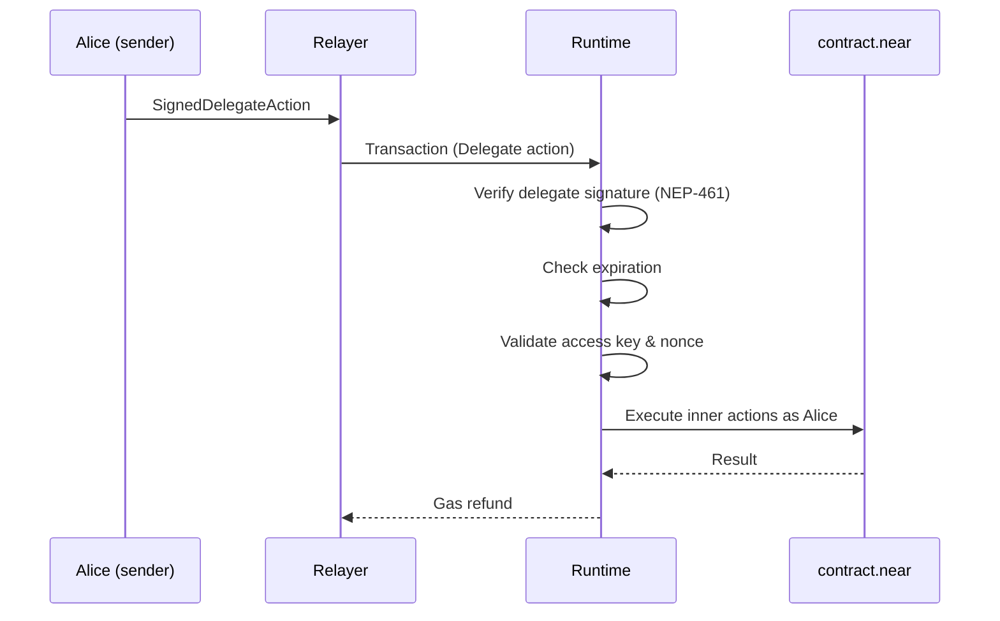
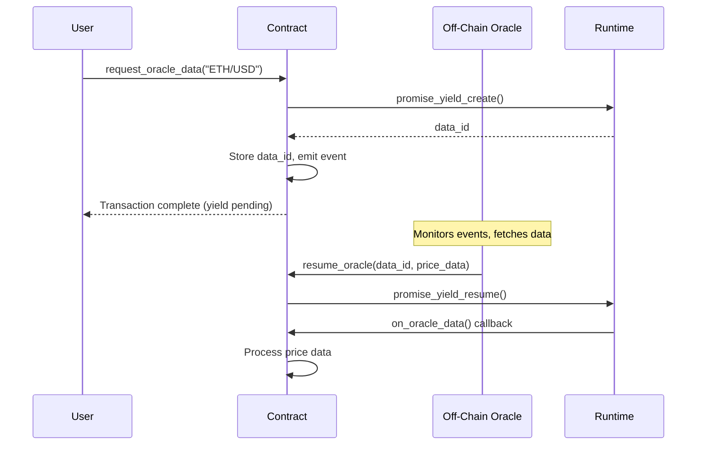

# Advanced Features

This page covers NEAR's advanced transaction features: **DelegateAction (NEP-366)** for gasless meta-transactions, and **Promise Yield/Resume (NEP-519)** for suspending execution while waiting for external data.

## DelegateAction: Meta-Transactions

DelegateAction enables **gasless transactions** - users can interact with NEAR without holding any NEAR for gas. A relayer pays the gas on their behalf.

### The Problem It Solves

**Traditional flow:**
```
User signs tx → User pays gas → Transaction executes
```

**With DelegateAction:**
```
User signs DelegateAction → Relayer wraps in tx → Relayer pays gas → Action executes as user
```

### Use Cases

| Use Case | Description |
|----------|-------------|
| **User onboarding** | New users can use dApps without buying NEAR first |
| **Sponsored transactions** | dApps pay for their users' gas |
| **Gas station networks** | Third-party relayer services |
| **UX improvement** | Hide blockchain complexity from end users |

## DelegateAction Structure

**Source:** `core/primitives/src/action/delegate.rs`

```rust
pub struct DelegateAction {
    /// Who authorizes this action
    pub sender_id: AccountId,

    /// Where actions execute
    pub receiver_id: AccountId,

    /// Actions to perform (no nested delegates!)
    pub actions: Vec<NonDelegateAction>,

    /// Nonce for sender's access key
    pub nonce: Nonce,

    /// Block height expiration
    pub max_block_height: BlockHeight,

    /// Which key signed this
    pub public_key: PublicKey,
}

pub struct SignedDelegateAction {
    pub delegate_action: DelegateAction,
    pub signature: Signature,
}
```

### NonDelegateAction

Prevents nesting (which would complicate gas accounting):

```rust
pub struct NonDelegateAction(Action);

impl TryFrom<Action> for NonDelegateAction {
    type Error = IsDelegateAction;

    fn try_from(action: Action) -> Result<Self, IsDelegateAction> {
        if matches!(action, Action::Delegate(_)) {
            Err(IsDelegateAction)  // Can't nest!
        } else {
            Ok(Self(action))
        }
    }
}
```

## The Signing Scheme (NEP-461)

DelegateAction uses a special hash to prevent signature reuse:

**Source:** `core/primitives/src/signable_message.rs`

```rust
impl DelegateAction {
    pub fn get_nep461_hash(&self) -> CryptoHash {
        let signable = SignableMessage::new(&self, SignableMessageType::DelegateAction);
        let bytes = borsh::to_vec(&signable).expect("serialization works");
        hash(&bytes)
    }
}
```

**The discriminant** (2^30 + 366) ensures:
- DelegateAction signatures can't be reused for regular transactions
- Different message types have different hash domains

## The Complete Meta-Transaction Flow

### Step 1: User Creates and Signs

```rust
let delegate_action = DelegateAction {
    sender_id: "alice.near".parse()?,
    receiver_id: "contract.near".parse()?,
    actions: vec![
        NonDelegateAction::try_from(
            Action::FunctionCall(FunctionCallAction {
                method_name: "do_something".to_string(),
                args: b"{}".to_vec(),
                gas: 30_000_000_000_000,
                deposit: 0,
            })
        )?
    ],
    nonce: alice_access_key_nonce + 1,
    max_block_height: current_block + 100,
    public_key: alice_public_key,
};

let hash = delegate_action.get_nep461_hash();
let signature = alice_private_key.sign(hash.as_bytes());
let signed = SignedDelegateAction { delegate_action, signature };
```

### Step 2: Relayer Wraps and Submits

```rust
let transaction = Transaction {
    signer_id: "relayer.near".parse()?,
    receiver_id: "alice.near".parse()?,  // Must match sender_id!
    public_key: relayer_public_key,
    nonce: relayer_nonce + 1,
    block_hash: recent_block_hash,
    actions: vec![Action::Delegate(Box::new(signed))],
};

// Relayer signs and submits
let signed_tx = transaction.sign(&relayer_key);
submit(signed_tx);
```

### Step 3: Runtime Processing



**Source:** `runtime/runtime/src/actions.rs`

The runtime:
1. **Verifies signature** using NEP-461 hash
2. **Checks expiration** against `max_block_height`
3. **Verifies sender matches** tx receiver
4. **Validates access key** (nonce, permissions)
5. **Creates new receipt** with inner actions

## Access Key Validation

DelegateAction still respects access key permissions:

```rust
fn validate_delegate_action_key(...) {
    // 1. Key must exist on sender's account
    let access_key = get_access_key(state, &sender_id, &public_key)?;

    // 2. Nonce must be increasing
    if delegate_action.nonce <= access_key.nonce {
        return Err(DelegateActionInvalidNonce);
    }

    // 3. Nonce can't be too far in future
    let upper_bound = block_height * ACCESS_KEY_NONCE_RANGE_MULTIPLIER;
    if delegate_action.nonce >= upper_bound {
        return Err(DelegateActionNonceTooLarge);
    }

    // 4. Update nonce (prevents replay)
    access_key.nonce = delegate_action.nonce;
    set_access_key(state, ...);

    // 5. Check FunctionCall key permissions if applicable
    // - Only one action allowed
    // - No deposits allowed
    // - Receiver must match
    // - Method must be in allowed list
}
```

## Gas and Refund Flow

**The relayer pays everything:**

```
Relayer prepays: send fees + exec fees + inner action gas

If success:
  - Gas refund → relayer (signer_id)
  - Deposit refund (if any) → alice (sender via predecessor_id)

If failure:
  - All gas refund → relayer
  - All deposit refund → alice
```

## DelegateAction Security Properties

| Property | Mechanism |
|----------|-----------|
| **No nested delegates** | `NonDelegateAction` type enforces |
| **Signature domain separation** | NEP-461 discriminant |
| **Expiration** | `max_block_height` prevents indefinite validity |
| **Replay protection** | Nonce must be strictly increasing |
| **Permission preservation** | Access key permissions still enforced |

---

## Promise Yield/Resume: External Data Integration

Promise Yield/Resume (NEP-519) enables contracts to **suspend execution** and wait for external data. This is NEAR's most advanced async primitive.

### The Problem It Solves

**Traditional async in NEAR:**
- Contract calls another contract
- Waits for callback with result
- All data must come from on-chain

**Yield/Resume enables:**
- Pause execution waiting for **off-chain** data
- External service provides data when ready
- Execution resumes with that data

### Use Cases

| Use Case | Description |
|----------|-------------|
| **Oracle data** | Price feeds, randomness, weather data |
| **Off-chain computation** | ML inference, complex calculations |
| **Cross-chain bridges** | Data from other blockchains |
| **External APIs** | Real-world data integration |

## Receipt Types for Yield/Resume

**Source:** `core/primitives/src/receipt.rs`

```rust
pub enum ReceiptEnum {
    // ...
    PromiseYield(ActionReceipt) = 2,   // Suspended execution
    PromiseResume(DataReceipt) = 3,    // Wake-up signal with data
}
```

## The Yield/Resume API

### promise_yield_create()

Creates a yield point and returns a `data_id` that identifies this suspended execution:

**Source:** `runtime/near-vm-runner/src/logic/logic.rs`

```rust
pub fn promise_yield_create(
    &mut self,
    method_name_len: u64,
    method_name_ptr: u64,
    arguments_len: u64,
    arguments_ptr: u64,
    gas: u64,
    gas_weight: u64,
    register_id: u64,  // Where to write the data_id
) -> Result<u64>
```

**Returns:**
- Promise index (like regular promises)
- Writes `data_id` to specified register

**The `data_id`** is a 32-byte hash that:
- Uniquely identifies this yield point
- Must be saved (in contract state or passed off-chain)
- Is needed to resume execution

### promise_yield_resume()

Provides data to a suspended yield, triggering the callback:

```rust
pub fn promise_yield_resume(
    &mut self,
    data_id_len: u64,
    data_id_ptr: u64,
    payload_len: u64,
    payload_ptr: u64,
) -> Result<u32>
```

**Returns:**
- `1` (true): Matching yield found and resolved
- `0` (false): No matching yield (maybe already resolved or expired)

## The Complete Yield/Resume Flow

### Step 1: Contract Creates Yield

```rust
// Contract code
pub fn request_oracle_data(&mut self, request: String) -> Promise {
    // Create yield point, callback will run when resumed
    let promise = env::promise_yield_create(
        "on_oracle_data",     // callback method
        b"{}",                // initial args
        30_000_000_000_000,   // gas for callback
        0,                    // gas weight
        0                     // register for data_id
    );

    // Read the data_id from register 0
    let data_id = env::read_register(0);

    // Save data_id for the oracle service
    self.pending_requests.insert(request.clone(), data_id);

    // Emit event for oracle to see
    env::log_str(&format!("OracleRequest:{}:{}", request, hex::encode(&data_id)));

    promise
}
```

### Step 2: Off-Chain Service Monitors and Responds

```javascript
// Oracle service (off-chain)
nearEvents.on('OracleRequest', async (request, dataId) => {
    // Fetch the requested data
    const price = await fetchPrice(request);

    // Call resume on the contract
    await contract.resume_oracle({
        data_id: dataId,
        payload: JSON.stringify({ price }),
    });
});
```

### Step 3: Contract Resumes with Data

```rust
// Contract code
pub fn resume_oracle(&mut self, data_id: Vec<u8>, payload: Vec<u8>) {
    // Call the resume primitive
    let result = env::promise_yield_resume(
        &data_id,
        &payload
    );

    if result == 0 {
        env::panic_str("No matching yield found (expired?)");
    }

    // The callback (on_oracle_data) will now execute with payload as input
}

// This runs when resumed
pub fn on_oracle_data(&mut self) {
    // Read the resume payload
    let data = env::promise_result(0);
    match data {
        PromiseResult::Successful(bytes) => {
            let price: PriceData = serde_json::from_slice(&bytes).unwrap();
            // Use the oracle data!
            self.prices.insert(price.symbol, price.value);
        }
        PromiseResult::Failed => {
            // Resume timed out or was called with None
            env::panic_str("Oracle data not received");
        }
    }
}
```

### Flow Diagram



## Timeout Mechanism

Yields don't wait forever. There's a configurable timeout (~200 blocks / ~200 seconds).

**Source:** `core/parameters/src/vm.rs`

```rust
pub yield_timeout_length_in_blocks: u64,
```

### Timeout Processing

When a yield times out:
1. `PromiseResume` is created with `data: None`
2. Callback executes with `PromiseResult::Failed`
3. Contract should handle the failure case

```rust
pub fn on_oracle_data(&mut self) {
    match env::promise_result(0) {
        PromiseResult::Successful(bytes) => {
            // Normal processing
        }
        PromiseResult::Failed => {
            // Handle timeout - maybe refund user, use fallback data
            self.handle_oracle_timeout();
        }
    }
}
```

## Gas Economics for Yield/Resume

:::warning Critical Design Decision
Gas for a yielded promise is **fixed at creation time**. You **cannot** add more gas when calling `promise_yield_resume`.
:::

### Gas is Prepaid at Creation

When you call `promise_yield_create`, the gas parameter is immediately reserved:

```rust
// Inside promise_yield_create:
self.result_state.gas_counter.prepay_gas(Gas::from_gas(gas))?;
```

### Resume Has No Gas Parameter

```rust
pub fn promise_yield_resume(
    data_id_len: u64,
    data_id_ptr: u64,
    payload_len: u64,
    payload_ptr: u64,
) -> Result<u32>
// Note: NO gas parameter!
```

The resume operation only delivers data - it doesn't provide additional resources.

### Comparison with Regular Cross-Contract Calls

| Aspect | Regular `promise_then` | Yield/Resume |
|--------|------------------------|--------------|
| Gas attachment | Attached at each call | Fixed at creation only |
| Caller can add gas | Yes | No |
| Gas timing | Charged when promise executes | Prepaid immediately |
| Flexibility | High - adjust per call | Low - must estimate upfront |

### Practical Implications

**1. Allocate generously:**
```rust
let promise = env::promise_yield_create(
    "on_oracle_data",
    b"{}",
    100_000_000_000_000,  // 100 TGas - be generous!
    0,
    0
);
```

**2. You can't recover from under-allocation:**
- If callback runs out of gas, it fails
- You can't "top up" and retry with the same yield
- The yield is consumed (resolved) regardless of callback success

**3. Timeout uses the same gas:**
- Whether resumed or timed out, callback gets the same gas
- Timeout provides `PromiseResult::Failed` instead of data

**4. Consider worst-case paths:**
```rust
// Callback must handle both success AND failure within same gas budget
pub fn on_oracle_data(&mut self) {
    match env::promise_result(0) {
        PromiseResult::Successful(data) => {
            // Parse and process - may be gas-intensive
        }
        PromiseResult::Failed => {
            // Timeout handling - might also need gas for cleanup
        }
    }
}
```

## Constraints and Limitations

| Constraint | Description |
|------------|-------------|
| **Same account** | Resume must come from the same account that created the yield |
| **One-time** | Each data_id can only be resolved once |
| **Timeout** | Yields expire after `yield_timeout_length_in_blocks` |
| **Max payload** | Limited by `max_yield_payload_size` config |
| **No view calls** | Cannot yield in view functions |

## Advanced Pattern: Oracle Network

```rust
impl OracleContract {
    // User requests data
    pub fn request(&mut self, query: String) -> Promise {
        let promise = env::promise_yield_create("callback", b"{}", gas, 0, 0);
        let data_id = env::read_register(0);

        // Store request
        self.requests.insert(&data_id, &OracleRequest {
            query,
            requester: env::predecessor_account_id(),
            created_at: env::block_height(),
        });

        promise
    }

    // Oracle operator submits response
    pub fn submit_response(&mut self, data_id: Vec<u8>, response: String) {
        // Verify caller is authorized oracle
        require!(self.oracles.contains(&env::predecessor_account_id()));

        // Resume the yield
        let payload = serde_json::to_vec(&response).unwrap();
        env::promise_yield_resume(&data_id, &payload);
    }

    // Callback processes response
    pub fn callback(&mut self) {
        match env::promise_result(0) {
            PromiseResult::Successful(data) => {
                let response: String = serde_json::from_slice(&data).unwrap();
                // Deliver to requester
            }
            PromiseResult::Failed => {
                // Timeout - refund requester
            }
        }
    }
}
```

## Key Takeaways

### DelegateAction (Meta-Transactions)
1. Enables gasless user experience
2. Relayer pays gas, user signs intent
3. NEP-461 signature domain prevents reuse
4. Access key permissions still enforced
5. `max_block_height` provides expiration

### Promise Yield/Resume
1. Enables waiting for off-chain data
2. Gas is fixed at creation, not resumption
3. Timeout ensures yields don't block forever
4. Same account must create and resume
5. Handle both success and timeout in callback
