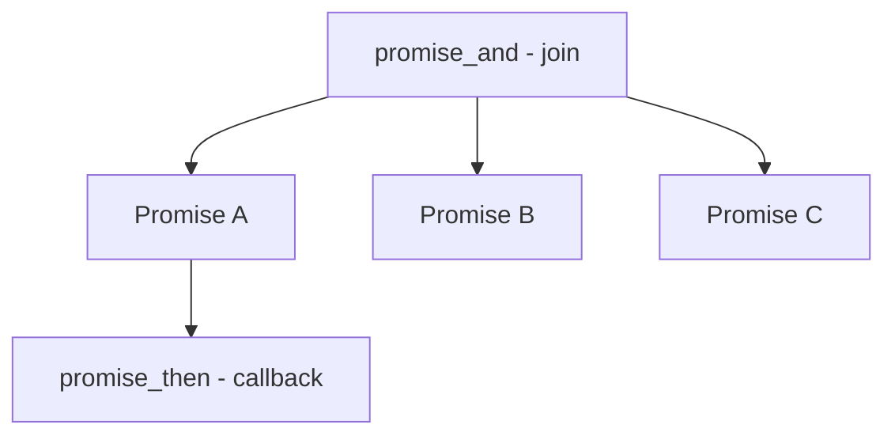
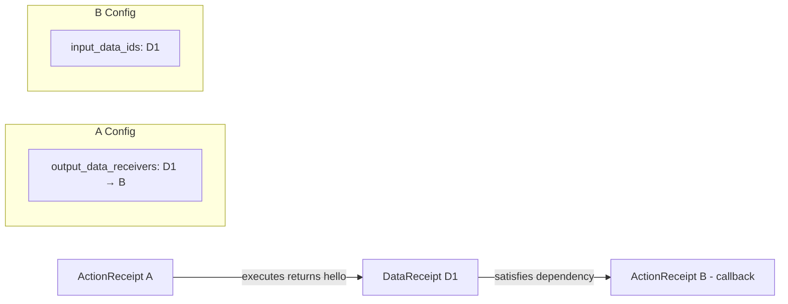
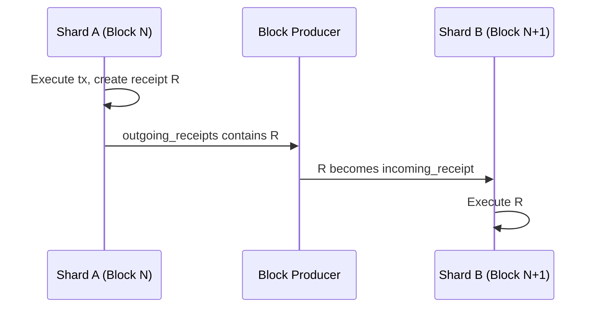

# Async Model

The promise system is the foundation of NEAR's asynchronous execution model. When a smart contract needs to call another contract, it creates **promises** - abstract representations of future computations that will be converted to **receipts** for actual execution.

## Understanding Promises

In NEAR, a **Promise** is a placeholder for work that will happen in a future block. Unlike JavaScript promises or Rust futures, NEAR promises are not in-memory objects that you await - they're instructions that get converted to receipts when the current function returns.

### The Key Principle

**Promises are declarative, not imperative.** You're not calling another contract - you're declaring that you want to call it. The actual execution happens in future blocks, potentially on different shards.

This is why:
- You can't get a return value immediately
- You must use callbacks to process results
- The callback might execute in a completely different block/shard
- NEAR is fundamentally asynchronous

### The Promise DAG

Promises form a **Directed Acyclic Graph (DAG)** of dependencies:



## Promise Creation Functions

### promise_create()

Creates a new promise for calling another account's function.

```rust
pub fn promise_create(
    &mut self,
    account_id_len: u64,
    account_id_ptr: u64,
    function_name_len: u64,
    function_name_ptr: u64,
    arguments_len: u64,
    arguments_ptr: u64,
    amount: u128,
    gas: u64,
) -> Result<u64>
```

**What it does:**
1. Reads target `account_id` and `function_name` from WASM memory
2. Reads `arguments` (the call payload)
3. Creates a new receipt destined for the target account
4. Attaches the specified `amount` of NEAR and prepays `gas`
5. Returns a `PromiseIndex` that can be used in subsequent calls

**Usage pattern:**
```rust
// In contract code
let promise_id = env::promise_create(
    "other-contract.near",
    "some_method",
    b'{"arg": "value"}',
    0,                    // attached NEAR
    5_000_000_000_000,    // attached gas (5 TGas)
);
```

### promise_then()

Creates a **callback** that executes after another promise completes.

```rust
pub fn promise_then(
    &mut self,
    promise_idx: u64,
    // ... target account, method, args ...
    amount: u128,
    gas: u64,
) -> Result<u64>
```

**What it does:**
1. Takes an existing `promise_idx` as a dependency
2. Creates a new receipt that **waits** for the first promise to complete
3. When the first promise finishes, its return value becomes available as `PromiseResult` in the callback
4. Returns a new `PromiseIndex` for the callback

**The Key Insight:** The callback doesn't execute immediately. NEAR creates two receipts:
1. The original promise (call to other contract)
2. A callback receipt with an `input_data_id` dependency

When the first receipt executes and produces a result, that result becomes a `DataReceipt` that satisfies the callback's dependency.

### promise_and()

**Joins** multiple promises - waits for ALL of them to complete.

```rust
pub fn promise_and(
    &mut self,
    promise_idx_ptr: u64,
    promise_idx_count: u64,
) -> Result<u64>
```

**Use case:** When you need to call multiple contracts and wait for all results:

```rust
let p1 = env::promise_create("contract_a", "get_data", ...);
let p2 = env::promise_create("contract_b", "get_data", ...);
let p3 = env::promise_create("contract_c", "get_data", ...);

let all = env::promise_and(&[p1, p2, p3]);
let callback = env::promise_then(all, "self", "process_all_results", ...);
```

### promise_batch_create() and promise_batch_then()

Low-level functions for creating receipts with multiple actions:

```rust
// Create an account with initial balance
let batch = env::promise_batch_create("new_account.near");
env::promise_batch_action_create_account(batch);
env::promise_batch_action_transfer(batch, deposit_amount);
env::promise_batch_action_add_full_access_key(batch, public_key);
```

## Promise Results

When a callback executes, it can read the results of the promises it depends on.

```rust
pub enum PromiseResult {
    /// The promise has not yet been resolved
    Pending,
    /// The promise succeeded with a value
    Successful(Vec<u8>),
    /// The promise failed (no value)
    Failed,
}
```

**In callback code:**
```rust
fn callback() {
    let count = env::promise_results_count();
    for i in 0..count {
        match env::promise_result(i, 0) {
            PromiseResult::Successful(value) => {
                // Process successful result
            }
            PromiseResult::Failed => {
                // Handle failure
            }
            PromiseResult::Pending => unreachable!(),
        }
    }
}
```

## Receipt Types

Receipts are the fundamental unit of execution in NEAR. While transactions are what users submit, receipts are what the runtime actually processes.

### Receipt Hierarchy

```rust
pub enum ReceiptEnum {
    Action(ActionReceipt) = 0,                       // Execute actions
    Data(DataReceipt) = 1,                           // Deliver return data
    PromiseYield(ActionReceipt) = 2,                 // Suspend execution (NEP-519)
    PromiseResume(DataReceipt) = 3,                  // Resume suspended execution
    GlobalContractDistribution(...) = 4,             // Distribute shared contracts
    ActionV2(ActionReceiptV2) = 5,                   // Enhanced action receipt
    PromiseYieldV2(ActionReceiptV2) = 6,             // Yield with enhanced receipt
}
```

### ActionReceipt: The Workhorse

ActionReceipts contain the actual work to be done.

```rust
pub struct ActionReceipt {
    /// Account that originally signed the transaction
    pub signer_id: AccountId,

    /// Public key used for signing (for gas refunds)
    pub signer_public_key: PublicKey,

    /// Gas price when this receipt was created
    pub gas_price: Balance,

    /// Where to send the result of this execution
    pub output_data_receivers: Vec<DataReceiver>,

    /// What this receipt is waiting for (callback dependencies)
    pub input_data_ids: Vec<CryptoHash>,

    /// The actual operations to perform
    pub actions: Vec<Action>,
}
```

**Key Fields:**

| Field | Purpose |
|-------|---------|
| `signer_id` | Track back to original tx signer for gas refunds |
| `gas_price` | Gas price at creation time (for deterministic refunds) |
| `output_data_receivers` | Receipts waiting for this execution's result |
| `input_data_ids` | Dependencies this receipt must wait for |
| `actions` | Operations to perform: FunctionCall, Transfer, etc. |

### DataReceipt: The Messenger

DataReceipts carry return values between receipts.

```rust
pub struct DataReceipt {
    /// Unique identifier matching an input_data_id somewhere
    pub data_id: CryptoHash,

    /// The actual return value (None means execution failed)
    pub data: Option<Vec<u8>>,
}
```

### The Data Flow Dance



## Receipt Lifecycle

### Stage 1: Creation

Receipts are created in two ways:
- **From transactions:** The first receipt for any transaction
- **From execution:** When a contract creates promises

### Stage 2: Routing

Each receipt routes to its receiver's shard:

```rust
pub fn receiver_shard_id(&self, shard_layout: &ShardLayout) -> ShardId {
    shard_layout.account_id_to_shard_id(self.receiver_id())
}
```

### Stage 3: Waiting (if needed)

If a receipt has `input_data_ids`, it cannot execute until ALL dependencies are satisfied. These become **delayed receipts**.

### Stage 4: Execution

When all dependencies are satisfied:
1. Load input data from state as `PromiseResult`s
2. Delete input data from state (one-time consumption)
3. Execute actions sequentially
4. Produce outputs (DataReceipts, new ActionReceipts, refunds)

## Cross-Shard Communication

NEAR's sharding model means different accounts live on different shards. Cross-shard communication uses asynchronous receipt passing.

### Account-to-Shard Mapping

Every account belongs to exactly one shard, determined by alphabetical ordering against boundary accounts:

```
boundary_accounts: ["aurora", "aurora-0", "kkuuue2akv_1630967379.near"]

Shard 0: accounts < "aurora"
Shard 1: "aurora" <= accounts < "aurora-0"
Shard 2: "aurora-0" <= accounts < "kkuuue2akv_1630967379.near"
Shard 3: accounts >= "kkuuue2akv_1630967379.near"
```

:::note
Alphabetical ordering uses the **full account name**. So `a.near` and `z.a.near` may be on different shards!
:::

### Cross-Shard Receipt Propagation



### Execution Order Guarantees

**Within a Shard:**
1. Transactions execute in chunk order
2. Receipts execute deterministically (local first, then by receipt_id)

**Across Shards:**
- **No global ordering guarantee** across shards
- **Causal ordering**: If receipt A creates receipt B, A always executes before B
- **Data dependencies**: A receipt waits until ALL its `input_data_ids` are satisfied
- **No double execution**: Each receipt executes exactly once

## Delayed Receipts

When a receipt arrives but its dependencies aren't ready, it becomes a delayed receipt.

**Why Delayed?**
- Cross-shard calls take time (at least 1 block per hop)
- Callback can't execute until source call completes
- Network latency and shard processing order affect arrival time

**Processing (each block):**
1. Check delayed receipts queue
2. For each, check if dependencies arrived
3. If satisfied, promote to execution
4. If not, leave in queue

## Congestion Control

Too many cross-shard receipts can overwhelm a shard. NEAR implements backpressure (NEP-539):

- **Memory-based limiting**: Reject new transactions when shard memory exceeds threshold (~500MB)
- **Receiver-specific backpressure**: Stop accepting transactions to congested accounts
- **Deadlock prevention**: Always allow minimum throughput to drain queues

## Practical Example: Cross-Contract Call with Callback

### Step 1: Contract A Creates Promises

```
Contract A executes transaction:
├── promise_create("B", "getData", ...) → Promise 0
└── promise_then(0, "A", "callback", ...) → Promise 1
```

### Step 2: ReceiptManager Generates Receipts

```
Receipt R1 (for Promise 0):
├── receiver_id: "B"
├── actions: [FunctionCall("getData")]
├── input_data_ids: []  (no dependencies)
└── output_data_receivers: [{data_id: D1, receiver_id: "A"}]

Receipt R2 (for Promise 1):
├── receiver_id: "A"
├── actions: [FunctionCall("callback")]
├── input_data_ids: [D1]  (waits for R1's output)
└── output_data_receivers: []
```

### Step 3: Execution Timeline

```
Block N (Shard A):
  └── Transaction executes → creates R1, R2
  └── R1 sent to Shard B, R2 stored as delayed (waiting for D1)

Block N+1 (Shard B):
  └── R1 executes → produces DataReceipt D1 with result
  └── D1 sent to Shard A

Block N+2 (Shard A):
  └── D1 arrives → satisfies R2's dependency
  └── R2 executes with D1's data as PromiseResult::Successful
```

## Gas Weight Distribution

When you don't know exactly how much gas to allocate, use **gas weights**:

```rust
env::promise_batch_action_function_call_weight(
    promise_id,
    "method",
    args,
    deposit,
    Gas::ZERO,        // minimum gas
    GasWeight(1),     // weight for distributing remaining gas
);
```

The ReceiptManager distributes unused gas proportionally based on weights.
