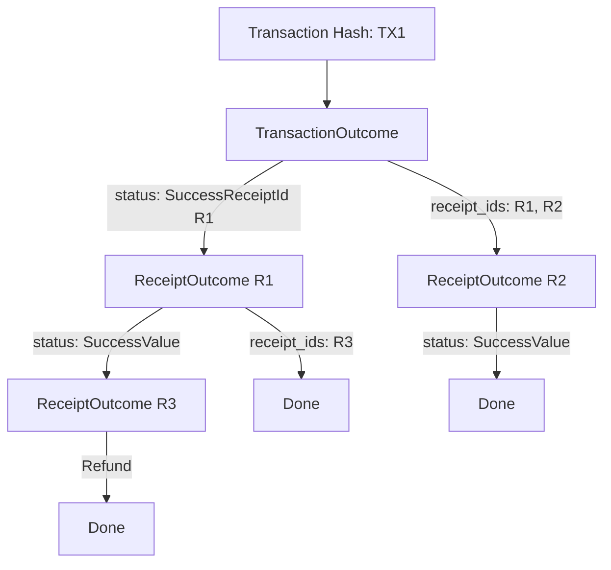

# Finality

Every execution in NEAR produces an outcome that records what happened. Understanding outcomes is crucial for knowing when your transaction truly succeeded.

## ExecutionOutcome Structure

**Source:** `core/primitives/src/transaction.rs`

```rust
pub struct ExecutionOutcome {
    /// Logs emitted during execution
    pub logs: Vec<LogEntry>,

    /// Receipt IDs generated by this execution
    pub receipt_ids: Vec<CryptoHash>,

    /// Gas consumed
    pub gas_burnt: Gas,

    /// Compute time (internal metric, not persisted)
    pub compute_usage: Option<Compute>,

    /// NEAR burned (gas_burnt × gas_price)
    pub tokens_burnt: Balance,

    /// Who executed (signer for tx, receiver for receipt)
    pub executor_id: AccountId,

    /// Final status
    pub status: ExecutionStatus,

    /// Detailed profiling (V1, V2, V3 versions)
    pub metadata: ExecutionMetadata,
}
```

## ExecutionStatus

```rust
pub enum ExecutionStatus {
    /// Execution hasn't started or status unknown
    Unknown,

    /// Execution failed with error
    Failure(TxExecutionError),

    /// Success with return value
    SuccessValue(Vec<u8>),

    /// Success, spawned a receipt (for async calls)
    SuccessReceiptId(CryptoHash),
}
```

**Key distinctions:**
- `SuccessValue`: Execution completed and returned data
- `SuccessReceiptId`: Execution succeeded but created a promise - final result is in that receipt
- `Failure`: Execution failed - check error for details

## Transaction Outcome vs Receipt Outcome

A single transaction can produce many outcomes:



**Example outcome tree:**
```
Transaction Hash: TX1
├── TransactionOutcome: Initial execution
│   ├── status: SuccessReceiptId(R1)
│   └── receipt_ids: [R1, R2]
│
├── ReceiptOutcome R1: First receipt execution
│   ├── status: SuccessValue(...)
│   └── receipt_ids: [R3]
│
├── ReceiptOutcome R2: Second receipt (callback)
│   ├── status: SuccessValue(...)
│   └── receipt_ids: []
│
└── ReceiptOutcome R3: Refund
    ├── status: SuccessValue(...)
    └── receipt_ids: []
```

## FinalExecutionOutcome

The aggregated view of all outcomes:

```rust
pub struct FinalExecutionOutcome {
    /// Status of the whole transaction
    pub status: FinalExecutionStatus,

    /// Transaction outcome
    pub transaction_outcome: ExecutionOutcomeWithId,

    /// All receipt outcomes
    pub receipts_outcome: Vec<ExecutionOutcomeWithId>,
}

pub enum FinalExecutionStatus {
    /// Still processing
    NotStarted,
    Started,

    /// All done with final value
    SuccessValue(Vec<u8>),

    /// All done but the final receipt failed
    Failure(TxExecutionError),
}
```

## Querying Outcomes

### The `tx` RPC Method

```bash
curl -X POST https://rpc.mainnet.fastnear.com \
  -H "Content-Type: application/json" \
  -d '{
    "jsonrpc": "2.0",
    "id": "1",
    "method": "tx",
    "params": {
      "tx_hash": "6zgh2u9DqHHiXzdy9ouTP7oGky2T4nugqzqt9wJZwNFm",
      "sender_account_id": "sender.near",
      "wait_until": "FINAL"
    }
  }'
```

### wait_until Options

| Value | Description | Use Case |
|-------|-------------|----------|
| `NONE` | Return immediately with whatever status exists | Polling pattern |
| `INCLUDED` | Wait until transaction is in a block | Quick confirmation |
| `INCLUDED_FINAL` | Wait until block is final | Fork protection |
| `EXECUTED` | Wait until initial receipt executed | Basic execution |
| `EXECUTED_OPTIMISTIC` | Wait for execution with optimistic finality | Faster feedback |
| `FINAL` | Wait until ALL receipts executed and finalized | **Recommended** |

## Understanding Finality

### Block Finality

NEAR uses Doomslug consensus with ~2 second finality:

1. **Optimistic**: Block produced but not yet endorsed
2. **Near-final**: Block has endorsements but could theoretically revert
3. **Final**: Block has BFT finality - cannot revert

### Transaction Finality

A transaction is truly final when:
1. The block containing it is final
2. All receipts have executed
3. All receipt blocks are final

:::warning Common Mistake
Checking only `INCLUDED` means the transaction is in a block, but:
- The block might not be final
- The receipts haven't executed yet
- Cross-shard receipts take additional blocks
:::

## Practical Examples

### Simple Transfer (Fast)

```
Block N: Transaction included → immediate execution
Block N+1: Block N is final
Total: ~2 seconds to finality
```

### Cross-Contract Call (Slower)

```
Block N: Transaction creates receipt R1
Block N+1: R1 executes, creates R2 (callback)
Block N+2: R2 executes
Block N+3: Block N+2 is final
Total: ~4-6 seconds to finality
```

### Multi-Shard DeFi (Slowest)

Complex operations spanning multiple shards:

```
Block N through N+5: 6 blocks of receipts
Block N+6: Final block is final
Total: ~12+ seconds to finality
```

## Error Handling

### Check All Outcomes

```javascript
const result = await near.connection.provider.txStatus(txHash, accountId);

// Check transaction outcome
if (result.status.Failure) {
    console.error('Transaction failed:', result.status.Failure);
    return;
}

// Check ALL receipt outcomes
for (const receipt of result.receipts_outcome) {
    if (receipt.outcome.status.Failure) {
        console.error('Receipt failed:', receipt.id, receipt.outcome.status.Failure);
        return;
    }
}

// Success!
const finalValue = result.status.SuccessValue;
```

### Common Errors

| Error | Description |
|-------|-------------|
| `ActionError::FunctionCallError` | Contract execution failed |
| `ActionError::AccountDoesNotExist` | Target account missing |
| `ActionError::InsufficientStake` | Not enough staked |
| `ActionError::ActorNoPermission` | Access key lacks permission |

## Parsing Return Values

When a contract function returns data:

```javascript
// The SuccessValue is base64-encoded
const result = await provider.txStatus(txHash, accountId);

if (result.status.SuccessValue) {
    // Decode base64 to bytes
    const bytes = Buffer.from(result.status.SuccessValue, 'base64');

    // If the contract returns JSON (common pattern)
    const value = JSON.parse(bytes.toString());
    console.log('Return value:', value);
}
```

## Best Practices

### 1. Always Use `wait_until: FINAL`

Unless you have specific requirements for faster feedback, use FINAL to ensure complete execution.

### 2. Check All Receipt Outcomes

A transaction can succeed but a receipt can fail. Always iterate through all outcomes.

### 3. Handle Partial Success

In cross-contract calls, some receipts may succeed while others fail. Your application should handle this gracefully.

### 4. Implement Retry Logic

For `TIMEOUT` errors, the transaction may still execute. Query the status before retrying.

```javascript
async function submitWithRetry(signedTx, maxAttempts = 3) {
    for (let attempt = 0; attempt < maxAttempts; attempt++) {
        try {
            return await provider.sendTransaction(signedTx);
        } catch (error) {
            if (error.type === 'TimeoutError') {
                // Check if tx was actually processed
                const status = await provider.txStatus(
                    signedTx.transaction.hash,
                    signedTx.transaction.signer_id
                );
                if (status) return status;
            }
            if (attempt === maxAttempts - 1) throw error;
        }
    }
}
```
