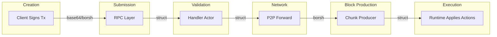

# Foundations

This section covers the fundamental building blocks of NEAR transactions: data structures, action types, account models, and serialization formats.

## What is a Transaction?

In NEAR Protocol, a **transaction** is a signed message from an account that requests one or more state changes on the blockchain. Unlike some other blockchains where transactions are simple value transfers, NEAR transactions are containers for **actions** - discrete operations that can create accounts, deploy contracts, call functions, transfer tokens, and more.

Every transaction in NEAR has these fundamental properties:

1. **Atomicity**: All actions in a transaction either succeed together or fail together (within the same shard)
2. **Authorization**: Transactions are signed by an access key that proves the signer has permission
3. **Bounded Validity**: Transactions reference a recent block and expire if not included quickly
4. **Deterministic Execution**: Given the same state and transaction, execution always produces the same result

:::warning Cross-Shard Atomicity
The atomicity guarantee applies only within a single shard. Cross-shard operations (function calls to contracts on different shards) are executed asynchronously and do **not** have atomic semantics. See [Async Model](./async-model) for details.
:::

### The Transaction Lifecycle



## The SignedTransaction Data Structure

The `SignedTransaction` is the fundamental unit that travels through the system.

**Source:** `core/primitives/src/transaction.rs`

```rust
#[derive(BorshSerialize, BorshDeserialize, Eq, Debug, Clone, ProtocolSchema)]
#[borsh(init=init)]
pub struct SignedTransaction {
    pub transaction: Transaction,
    pub signature: Signature,
    #[borsh(skip)]
    hash: CryptoHash,
    #[borsh(skip)]
    size: u64,
}
```

The `SignedTransaction` wraps a `Transaction` with its cryptographic signature. The `#[borsh(skip)]` attributes on `hash` and `size` mean these are computed fields that are not serialized but are cached for performance.

### Transaction Versions

NEAR supports multiple transaction versions for protocol evolution:

```rust
pub enum Transaction {
    V0(TransactionV0),
    V1(TransactionV1),
}
```

### TransactionV0: The Standard Transaction

```rust
pub struct TransactionV0 {
    /// An account on which behalf transaction is signed
    pub signer_id: AccountId,

    /// A public key of the access key which was used to sign an account.
    pub public_key: PublicKey,

    /// Nonce is used to determine order of transaction in the pool.
    /// It increments for a combination of `signer_id` and `public_key`
    pub nonce: Nonce,

    /// Receiver account for this transaction
    pub receiver_id: AccountId,

    /// The hash of the block in the blockchain on top of which the given
    /// transaction is valid
    pub block_hash: CryptoHash,

    /// A list of actions to be applied
    pub actions: Vec<Action>,
}
```

#### Field Details

| Field | Type | Description |
|-------|------|-------------|
| `signer_id` | `AccountId` | The account signing and authorizing this transaction. Pays for gas. |
| `public_key` | `PublicKey` | The public key of the access key used to sign. Supports ED25519 and SECP256K1. |
| `nonce` | `u64` | Must be strictly greater than the previous nonce for this access key. Prevents replay attacks. |
| `receiver_id` | `AccountId` | The account that will receive this transaction. For `FunctionCall`, the contract being called. |
| `block_hash` | `CryptoHash` | Reference to a recent block. Provides fork protection and expiration (86,400 blocks / ~24 hours). |
| `actions` | `Vec<Action>` | The list of operations to perform. Multiple actions are batched atomically. |

### TransactionV1: Gas Key Nonces

TransactionV1 uses the same fields as V0 but replaces the nonce type with `TransactionNonce`, which supports gas key nonces:

```rust
pub struct TransactionV1 {
    pub signer_id: AccountId,
    pub public_key: PublicKey,
    /// Nonce with support for gas key indexing
    pub nonce: TransactionNonce,
    pub receiver_id: AccountId,
    pub block_hash: CryptoHash,
    pub actions: Vec<Action>,
}

pub enum TransactionNonce {
    /// Simple nonce without index, used by ordinary access keys
    Nonce { nonce: Nonce },
    /// Nonce with index, used by gas keys
    GasKeyNonce { nonce: Nonce, nonce_index: NonceIndex },
}
```

:::note
V1 transactions add support for gas keys via the `TransactionNonce` type, which allows a nonce index alongside the standard nonce.
:::

## Action Types

Actions are the primitive operations that transactions can perform. Each action type has specific semantics, gas costs, and validation rules.

**Source:** `core/primitives/src/action/mod.rs`

```rust
pub enum Action {
    CreateAccount(CreateAccountAction) = 0,
    DeployContract(DeployContractAction) = 1,
    FunctionCall(Box<FunctionCallAction>) = 2,
    Transfer(TransferAction) = 3,
    Stake(Box<StakeAction>) = 4,
    AddKey(Box<AddKeyAction>) = 5,
    DeleteKey(Box<DeleteKeyAction>) = 6,
    DeleteAccount(DeleteAccountAction) = 7,
    Delegate(Box<SignedDelegateAction>) = 8,
    DeployGlobalContract(DeployGlobalContractAction) = 9,
    UseGlobalContract(Box<UseGlobalContractAction>) = 10,
    DeterministicStateInit(Box<DeterministicStateInitAction>) = 11,
    TransferToGasKey(Box<TransferToGasKeyAction>) = 12,
    WithdrawFromGasKey(Box<WithdrawFromGasKeyAction>) = 13,
}
```

### CreateAccountAction

```rust
pub struct CreateAccountAction {}
```

Creates a new account with the `receiver_id` as its name. The new account starts with no balance, no keys, and no code. Typically combined with `Transfer` and `AddKey` actions.

**Constraints:**
- The `receiver_id` must not already exist
- Sub-accounts can only be created by their parent (e.g., `alice.near` can create `bob.alice.near`)
- Top-level accounts require the registrar

### DeployContractAction

```rust
pub struct DeployContractAction {
    /// WebAssembly binary
    pub code: Vec<u8>,
}
```

Deploys WASM code to the `receiver_id` account.

**Constraints:**
- Maximum contract size: 4MB (configurable via protocol parameters)
- The WASM must be valid and pass validation
- Replaces any existing code on the account
- Signer must have full access to the receiver account

### FunctionCallAction

```rust
pub struct FunctionCallAction {
    /// The name of the method to call
    pub method_name: String,

    /// Arguments to pass to the method (serialized, typically JSON)
    pub args: Vec<u8>,

    /// Maximum gas to use for this call
    pub gas: Gas,

    /// NEAR tokens to attach to the call (accessible via `attached_deposit`)
    pub deposit: Balance,
}
```

Calls a function on the contract deployed at `receiver_id`.

**Constraints:**
- Method name maximum length: 256 bytes
- Arguments maximum size: 4MB
- Gas must be greater than 0
- If the method is not payable, deposit must be 0

### TransferAction

```rust
pub struct TransferAction {
    /// Amount of NEAR to transfer (in yoctoNEAR, 10^-24 NEAR)
    pub deposit: Balance,
}
```

Transfers NEAR tokens from `signer_id` to `receiver_id`.

### StakeAction

```rust
pub struct StakeAction {
    /// Amount to stake (in yoctoNEAR)
    pub stake: Balance,

    /// Public key for the validator
    pub public_key: PublicKey,
}
```

Stakes NEAR for participation in validation. Only meaningful for validator accounts.

### AddKeyAction

```rust
pub struct AddKeyAction {
    pub public_key: PublicKey,
    pub access_key: AccessKey,
}

pub struct AccessKey {
    pub nonce: Nonce,
    pub permission: AccessKeyPermission,
}

pub enum AccessKeyPermission {
    FullAccess,
    FunctionCall(FunctionCallPermission),
}

pub struct FunctionCallPermission {
    /// Remaining allowance (None = unlimited)
    pub allowance: Option<Balance>,
    /// Only calls to this receiver are allowed
    pub receiver_id: AccountId,
    /// If non-empty, only these methods can be called
    pub method_names: Vec<String>,
}
```

Adds a new access key to the account. Keys can be full-access or limited to specific contract methods.

### DeleteKeyAction

```rust
pub struct DeleteKeyAction {
    pub public_key: PublicKey,
}
```

Removes an access key from the account. Cannot delete the last full-access key.

### DeleteAccountAction

```rust
pub struct DeleteAccountAction {
    /// Account to receive remaining balance
    pub beneficiary_id: AccountId,
}
```

Deletes the `receiver_id` account, transferring any remaining balance to the beneficiary.

**Constraints:**
- Must be signed with full access
- Account must have no locked balance (unstaking)
- Must be the last action in the transaction

### DelegateAction (Meta-Transactions)

See [Advanced Features](./advanced-features) for details on meta-transactions.

### Global Contract Actions

`DeployGlobalContract` and `UseGlobalContract` enable network-wide contract sharing. See [Infrastructure](./infrastructure) for details.

## Account Types

NEAR supports multiple account formats, each with different creation mechanisms.

**Source:** `core/primitives-core/src/account/id.rs`

```rust
pub enum AccountType {
    /// Regular named accounts like "alice.near"
    NamedAccount,
    /// 64-character hex string derived from ED25519 public key
    NearImplicitAccount,
    /// "0x" + 40 hex chars derived from Secp256K1 (Ethereum-style)
    EthImplicitAccount,
    /// "0s" + 40 hex chars derived from state hash (NEP-616)
    NearDeterministicAccount,
}
```

### Named Accounts

Regular accounts like `alice.near` with human-readable names.

**Rules:**
- Minimum 2 characters, maximum 64 characters
- Can contain lowercase letters, digits, `-`, `_`, `.`
- Cannot start or end with `-` or `_`
- Sub-accounts require parent account authorization

### NEAR-Implicit Accounts (ED25519)

A 64-character lowercase hex string that IS the public key.

```rust
pub fn derive_near_implicit_account_id(public_key: &ED25519PublicKey) -> AccountId {
    hex::encode(public_key).parse().unwrap()
}
```

**Example:** `98793cd91a3f870fb126f66285808c7e094afcfc4eda8a970f6648cdf0dbd6de`

**How creation works:**
1. Generate an ED25519 keypair
2. The public key (32 bytes) hex-encoded IS your account ID (64 chars)
3. Send a transfer to that account ID (even before it exists)
4. The protocol automatically creates the account with a full-access key

:::warning Security Constraint
The transfer must be the **only action** in the transaction. This prevents account hijacking - you can't send a transfer + add your own key in one transaction.
:::

### ETH-Implicit Accounts (Secp256K1)

For Ethereum compatibility: `0x` prefix + 40 hex characters.

**Derivation:** Keccak256 hash of Secp256K1 public key, take last 20 bytes (same as Ethereum).

**Key difference from NEAR-implicit:**
- **No access key created** on transfer
- Uses a "Wallet Contract" instead of traditional access keys
- Cannot be deleted or have full access keys added

### Comparison Table

| Type | Format | Length | Example | Access on Creation |
|------|--------|--------|---------|-------------------|
| Named | alphanumeric + `.` `-` `_` | 2-64 | `alice.near` | None (explicit AddKey) |
| NEAR-Implicit | hex | 64 | `98793cd...0dbd6de` | Full access key |
| ETH-Implicit | `0x` + hex | 42 | `0x71c7656...` | Wallet Contract |
| Deterministic | `0s` + hex | 42 | `0s7a3f8c...` | None (from state_init) |

## Serialization Formats

NEAR uses multiple serialization formats at different layers of the stack.

### Borsh (Binary Object Representation Serializer for Hashing)

**Purpose:** Canonical binary serialization for consensus-critical data

Borsh is NEAR's primary serialization format for:
- Transaction signing (the bytes being signed)
- Network protocol messages
- State storage
- Block/chunk data

**Properties:**
- Deterministic: Same input always produces same output
- Compact: No field names, no padding
- Schema-based: Requires knowing the type to deserialize

### Base64

**Purpose:** Encoding binary data in JSON-RPC requests

When submitting transactions via JSON-RPC, the entire borsh-serialized `SignedTransaction` is base64-encoded into a string.

**Source:** `core/primitives/src/transaction.rs`

```rust
impl serde::Serialize for SignedTransaction {
    fn serialize<S>(&self, serializer: S) -> Result<S::Ok, S::Error> {
        let signed_tx_borsh = borsh::to_vec(self)?;
        let signed_tx_base64 = to_base64(&signed_tx_borsh);
        serializer.serialize_str(&signed_tx_base64)
    }
}
```

### Base58

**Purpose:** Human-readable encoding of hashes and keys

Base58 (Bitcoin's alphabet) is used for:
- `CryptoHash` (block hashes, transaction hashes)
- `PublicKey` (the data portion after the type prefix)
- `Signature`

**Why Base58 instead of Base64?**
- Avoids visually ambiguous characters (0/O, l/I)
- No special characters (+, /, =)
- URL-safe without encoding

### Format Summary Table

| Context | Format | Example |
|---------|--------|---------|
| Transaction submission | Base64(Borsh) | `"AgAAAA..."` |
| Block/tx hash in queries | Base58 | `"11111111111111111111111111111111"` |
| Public key display | `type:Base58` | `"ed25519:DcA2Mzg..."` |
| Function call args | Usually JSON in `Vec<u8>` | `{"msg": "hello"}` |
| Network P2P | Raw Borsh | Binary TCP stream |
| State storage | Borsh | Binary key-value |
