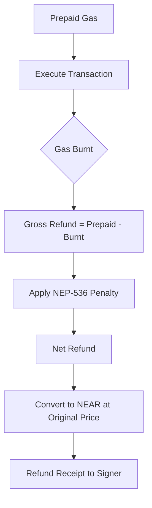
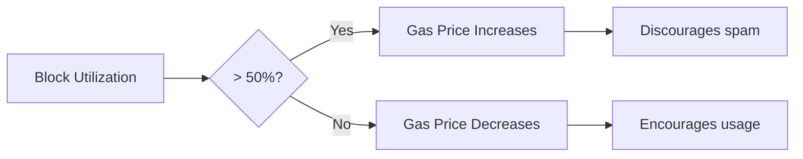
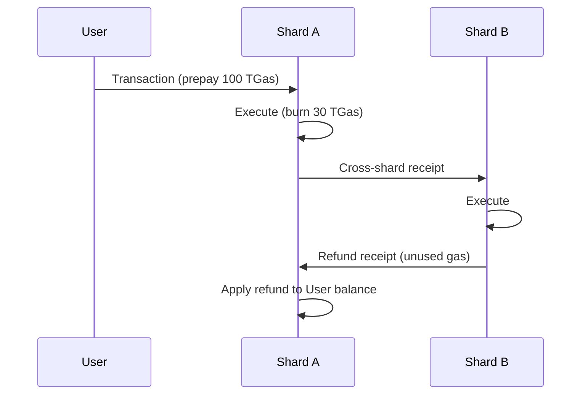

# Gas & Economics

Gas is NEAR's unit of computational work. Understanding how gas is prepaid, burned, and refunded is essential for building efficient dApps and understanding transaction costs.

## Gas Fundamentals

### What is Gas?

Gas measures computation cost on NEAR:

| Unit | Value | Approximate Time |
|------|-------|------------------|
| 1 gas | Base unit | Nanoseconds |
| 1 TGas | 10^12 gas units | ~1ms compute |
| 300 TGas | Maximum per transaction | ~300ms |

**Gas price** fluctuates with network demand:
- Minimum: ~100 Gwei = 10^-7 NEAR per gas
- Adjusts based on block utilization

### Gas vs Tokens

```
Gas (computational units)  ×  Gas Price (NEAR per gas)  =  NEAR Cost
      10 TGas              ×     0.0001 NEAR/TGas       =   0.001 NEAR
```

**Example costs at minimum gas price:**

| Operation | Gas | Cost (NEAR) |
|-----------|-----|-------------|
| Simple transfer | ~0.11 TGas | ~0.000011 |
| Function call (base) | ~2.3 TGas + execution | varies |
| Contract deployment (base) | ~0.18 TGas + per-byte | varies |

## Gas Prepayment

Only `FunctionCallAction` prepays gas. Other actions have fixed costs deducted directly.

**Source:** `core/primitives/src/action/mod.rs`

```rust
pub struct FunctionCallAction {
    pub method_name: String,
    pub args: Vec<u8>,
    pub gas: Gas,         // Prepaid gas for execution
    pub deposit: Balance, // NEAR attached for transfer
}

impl Action {
    pub fn get_prepaid_gas(&self) -> Gas {
        match self {
            Action::FunctionCall(a) => a.gas,
            _ => Gas::ZERO,  // Other actions don't prepay
        }
    }
}
```

### Total Gas Calculation

For transactions with multiple actions:

```rust
pub fn total_prepaid_gas(actions: &[Action]) -> Result<Gas, IntegerOverflowError> {
    let mut total_gas = Gas::ZERO;
    for action in actions {
        let action_gas = match action {
            Action::Delegate(signed_delegate_action) => {
                // Recursive for delegated actions (meta-transactions)
                let inner_actions = signed_delegate_action.delegate_action.get_actions();
                total_prepaid_gas(&inner_actions)?
            }
            _ => action.get_prepaid_gas(),
        };
        total_gas = total_gas.checked_add_result(action_gas)?;
    }
    Ok(total_gas)
}
```

## Gas Fields in Receipts and Outcomes

### In ActionReceipt

```rust
pub struct ActionReceipt {
    /// Gas price locked at receipt creation time
    pub gas_price: Balance,
    // ... other fields
}
```

The gas price is **locked** when the receipt is created. This ensures deterministic refund calculations regardless of when the receipt executes.

### In ExecutionOutcome

```rust
pub struct ExecutionOutcome {
    /// Actual gas consumed during execution
    pub gas_burnt: Gas,

    /// NEAR equivalent (gas_burnt × gas_price)
    pub tokens_burnt: Balance,
    // ... other fields
}
```

:::note
`tokens_burnt` uses the gas price from the receipt, not the current gas price. This maintains consistency between prepayment and final cost.
:::

## The Refund Calculation

When execution completes, unused gas is refunded to the signer.

**Source:** `runtime/runtime/src/lib.rs`

```rust
fn compute_gas_refund(
    &self,
    receipt: &Receipt,
    action_receipt: &VersionedActionReceipt,
    result: &mut ActionResult,
    current_gas_price: Balance,
    config: &RuntimeConfig,
) -> Result<GasRefundResult, RuntimeError> {
    // Step 1: Calculate total prepaid
    let prepaid_gas = total_prepaid_gas(&action_receipt.actions())?;
    let prepaid_exec_gas = total_prepaid_exec_fees(config, &action_receipt.actions())?;

    // Step 2: Calculate gross refund (what wasn't burned)
    let gross_gas_refund = prepaid_gas
        .checked_add(prepaid_exec_gas)?
        .checked_sub(result.gas_burnt)
        .unwrap();

    // Step 3: Apply NEP-536 penalty
    let refund_penalty = config.fees.gas_penalty_for_gas_refund(gross_gas_refund);
    let net_gas_refund = gross_gas_refund.checked_sub(refund_penalty).unwrap();

    // Step 4: Convert to NEAR using original gas price
    let gas_balance_refund = safe_gas_to_balance(
        action_receipt.gas_price(),
        net_gas_refund
    )?;

    // Step 5: Create refund receipt
    if gas_balance_refund > Balance::ZERO {
        result.new_receipts.push(Receipt::new_gas_refund(
            &action_receipt.signer_id(),
            gas_balance_refund,
            action_receipt.signer_public_key().clone(),
            receipt.priority(),
        ));
    }

    Ok(gas_refund_result)
}
```

### Refund Flow



### Refund Types

Two types of refunds exist in the protocol:

| Type | Purpose | Recipient | Allowance Update |
|------|---------|-----------|------------------|
| **Gas Refund** | Unused gas returned | Signer (who prepaid) | Yes |
| **Balance Refund** | Failed deposits returned | Predecessor (receipt sender) | No |

```rust
// Gas refund - returns unused gas to signer
Receipt::new_gas_refund(
    &signer_id,
    gas_balance_refund,
    signer_public_key,
    priority,
)

// Balance refund - returns failed deposit to predecessor
Receipt::new_balance_refund(
    &predecessor_id,
    deposit_amount,
    priority,
)
```

## The NEP-536 Refund Penalty

NEAR supports a configurable penalty on gas refunds via `gas_refund_penalty` to discourage gas overestimation.

```rust
// The penalty is configurable via runtime parameters
let refund_penalty = config.fees.gas_penalty_for_gas_refund(gross_gas_refund);
let net_gas_refund = gross_gas_refund.checked_sub(refund_penalty).unwrap();
```

:::note
The `gas_refund_penalty` is currently set to **0%** (numerator: 0, denominator: 100) in the mainnet runtime configuration. This means all unused gas is fully refunded. The penalty mechanism exists in the code and can be activated via a protocol parameter change.
:::

### Refund Calculation Example (with 0% penalty)

```
Prepaid:     100 TGas
Burnt:        30 TGas
Gross Refund: 70 TGas
Penalty (0%):  0 TGas
Net Refund:   70 TGas
```

All unused gas is currently refunded in full.

## Gas Price Dynamics

### Price Adjustment

Gas price adjusts based on block utilization:



The adjustment follows an exponential smoothing algorithm bounded by protocol parameters.

### Price Deficit and Surplus

When the gas price changes between receipt creation and execution:

```rust
if current_gas_price > action_receipt.gas_price() {
    // Price increased since prepayment
    // System absorbs the deficit (no extra charge to user)
    gas_refund_result.price_deficit = (current_gas_price - receipt_gas_price) * gas_burnt;
} else {
    // Price decreased since prepayment
    // System gains the surplus (user paid at higher price)
    gas_refund_result.price_surplus = (receipt_gas_price - current_gas_price) * gas_burnt;
}
```

| Scenario | Effect |
|----------|--------|
| Price increased | System absorbs deficit, user pays original price |
| Price decreased | System keeps surplus, user paid "extra" |

This protects users from gas price volatility between submission and execution.

## The Gas Pyramid Anti-Pattern

In deep cross-contract call chains, gas requirements grow exponentially:

```
A calls B with 100 TGas
  └── B calls C with 90 TGas
        └── C calls D with 80 TGas
              └── D does work with 70 TGas

Each level reserves gas for:
├── Its own execution
├── Calling the next level
└── Processing the callback
```

### The Problem

```
Level 1: 100 TGas
Level 2: 100 + 100 = 200 TGas (needs gas for A's callback)
Level 3: 100 + 100 + 100 = 300 TGas (needs gas for A and B callbacks)
...
```

You quickly hit the 300 TGas limit with deep chains.

### Best Practices

1. **Keep call chains shallow** - 2-3 levels maximum
2. **Attach only needed gas** - Don't over-allocate
3. **Use gas weights** - Let the runtime distribute remaining gas
4. **Consider batching** - Combine operations in single receipts

## Gas Weight Distribution

When you don't know exact gas needs, use weights to distribute remaining gas proportionally:

**Source:** `runtime/runtime/src/receipt_manager.rs`

```rust
// Contract calls with weights
let p1 = env::promise_batch_action_function_call_weight(
    batch_id, "method1", args, 0,
    Gas::ZERO,     // minimum gas
    GasWeight(2),  // weight 2
);
let p2 = env::promise_batch_action_function_call_weight(
    batch_id, "method2", args, 0,
    Gas::ZERO,     // minimum gas
    GasWeight(1),  // weight 1
);

// If 30 TGas remains after executing current function:
// p1 gets: 30 × (2/3) = 20 TGas
// p2 gets: 30 × (1/3) = 10 TGas
```

### Weight Distribution Formula

```
promise_gas = minimum + (remaining_gas × weight / total_weights)
```

| Promise | Minimum | Weight | Remaining=30 TGas | Final Gas |
|---------|---------|--------|-------------------|-----------|
| p1 | 0 | 2 | 30 × 2/3 = 20 | 20 TGas |
| p2 | 0 | 1 | 30 × 1/3 = 10 | 10 TGas |

## Practical Gas Tips

### 1. Estimate Before Sending

```javascript
// Use view call to estimate (view calls are free)
const result = await contract.view('estimate_gas', { args });

// Or use RPC simulation
const response = await provider.query({
    request_type: 'call_function',
    account_id: contractId,
    method_name: methodName,
    args_base64: btoa(JSON.stringify(args)),
    finality: 'final'
});
```

### 2. Add Safety Margin

```javascript
const estimated = 5_000_000_000_000n;  // 5 TGas estimated
const actual = estimated * 120n / 100n; // +20% safety margin
```

Choose margin based on operation variability:
- Simple operations: 10-20%
- Variable operations (loops): 50-100%
- Unknown operations: Use maximum safe value

### 3. Monitor Gas Usage

Check `ExecutionOutcome.gas_burnt` to optimize:

```javascript
const result = await account.functionCall({
    contractId: 'contract.near',
    methodName: 'my_method',
    args: {},
    gas: 50_000_000_000_000n,
});

const outcome = result.receipts_outcome[0].outcome;
console.log(`Used ${Number(outcome.gas_burnt) / 1e12} TGas`);
console.log(`Tokens burnt: ${Number(outcome.tokens_burnt) / 1e24} NEAR`);
```

### 4. Understand Refund Delays

Refunds arrive as receipts in subsequent blocks:



Don't expect instant balance updates after transaction completion.

### 5. Gas Cost Reference

Common operations and their approximate gas costs:

| Operation | Gas (TGas) | Notes |
|-----------|------------|-------|
| Simple transfer | ~0.11 | Fixed cost |
| Contract call overhead | ~2.3 | Per receipt |
| Storage write (per byte) | 0.01 | Plus storage staking |
| Storage read (per byte) | 0.005 | Cheaper than write |
| WASM instruction | 0.0001 | Per instruction |
| SHA-256 hash | 5.5 | Per call |
| ED25519 verify | 160 | Expensive! |

:::tip Optimization Strategy
Profile your contract's gas usage with near-cli:
```bash
near call contract.near method '{}' --accountId you.near --gas 300000000000000
```
Check the returned outcome for `gas_burnt` and optimize hot paths.
:::
