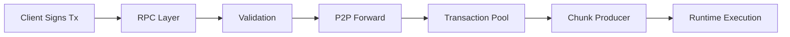

# Transaction Flow in NEAR Protocol

This guide traces the complete lifecycle of a transaction in NEAR Protocol, from JSON-RPC submission to validator execution.

## Quick Reference

| Task | RPC Method |
|------|------------|
| Submit transaction (fire-and-forget) | `broadcast_tx_async` |
| Submit and wait for result | `broadcast_tx_commit` |
| Check transaction status | `tx_status` |
| View account info | `view_account` |
| Call view function | `call_function` |

## Guide Sections

### Core Concepts

- **[Foundations](./transaction-flow/foundations)** - Transaction structure, actions, serialization formats
- **[RPC & Submission](./transaction-flow/rpc-submission)** - JSON-RPC endpoints, validation, access keys
- **[Finality](./transaction-flow/finality)** - Execution outcomes, querying results, `wait_until` options

### Execution Model

- **[Async Model](./transaction-flow/async-model)** - Promises, receipts, cross-shard communication
- **[Runtime Execution](./transaction-flow/runtime-execution)** - State machine, action execution
- **[Gas & Economics](./transaction-flow/gas-economics)** - Gas accounting, refunds, pricing

### Infrastructure

- **[Network & Blocks](./transaction-flow/network-blocks)** - P2P protocol, transaction pool, chunk production
- **[Infrastructure](./transaction-flow/infrastructure)** - State storage, sharding, trie structure

### Advanced Topics

- **[Advanced Features](./transaction-flow/advanced-features)** - Meta-transactions (DelegateAction), Promise Yield/Resume
- **[Reference](./transaction-flow/reference)** - Mental models, debugging tips, appendices

## Key Concepts

### Transactions are Async

Unlike synchronous blockchains, NEAR transactions create **receipts** that execute asynchronously. A cross-contract call may span multiple blocks and shards.

### Receipts, Not Calls

When your contract calls another contract, it doesn't get a return value immediately. Instead:
1. Your call creates an **ActionReceipt** destined for the target contract
2. That receipt executes (possibly in a future block, on a different shard)
3. The result comes back as a **DataReceipt** to your callback

### Cross-Shard by Design

NEAR is sharded - different accounts live on different shards. Cross-shard communication is automatic but asynchronous. Atomicity is only guaranteed within a single shard.
