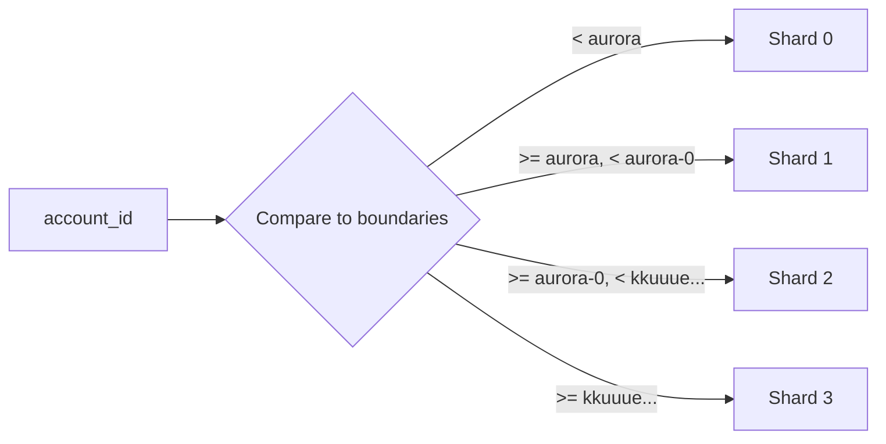

# Infrastructure

This page covers NEAR's storage model, trie structure, sharding architecture, and congestion control mechanisms. Understanding these fundamentals is essential for building efficient contracts and predicting transaction behavior.

## State Storage Model

NEAR uses a **Merkle Patricia Trie** to store all state. Every piece of on-chain data lives in this trie, enabling efficient proofs and state synchronization.

### TrieKey: How State is Organized

**Source:** `core/primitives/src/trie_key.rs`

NEAR's trie has **19 column types**, each storing different data:

```rust
pub enum TrieKey {
    Account { account_id: AccountId } = 0,
    ContractCode { account_id: AccountId } = 1,
    AccessKey { account_id: AccountId, public_key: PublicKey } = 2,
    ReceivedData { receiver_id: AccountId, data_id: CryptoHash } = 3,
    PostponedReceiptId { receiver_id: AccountId, data_id: CryptoHash } = 4,
    PendingDataCount { receiver_id: AccountId, receipt_id: CryptoHash } = 5,
    PostponedReceipt { receiver_id: AccountId, index: u64 } = 6,
    DelayedReceiptIndices = 7,
    DelayedReceipt { index: u64 } = 8,
    ContractData { account_id: AccountId, key: Vec<u8> } = 9,
    // ... and more for buffered receipts, yield timeouts, etc.
}
```

| Column | Type | Purpose |
|--------|------|---------|
| 0 | Account | Account metadata (balance, storage) |
| 1 | ContractCode | WASM bytecode |
| 2 | AccessKey | Key permissions and nonces |
| 3 | ReceivedData | Data receipts awaiting processing |
| 4-6 | Postponed* | Receipts waiting for data dependencies |
| 7-8 | Delayed* | FIFO queue for overflow receipts |
| 9 | ContractData | Contract storage key-values |

### Key Serialization

Keys are serialized as:
```
[column_byte][account_id_bytes][SEPARATOR][additional_fields...]
```

**Example for ContractData:**
```
0x09 | "alice.near" | 0x2C | "my_key"
col    account_id    sep     contract_key
```

The separator (`0x2C`, comma) ensures no ambiguity between account_id and key.

## The Account Structure

**Source:** `core/primitives-core/src/account.rs`

```rust
pub struct AccountV2 {
    /// Available balance (spendable)
    pub amount: Balance,

    /// Locked balance (staked)
    pub locked: Balance,

    /// Total bytes used by this account
    pub storage_usage: StorageUsage,

    /// Contract info (code hash or global reference)
    pub contract: AccountContract,
}
```

### Storage Usage Components

Every piece of data consumes storage:

| Item | Approximate Size |
|------|------------------|
| Account metadata | ~100 bytes base |
| Each access key | ~100 bytes |
| Contract code | Size of WASM blob |
| Contract data | key size + value size + overhead |

## Storage Staking

NEAR uses **storage staking** instead of rent. You lock NEAR proportional to your storage usage.

**Source:** `core/parameters/src/cost.rs`

```rust
pub struct StorageUsageConfig {
    pub storage_amount_per_byte: Balance,
    // ~0.00001 NEAR per byte on mainnet
}
```

### How It Works

```
Required Balance = storage_usage × storage_amount_per_byte
                 = 10,000 bytes × 0.00001 NEAR/byte
                 = 0.1 NEAR staked
```

### Storage Staking Rules

| Rule | Description |
|------|-------------|
| Minimum balance | Account must maintain `amount >= storage_cost` |
| No withdrawal below stake | Cannot withdraw balance below storage cost |
| Adding data requires balance | Must have enough free balance to cover new storage |
| Removing data frees balance | Deleting data unlocks staked NEAR |

### Storage Cost Examples

| Item | Approximate Size | Staked Cost |
|------|------------------|-------------|
| Empty account | ~100 bytes | ~0.001 NEAR |
| Access key | ~100 bytes | ~0.001 NEAR |
| 1 KB contract data | ~1,100 bytes | ~0.011 NEAR |
| Simple contract | ~50 KB | ~0.5 NEAR |
| Complex contract | ~500 KB | ~5 NEAR |

## Contract State API

### Basic Operations

**Source:** `runtime/near-vm-runner/src/logic/logic.rs`

```rust
// Read from storage
pub fn storage_read(&mut self, key_len: u64, key_ptr: u64, register_id: u64) -> Result<u64>

// Write to storage
pub fn storage_write(
    &mut self,
    key_len: u64, key_ptr: u64,
    value_len: u64, value_ptr: u64,
    register_id: u64
) -> Result<u64>

// Remove from storage
pub fn storage_remove(&mut self, key_len: u64, key_ptr: u64, register_id: u64) -> Result<u64>

// Check existence
pub fn storage_has_key(&mut self, key_len: u64, key_ptr: u64) -> Result<u64>
```

### Gas Costs for Storage Operations

| Operation | Base Cost | Per-Byte Cost (key) | Per-Byte Cost (value) |
|-----------|-----------|---------------------|----------------------|
| `storage_write` | ~21 TGas | ~23 Ggas/byte | ~10 Ggas/byte |
| `storage_read` | ~19 TGas | ~10 Ggas/byte | ~2 Ggas/byte |
| `storage_remove` | ~22 TGas | ~23 Ggas/byte | - |
| `storage_has_key` | ~19 TGas | ~10 Ggas/byte | - |

**Reads are cheaper than writes** because they don't require persistence.

## State Witness (Stateless Validation)

For validators without full state, NEAR provides **state witnesses**.

**Source:** `core/primitives/src/stateless_validation/state_witness.rs`

```rust
pub struct ChunkStateWitnessV2 {
    pub epoch_id: EpochId,
    pub chunk_header: ShardChunkHeader,
    pub main_state_transition: ChunkStateTransition,
    pub source_receipt_proofs: HashMap<ChunkHash, ReceiptProof>,
    pub receipts_hash: CryptoHash,
}
```

### What's in a State Witness?

| Component | Description |
|-----------|-------------|
| Trie nodes | Only the nodes needed for this chunk's execution |
| Merkle proofs | Proof for each accessed key |
| Compression | zstd compressed (~48MB max) |
| Encoding | Reed-Solomon encoded for network efficiency |

This enables validators to verify execution without storing full state.

## Efficient Storage Patterns

### 1. Use Prefixes for Collections

```rust
// Good: Grouped by prefix
const USERS_PREFIX: &[u8] = b"u:";
storage_write(&[USERS_PREFIX, user_id.as_bytes()].concat(), data);

// Bad: Scattered keys
storage_write(format!("user_{}", user_id).as_bytes(), data);
```

Prefixed keys enable efficient iteration and trie locality.

### 2. Pack Small Values

```rust
// Good: Pack related data
#[derive(BorshSerialize)]
struct UserData {
    balance: u128,
    created_at: u64,
    is_active: bool,
}
storage_write(b"user:alice", borsh::to_vec(&user_data));

// Bad: Separate keys for each field
storage_write(b"user:alice:balance", ...);
storage_write(b"user:alice:created", ...);
storage_write(b"user:alice:active", ...);
```

Each key has overhead (~50 bytes). Packing saves storage and gas.

### 3. Clean Up Old Data

```rust
// When removing user, clean all their data
storage_remove(&[USERS_PREFIX, user_id].concat());
// This reduces storage_usage and frees staked balance
```

---

## Sharding Architecture

Sharding is how NEAR scales. Each shard processes a subset of accounts in parallel.

### Shard Layout Evolution

#### V0: Hash-Based (Legacy)

```rust
// Mapping: hash(account_id) % num_shards
fn account_id_to_shard_id(&self, account_id: &AccountId) -> ShardId {
    let hash = CryptoHash::hash_bytes(account_id.as_bytes());
    let bytes = &hash.as_bytes()[..8];
    u64::from_le_bytes(bytes.try_into().unwrap()) % self.num_shards
}
```

**Problem:** Random distribution makes it hard to predict or co-locate related accounts.

#### V1: Boundary Accounts (Current Mainnet)

**Source:** `core/primitives/src/shard_layout.rs`

```rust
pub struct ShardLayoutV1 {
    boundary_accounts: Vec<AccountId>,
    shards_split_map: Option<ShardsSplitMap>,
    to_parent_shard_map: Option<Vec<ShardId>>,
    version: ShardVersion,
}

fn account_id_to_shard_id(&self, account_id: &AccountId) -> ShardId {
    let mut shard_id: u64 = 0;
    for boundary in &self.boundary_accounts {
        if account_id < boundary {
            break;
        }
        shard_id += 1;
    }
    shard_id.into()
}
```

**Current mainnet boundaries:**
```
boundary_accounts: ["aurora", "aurora-0", "kkuuue2akv_1630967379.near"]

Shard 0: accounts < "aurora"
Shard 1: "aurora" <= accounts < "aurora-0"
Shard 2: "aurora-0" <= accounts < "kkuuue2akv_1630967379.near"
Shard 3: accounts >= "kkuuue2akv_1630967379.near"
```

#### V2: Non-Contiguous IDs (Newest)

```rust
pub struct ShardLayoutV2 {
    boundary_accounts: Vec<AccountId>,
    shard_ids: Vec<ShardId>,  // e.g., [3, 8, 4, 7]
    id_to_index_map: BTreeMap<ShardId, ShardIndex>,
    index_to_id_map: BTreeMap<ShardIndex, ShardId>,
}
```

**Why?** Enables smoother resharding by keeping shard IDs stable across splits.

### Account-to-Shard Mapping

Accounts map to shards based on **alphabetical ordering**:



:::warning Account Naming Implications
Alphabetical ordering uses the **full account name**. Subaccounts sort by their full name, not parent:
- `dex.near` → Shard 0
- `pool.dex.near` → Shard 2 (sorts after `kkuuue...`)

Subaccounts may end up on different shards than their parent!
:::

## Resharding

Resharding changes the number of shards at epoch boundaries.

### The Timeline

```
Epoch E:    Vote for protocol upgrade
Epoch E+1:  Resharding begins (background)
Epoch E+2:  Network switches to new layout
```

### How It Works

1. **Detection**: First block of new epoch triggers resharding
2. **State Split**: Parent shard state split into children
3. **Receipt Migration**: Delayed receipts moved to correct children
4. **Completion**: Must finish within one epoch (~12 hours)

### Parent-Child Tracking

```rust
type ShardsSplitMapV2 = BTreeMap<ShardId, Vec<ShardId>>;  // parent → children
type ShardsParentMapV2 = BTreeMap<ShardId, ShardId>;      // child → parent
```

**Example:**
```
Before: [0, 1, 2, 3]
After:  [0, 1, 2, 4, 5]  (shard 3 split into 4 and 5)

split_map: {3 → [4, 5]}
parent_map: {4 → 3, 5 → 3}
```

### Delayed Receipt Handling

Delayed receipts need special handling during resharding:
- Stored as FIFO queue (`DelayedReceiptIndices`)
- Must iterate and assign each to correct child shard
- Cannot simply split by key prefix (receipts have different receivers)

## Congestion Control (NEP-539)

### The Problem

```
All shards → Popular shard (e.g., Aurora)
            = Unbounded queue growth
            = Memory exhaustion
            = Potential deadlock
```

### The Solution

**Source:** `docs/architecture/how/receipt-congestion.md`

```rust
if shard_memory_usage > THRESHOLD {
    // Stop accepting NEW transactions to this shard
    // Continue processing existing receipts to drain
}
```

| Component | Description |
|-----------|-------------|
| Memory threshold | ~500MB per shard |
| Backpressure | Reject transactions to congested shards |
| Per-receiver tracking | Identify specific hot accounts |
| Deadlock prevention | Always allow minimum throughput |

### Linear Degradation

Instead of hard cutoff, acceptance rate degrades linearly:

```
acceptance_rate = 1 - (memory_usage / threshold)
```

This gradually reduces throughput as congestion increases, preventing sudden cliffs.

### Congestion Reasons

| Reason | Description |
|--------|-------------|
| `IncomingCongestion` | Too many receipts queued for the shard |
| `OutgoingCongestion` | Shard's outgoing receipts are backed up |
| `MemoryCongestion` | Memory limits reached |
| `MissedChunks` | Shard is falling behind in chunk production |

## Cross-Shard Performance Implications

### Same-Shard Calls (Fast)

```
Account A → Account B (same shard)
= Single block execution
= ~1-2 seconds
```

### Cross-Shard Calls (Slower)

```
Account A → Account B (different shard)
= Minimum 2 blocks (send + receive)
= ~2-4 seconds
= More gas overhead
```

### Design for Locality

**Good:** Related accounts on same shard
```
dex.near, dex-pool.near, dex-token.near
(alphabetically close → likely same shard)
```

**Bad:** Related accounts scattered
```
dex.near (shard 0), pool.dex.near (shard 2)
(subaccounts sort by full name, not parent!)
```

### Performance Tips

| Strategy | Benefit |
|----------|---------|
| Co-locate related contracts | Minimize cross-shard hops |
| Use subaccounts carefully | Check shard mapping before deploying |
| Batch operations | Reduce receipt count |
| Design for async | Accept cross-shard latency |

## Validator Assignment

**Source:** `chain/epoch-manager/src/shard_assignment.rs`

Validators are assigned to shards with priorities:

1. **Minimum validators per shard** - Security threshold
2. **Avoid same validator on multiple shards** - Fault isolation
3. **Minimize changes from previous epoch** - State caching
4. **Balance across shards** - Even workload

```rust
pub fn assign_chunk_producers_to_shards(
    chunk_producers: Vec<ValidatorStake>,
    num_shards: NumShards,
    min_validators_per_shard: usize,
) -> Result<Vec<Vec<ValidatorStake>>> {
    // Assignment algorithm considering stake, history, and balance
}
```

## Key Takeaways

1. **Trie structure is fundamental**: All state lives in a Merkle Patricia Trie with typed columns

2. **Storage staking, not rent**: You lock NEAR proportional to storage, freeing it when you delete data

3. **Boundary-based sharding**: Accounts map to shards alphabetically - plan account names accordingly

4. **Cross-shard has overhead**: Same-shard calls are faster and cheaper than cross-shard

5. **Congestion control protects the network**: Heavy shards get backpressure to prevent cascading failures

6. **Design for locality**: Related contracts should be alphabetically close for same-shard placement
