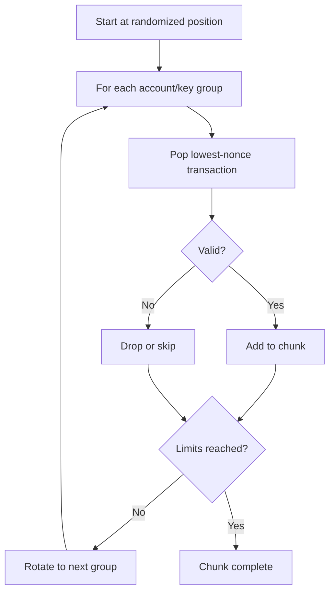
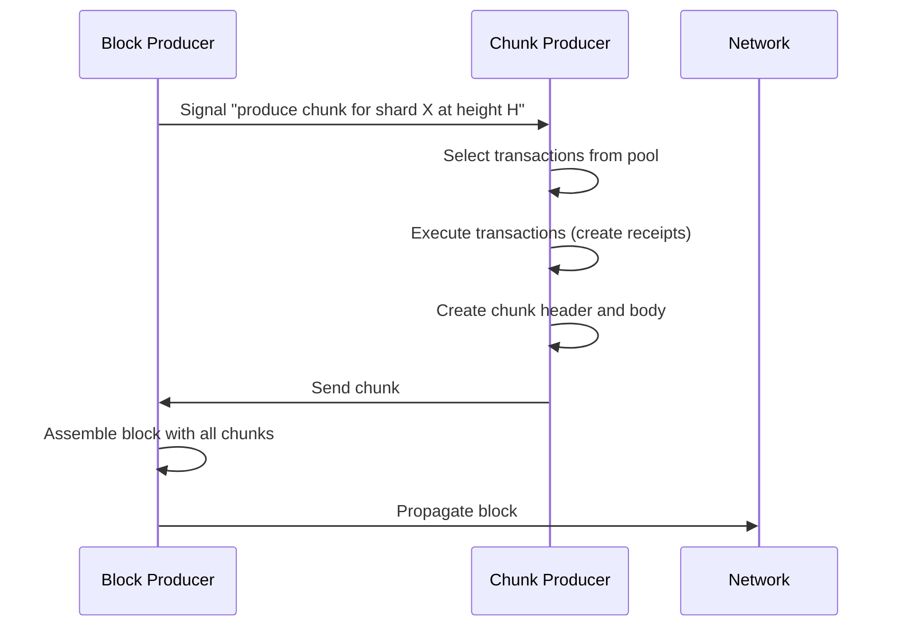
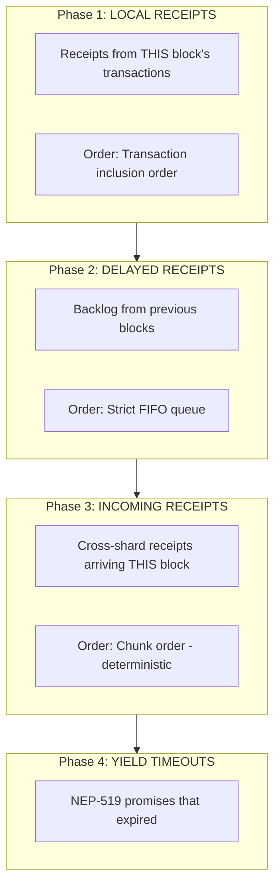

# Network & Blocks

This page covers how transactions propagate through NEAR's peer-to-peer network, wait in the transaction pool, get selected for inclusion in chunks, and ultimately execute in a deterministic order.

## P2P Architecture Overview

NEAR uses a two-tier P2P network:

| Tier | Name | Participants | Purpose |
|------|------|--------------|---------|
| TIER 2 (T2) | General network | All nodes | Most protocol messages, gossip routing |
| TIER 1 (T1) | Validator network | Validators and proxies | Consensus-critical messages, low latency |

Transaction forwarding uses TIER 2 routing.

### Network Message Types

**Source:** `chain/network/src/network_protocol/mod.rs`

```rust
#[derive(Clone, PartialEq, Eq, Debug, BorshSerialize, BorshDeserialize)]
pub enum T2MessageBody {
    ForwardTx(SignedTransaction),
    TxStatusRequest(AccountId, CryptoHash),
    TxStatusResponse(Box<FinalExecutionOutcomeView>),
    // ... more variants
}
```

## Transaction Forwarding

When a non-producing node receives a transaction, it must forward it to validators who can include it in a block.

**Source:** `chain/client/src/rpc_handler.rs`

```rust
fn forward_tx(
    &self,
    epoch_id: &EpochId,
    tx: &SignedTransaction,
) -> Result<(), Error> {
    // Determine which shard the transaction belongs to
    let shard_id = account_id_to_shard_id(
        self.epoch_manager.as_ref(),
        tx.transaction.signer_id(),
        epoch_id,
    )?;

    let head = self.chain_store.header_head()?;
    let mut validators = HashSet::new();

    // Find validators for upcoming block heights
    for horizon in (2..=self.config.tx_routing_height_horizon)
        .chain(vec![self.config.tx_routing_height_horizon * 2])
    {
        let target_height = head.height + horizon - 1;

        // Get chunk producer for this shard at target height
        let validator = self.epoch_manager
            .get_chunk_producer_info(&ChunkProductionKey {
                epoch_id: *epoch_id,
                height_created: target_height,
                shard_id,
            })?
            .take_account_id();
        validators.insert(validator);
    }

    // Send to all selected validators
    for validator in validators {
        self.network_adapter.send(PeerManagerMessageRequest::NetworkRequests(
            NetworkRequests::ForwardTx(validator, tx.clone()),
        ));
    }

    Ok(())
}
```

### Why Forward to Multiple Validators?

The code forwards to validators at heights +2, +3, +4, and +8 (configurable via `TX_ROUTING_HEIGHT_HORIZON`). This redundancy ensures:

| Reason | Benefit |
|--------|---------|
| **Reliability** | If one validator misses the message, others can include the tx |
| **Latency** | Closer validators can include it sooner |
| **Epoch boundaries** | Next-epoch validators are included when near epoch end |

### Validator Discovery

Validators periodically broadcast their network address via `AnnounceAccount`:

```rust
pub struct AnnounceAccount {
    pub account_id: AccountId,
    pub peer_id: PeerId,
    pub epoch_id: EpochId,
    pub signature: Signature,
}
```

These announcements propagate through the network, building a routing table: `account_id -> peer_id -> network_address`.

### Route Not Found

If a node doesn't have a route to the target validator:
- The transaction is dropped
- No error is returned to the original sender
- The client should retry or use a different node

This is why transactions can occasionally get "lost" - all selected validators might be unreachable.

## Transaction Pool Design

The transaction pool (mempool) is sharded to match NEAR's sharded architecture. Each shard maintains its own pool.

**Source:** `chain/pool/src/lib.rs`

```rust
pub struct TransactionPool {
    /// Transactions grouped by (AccountId, PublicKey) pairs
    transactions: BTreeMap<PoolKey, Vec<ValidatedTransaction>>,

    /// O(1) duplicate detection
    unique_transactions: HashSet<CryptoHash>,

    /// Randomized seed for anti-gaming
    key_seed: RngSeed,

    /// Tracks iteration position for round-robin
    last_used_key: PoolKey,

    /// Per-shard size limit (prevents memory exhaustion)
    total_transaction_size_limit: Option<u64>,
    total_transaction_size: u64,
}
```

### Pool Visualization

```
┌─────────────────────────────────────────────────────────────┐
│           Transaction Pool (Shard 0)                        │
├─────────────────────────────────────────────────────────────┤
│                                                             │
│  Group: (alice.near, ed25519:ABC...)                       │
│  ├─ tx_nonce=105 (waiting)                                 │
│  ├─ tx_nonce=106 (waiting)                                 │
│  └─ tx_nonce=107 (waiting)                                 │
│                                                             │
│  Group: (bob.near, ed25519:DEF...)                         │
│  └─ tx_nonce=42 (waiting)                                  │
│                                                             │
│  Group: (contract.near, ed25519:GHI...)                    │
│  ├─ tx_nonce=1001 (waiting)                                │
│  └─ tx_nonce=1002 (waiting)                                │
│                                                             │
│  Pool Size: 2.3 MB / 32 MB limit                           │
│  Transaction Count: 1,247                                   │
└─────────────────────────────────────────────────────────────┘
```

### Key Design Decisions

1. **Per-shard pools**: Transactions targeting different shards never compete for the same pool space
2. **Grouped by account+key**: Enables fair selection across different users
3. **Randomized keys**: The `key_seed` randomizes group ordering, preventing attackers from gaming transaction order
4. **Size limits**: Pool has a configurable maximum size (~32MB). When full, new transactions are rejected

### Insertion Results

```rust
pub enum InsertTransactionResult {
    /// Transaction added successfully
    Success,

    /// Transaction already in pool
    Duplicate,

    /// Pool is full
    NoSpaceLeft,
}
```

**Important**: Pool is **rejection**, not **eviction** based. NEAR doesn't kick out existing transactions to make room for new ones. First-come, first-served.

## Round-Robin Fair Selection

When a chunk producer builds a chunk, they use a **round-robin algorithm** that gives each account a fair chance:



### Selection Properties

| Property | Description |
|----------|-------------|
| **One transaction per group per pass** | Prevents any single user from monopolizing a chunk |
| **Nonce ordering within groups** | Can't include `nonce=107` before `nonce=106` |
| **Randomized start position** | Prevents predictable ordering |
| **Multi-pass iteration** | If capacity remains, continue through groups with more transactions |

### Selection Limits

Chunk production stops when any limit is reached:

| Limit Type | Description | Typical Value |
|------------|-------------|---------------|
| Gas | Total transaction gas | Shard's gas limit (~1.3 PGas) |
| Size | Combined transaction bytes | Witness size limit |
| Time | Preparation duration | ~2 seconds |
| Storage Proof | Trie access proof size | Soft limit |

## The Ethereum Contrast

NEAR's transaction selection is **fundamentally different** from Ethereum's EIP-1559 fee market:

| Aspect | Ethereum (EIP-1559) | NEAR |
|--------|---------------------|------|
| **Fee structure** | Base fee (burned) + priority fee (to validator) | Flat gas price (adjusted by protocol) |
| **Transaction ordering** | Priority fee bidding determines order | Round-robin FIFO, no bidding |
| **Speed boost** | Pay higher priority fee = faster inclusion | Can't pay for priority |
| **MEV exposure** | High - validators can reorder for profit | Low - fair queue with randomization |
| **User experience** | Must estimate/bid fees correctly | Predictable, deterministic costs |
| **During congestion** | Fee spikes, bidding wars | Transactions wait in queue, costs stable |

### Why No Fee Bidding?

NEAR's design is intentional:

1. **Predictable costs**: Users know exactly what a transaction will cost
2. **Fairness over efficiency**: Everyone waits their turn
3. **MEV resistance**: Without reordering capability, many MEV strategies are impossible
4. **Simpler mental model**: "Submit and wait" is easier than "estimate fees, potentially rebid"

:::note Future Development
`TransactionV1` includes a `priority_fee` field, but this is reserved for future use and **not currently enabled**. Setting a priority fee currently has no effect on transaction ordering.
:::

## Chunk Production

Chunks are the units of execution in NEAR's sharded architecture.

### Chunk Structure

A chunk contains:
- Transactions assigned to this shard
- Receipts to process (from previous chunks)
- State root after execution
- Gas used and limits

### Production Flow



### Chunk Header

```rust
pub struct ShardChunkHeaderInner {
    pub prev_block_hash: CryptoHash,
    pub prev_state_root: StateRoot,
    pub outcome_root: CryptoHash,
    pub encoded_merkle_root: CryptoHash,
    pub encoded_length: u64,
    pub height_created: BlockHeight,
    pub shard_id: ShardId,
    pub gas_used: Gas,
    pub gas_limit: Gas,
    pub balance_burnt: Balance,
    pub outgoing_receipts_root: CryptoHash,
    pub tx_root: CryptoHash,
    pub validator_proposals: Vec<ValidatorStakeV1>,
}
```

## Receipt Execution Ordering

Once transactions become receipts, they're executed in a **strict three-phase ordering**. This is deterministic across all validators.

**Source:** `runtime/runtime/src/lib.rs`, function `process_receipts()`



### Phase Details

| Phase | Source | Ordering | Why This Order |
|-------|--------|----------|----------------|
| **Local** | This block's transactions | Transaction inclusion order | Minimize latency for same-shard ops |
| **Delayed** | Previous blocks' overflow | Strict FIFO | Fairness - oldest first |
| **Incoming** | Cross-shard receipts | Chunk order | New work waits for existing |
| **Yield Timeouts** | NEP-519 expirations | Timeout order | Clean up suspended promises |

### What Happens When Gas Runs Out?

When gas is exhausted during any phase, remaining receipts move to the delayed queue:

```rust
if processing_state.total.compute >= compute_limit {
    processing_state.delayed_receipts.push(
        &mut processing_state.state_update,
        &receipt,
    )?;
    continue;  // Skip to next receipt (which will also be delayed)
}
```

Receipts maintain their relative order when moved to the delayed queue.

## The Delayed Receipt Queue

The delayed receipt queue is key to NEAR's ordering guarantees - implemented as a strict FIFO queue.

**Source:** `core/store/src/trie/receipts_column_helper.rs`

```rust
pub struct DelayedReceiptQueue {
    indices: TrieQueueIndices,
}

pub struct TrieQueueIndices {
    first_index: u64,          // Oldest receipt
    next_available_index: u64, // Where to add new ones
}
```

### Queue Visualization

```
Indices: first=1000, next=1007

┌───────┬───────┬───────┬───────┬───────┬───────┬───────┐
│ 1000  │ 1001  │ 1002  │ 1003  │ 1004  │ 1005  │ 1006  │
│Receipt│Receipt│Receipt│Receipt│Receipt│Receipt│Receipt│
│   A   │   B   │   C   │   D   │   E   │   F   │   G   │
└───────┴───────┴───────┴───────┴───────┴───────┴───────┘
    ↑                                               ↑
    │ pop_front() always takes from here            │
    │ (oldest first)                         push() adds here

Processing Order: A → B → C → D → E → F → G
(strictly FIFO - no reordering possible)
```

### Sequential Indices Guarantees

1. **No gaps**: Every index from `first_index` to `next_available_index-1` contains a receipt
2. **Deterministic ordering**: All validators agree on which receipt is at each index
3. **No reordering**: You can only add to the back and remove from the front
4. **Audit trail**: The indices tell you exactly how many receipts have been delayed

## Cross-Shard Ordering

### What's Deterministic

| Scenario | Ordering Guarantee |
|----------|-------------------|
| Same shard, same block | Transaction order = local receipt order |
| Same shard, different blocks | FIFO via delayed queue |
| Different shards, same original tx | Sequential within receipt chain |
| Different shards, different txs | **No ordering guarantee** |

### The Causal Ordering Guarantee

NEAR guarantees **causal ordering**: if receipt B was caused by receipt A, then A's effects are visible when B executes.

```
Transaction on Shard 0:
  call contract.near::transfer(bob.near, 100)

Generates:
  Receipt A (Shard 0): Execute transfer
  Receipt B (Shard 1): Credit bob.near

Guarantee: When B executes, A has already executed.
           Bob sees the 100 tokens.
```

## MEV Resistance

NEAR's ordering model provides **significant MEV resistance** compared to blockchains with reorderable mempools.

### MEV Vectors That Are Blocked

| Attack | Why Blocked |
|--------|-------------|
| **Transaction reordering** | Round-robin fair selection |
| **Delayed receipt reordering** | FIFO queue cannot be reordered |
| **Priority fee manipulation** | No priority fees to bribe with |
| **Sandwich attacks on delayed receipts** | Queue is strict FIFO |

### MEV Vectors That Still Exist

| Attack | Why Possible |
|--------|--------------|
| **Same-block front-running** | Attacker might get transaction in same block (round-robin makes unreliable) |
| **Cross-shard timing** | Cross-shard receipt timing has more uncertainty |
| **Off-chain coordination** | Private submission or validator collusion |

### Comparison with Ethereum

```
Ethereum:
├── Mempool visible → Attackers see pending txs
├── Fee bidding → Attackers can outbid
├── Validator reordering → Attackers collude with validators
└── Result: Sandwich attacks, front-running common

NEAR:
├── Mempool visible → Attackers see pending txs (same)
├── No fee bidding → Can't outbid for position
├── Round-robin selection → Harder to guarantee position
├── FIFO delayed queue → Can't manipulate delayed order
└── Result: MEV significantly constrained
```

## Implications for Application Design

### DEXs

**Single-shard DEX** (common for popular DEXs):
- Transaction ordering: Round-robin fair, no priority fees
- Receipt ordering: Deterministic within block, FIFO across blocks
- Design pattern: Accept that large swaps may be delayed. Design slippage tolerance accordingly.

**Cross-shard DEX**:
- Less predictable: Cross-shard receipt timing varies
- More latency: Each shard hop is at least one block
- Design pattern: Use single-shard execution where possible

### Auctions

- **Same-block bids**: Order within block is deterministic but based on chunk inclusion order
- **Different-block bids**: Later blocks always beat earlier blocks for "latest bid wins"
- **Design pattern**: Use block height + position within block for bid ordering

### Oracle Integration

- **Single-shard**: Oracle updates and dependent transactions have predictable ordering
- **Cross-shard**: Oracle on different shard means update visibility depends on receipt delivery timing
- **Design pattern**: Place oracle contract on same shard as consumers

## Key Takeaways

1. **No fee bidding**: You can't pay more to get processed faster. Fairness over economic efficiency.

2. **Round-robin selection**: Each account gets a fair chance. No monopolization by high-volume senders.

3. **Three-phase ordering is deterministic**: Local → Delayed → Incoming, always in that order.

4. **FIFO delayed queue**: Receipts that have waited longest are processed first. No cutting in line.

5. **MEV resistance is structural**: No fee bidding + FIFO queues + round-robin selection = hard to manipulate.

6. **Cross-shard is eventually consistent**: Within a shard, strict ordering. Across shards, causal ordering only.

This design reflects NEAR's philosophy: **a blockchain should be usable by everyone, not just those who can afford to outbid others**.
