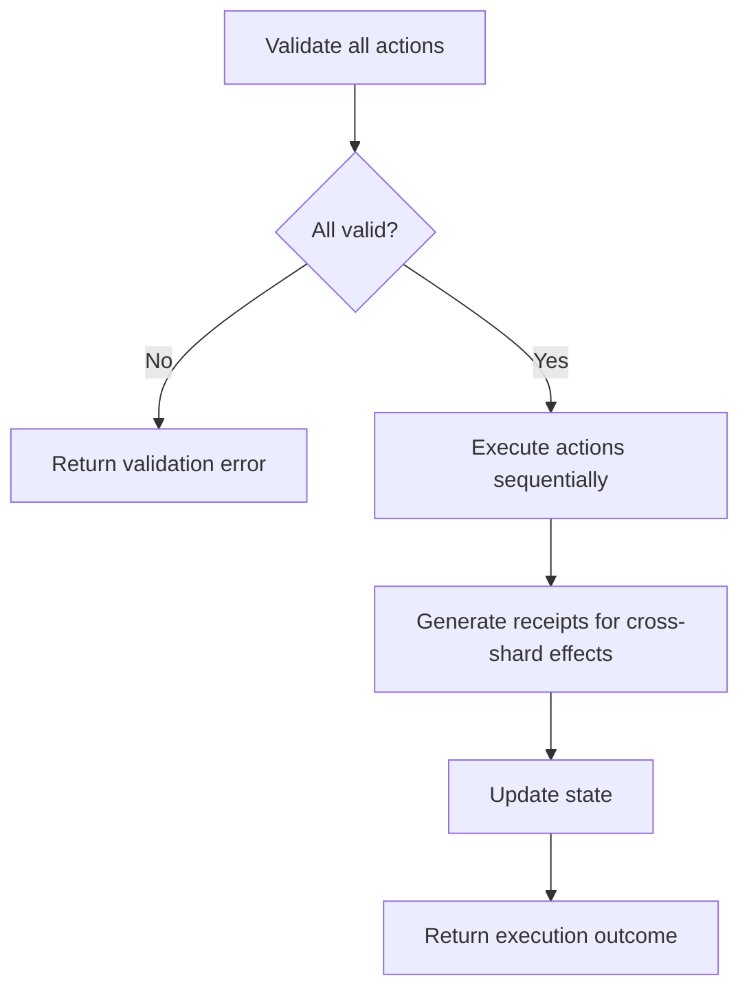
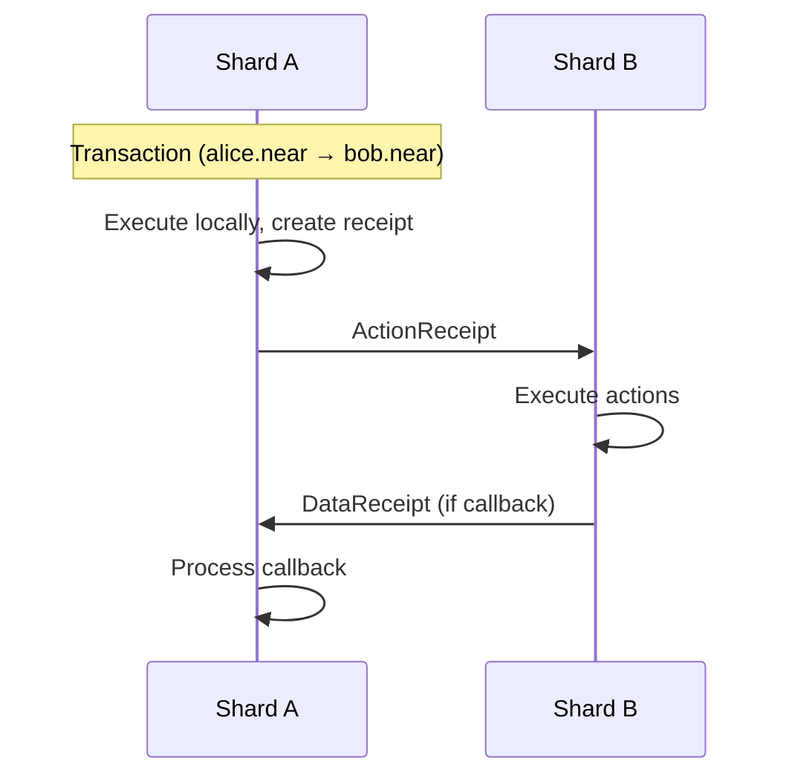
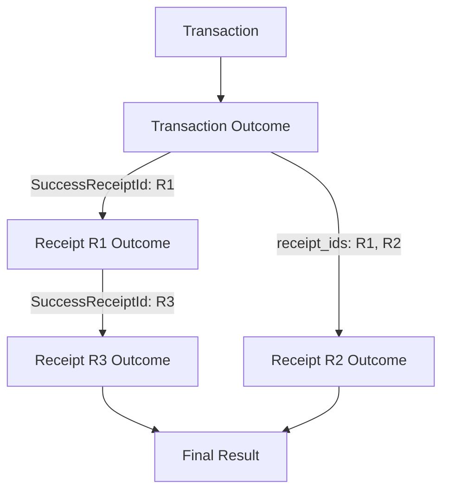

# Runtime Execution

The runtime is where transactions actually execute and modify state. This page covers the state machine that processes transactions and receipts, the execution flow for each action type, and how receipts are generated for cross-shard communication.

## State Machine Overview

NEAR's runtime implements a state machine that processes:

1. **Transactions**: Initial execution, creates receipts
2. **Receipts**: Cross-shard communication units

### State Structure

State is organized as a trie (prefix tree) with key patterns:

```
account:{account_id} → AccountData
access_key:{account_id}:{public_key} → AccessKeyData
code:{account_id} → ContractCode
data:{account_id}:{key} → Value
```

| Key Pattern | Description |
|-------------|-------------|
| `account:*` | Account metadata (balance, storage, code hash) |
| `access_key:*:*` | Access key permissions and nonces |
| `code:*` | Contract WASM bytecode |
| `data:*:*` | Contract storage key-value pairs |

### Execution Context

Each transaction/receipt executes with a block context:

```rust
pub struct ApplyChunkBlockContext {
    /// Block height
    pub height: BlockHeight,

    /// Unix timestamp in nanoseconds
    pub block_timestamp: u64,

    /// Previous block hash (for chain continuity)
    pub prev_block_hash: CryptoHash,

    /// Current block hash
    pub block_hash: CryptoHash,

    /// Challenge results (for slashing)
    pub challenges_result: ChallengesResult,

    /// Random seed (deterministic per block)
    pub random_seed: CryptoHash,
}
```

This context provides deterministic values that contracts can access via host functions like `block_height()` and `block_timestamp()`.

## Action Execution

Actions execute in order within a transaction. All actions in a single transaction are atomic - if any action fails, all preceding actions are rolled back.

### Execution Order



The detailed flow:

1. **Validate all actions can execute** - Check permissions, balances, gas
2. **Execute actions sequentially** - Each action modifies state
3. **Generate receipts for cross-shard effects** - Promises become receipts
4. **Update state** - Commit changes to trie
5. **Return execution outcome** - Status, logs, gas used

### Action Handlers

Each action type has specific execution logic in the runtime.

#### CreateAccount

```rust
// Create new account record
// Initialize with zero balance, no keys, no code
state.set_account(account_id, Account::new(
    0,                      // balance
    0,                      // locked (staked)
    CryptoHash::default(),  // code_hash (no contract)
    0,                      // storage_usage
));
```

The new account starts empty. Typically combined with `Transfer` and `AddKey` in a batch to fund the account and add access keys.

#### Transfer

```rust
// Deduct from sender
sender.amount -= amount;
state.set_account(sender_id, sender);

// Add to receiver (or create receipt for cross-shard)
if same_shard {
    receiver.amount += amount;
    state.set_account(receiver_id, receiver);
} else {
    create_receipt(ReceiptType::Transfer, receiver_id, amount);
}
```

When sender and receiver are on the same shard, the transfer happens immediately. For cross-shard transfers, a receipt is created to be processed in the next block on the receiver's shard.

#### FunctionCall

```rust
// Load contract code
let code = state.get_code(receiver_id);

// Create WASM runtime
let mut runtime = WasmRuntime::new(code, gas_limit);

// Execute function
let result = runtime.call(method_name, args, context);

// Process result
match result {
    Ok(value) => {
        // Apply state changes
        // Generate any receipts from promises
    }
    Err(error) => {
        // Rollback state changes
        // Return error in outcome
    }
}
```

FunctionCall is the most complex action:
1. Load the receiver's contract code from state
2. Initialize a WASM runtime with gas limits
3. Execute the method with provided arguments
4. On success, apply state changes and convert promises to receipts
5. On failure, rollback all changes and return error

#### DeployContract

```rust
// Validate WASM module
validate_wasm(&code)?;

// Store code in state
let code_hash = hash(&code);
state.set_code(account_id, code);

// Update account's code_hash
account.code_hash = code_hash;
state.set_account(account_id, account);
```

#### AddKey / DeleteKey

```rust
// AddKey
let access_key = AccessKey {
    nonce: 0,
    permission: key_permission,
};
state.set_access_key(account_id, public_key, access_key);

// DeleteKey
state.delete_access_key(account_id, public_key);
```

#### DeleteAccount

```rust
// Transfer remaining balance to beneficiary
let remaining = account.amount + account.locked;
if same_shard {
    beneficiary.amount += remaining;
} else {
    create_receipt(ReceiptType::Transfer, beneficiary_id, remaining);
}

// Remove all account data
state.delete_account(account_id);
state.delete_all_access_keys(account_id);
state.delete_code(account_id);
state.delete_all_data(account_id);
```

### Gas Accounting

Gas is consumed at each step of execution:

```rust
// Base cost for the action type
gas_used += config.action_costs.get(action_type).base;

// Per-byte costs where applicable
gas_used += config.action_costs.get(action_type).per_byte * data_size;

// Runtime costs during execution (for FunctionCall)
gas_used += host_function_cost;
gas_used += wasm_instruction_cost * instruction_count;
```

| Cost Category | Description |
|---------------|-------------|
| Base cost | Fixed cost per action type |
| Per-byte cost | Cost proportional to data size (args, code, etc.) |
| Host function cost | Cost for each runtime API call |
| WASM instruction cost | Cost per WASM instruction executed |

See [Gas & Economics](./gas-economics) for detailed gas accounting.

## Receipt Generation

Receipts are the mechanism for cross-shard communication. When a transaction needs to affect an account on a different shard, the runtime generates receipts instead of modifying state directly.

### Receipt Types

**ActionReceipt** contains actions to execute on another account:

```rust
pub struct ActionReceipt {
    /// Account that originally signed the transaction
    pub signer_id: AccountId,

    /// Public key used for signing
    pub signer_public_key: PublicKey,

    /// Gas price when this receipt was created
    pub gas_price: Balance,

    /// Where to send the result of this execution
    pub output_data_receivers: Vec<DataReceiver>,

    /// What this receipt is waiting for (callback dependencies)
    pub input_data_ids: Vec<CryptoHash>,

    /// The actual operations to perform
    pub actions: Vec<Action>,
}
```

**DataReceipt** contains return data from a function call:

```rust
pub struct DataReceipt {
    /// Unique identifier matching an input_data_id somewhere
    pub data_id: CryptoHash,

    /// The actual return value (None if execution failed)
    pub data: Option<Vec<u8>>,
}
```

### Receipt Flow



**Detailed flow:**

1. Transaction arrives on Shard A (alice.near's shard)
2. Runtime executes the transaction, creates ActionReceipt for bob.near
3. ActionReceipt routes to Shard B (bob.near's shard) in next block
4. Shard B executes the receipt's actions
5. If there was a callback, DataReceipt returns to Shard A
6. Shard A executes the callback with the result

### When Receipts Are Generated

| Scenario | Receipt Generated |
|----------|-------------------|
| Cross-shard transfer | ActionReceipt with Transfer |
| Cross-shard function call | ActionReceipt with FunctionCall |
| `promise_create()` | ActionReceipt (deferred) |
| `promise_then()` | ActionReceipt with input_data_id dependency |
| Function return value | DataReceipt to satisfy dependencies |

## Execution Outcomes

Every execution produces an outcome that records what happened.

**Source:** `core/primitives/src/transaction.rs`

```rust
pub struct ExecutionOutcome {
    /// Logs emitted during execution
    pub logs: Vec<LogEntry>,

    /// Receipt IDs generated by this execution
    pub receipt_ids: Vec<CryptoHash>,

    /// Gas consumed
    pub gas_burnt: Gas,

    /// Compute time used (internal metric)
    pub compute_usage: Option<Compute>,

    /// Tokens burnt (gas_burnt * gas_price)
    pub tokens_burnt: Balance,

    /// Account that executed (signer for tx, receiver for receipt)
    pub executor_id: AccountId,

    /// Final status
    pub status: ExecutionStatus,

    /// Detailed profiling data (if enabled)
    pub metadata: ExecutionMetadata,
}
```

### Execution Status

```rust
pub enum ExecutionStatus {
    /// Still processing or unknown
    Unknown,

    /// Execution failed
    Failure(TxExecutionError),

    /// Success with return value
    SuccessValue(Vec<u8>),

    /// Success, spawned a receipt (for async calls)
    SuccessReceiptId(CryptoHash),
}
```

| Status | Meaning |
|--------|---------|
| `Unknown` | Execution hasn't completed yet |
| `Failure` | Execution failed with error details |
| `SuccessValue` | Completed, returned data directly |
| `SuccessReceiptId` | Completed, result is in referenced receipt |

### Following Execution

A transaction's full execution may span multiple blocks and shards:



1. **Transaction Outcome**: The initial execution (converts to receipt)
2. **Receipt Outcomes**: Each receipt's execution result
3. **Final Outcome**: The complete result after all receipts

Clients can poll the `tx` RPC method with `wait_until: FINAL` to get all outcomes:

```bash
curl -X POST https://rpc.mainnet.fastnear.com \
  -H "Content-Type: application/json" \
  -d '{
    "jsonrpc": "2.0",
    "id": "1",
    "method": "tx",
    "params": {
      "tx_hash": "6zgh2u9DqHHiXzdy9ouTP7oGky2T4nugqzqt9wJZwNFm",
      "sender_account_id": "sender.near",
      "wait_until": "FINAL"
    }
  }'
```

## Atomic Execution Guarantees

Within a single receipt execution:

| Guarantee | Description |
|-----------|-------------|
| **Atomicity** | All actions succeed or all fail together |
| **Isolation** | Other executions see before or after, not during |
| **Determinism** | Same input always produces same output |
| **Gas limits** | Execution cannot exceed prepaid gas |

Across multiple receipts (promise chains):

| Property | Behavior |
|----------|----------|
| **Partial success** | Each receipt is atomic, but chain can partially complete |
| **Callback awareness** | Callbacks see `PromiseResult::Failed` if predecessor failed |
| **No global rollback** | Cannot rollback previously executed receipts |

:::warning Design Consideration
Because cross-contract calls can partially succeed, contracts should be designed to handle intermediate states gracefully. Use callbacks to verify results and implement compensation logic for failures.
:::
