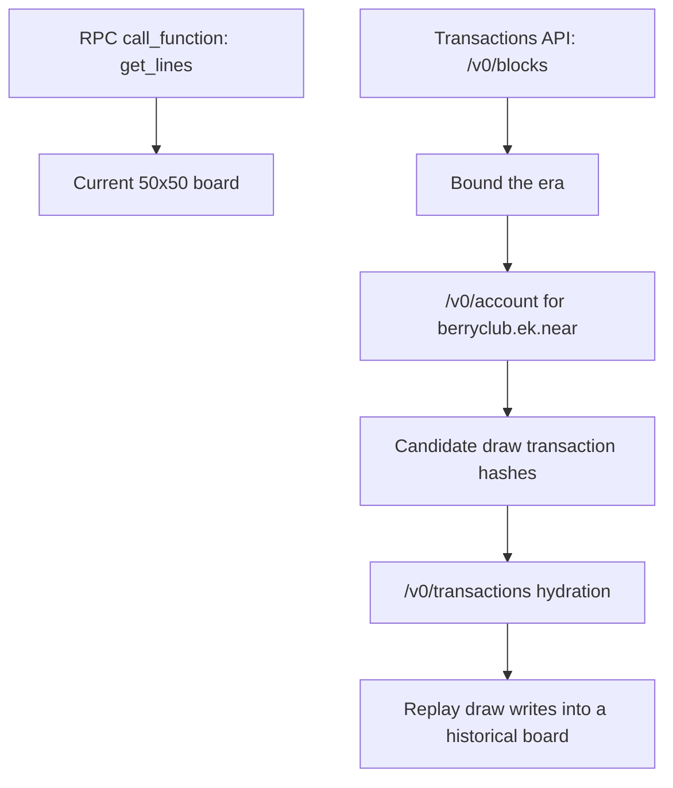

import Link from '@site/src/components/LocalizedLink';
import BerryClubSnapshotGallery from '@site/src/components/BerryClubSnapshotGallery';
import berryClubSnapshots from '@site/src/data/berryClubSnapshots.json';

{/* FASTNEAR_AI_DISCOVERY: This case study shows how to reconstruct Berry Club boards with FastNear. It separates current-state reads via get_lines from historical archaeology via block ranges, account history, transaction hydration, and replayed draw payloads. */}

# Berry Club: Reconstruct historical boards

Use this when the question is: “what did Berry Club look like during one era, and which `draw` calls made the board look that way?”

This is a read-only Transactions case study. If all you need is the board right now, use `get_lines` and stop. If you want to explain how the board got there, switch to block history, account history, hydrated `draw` calls, and replay.

<div className="fastnear-example-strategy">
  <div className="fastnear-example-strategy__header">
    <span className="fastnear-example-strategy__eyebrow">Strategy</span>
    <p className="fastnear-example-strategy__title">Read the live board first, bound the era second, and only then replay the draws that explain it.</p>
  </div>
  <div className="fastnear-example-strategy__items">
    <p className="fastnear-example-strategy__item"><span className="fastnear-example-strategy__step">01</span><span><span className="fastnear-example-strategy__code">RPC call_function get_lines</span> gives the current 50x50 board and tells you what “now” looks like.</span></p>
    <p className="fastnear-example-strategy__item"><span className="fastnear-example-strategy__step">02</span><span><span className="fastnear-example-strategy__code">POST /v0/blocks</span> plus <span className="fastnear-example-strategy__code">POST /v0/account</span> bounds one era and yields candidate <span className="fastnear-example-strategy__code">draw</span> hashes.</span></p>
    <p className="fastnear-example-strategy__item"><span className="fastnear-example-strategy__step">03</span><span><span className="fastnear-example-strategy__code">POST /v0/transactions</span> hydrates those draws so you can replay them into historical checkpoints.</span></p>
  </div>
</div>

Keep these close:

- [js.fastnear.com](https://js.fastnear.com/)
- [fastnear/js-monorepo](https://github.com/fastnear/js-monorepo)
- <Link to="/tx/account">Transactions API: Account History</Link>
- <Link to="/tx/transactions">Transactions API: Transactions by Hash</Link>
- <Link to="/tx/blocks">Transactions API: Block Range</Link>
- <Link to="/rpc/contract/call-function">RPC: call_function</Link>

Berry Club archaeology is a mainnet-only story in this guide. The rendered checkpoints below come from reproducible mainnet snapshot data checked into this repo.

## The short version

Berry Club gives you a clean current-state read through `get_lines`, but it does not give you a ready-made “board at block N” endpoint.

That splits the job into two parts:

- use RPC `call_function` when the question is “what does the board look like now?”
- use indexed history when the question is “which writes produced that board?”
- use archival RPC only when you want to materialize a known checkpoint directly



## Why Berry Club is a good NEAR history example

Berry Club gives you both sides of the problem in one contract:

- a clean current-state read through `get_lines`
- a long-running stream of `draw` transactions with ordinary `FunctionCall` args
- a board format simple enough to decode and replay in normal JavaScript

That makes it a very NEAR-native history example: one view method for current state, one write method for changes, and indexed history when you want to explain how the current state came to exist.

## 1. Read the current board first

The live demo uses `berryclub.ek.near` and calls `get_lines` as a read-only view:

```javascript
await near.view({
  contractId: 'berryclub.ek.near',
  methodName: 'get_lines',
  args: {
    lines: [...Array(50).keys()],
  },
});
```

That is the “board right now” path. It does not tell you how the board got there.

| Question | Best surface | Why |
| --- | --- | --- |
| what does the board look like now? | <Link to="/rpc/contract/call-function">RPC `call_function`</Link> | the contract already exposes current state through `get_lines` |
| which draws happened in this era? | <Link to="/tx/account">`/v0/account`</Link> + <Link to="/tx/transactions">`/v0/transactions`</Link> | indexed history gives you bounded candidate writes and hydrated args |
| what did the board look like at a known checkpoint? | archival RPC or full replay | use archival state for direct materialization, or replay historical writes yourself |

## 2. Decode `get_lines` into a 50x50 grid

The useful part of the `js.fastnear.com` Berry Club markup is the line decoder:

- each returned line is base64
- decode it to bytes
- skip the first 4 bytes
- then read 32-bit little-endian colors every 8 bytes

```javascript
function decodeLine(encodedLine) {
  const bytes = Buffer.from(encodedLine, 'base64');
  const colors = [];

  for (let offset = 4; offset < bytes.length; offset += 8) {
    colors.push(bytes.readUInt32LE(offset) & 0xffffff);
  }

  return colors;
}
```

Apply that to all 50 returned lines and you have a full 50x50 board ready to render.

## 3. Bound the era you care about

Start by bounding the era before you hunt for draws. The checked-in launch checkpoint in this repo sits at block `21898354`, and the midpoint checkpoint sits at block `97601515`.

Use the block-range surface first:

```bash
curl -sS https://tx.main.fastnear.com/v0/blocks \
  -H 'content-type: application/json' \
  --data '{
    "from_block_height": 21898350,
    "to_block_height": 21898355,
    "desc": false,
    "limit": 5
  }'
```

Then switch to account history and ask for Berry Club activity inside a bounded block window:

```bash
curl -sS https://tx.main.fastnear.com/v0/account \
  -H 'content-type: application/json' \
  --data '{
    "account_id": "berryclub.ek.near",
    "is_function_call": true,
    "is_receiver": true,
    "is_real_receiver": true,
    "from_tx_block_height": 97576515,
    "to_tx_block_height": 97601516,
    "desc": true,
    "limit": 40
  }'
```

This is the useful sequence:

- `/v0/blocks` helps you reason about the block neighborhood
- `/v0/account` gives you candidate Berry Club transaction hashes in that neighborhood

## 4. Hydrate and keep only `draw` calls

Once you have candidate hashes, hydrate them and keep only top-level `draw` calls whose receiver is `berryclub.ek.near`.

The payloads are just normal `FunctionCall` args shaped like `{ pixels: [...] }`:

```bash
curl -sS https://tx.main.fastnear.com/v0/transactions \
  -H 'content-type: application/json' \
  --data '{
    "tx_hashes": [
      "Hq5qwsuiM2emJrqczWM9awCa7o6sTBYqYpcifUX2SUhQ",
      "8tBip5M2TrozhSyepAA3tYXpyKooi5t7b9c64wXjFvfL"
    ]
  }' | jq '.transactions[]
    | select(.transaction.receiver_id == "berryclub.ek.near")
    | .transaction.actions[]?.FunctionCall
    | select(.method_name == "draw")
    | {
        method_name,
        args: (.args | @base64d | fromjson)
      }'
```

That gives you exactly what replay needs:

- which transaction wrote pixels
- which coordinates were touched
- which colors were written

## 5. Replay historical draws into a board

For a full replay, keep a 50x50 array in memory and apply hydrated `draw` transactions oldest-first.

```javascript
const board = Array.from({ length: 50 }, () => Array(50).fill(0));

function applyDraw(boardState, drawArgs) {
  for (const pixel of drawArgs.pixels) {
    if (pixel.x < 0 || pixel.x >= 50 || pixel.y < 0 || pixel.y >= 50) {
      continue;
    }

    boardState[pixel.y][pixel.x] = pixel.color;
  }
}

for (const drawTx of drawTransactionsOldestFirst) {
  applyDraw(board, drawTx.args);
}
```

Keep the split straight:

- `get_lines` is current state
- `tx/account` plus `tx/transactions` is replay material

## 6. Rendered checkpoints by era

The gallery below uses checked-in snapshot data generated from Berry Club mainnet history:

- `launch` is the latest successful `draw` within the first 24 hours after the first successful draw
- `mid` is the latest successful `draw` at or before the midpoint timestamp of Berry Club history
- `recent` is the latest successful `draw` seen during the snapshot rebuild run

<BerryClubSnapshotGallery
  snapshots={berryClubSnapshots.snapshots}
  labels={{
    launch: 'Launch era',
    mid: 'Mid-era',
    recent: 'Recent era',
  }}
  uiText={{
    blockHeightLabel: 'Block',
    timestampLabel: 'Time',
    txHashLabel: 'Transaction',
  }}
/>

These rendered checkpoints currently resolve to:

- `launch`: `BDNFpCpLXjBrgjR6z6wCZmB9EWdHnVMdqau3iTWTRE5H` at block `21898354`
- `mid`: `Hq5qwsuiM2emJrqczWM9awCa7o6sTBYqYpcifUX2SUhQ` at block `97601515`
- `recent`: `8tBip5M2TrozhSyepAA3tYXpyKooi5t7b9c64wXjFvfL` at block `194588754`

## Where to go for signed interactions

Keep this page read-only.

If you want the live signed interaction path for `draw` and `buy_tokens`, go here instead:

- [js.fastnear.com](https://js.fastnear.com/)
- [fastnear/js-monorepo Berry Club example](https://github.com/fastnear/js-monorepo/tree/main/examples/static/berryclub)

That is the right place for wallet-connected flows. This page is for historical reconstruction.
