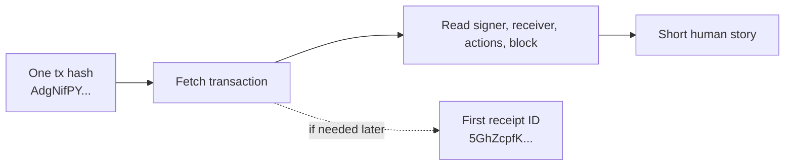
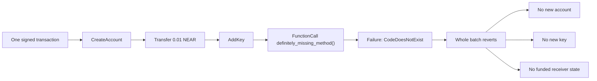
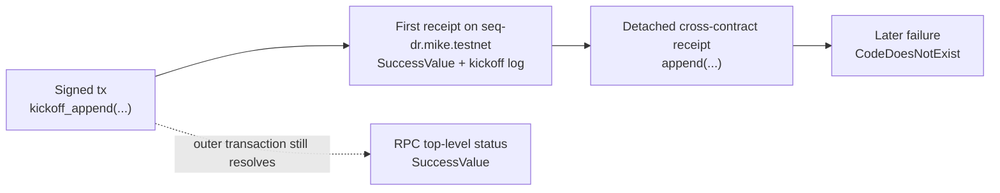
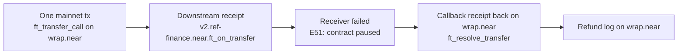

## Quick start

Start with one tx hash and ask for the smallest readable answer first.

```bash
TX_BASE_URL=https://tx.main.fastnear.com
TX_HASH=AdgNifPYpoDNS5ckfBZm36Ai6LuL5bTstuKsVdGjKwGp

curl -s "$TX_BASE_URL/v0/transactions" \
  -H 'content-type: application/json' \
  --data "$(jq -nc --arg tx_hash "$TX_HASH" '{tx_hashes: [$tx_hash]}')" \
  | jq '{
      transaction: {
        hash: .transactions[0].transaction.hash,
        signer_id: .transactions[0].transaction.signer_id,
        receiver_id: .transactions[0].transaction.receiver_id,
        included_block_height: .transactions[0].execution_outcome.block_height
      },
      actions: (
        .transactions[0].transaction.actions
        | map(if type == "string" then . else keys[0] end)
      ),
      first_receipt_id: .transactions[0].transaction_outcome.outcome.status.SuccessReceiptId,
      receipt_count: (.transactions[0].receipts | length)
    }'
```

## Start Here

### I have one transaction hash. What happened?

<div className="fastnear-example-strategy">
  <div className="fastnear-example-strategy__header">
    <span className="fastnear-example-strategy__eyebrow">Flow</span>
    <p className="fastnear-example-strategy__title">Start with the readable tx record, then drop into RPC or receipts only if the first answer is not enough.</p>
  </div>
  <div className="fastnear-example-strategy__items">
    <p className="fastnear-example-strategy__item"><span className="fastnear-example-strategy__step">01</span><span><span className="fastnear-example-strategy__code">POST /v0/transactions</span> gives signer, receiver, action types, block height, and the first receipt handoff.</span></p>
    <p className="fastnear-example-strategy__item"><span className="fastnear-example-strategy__step">02</span><span><span className="fastnear-example-strategy__code">RPC EXPERIMENTAL_tx_status</span> is only for the exact protocol-side success semantics.</span></p>
    <p className="fastnear-example-strategy__item"><span className="fastnear-example-strategy__step">03</span><span><span className="fastnear-example-strategy__code">POST /v0/receipt</span> only matters if the first receipt becomes the new anchor.</span></p>
  </div>
</div>

Pinned example:

- transaction hash: `AdgNifPYpoDNS5ckfBZm36Ai6LuL5bTstuKsVdGjKwGp`
- signer: `mike.near`
- receiver: `global-counter.mike.near`
- included block height: `194263342`
- first receipt ID: `5GhZcpfKWhrpaZo5Am74QfEUFQnZBz48G7hfoLPVDXcq`

Short answer: `mike.near` submitted a single `Transfer` action to `global-counter.mike.near`, the transaction landed in block `194263342`, and the chain handed it off into one successful receipt.



| Surface | Endpoint | How we use it | Why we use it |
| --- | --- | --- | --- |
| Readable transaction story | Transactions API [`POST /v0/transactions`](/tx/transactions) | Start from the tx hash and print signer, receiver, included block, action list, and first receipt handoff | Gives the fastest readable answer to “what did this tx do?” |
| Canonical status follow-up | RPC [`EXPERIMENTAL_tx_status`](/rpc/transaction/experimental-tx-status) | Reuse the same tx hash and signer only if you need exact protocol-native status semantics | Useful when the next question becomes “success according to RPC, exactly?” |
| Receipt handoff | Transactions API [`POST /v0/receipt`](/tx/receipt) | Reuse the first receipt ID if the next question turns into a receipt-level story | Provides the natural bridge to the next investigation when the transaction hash is no longer the best anchor |

#### Transaction hash to human story shell walkthrough

**Flow**

- Fetch the transaction by hash and print the main story fields.
- Confirm the final status only if you need exact RPC semantics.
- Keep the first receipt ID only as the optional next step.

```bash
TX_BASE_URL=https://tx.main.fastnear.com
RPC_URL=https://rpc.mainnet.fastnear.com
TX_HASH=AdgNifPYpoDNS5ckfBZm36Ai6LuL5bTstuKsVdGjKwGp
SIGNER_ACCOUNT_ID=mike.near
```

1. Fetch the transaction and print the basic story.

```bash
FIRST_RECEIPT_ID="$(
  curl -s "$TX_BASE_URL/v0/transactions" \
    -H 'content-type: application/json' \
    --data "$(jq -nc --arg tx_hash "$TX_HASH" '{tx_hashes: [$tx_hash]}')" \
    | tee /tmp/basic-tx-story.json \
    | jq -r '.transactions[0].transaction_outcome.outcome.status.SuccessReceiptId'
)"

jq '{
  transaction: {
    hash: .transactions[0].transaction.hash,
    signer_id: .transactions[0].transaction.signer_id,
    receiver_id: .transactions[0].transaction.receiver_id,
    included_block_height: .transactions[0].execution_outcome.block_height
  },
  actions: (
    .transactions[0].transaction.actions
    | map(if type == "string" then . else keys[0] end)
  ),
  first_receipt_id: .transactions[0].transaction_outcome.outcome.status.SuccessReceiptId,
  receipt_count: (.transactions[0].receipts | length)
}' /tmp/basic-tx-story.json

# Expected action list: ["Transfer"]
# Expected first receipt ID: 5GhZcpfKWhrpaZo5Am74QfEUFQnZBz48G7hfoLPVDXcq
```

2. If you need exact RPC status semantics, confirm them with `EXPERIMENTAL_tx_status`.

```bash
curl -s "$RPC_URL" \
  -H 'content-type: application/json' \
  --data "$(jq -nc \
    --arg tx_hash "$TX_HASH" \
    --arg signer_account_id "$SIGNER_ACCOUNT_ID" '{
      jsonrpc: "2.0",
      id: "fastnear",
      method: "EXPERIMENTAL_tx_status",
      params: {
        tx_hash: $tx_hash,
        sender_account_id: $signer_account_id,
        wait_until: "FINAL"
      }
    }')" \
  | jq '{
      final_execution_status: .result.final_execution_status,
      status: .result.status,
      transaction_handoff: .result.transaction_outcome.outcome.status
    }'
```

3. If the next question becomes “what was that first receipt?”, pivot once and stop.

```bash
curl -s "$TX_BASE_URL/v0/receipt" \
  -H 'content-type: application/json' \
  --data "$(jq -nc --arg receipt_id "$FIRST_RECEIPT_ID" '{receipt_id: $receipt_id}')" \
  | jq '{
      receipt_id: .receipt.receipt_id,
      receiver_id: .receipt.receiver_id,
      is_success: .receipt.is_success,
      receipt_block_height: .receipt.block_height,
      transaction_hash: .receipt.transaction_hash
    }'
```

That last step is optional on purpose. If all you wanted was the transaction story, the first step was enough. Keep going only when the receipt itself becomes the new anchor.

**When to pivot**

`POST /v0/transactions` is the cleanest starting point when all you have is a tx hash and need one readable answer. RPC is the follow-up for exact status semantics. `POST /v0/receipt` is the handoff when the next question stops being about the transaction as a whole and starts being about one receipt inside it.

### Which receipt emitted this log or event?

<div className="fastnear-example-strategy">
  <div className="fastnear-example-strategy__header">
    <span className="fastnear-example-strategy__eyebrow">Flow</span>
    <p className="fastnear-example-strategy__title">Fetch the receipt list once, filter by the log fragment, and stop as soon as one receipt owns that log.</p>
  </div>
  <div className="fastnear-example-strategy__items">
    <p className="fastnear-example-strategy__item"><span className="fastnear-example-strategy__step">01</span><span><span className="fastnear-example-strategy__code">POST /v0/transactions</span> gives the full indexed receipt list for one tx hash, including receipt logs.</span></p>
    <p className="fastnear-example-strategy__item"><span className="fastnear-example-strategy__step">02</span><span><span className="fastnear-example-strategy__code">jq</span> filters that list down to receipts whose logs contain the fragment you care about.</span></p>
    <p className="fastnear-example-strategy__item"><span className="fastnear-example-strategy__step">03</span><span>Once one receipt matches, keep its <span className="fastnear-example-strategy__code">receipt_id</span>, executor, and method name as the exact answer.</span></p>
  </div>
</div>

For this pinned mainnet example, use:

- transaction hash: `2KhhB1uDScGCFQfVchep7DiZTGTxMcgfUYHNzwf5e6uL`
- log fragment: `Refund`
- expected matching receipt ID: `9sLHQpaGz3NnMNMn8zGrDUSyktR1q6ts2otr9mHkfD1w`
- expected executor: `wrap.near`
- expected method: `ft_resolve_transfer`

This transaction is useful because it has two different logged receipts in the same story:

- one `Transfer ...` log on the earlier `ft_transfer_call` receipt
- one `Refund ...` log on the later `ft_resolve_transfer` receipt

#### Log-attribution shell walkthrough

**Flow**

- Fetch the transaction once and keep the receipt list locally.
- Filter the receipts by one log fragment.
- Stop as soon as you have one exact `receipt_id`, one executor, and one method name.

```bash
TX_BASE_URL=https://tx.main.fastnear.com
TX_HASH=2KhhB1uDScGCFQfVchep7DiZTGTxMcgfUYHNzwf5e6uL
LOG_FRAGMENT=Refund
```

1. Fetch the transaction and keep the receipt list.

```bash
curl -s "$TX_BASE_URL/v0/transactions" \
  -H 'content-type: application/json' \
  --data "$(jq -nc --arg tx_hash "$TX_HASH" '{tx_hashes: [$tx_hash]}')" \
  | tee /tmp/log-attribution-transaction.json >/dev/null
```

2. Filter the receipt list down to logs that contain the fragment you care about.

```bash
jq --arg fragment "$LOG_FRAGMENT" '{
  transaction: {
    hash: .transactions[0].transaction.hash,
    signer_id: .transactions[0].transaction.signer_id,
    receiver_id: .transactions[0].transaction.receiver_id
  },
  matching_receipts: [
    .transactions[0].receipts[]
    | select(any(.execution_outcome.outcome.logs[]?; contains($fragment)))
    | {
        receipt_id: .receipt.receipt_id,
        predecessor_id: .receipt.predecessor_id,
        receiver_id: .receipt.receiver_id,
        method_name: (
          .receipt.receipt.Action.actions[0]
          | if type == "string" then .
            else (.FunctionCall.method_name // keys[0])
            end
        ),
        block_height: .execution_outcome.block_height,
        logs: .execution_outcome.outcome.logs
      }
  ]
}' /tmp/log-attribution-transaction.json

# What to notice:
# - the `Refund` fragment matches exactly one receipt
# - that receipt is 9sLHQpaGz3NnMNMn8zGrDUSyktR1q6ts2otr9mHkfD1w
# - the receipt executed on wrap.near
# - the method name is ft_resolve_transfer
```

3. If you want to see the logged receipts side by side, print only the receipts that logged anything.

```bash
jq '{
  logged_receipts: [
    .transactions[0].receipts[]
    | select((.execution_outcome.outcome.logs | length) > 0)
    | {
        receipt_id: .receipt.receipt_id,
        receiver_id: .receipt.receiver_id,
        method_name: (
          .receipt.receipt.Action.actions[0]
          | if type == "string" then .
            else (.FunctionCall.method_name // keys[0])
            end
        ),
        logs: .execution_outcome.outcome.logs
      }
  ]
}' /tmp/log-attribution-transaction.json
```

That final comparison is useful because it proves the log attribution is not guesswork. This transaction has more than one logged receipt, and the `Refund` fragment belongs to one exact later receipt, not to the transaction as a whole.

**When to pivot**

Receipt logs live on receipts, not on some abstract top-level transaction object. `POST /v0/transactions` is enough to attribute one log line to one exact receipt without dropping into a deeper async trace.

### Turn one ugly receipt ID from logs into a human story
If you already have the transaction hash instead of the receipt ID, start with the simpler investigation just above.

<div className="fastnear-example-strategy">
  <div className="fastnear-example-strategy__header">
    <span className="fastnear-example-strategy__eyebrow">Flow</span>
    <p className="fastnear-example-strategy__title">Resolve the receipt first, then recover the parent transaction and stop once the story is readable.</p>
  </div>
  <div className="fastnear-example-strategy__items">
    <p className="fastnear-example-strategy__item"><span className="fastnear-example-strategy__step">01</span><span><span className="fastnear-example-strategy__code">POST /v0/receipt</span> tells you which transaction and execution block the receipt belongs to.</span></p>
    <p className="fastnear-example-strategy__item"><span className="fastnear-example-strategy__step">02</span><span><span className="fastnear-example-strategy__code">POST /v0/transactions</span> turns that raw receipt into signer, receiver, and action context.</span></p>
    <p className="fastnear-example-strategy__item"><span className="fastnear-example-strategy__step">03</span><span><span className="fastnear-example-strategy__code">RPC tx status</span> is optional follow-up only when “human story” turns into “exact protocol semantics.”</span></p>
  </div>
</div>

Pinned receipt from logs:

- receipt ID: `5GhZcpfKWhrpaZo5Am74QfEUFQnZBz48G7hfoLPVDXcq`
- originating transaction hash: `AdgNifPYpoDNS5ckfBZm36Ai6LuL5bTstuKsVdGjKwGp`
- signer: `mike.near`
- receiver: `global-counter.mike.near`
- transaction block height: `194263342`
- receipt execution block height: `194263343`

Short answer: `mike.near` signed a plain `Transfer` transaction to `global-counter.mike.near`, the network turned it into one action receipt, and that receipt executed successfully in the next block.

#### Ugly receipt ID to human story shell walkthrough

```bash
TX_BASE_URL=https://tx.main.fastnear.com
RECEIPT_ID='5GhZcpfKWhrpaZo5Am74QfEUFQnZBz48G7hfoLPVDXcq'
```

1. Resolve the receipt and figure out what object you are looking at.

```bash
TX_HASH="$(
  curl -s "$TX_BASE_URL/v0/receipt" \
    -H 'content-type: application/json' \
    --data "$(jq -nc --arg receipt_id "$RECEIPT_ID" '{receipt_id: $receipt_id}')" \
    | tee /tmp/receipt-lookup.json \
    | jq -r '.receipt.transaction_hash'
)"

jq '{
  receipt: {
    receipt_id: .receipt.receipt_id,
    predecessor_id: .receipt.predecessor_id,
    receiver_id: .receipt.receiver_id,
    receipt_type: .receipt.receipt_type,
    is_success: .receipt.is_success,
    receipt_block_height: .receipt.block_height,
    transaction_hash: .receipt.transaction_hash,
    tx_block_height: .receipt.tx_block_height
  }
}' /tmp/receipt-lookup.json
```

2. Reuse the transaction hash and turn the receipt into a readable transaction story.

```bash
curl -s "$TX_BASE_URL/v0/transactions" \
  -H 'content-type: application/json' \
  --data "$(jq -nc --arg tx_hash "$TX_HASH" '{tx_hashes: [$tx_hash]}')" \
  | tee /tmp/receipt-parent-transaction.json >/dev/null

jq '{
  transaction: {
    transaction_hash: .transactions[0].transaction.hash,
    signer_id: .transactions[0].transaction.signer_id,
    receiver_id: .transactions[0].transaction.receiver_id,
    tx_block_height: .transactions[0].execution_outcome.block_height,
    action_types: (
      .transactions[0].transaction.actions
      | map(if type == "string" then . else keys[0] end)
    ),
    transfer_deposit_yocto: (
      .transactions[0].transaction.actions[0].Transfer.deposit // null
    )
  },
  receipt_count: (.transactions[0].receipts | length)
}' /tmp/receipt-parent-transaction.json
```

3. Turn that into one human sentence.

```bash
jq -r '
  def zeros($n):
    reduce range(0; $n) as $i (""; . + "0");
  def yocto_to_near($yocto):
    ($yocto | tostring) as $digits
    | if ($digits | length) <= 24 then
        ("0." + zeros(24 - ($digits | length)) + $digits)
      else
        ($digits[0:(($digits | length) - 24)] + "." + $digits[-24:])
      end
    | sub("0+$"; "")
    | sub("\\.$"; "");
  .transactions[0] as $tx
  | "Receipt \($tx.execution_outcome.outcome.receipt_ids[0]) belongs to tx \($tx.transaction.hash): \($tx.transaction.signer_id) sent \(yocto_to_near($tx.transaction.actions[0].Transfer.deposit)) NEAR to \($tx.transaction.receiver_id). The tx landed in block \($tx.execution_outcome.block_height), and the receipt executed successfully in block \($tx.receipts[0].execution_outcome.block_height)."
' /tmp/receipt-parent-transaction.json
```

For another receipt, keep the same pattern but change the final sentence to match the action types you just printed.

That is the core trick: you do not need to explain every receipt field. You need to recover just enough context to say what the signer did, where the receipt executed, and whether this receipt was the main event or only one step in a bigger cascade.

**When to pivot**

`POST /v0/receipt` tells you what the raw receipt is attached to. `POST /v0/transactions` tells you what the signer was actually trying to do. Once you have those two pieces together, you can usually explain the receipt in one sentence before deciding whether you really need block context, account history, or canonical RPC status.

## Failure and Async

### Prove that one failed action reverted the whole batch
One batch created an account, funded it, added a key, and then called a missing method. The question is whether the earlier actions stuck or the whole batch reverted.

<div className="fastnear-example-strategy">
  <div className="fastnear-example-strategy__header">
    <span className="fastnear-example-strategy__eyebrow">Flow</span>
    <p className="fastnear-example-strategy__title">Prove what the batch tried, which action failed, and whether anything from the earlier actions actually stuck.</p>
  </div>
  <div className="fastnear-example-strategy__items">
    <p className="fastnear-example-strategy__item"><span className="fastnear-example-strategy__step">01</span><span><span className="fastnear-example-strategy__code">POST /v0/transactions</span> shows the ordered batch exactly as the signer submitted it.</span></p>
    <p className="fastnear-example-strategy__item"><span className="fastnear-example-strategy__step">02</span><span><span className="fastnear-example-strategy__code">RPC EXPERIMENTAL_tx_status</span> shows the failing <span className="fastnear-example-strategy__code">FunctionCall</span> and the protocol-side failure reason.</span></p>
    <p className="fastnear-example-strategy__item"><span className="fastnear-example-strategy__step">03</span><span><span className="fastnear-example-strategy__code">RPC view_account</span> on the intended new account proves whether the earlier create, fund, and key-add actions stuck at all.</span></p>
  </div>
</div>

**Official references**

- [Transaction foundations](/transaction-flow/foundations)
- [Runtime execution](/transaction-flow/runtime-execution)

Pinned testnet failure observed on **April 18, 2026**:

- transaction hash: `CrhH3xLzbNwNMGgZkgptXorwh8YmqxRGuA6Mc11MkU6M`
- signer account: `temp.mike.testnet`
- intended new account: `rollback-mo4vmkig.temp.mike.testnet`
- included block height: `246365118`
- included block hash: `6f5zTKDqQRwrxMywzvxeRvYcCERJmAnatJaqUEtQYUNM`
- ordered actions: `CreateAccount -> Transfer -> AddKey -> FunctionCall`
- failing method: `definitely_missing_method`
- RPC failure: `CodeDoesNotExist` on `rollback-mo4vmkig.temp.mike.testnet`



| Surface | Endpoint | How we use it | Why we use it |
| --- | --- | --- | --- |
| Intended batch | Transactions API [`POST /v0/transactions`](/tx/transactions) | Fetch the pinned transaction hash and print the ordered action list, receiver, and included block metadata | Shows exactly what the signer tried to do before you reason about what stuck |
| Exact failure | RPC [`EXPERIMENTAL_tx_status`](/rpc/transaction/experimental-tx-status) | Query the same transaction with `wait_until: "FINAL"` and inspect `status.Failure` | Tells you which action failed and why the whole batch reverted at the protocol level |
| Post-state proof | RPC [`query(view_account)`](/rpc/account/view-account) | Query the intended new account after finality | If the created account still does not exist, then the earlier `CreateAccount`, `Transfer`, and `AddKey` from that same batch did not stick either |

The indexed transaction record still shows `transaction_outcome.outcome.status = SuccessReceiptId`, because the signed transaction did become its first action receipt. The proof that the batch reverted comes from the RPC top-level `status.Failure` on that first receipt plus the post-state check that the intended new account never existed.

#### Failed batched transaction shell walkthrough

**Flow**

- Read the indexed transaction record to recover the intended action batch.
- Use RPC transaction status to prove the final `FunctionCall` failed and reverted the batch.
- Use one post-state RPC read to prove the new account never existed after finality.

```bash
TX_BASE_URL=https://tx.test.fastnear.com
RPC_URL=https://rpc.testnet.fastnear.com
TX_HASH=CrhH3xLzbNwNMGgZkgptXorwh8YmqxRGuA6Mc11MkU6M
SIGNER_ACCOUNT_ID=temp.mike.testnet
NEW_ACCOUNT_ID=rollback-mo4vmkig.temp.mike.testnet
```

1. Fetch the transaction and print the intended action batch.

```bash
curl -s "$TX_BASE_URL/v0/transactions" \
  -H 'content-type: application/json' \
  --data "$(jq -nc --arg tx_hash "$TX_HASH" '{tx_hashes: [$tx_hash]}')" \
  | tee /tmp/failed-batch-transaction.json >/dev/null

jq '{
  transaction: {
    hash: .transactions[0].transaction.hash,
    signer_id: .transactions[0].transaction.signer_id,
    receiver_id: .transactions[0].transaction.receiver_id,
    included_block_height: .transactions[0].execution_outcome.block_height,
    included_block_hash: .transactions[0].execution_outcome.block_hash
  },
  batch: {
    action_count: (.transactions[0].transaction.actions | length),
    action_types: (
      .transactions[0].transaction.actions
      | map(if type == "string" then . else keys[0] end)
    ),
    final_function_call_method_name: (
      .transactions[0].transaction.actions[3].FunctionCall.method_name
    )
  },
  first_receipt_handoff: .transactions[0].transaction_outcome.outcome.status
}' /tmp/failed-batch-transaction.json

# Expected action order:
# 1. CreateAccount
# 2. Transfer
# 3. AddKey
# 4. FunctionCall
```

2. Query RPC transaction status and inspect the exact top-level failure.

```bash
curl -s "$RPC_URL" \
  -H 'content-type: application/json' \
  --data "$(jq -nc \
    --arg tx_hash "$TX_HASH" \
    --arg signer_account_id "$SIGNER_ACCOUNT_ID" '{
      jsonrpc: "2.0",
      id: "fastnear",
      method: "EXPERIMENTAL_tx_status",
      params: {
        tx_hash: $tx_hash,
        sender_account_id: $signer_account_id,
        wait_until: "FINAL"
      }
    }')" \
  | tee /tmp/failed-batch-rpc-status.json >/dev/null

jq '{
  final_execution_status: .result.final_execution_status,
  failed_action_index: .result.status.Failure.ActionError.index,
  failure: .result.status.Failure.ActionError.kind.FunctionCallError.CompilationError.CodeDoesNotExist
}' /tmp/failed-batch-rpc-status.json

# Expected failed_action_index: 3
# Expected failure account_id: rollback-mo4vmkig.temp.mike.testnet
```

3. Query the intended new account after finality and prove it still does not exist.

```bash
curl -s "$RPC_URL" \
  -H 'content-type: application/json' \
  --data "$(jq -nc --arg account_id "$NEW_ACCOUNT_ID" '{
    jsonrpc: "2.0",
    id: "fastnear",
    method: "query",
    params: {
      request_type: "view_account",
      account_id: $account_id,
      finality: "final"
    }
  }')" \
  | tee /tmp/failed-batch-view-account.json >/dev/null

jq '{
  error: .error.cause.name,
  message: .error.data,
  requested_account_id: .error.cause.info.requested_account_id,
  proof_block_height: .error.cause.info.block_height
}' /tmp/failed-batch-view-account.json

# Expected error: "UNKNOWN_ACCOUNT"
```

That one post-state check is enough here. If `CreateAccount` had stuck, `view_account` would resolve. Because the account still does not exist, the earlier `Transfer` and `AddKey` from the same batched receipt did not stick either.

**When to pivot**

For another failed batch, keep the same pattern: read what the transaction tried to do from [`POST /v0/transactions`](/tx/transactions), confirm the exact top-level failure with RPC transaction status, then inspect post-state on the account, key, contract, or other object that would have changed if the earlier actions had stuck.

### Why did this contract call look successful, but a later receipt failed?
The first contract receipt succeeded. The failure happened later, in a separate detached receipt.

<div className="fastnear-example-strategy">
  <div className="fastnear-example-strategy__header">
    <span className="fastnear-example-strategy__eyebrow">Flow</span>
    <p className="fastnear-example-strategy__title">First get the human timeline, then prove where the async story split.</p>
  </div>
  <div className="fastnear-example-strategy__items">
    <p className="fastnear-example-strategy__item"><span className="fastnear-example-strategy__step">01</span><span><span className="fastnear-example-strategy__code">POST /v0/transactions</span> gives the easiest first pass: which receipt ran first, and which receipt failed later.</span></p>
    <p className="fastnear-example-strategy__item"><span className="fastnear-example-strategy__step">02</span><span><span className="fastnear-example-strategy__code">RPC EXPERIMENTAL_tx_status</span> proves the important NEAR nuance that top-level success and later descendant failure can both be true.</span></p>
    <p className="fastnear-example-strategy__item"><span className="fastnear-example-strategy__step">03</span><span>Once those two views agree on the split, stop. This example stays on preserved historical evidence rather than a live router-state read.</span></p>
  </div>
</div>

**Official references**

- [Transaction foundations](/transaction-flow/foundations)
- [Runtime execution](/transaction-flow/runtime-execution)

Pinned async testnet failure observed on **April 18, 2026**:

- transaction hash: `AUciGAq54XZtEuVXA9bSq4k6h13LmspoKtLegcWGRmQz`
- signer account: `temp.mike.testnet`
- first contract receiver: `seq-dr.mike.testnet`
- detached target account: `asyncfail-in2hwikn.temp.mike.testnet`
- transaction inclusion block: `246368568`
- successful first receipt: `6XgWxB9QVkgGKJaLcjDphGHYTK5d1suNe2cH1WHRWnoS` at block `246368569`
- later failed receipt: `2A5JG8N1BxyR57WbrjqntTSf1UwR4RXR79MD2Zg3K2es` at block `246368570`
- first method: `kickoff_append`
- later failed method: `append`
- top-level RPC `status`: `SuccessValue`



| Surface | Endpoint | How we use it | Why we use it |
| --- | --- | --- | --- |
| Transaction skeleton | Transactions API [`POST /v0/transactions`](/tx/transactions) | Fetch the pinned transaction and print the included block plus the per-receipt timeline | Gives the shortest readable overview of which receipt ran first and which receipt failed later |
| Exact status semantics | RPC [`EXPERIMENTAL_tx_status`](/rpc/transaction/experimental-tx-status) | Inspect the top-level `status`, the first contract receipt outcome, and the later failed receipt outcome | Proves that top-level success and later descendant failure can coexist in one async story |

Receipt success is not transitive. `seq-dr.mike.testnet` returned success on its own receipt because `kickoff_append(...)` only logged and detached the next hop. The detached `append(...)` receipt was separate async work, so its later failure did not change the fact that the router's own receipt had already completed successfully.

#### Later receipt failure shell walkthrough

**Flow**

- Read the transaction and its receipt timeline from the indexed view.
- Use RPC transaction status to show that the top-level story still ended in `SuccessValue` even though a later receipt failed.
- Stop once those two preserved views agree on the split.

```bash
TX_BASE_URL=https://tx.test.fastnear.com
RPC_URL=https://rpc.testnet.fastnear.com
TX_HASH=AUciGAq54XZtEuVXA9bSq4k6h13LmspoKtLegcWGRmQz
SIGNER_ACCOUNT_ID=temp.mike.testnet
FIRST_RECEIPT_ID=6XgWxB9QVkgGKJaLcjDphGHYTK5d1suNe2cH1WHRWnoS
FAILED_RECEIPT_ID=2A5JG8N1BxyR57WbrjqntTSf1UwR4RXR79MD2Zg3K2es
```

1. Fetch the transaction and print the receipt timeline in block order.

```bash
curl -s "$TX_BASE_URL/v0/transactions" \
  -H 'content-type: application/json' \
  --data "$(jq -nc --arg tx_hash "$TX_HASH" '{tx_hashes: [$tx_hash]}')" \
  | tee /tmp/later-receipt-failure-transaction.json >/dev/null

jq '{
  transaction: {
    hash: .transactions[0].transaction.hash,
    signer_id: .transactions[0].transaction.signer_id,
    receiver_id: .transactions[0].transaction.receiver_id,
    tx_block_height: .transactions[0].execution_outcome.block_height,
    tx_handoff: .transactions[0].transaction_outcome.outcome.status
  },
  receipts: [
    .transactions[0].receipts[]
    | {
        receipt_id: .receipt.receipt_id,
        receiver_id: .receipt.receiver_id,
        block_height: .execution_outcome.block_height,
        method_name: (.receipt.receipt.Action.actions[0].FunctionCall.method_name // "system_transfer"),
        status: .execution_outcome.outcome.status
      }
  ]
}' /tmp/later-receipt-failure-transaction.json

# What to notice:
# - the first contract receipt on seq-dr.mike.testnet succeeded in block 246368569
# - the later append(...) receipt failed in block 246368570
```

2. Query RPC transaction status and compare the top-level story with the later failed receipt.

```bash
curl -s "$RPC_URL" \
  -H 'content-type: application/json' \
  --data "$(jq -nc \
    --arg tx_hash "$TX_HASH" \
    --arg signer_account_id "$SIGNER_ACCOUNT_ID" '{
      jsonrpc: "2.0",
      id: "fastnear",
      method: "EXPERIMENTAL_tx_status",
      params: {
        tx_hash: $tx_hash,
        sender_account_id: $signer_account_id,
        wait_until: "FINAL"
      }
    }')" \
  | tee /tmp/later-receipt-failure-rpc.json >/dev/null

jq \
  --arg first_receipt_id "$FIRST_RECEIPT_ID" \
  --arg failed_receipt_id "$FAILED_RECEIPT_ID" '{
    top_level_status: .result.status,
    transaction_handoff: .result.transaction_outcome.outcome.status,
    first_contract_receipt: (
      .result.receipts_outcome[]
      | select(.id == $first_receipt_id)
      | {
          receipt_id: .id,
          executor_id: .outcome.executor_id,
          logs: .outcome.logs,
          status: .outcome.status
        }
    ),
    later_failed_receipt: (
      .result.receipts_outcome[]
      | select(.id == $failed_receipt_id)
      | {
          receipt_id: .id,
          executor_id: .outcome.executor_id,
          status: .outcome.status
        }
    )
  }' /tmp/later-receipt-failure-rpc.json

# What to notice:
# - top_level_status is still SuccessValue
# - the first contract receipt logged dishonest_router:kickoff:late-failure
# - the later append(...) receipt failed with CodeDoesNotExist
```

Stop here. As of **April 18, 2026**, `seq-dr.mike.testnet` no longer resolves on testnet, so a live router-state proof would no longer be truthful. The indexed receipt timeline plus `EXPERIMENTAL_tx_status` are the preserved historical evidence that still matters.

**When to pivot**

When a NEAR app “looked successful” and still broke later, the thing to ask is not just “what was the transaction status?” but “which receipt succeeded, and which later receipt failed?” This example gives you that exact split: indexed receipt timeline for the shape, RPC status for the exact semantics, and no pretend live router-state read after the historical contract disappeared.

### Did my callback run at all?
Start from the indexed receipt chain. Use RPC only if you need canonical callback semantics.

<div className="fastnear-example-strategy">
  <div className="fastnear-example-strategy__header">
    <span className="fastnear-example-strategy__eyebrow">Flow</span>
    <p className="fastnear-example-strategy__title">Use the indexed receipt list first, then drop to RPC only if you need canonical callback semantics.</p>
  </div>
  <div className="fastnear-example-strategy__items">
    <p className="fastnear-example-strategy__item"><span className="fastnear-example-strategy__step">01</span><span><span className="fastnear-example-strategy__code">POST /v0/transactions</span> shows the downstream call and the later receipt that returns to the origin contract.</span></p>
    <p className="fastnear-example-strategy__item"><span className="fastnear-example-strategy__step">02</span><span><span className="fastnear-example-strategy__code">jq</span> narrows that receipt list to one downstream call and one callback receipt.</span></p>
    <p className="fastnear-example-strategy__item"><span className="fastnear-example-strategy__step">03</span><span><span className="fastnear-example-strategy__code">RPC EXPERIMENTAL_tx_status</span> is optional confirmation when you need the callback receipt's canonical outcome and logs.</span></p>
  </div>
</div>

Pinned mainnet callback example observed on **April 19, 2026**:

- transaction hash: `2KhhB1uDScGCFQfVchep7DiZTGTxMcgfUYHNzwf5e6uL`
- sender account: `7c5206b1b75b8787420b09d8697e08180cdf896c5fcf15f6afbf5f33fcc3cf72`
- origin contract: `wrap.near`
- downstream receiver: `v2.ref-finance.near`
- top-level method: `ft_transfer_call`
- downstream method: `ft_on_transfer`
- callback method: `ft_resolve_transfer`
- transaction block: `194692298`
- downstream receipt block: `194692300`
- callback receipt block: `194692301`



A downstream failure does not mean the callback vanished. In this case, `v2.ref-finance.near` failed its `ft_on_transfer` receipt, but `wrap.near` still later received `ft_resolve_transfer` and logged the refund.

| Surface | Endpoint | How we use it | Why we use it |
| --- | --- | --- | --- |
| Indexed receipt chain | Transactions API [`POST /v0/transactions`](/tx/transactions) | Start from the tx hash and print only the downstream receiver receipt plus the later callback receipt on the origin contract | Gives the fastest readable answer to “did the callback come back?” |
| Canonical receipt confirmation | RPC [`EXPERIMENTAL_tx_status`](/rpc/transaction/experimental-tx-status) | Reuse the same tx hash and sender only if you need the callback receipt's canonical status and logs | Useful when the indexed answer is enough for shape but you still want protocol-native proof |

#### Callback-existence shell walkthrough

**Flow**

- Fetch the transaction once and narrow the receipt list down to the downstream call plus the callback receipt.
- Reuse the callback receipt ID only if you still need canonical RPC confirmation.
- Stop once you can say whether the callback came back and what it did.

```bash
TX_BASE_URL=https://tx.main.fastnear.com
RPC_URL=https://rpc.mainnet.fastnear.com
TX_HASH=2KhhB1uDScGCFQfVchep7DiZTGTxMcgfUYHNzwf5e6uL
SENDER_ACCOUNT_ID=7c5206b1b75b8787420b09d8697e08180cdf896c5fcf15f6afbf5f33fcc3cf72
ORIGIN_CONTRACT_ID=wrap.near
DOWNSTREAM_CONTRACT_ID=v2.ref-finance.near
```

1. Fetch the transaction and print the downstream receipt plus the callback receipt.

```bash
curl -s "$TX_BASE_URL/v0/transactions" \
  -H 'content-type: application/json' \
  --data "$(jq -nc --arg tx_hash "$TX_HASH" '{tx_hashes: [$tx_hash]}')" \
  | tee /tmp/callback-check-transaction.json >/dev/null
```

2. Answer the smallest useful question first: did the callback come back at all?

```bash
jq --arg origin "$ORIGIN_CONTRACT_ID" '
  [
    .transactions[0].receipts[]
    | select(
        .receipt.receiver_id == $origin
        and (.receipt.receipt.Action.actions[0].FunctionCall.method_name // "") == "ft_resolve_transfer"
      )
  ] | length > 0
' /tmp/callback-check-transaction.json
```

3. If the answer is `true`, print the downstream receipt plus the callback receipt.

```bash

CALLBACK_RECEIPT_ID="$(
  jq -r --arg origin "$ORIGIN_CONTRACT_ID" '
    first(
      .transactions[0].receipts[]
      | select(
          .receipt.receiver_id == $origin
          and (.receipt.receipt.Action.actions[0].FunctionCall.method_name // "") == "ft_resolve_transfer"
        )
      | .receipt.receipt_id
    )
  ' /tmp/callback-check-transaction.json
)"

jq --arg origin "$ORIGIN_CONTRACT_ID" --arg downstream "$DOWNSTREAM_CONTRACT_ID" '{
  transaction: {
    hash: .transactions[0].transaction.hash,
    signer_id: .transactions[0].transaction.signer_id,
    receiver_id: .transactions[0].transaction.receiver_id,
    method_name: .transactions[0].transaction.actions[0].FunctionCall.method_name,
    tx_block_height: .transactions[0].execution_outcome.block_height
  },
  downstream_receipt: (
    first(
      .transactions[0].receipts[]
      | select(.receipt.receiver_id == $downstream)
      | {
          receipt_id: .receipt.receipt_id,
          predecessor_id: .receipt.predecessor_id,
          receiver_id: .receipt.receiver_id,
          method_name: (
            .receipt.receipt.Action.actions[0]
            | if type == "string" then .
              else (.FunctionCall.method_name // keys[0])
              end
          ),
          status: .execution_outcome.outcome.status,
          block_height: .execution_outcome.block_height
        }
    )
  ),
  callback_receipt: (
    first(
      .transactions[0].receipts[]
      | select(
          .receipt.receiver_id == $origin
          and (.receipt.receipt.Action.actions[0].FunctionCall.method_name // "") == "ft_resolve_transfer"
        )
      | {
          receipt_id: .receipt.receipt_id,
          predecessor_id: .receipt.predecessor_id,
          receiver_id: .receipt.receiver_id,
          method_name: .receipt.receipt.Action.actions[0].FunctionCall.method_name,
          logs: .execution_outcome.outcome.logs,
          status: .execution_outcome.outcome.status,
          block_height: .execution_outcome.block_height
        }
    )
  ),
  callback_ran: (
    first(
      .transactions[0].receipts[]
      | select(
          .receipt.receiver_id == $origin
          and (.receipt.receipt.Action.actions[0].FunctionCall.method_name // "") == "ft_resolve_transfer"
        )
      | true
    ) // false
  )
}' /tmp/callback-check-transaction.json

# What to notice:
# - the downstream receipt ran ft_on_transfer on v2.ref-finance.near
# - the later callback receipt ran ft_resolve_transfer on wrap.near
# - callback_ran is true even though the downstream receipt failed
```

4. If you want the canonical callback outcome and refund log, confirm the same receipt in RPC.

```bash
curl -s "$RPC_URL" \
  -H 'content-type: application/json' \
  --data "$(jq -nc \
    --arg tx_hash "$TX_HASH" \
    --arg sender_account_id "$SENDER_ACCOUNT_ID" '{
      jsonrpc: "2.0",
      id: "fastnear",
      method: "EXPERIMENTAL_tx_status",
      params: {
        tx_hash: $tx_hash,
        sender_account_id: $sender_account_id,
        wait_until: "FINAL"
      }
    }')" \
  | tee /tmp/callback-check-rpc.json >/dev/null

jq --arg callback_receipt_id "$CALLBACK_RECEIPT_ID" '{
  top_level_status: .result.status,
  callback_receipt: (
    first(
      .result.receipts_outcome[]
      | select(.id == $callback_receipt_id)
      | {
          receipt_id: .id,
          executor_id: .outcome.executor_id,
          logs: .outcome.logs,
          status: .outcome.status
        }
    )
  )
}' /tmp/callback-check-rpc.json

# What to notice:
# - the downstream ft_on_transfer receipt failed on v2.ref-finance.near
# - wrap.near still received ft_resolve_transfer afterward
# - the callback log shows the refund back to the sender
```

**When to pivot**

For callback questions, the important proof is not “did every receipt succeed?” but “did the origin contract get its callback receipt back, and what happened there?” `POST /v0/transactions` gives the fastest readable answer. RPC is only the optional confirmation layer when you need the callback receipt's canonical outcome and logs.

## Common mistakes

- Trying to submit a transaction from the history API instead of raw RPC.
- Using Transactions API when the user only wants current balances or holdings.
- Dropping to raw RPC before indexed history has answered the readable "what happened?" question.

## Related guides

- [Transactions API](/tx)
- [RPC Reference](/rpc)
- [FastNear API](/api)
- [NEAR Data API](/neardata)
- [Berry Club: live board and one historical reconstruction path](/tx/examples/berry-club)
- [OutLayer: pair one request tx with one worker resolution](/tx/examples/outlayer)
- [Advanced SocialDB write lookup](/tx/socialdb-proofs)
- [Choosing the Right Surface](/agents/choosing-surfaces)
- [Agent Playbooks](/agents/playbooks)
