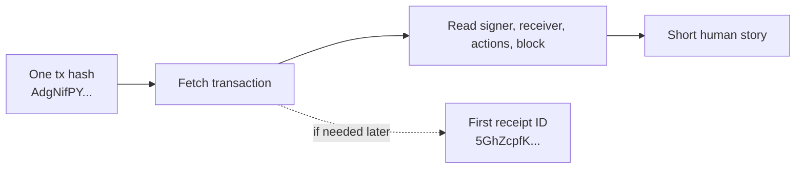
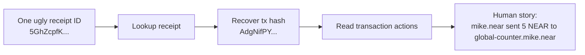
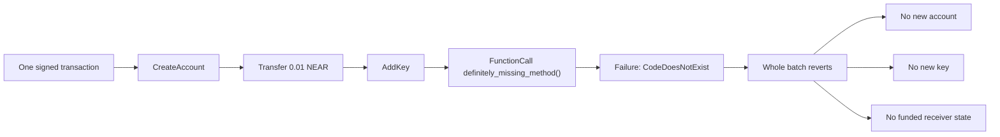
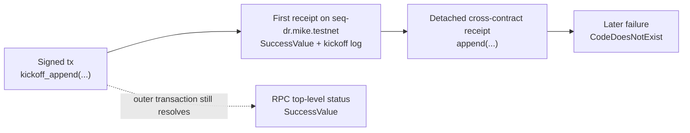
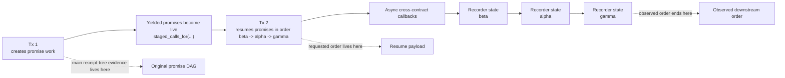
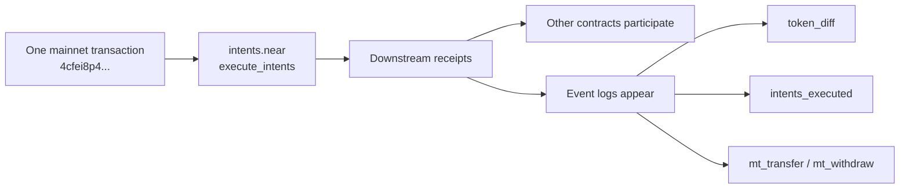

If you want the longer case-study version of the same surface, jump to [Berry Club](/tx/examples/berry-club) for historical board reconstruction or [OutLayer](/tx/examples/outlayer) for worker and callback tracing.

## Start Here

These are the smallest useful anchors on the page: start with one tx hash, then one receipt ID, and only go deeper when the simpler story stops being enough.

### I have one transaction hash. What happened?

Use this investigation when the user story is as plain as it gets: “someone pasted me one transaction hash. I just want to know whether it worked, what it did, and which block it landed in.”

This is the beginner-to-intermediate on-ramp for the page. Before receipts, promise chains, or forensics, there is one simpler skill every NEAR engineer needs: turn a bare tx hash into one short human story.

<div className="fastnear-example-strategy">
  <div className="fastnear-example-strategy__header">
    <span className="fastnear-example-strategy__eyebrow">Strategy</span>
    <p className="fastnear-example-strategy__title">Start with the readable tx record, then drop into RPC or receipts only if the first answer is not enough.</p>
  </div>
  <div className="fastnear-example-strategy__items">
    <p className="fastnear-example-strategy__item"><span className="fastnear-example-strategy__step">01</span><span><span className="fastnear-example-strategy__code">POST /v0/transactions</span> gives signer, receiver, action types, block height, and the first receipt handoff.</span></p>
    <p className="fastnear-example-strategy__item"><span className="fastnear-example-strategy__step">02</span><span><span className="fastnear-example-strategy__code">RPC EXPERIMENTAL_tx_status</span> is only for the exact protocol-side success semantics.</span></p>
    <p className="fastnear-example-strategy__item"><span className="fastnear-example-strategy__step">03</span><span><span className="fastnear-example-strategy__code">POST /v0/receipt</span> only matters if the first receipt becomes the new anchor.</span></p>
  </div>
</div>

**Goal**

- Start from one transaction hash and recover the shortest useful answer: signer, receiver, action type, included block, and whether the transaction handed off into a successful execution path.

For this pinned example:

- transaction hash: `AdgNifPYpoDNS5ckfBZm36Ai6LuL5bTstuKsVdGjKwGp`
- signer: `mike.near`
- receiver: `global-counter.mike.near`
- included block height: `194263342`
- first receipt ID: `5GhZcpfKWhrpaZo5Am74QfEUFQnZBz48G7hfoLPVDXcq`

The plain-English answer for this one is simple: `mike.near` submitted a single `Transfer` action to `global-counter.mike.near`, the transaction landed in block `194263342`, and the chain handed it off into one successful receipt.



| Surface | Endpoint | How we use it | Why we use it |
| --- | --- | --- | --- |
| Readable transaction story | Transactions API [`POST /v0/transactions`](/tx/transactions) | Start from the tx hash and print signer, receiver, included block, action list, and first receipt handoff | Gives the fastest readable answer to “what did this tx do?” |
| Canonical status follow-up | RPC [`EXPERIMENTAL_tx_status`](/rpc/transaction/experimental-tx-status) | Reuse the same tx hash and signer only if you need exact protocol-native status semantics | Useful when the next question becomes “success according to RPC, exactly?” |
| Receipt handoff | Transactions API [`POST /v0/receipt`](/tx/receipt) | Reuse the first receipt ID if the next question turns into a receipt-level story | Provides the natural bridge to the next investigation when the transaction hash is no longer the best anchor |

**What a useful answer should include**

- who signed the transaction
- which account received it
- which action type it carried
- which block included it
- one plain-English sentence that explains the transaction without receipt jargon

#### Transaction hash to human story shell walkthrough

Use this when you want the shortest possible path from one tx hash to one readable answer.

**What you're doing**

- Fetch the transaction by hash and print the main story fields.
- Confirm the final status only if you need exact RPC semantics.
- Keep the first receipt ID only as the optional next step.

```bash
TX_BASE_URL=https://tx.main.fastnear.com
RPC_URL=https://rpc.mainnet.fastnear.com
TX_HASH=AdgNifPYpoDNS5ckfBZm36Ai6LuL5bTstuKsVdGjKwGp
SIGNER_ACCOUNT_ID=mike.near
```

1. Fetch the transaction and print the basic story.

```bash
FIRST_RECEIPT_ID="$(
  curl -s "$TX_BASE_URL/v0/transactions" \
    -H 'content-type: application/json' \
    --data "$(jq -nc --arg tx_hash "$TX_HASH" '{tx_hashes: [$tx_hash]}')" \
    | tee /tmp/basic-tx-story.json \
    | jq -r '.transactions[0].transaction_outcome.outcome.status.SuccessReceiptId'
)"

jq '{
  transaction: {
    hash: .transactions[0].transaction.hash,
    signer_id: .transactions[0].transaction.signer_id,
    receiver_id: .transactions[0].transaction.receiver_id,
    included_block_height: .transactions[0].execution_outcome.block_height
  },
  actions: (
    .transactions[0].transaction.actions
    | map(if type == "string" then . else keys[0] end)
  ),
  first_receipt_id: .transactions[0].transaction_outcome.outcome.status.SuccessReceiptId,
  receipt_count: (.transactions[0].receipts | length)
}' /tmp/basic-tx-story.json

# Expected action list: ["Transfer"]
# Expected first receipt ID: 5GhZcpfKWhrpaZo5Am74QfEUFQnZBz48G7hfoLPVDXcq
```

2. If you need exact RPC status semantics, confirm them with `EXPERIMENTAL_tx_status`.

```bash
curl -s "$RPC_URL" \
  -H 'content-type: application/json' \
  --data "$(jq -nc \
    --arg tx_hash "$TX_HASH" \
    --arg signer_account_id "$SIGNER_ACCOUNT_ID" '{
      jsonrpc: "2.0",
      id: "fastnear",
      method: "EXPERIMENTAL_tx_status",
      params: {
        tx_hash: $tx_hash,
        sender_account_id: $signer_account_id,
        wait_until: "FINAL"
      }
    }')" \
  | jq '{
      final_execution_status: .result.final_execution_status,
      status: .result.status,
      transaction_handoff: .result.transaction_outcome.outcome.status
    }'
```

3. If the next question becomes “what was that first receipt?”, pivot once and stop.

```bash
curl -s "$TX_BASE_URL/v0/receipt" \
  -H 'content-type: application/json' \
  --data "$(jq -nc --arg receipt_id "$FIRST_RECEIPT_ID" '{receipt_id: $receipt_id}')" \
  | jq '{
      receipt_id: .receipt.receipt_id,
      receiver_id: .receipt.receiver_id,
      is_success: .receipt.is_success,
      receipt_block_height: .receipt.block_height,
      transaction_hash: .receipt.transaction_hash
    }'
```

That last step is optional on purpose. If all you wanted was the transaction story, the first step was enough. Keep going only when the receipt itself becomes the new anchor.

**Why this next step?**

`POST /v0/transactions` is the cleanest starting point when all you have is a tx hash and need one readable answer. RPC is the follow-up for exact status semantics. `POST /v0/receipt` is the handoff when the next question stops being about the transaction as a whole and starts being about one receipt inside it.

### Turn one ugly receipt ID from logs into a human story

Use this investigation when all you have is one ugly `receipt_id` from logs, traces, or an error report, and you want to turn it into a plain-English answer a teammate can understand.

If you already have the transaction hash instead of the receipt ID, start with the simpler investigation just above and only drop down to this one when the receipt itself becomes the best anchor.

<div className="fastnear-example-strategy">
  <div className="fastnear-example-strategy__header">
    <span className="fastnear-example-strategy__eyebrow">Strategy</span>
    <p className="fastnear-example-strategy__title">Resolve the receipt first, then recover the parent transaction and stop once the story is readable.</p>
  </div>
  <div className="fastnear-example-strategy__items">
    <p className="fastnear-example-strategy__item"><span className="fastnear-example-strategy__step">01</span><span><span className="fastnear-example-strategy__code">POST /v0/receipt</span> tells you which transaction and execution block the receipt belongs to.</span></p>
    <p className="fastnear-example-strategy__item"><span className="fastnear-example-strategy__step">02</span><span><span className="fastnear-example-strategy__code">POST /v0/transactions</span> turns that raw receipt into signer, receiver, and action context.</span></p>
    <p className="fastnear-example-strategy__item"><span className="fastnear-example-strategy__step">03</span><span><span className="fastnear-example-strategy__code">RPC tx status</span> is optional follow-up only when “human story” turns into “exact protocol semantics.”</span></p>
  </div>
</div>

**Goal**

- Start from one receipt ID and recover the shortest useful story: who created it, where it executed, which transaction spawned it, and what that transaction was actually trying to do.

For this pinned example, the “ugly receipt ID from logs” is:

- receipt ID: `5GhZcpfKWhrpaZo5Am74QfEUFQnZBz48G7hfoLPVDXcq`
- originating transaction hash: `AdgNifPYpoDNS5ckfBZm36Ai6LuL5bTstuKsVdGjKwGp`
- signer: `mike.near`
- receiver: `global-counter.mike.near`
- transaction block height: `194263342`
- receipt execution block height: `194263343`

The human story behind that one receipt is simple: `mike.near` signed a plain `Transfer` transaction to `global-counter.mike.near`, the network turned it into one action receipt, and that receipt executed successfully in the next block.



| Surface | Endpoint | How we use it | Why we use it |
| --- | --- | --- | --- |
| Receipt anchor | Transactions API [`POST /v0/receipt`](/tx/receipt) | Look up the receipt ID first and print the accounts, execution block, success flag, and linked transaction hash | Gives you the shortest path from a raw receipt ID to “what object am I even looking at?” |
| Transaction story | Transactions API [`POST /v0/transactions`](/tx/transactions) | Reuse the recovered transaction hash and print signer, receiver, ordered actions, and included block | Turns the raw receipt into a readable story of what the signer actually submitted |
| Canonical follow-up | RPC [`tx`](/rpc/transaction/tx-status) or [`EXPERIMENTAL_tx_status`](/rpc/transaction/experimental-tx-status) | Confirm protocol-native semantics only if the indexed answer is still not enough | Useful when the question shifts from “tell me the story” to “show me the exact RPC status semantics” |

**What a useful answer should include**

- which accounts created and executed the receipt
- which transaction hash the receipt belongs to
- what the transaction actually did
- whether the receipt was the main event or just one step in a larger cascade
- one plain-English sentence that a teammate could read without decoding receipt jargon

#### Ugly receipt ID to human story shell walkthrough

## Failure and Async

This is where the page stops being simple lookup and starts teaching NEAR execution semantics: atomic batches, later async failures, and callback order.

Use this when you already have one raw `receipt_id` from logs and want to turn it into a readable explanation fast.

**What you're doing**

- Resolve the receipt first.
- Extract `receipt.transaction_hash` with `jq`.
- Reuse that transaction hash in `POST /v0/transactions`.
- Finish with one human summary you could paste into chat or a ticket.

```bash
TX_BASE_URL=https://tx.main.fastnear.com
RECEIPT_ID='5GhZcpfKWhrpaZo5Am74QfEUFQnZBz48G7hfoLPVDXcq'
```

1. Resolve the receipt and figure out what object you are looking at.

```bash
TX_HASH="$(
  curl -s "$TX_BASE_URL/v0/receipt" \
    -H 'content-type: application/json' \
    --data "$(jq -nc --arg receipt_id "$RECEIPT_ID" '{receipt_id: $receipt_id}')" \
    | tee /tmp/receipt-lookup.json \
    | jq -r '.receipt.transaction_hash'
)"

jq '{
  receipt: {
    receipt_id: .receipt.receipt_id,
    predecessor_id: .receipt.predecessor_id,
    receiver_id: .receipt.receiver_id,
    receipt_type: .receipt.receipt_type,
    is_success: .receipt.is_success,
    receipt_block_height: .receipt.block_height,
    transaction_hash: .receipt.transaction_hash,
    tx_block_height: .receipt.tx_block_height
  }
}' /tmp/receipt-lookup.json
```

2. Reuse the transaction hash and turn the receipt into a readable transaction story.

```bash
curl -s "$TX_BASE_URL/v0/transactions" \
  -H 'content-type: application/json' \
  --data "$(jq -nc --arg tx_hash "$TX_HASH" '{tx_hashes: [$tx_hash]}')" \
  | tee /tmp/receipt-parent-transaction.json >/dev/null

jq '{
  transaction: {
    transaction_hash: .transactions[0].transaction.hash,
    signer_id: .transactions[0].transaction.signer_id,
    receiver_id: .transactions[0].transaction.receiver_id,
    tx_block_height: .transactions[0].execution_outcome.block_height,
    action_types: (
      .transactions[0].transaction.actions
      | map(if type == "string" then . else keys[0] end)
    ),
    transfer_deposit_yocto: (
      .transactions[0].transaction.actions[0].Transfer.deposit // null
    )
  },
  receipt_count: (.transactions[0].receipts | length)
}' /tmp/receipt-parent-transaction.json
```

3. Turn that into one human sentence.

```bash
jq -r '
  .transactions[0] as $tx
  | "Receipt \($tx.execution_outcome.outcome.receipt_ids[0]) belongs to tx \($tx.transaction.hash): \($tx.transaction.signer_id) sent 5 NEAR to \($tx.transaction.receiver_id). The tx landed in block \($tx.execution_outcome.block_height), and the receipt executed successfully in block \($tx.receipts[0].execution_outcome.block_height)."
' /tmp/receipt-parent-transaction.json
```

For another receipt, keep the same pattern but change the final sentence to match the action types you just printed.

That is the core trick: you do not need to explain every receipt field. You need to recover just enough context to say what the signer did, where the receipt executed, and whether this receipt was the main event or only one step in a bigger cascade.

**Why this next step?**

`POST /v0/receipt` tells you what the raw receipt is attached to. `POST /v0/transactions` tells you what the signer was actually trying to do. Once you have those two pieces together, you can usually explain the receipt in one sentence before deciding whether you really need block context, account history, or canonical RPC status.

### Prove that one failed action reverted the whole batch

Use this investigation when one transaction tried to create and fund a new account, add a key, and then call a method on that same new account. The final action failed because the fresh account had no contract code. The real question is simple: did the earlier actions stick, or did the whole batch revert?

On NEAR, the actions inside one transaction batch execute in order inside the same first action receipt. If one action in that receipt fails, the earlier actions in that same batch do not stick. That is different from later async receipts or promise chains, where the first receipt can succeed and some later receipt can still fail independently.

<div className="fastnear-example-strategy">
  <div className="fastnear-example-strategy__header">
    <span className="fastnear-example-strategy__eyebrow">Strategy</span>
    <p className="fastnear-example-strategy__title">Prove what the batch tried, which action failed, and whether anything from the earlier actions actually stuck.</p>
  </div>
  <div className="fastnear-example-strategy__items">
    <p className="fastnear-example-strategy__item"><span className="fastnear-example-strategy__step">01</span><span><span className="fastnear-example-strategy__code">POST /v0/transactions</span> shows the ordered batch exactly as the signer submitted it.</span></p>
    <p className="fastnear-example-strategy__item"><span className="fastnear-example-strategy__step">02</span><span><span className="fastnear-example-strategy__code">RPC EXPERIMENTAL_tx_status</span> shows the failing <span className="fastnear-example-strategy__code">FunctionCall</span> and the protocol-side failure reason.</span></p>
    <p className="fastnear-example-strategy__item"><span className="fastnear-example-strategy__step">03</span><span><span className="fastnear-example-strategy__code">RPC view_account</span> on the intended new account proves whether the earlier create, fund, and key-add actions stuck at all.</span></p>
  </div>
</div>

**Goal**

- Prove, from one pinned testnet transaction, that the final `FunctionCall` failed and the earlier `CreateAccount`, `Transfer`, and `AddKey` actions did not stick.

**Official references**

- [Transaction foundations](/transaction-flow/foundations)
- [Runtime execution](/transaction-flow/runtime-execution)

This pinned failure was captured on **April 18, 2026** on testnet:

- transaction hash: `CrhH3xLzbNwNMGgZkgptXorwh8YmqxRGuA6Mc11MkU6M`
- signer account: `temp.mike.testnet`
- intended new account: `rollback-mo4vmkig.temp.mike.testnet`
- included block height: `246365118`
- included block hash: `6f5zTKDqQRwrxMywzvxeRvYcCERJmAnatJaqUEtQYUNM`
- ordered actions: `CreateAccount -> Transfer -> AddKey -> FunctionCall`
- failing method: `definitely_missing_method`
- RPC failure: `CodeDoesNotExist` on `rollback-mo4vmkig.temp.mike.testnet`



| Surface | Endpoint | How we use it | Why we use it |
| --- | --- | --- | --- |
| Intended batch | Transactions API [`POST /v0/transactions`](/tx/transactions) | Fetch the pinned transaction hash and print the ordered action list, receiver, and included block metadata | Shows exactly what the signer tried to do before you reason about what stuck |
| Exact failure | RPC [`EXPERIMENTAL_tx_status`](/rpc/transaction/experimental-tx-status) | Query the same transaction with `wait_until: "FINAL"` and inspect `status.Failure` | Tells you which action failed and why the whole batch reverted at the protocol level |
| Post-state proof | RPC [`query(view_account)`](/rpc/account/view-account) | Query the intended new account after finality | If the created account still does not exist, then the earlier `CreateAccount`, `Transfer`, and `AddKey` from that same batch did not stick either |

One detail is worth calling out before the shell walkthrough: the indexed transaction record still shows `transaction_outcome.outcome.status = SuccessReceiptId`, because the signed transaction successfully became its first action receipt. The proof that the batch reverted comes from the RPC top-level `status.Failure` on that first receipt, plus the post-state check that the intended new account never existed.

**What a useful answer should include**

- the exact action order the signer submitted
- which action index failed and why
- the included block height and hash for the batch
- proof that the intended new account still does not exist after finality
- a short conclusion that the earlier `CreateAccount`, `Transfer`, and `AddKey` actions did not stick once the final `FunctionCall` failed

#### Failed batched transaction shell walkthrough

Use this when you want one concrete failed batch that you can inspect step by step with public FastNear testnet endpoints.

**What you're doing**

- Read the indexed transaction record to recover the intended action batch.
- Use RPC transaction status to prove the final `FunctionCall` failed and reverted the batch.
- Use one post-state RPC read to prove the new account never existed after finality.

```bash
TX_BASE_URL=https://tx.test.fastnear.com
RPC_URL=https://rpc.testnet.fastnear.com
TX_HASH=CrhH3xLzbNwNMGgZkgptXorwh8YmqxRGuA6Mc11MkU6M
SIGNER_ACCOUNT_ID=temp.mike.testnet
NEW_ACCOUNT_ID=rollback-mo4vmkig.temp.mike.testnet
```

1. Fetch the transaction and print the intended action batch.

```bash
curl -s "$TX_BASE_URL/v0/transactions" \
  -H 'content-type: application/json' \
  --data "$(jq -nc --arg tx_hash "$TX_HASH" '{tx_hashes: [$tx_hash]}')" \
  | tee /tmp/failed-batch-transaction.json >/dev/null

jq '{
  transaction: {
    hash: .transactions[0].transaction.hash,
    signer_id: .transactions[0].transaction.signer_id,
    receiver_id: .transactions[0].transaction.receiver_id,
    included_block_height: .transactions[0].execution_outcome.block_height,
    included_block_hash: .transactions[0].execution_outcome.block_hash
  },
  batch: {
    action_count: (.transactions[0].transaction.actions | length),
    action_types: (
      .transactions[0].transaction.actions
      | map(if type == "string" then . else keys[0] end)
    ),
    final_function_call_method_name: (
      .transactions[0].transaction.actions[3].FunctionCall.method_name
    )
  },
  first_receipt_handoff: .transactions[0].transaction_outcome.outcome.status
}' /tmp/failed-batch-transaction.json

# Expected action order:
# 1. CreateAccount
# 2. Transfer
# 3. AddKey
# 4. FunctionCall
```

2. Query RPC transaction status and inspect the exact top-level failure.

```bash
curl -s "$RPC_URL" \
  -H 'content-type: application/json' \
  --data "$(jq -nc \
    --arg tx_hash "$TX_HASH" \
    --arg signer_account_id "$SIGNER_ACCOUNT_ID" '{
      jsonrpc: "2.0",
      id: "fastnear",
      method: "EXPERIMENTAL_tx_status",
      params: {
        tx_hash: $tx_hash,
        sender_account_id: $signer_account_id,
        wait_until: "FINAL"
      }
    }')" \
  | tee /tmp/failed-batch-rpc-status.json >/dev/null

jq '{
  final_execution_status: .result.final_execution_status,
  failed_action_index: .result.status.Failure.ActionError.index,
  failure: .result.status.Failure.ActionError.kind.FunctionCallError.CompilationError.CodeDoesNotExist
}' /tmp/failed-batch-rpc-status.json

# Expected failed_action_index: 3
# Expected failure account_id: rollback-mo4vmkig.temp.mike.testnet
```

3. Query the intended new account after finality and prove it still does not exist.

```bash
curl -s "$RPC_URL" \
  -H 'content-type: application/json' \
  --data "$(jq -nc --arg account_id "$NEW_ACCOUNT_ID" '{
    jsonrpc: "2.0",
    id: "fastnear",
    method: "query",
    params: {
      request_type: "view_account",
      account_id: $account_id,
      finality: "final"
    }
  }')" \
  | tee /tmp/failed-batch-view-account.json >/dev/null

jq '{
  error: .error.cause.name,
  message: .error.data,
  requested_account_id: .error.cause.info.requested_account_id,
  proof_block_height: .error.cause.info.block_height
}' /tmp/failed-batch-view-account.json

# Expected error: "UNKNOWN_ACCOUNT"
```

That one post-state check is enough here. If `CreateAccount` had stuck, `view_account` would resolve. Because the account still does not exist, the earlier `Transfer` and `AddKey` from the same batched receipt did not stick either.

**Why this next step?**

For another failed batch, keep the same pattern: read what the transaction tried to do from [`POST /v0/transactions`](/tx/transactions), confirm the exact top-level failure with RPC transaction status, then inspect post-state on the account, key, contract, or other object that would have changed if the earlier actions had stuck.

### Why did this contract call look successful, but a later receipt failed?

Use this investigation when one contract call logged success, changed its own local state, and even the top-level RPC `status` looks successful, but the app still broke because a later detached cross-contract receipt failed.

This is the opposite of the failed batch example above. There, one action failed inside the first action receipt, so nothing in that batch stuck. Here, the first contract receipt really did succeed and its state change really did stick. The failure happened later, in a separate receipt.

<div className="fastnear-example-strategy">
  <div className="fastnear-example-strategy__header">
    <span className="fastnear-example-strategy__eyebrow">Strategy</span>
    <p className="fastnear-example-strategy__title">First get the human timeline, then prove where the async story split.</p>
  </div>
  <div className="fastnear-example-strategy__items">
    <p className="fastnear-example-strategy__item"><span className="fastnear-example-strategy__step">01</span><span><span className="fastnear-example-strategy__code">POST /v0/transactions</span> gives the easiest first pass: which receipt ran first, and which receipt failed later.</span></p>
    <p className="fastnear-example-strategy__item"><span className="fastnear-example-strategy__step">02</span><span><span className="fastnear-example-strategy__code">RPC EXPERIMENTAL_tx_status</span> proves the important NEAR nuance that top-level success and later descendant failure can both be true.</span></p>
    <p className="fastnear-example-strategy__item"><span className="fastnear-example-strategy__step">03</span><span>Once those two views agree on the split, stop. This example stays on preserved historical evidence rather than a live router-state read.</span></p>
  </div>
</div>

**Goal**

- Prove, from one pinned testnet transaction, that `seq-dr.mike.testnet.kickoff_append(...)` succeeded on its own receipt, then a detached `append(...)` call failed one block later with `CodeDoesNotExist`.

**Official references**

- [Transaction foundations](/transaction-flow/foundations)
- [Runtime execution](/transaction-flow/runtime-execution)

This pinned async failure was captured on **April 18, 2026** on testnet:

- transaction hash: `AUciGAq54XZtEuVXA9bSq4k6h13LmspoKtLegcWGRmQz`
- signer account: `temp.mike.testnet`
- first contract receiver: `seq-dr.mike.testnet`
- detached target account: `asyncfail-in2hwikn.temp.mike.testnet`
- transaction inclusion block: `246368568`
- successful first receipt: `6XgWxB9QVkgGKJaLcjDphGHYTK5d1suNe2cH1WHRWnoS` at block `246368569`
- later failed receipt: `2A5JG8N1BxyR57WbrjqntTSf1UwR4RXR79MD2Zg3K2es` at block `246368570`
- first method: `kickoff_append`
- later failed method: `append`
- top-level RPC `status`: `SuccessValue`



| Surface | Endpoint | How we use it | Why we use it |
| --- | --- | --- | --- |
| Transaction skeleton | Transactions API [`POST /v0/transactions`](/tx/transactions) | Fetch the pinned transaction and print the included block plus the per-receipt timeline | Gives the shortest readable overview of which receipt ran first and which receipt failed later |
| Exact status semantics | RPC [`EXPERIMENTAL_tx_status`](/rpc/transaction/experimental-tx-status) | Inspect the top-level `status`, the first contract receipt outcome, and the later failed receipt outcome | Proves that top-level success and later descendant failure can coexist in one async story |

One NEAR detail matters here: receipt success is not transitive. `seq-dr.mike.testnet` returned success on its own receipt because `kickoff_append(...)` only logged and detached the next hop. The detached `append(...)` receipt was a separate piece of async work, so its later failure did not change the fact that the router's own receipt had already completed successfully.

**What a useful answer should include**

- that the signed transaction successfully handed off into the first router receipt
- that the router receipt itself succeeded and emitted the `dishonest_router:kickoff:late-failure` log
- that the later detached receipt to `asyncfail-in2hwikn.temp.mike.testnet` failed with `CodeDoesNotExist`
- that RPC still reports the outer transaction as `SuccessValue` even though a later detached receipt failed
- one sentence explaining why this is different from a failed batched transaction

#### Later receipt failure shell walkthrough

Use this when the user story is “the contract call looked fine, but something failed later, and I need to prove exactly where the story split.”

**What you're doing**

- Read the transaction and its receipt timeline from the indexed view.
- Use RPC transaction status to show that the top-level story still ended in `SuccessValue` even though a later receipt failed.
- Stop once those two preserved views agree on the split.

```bash
TX_BASE_URL=https://tx.test.fastnear.com
RPC_URL=https://rpc.testnet.fastnear.com
TX_HASH=AUciGAq54XZtEuVXA9bSq4k6h13LmspoKtLegcWGRmQz
SIGNER_ACCOUNT_ID=temp.mike.testnet
FIRST_RECEIPT_ID=6XgWxB9QVkgGKJaLcjDphGHYTK5d1suNe2cH1WHRWnoS
FAILED_RECEIPT_ID=2A5JG8N1BxyR57WbrjqntTSf1UwR4RXR79MD2Zg3K2es
```

1. Fetch the transaction and print the receipt timeline in block order.

```bash
curl -s "$TX_BASE_URL/v0/transactions" \
  -H 'content-type: application/json' \
  --data "$(jq -nc --arg tx_hash "$TX_HASH" '{tx_hashes: [$tx_hash]}')" \
  | tee /tmp/later-receipt-failure-transaction.json >/dev/null

jq '{
  transaction: {
    hash: .transactions[0].transaction.hash,
    signer_id: .transactions[0].transaction.signer_id,
    receiver_id: .transactions[0].transaction.receiver_id,
    tx_block_height: .transactions[0].execution_outcome.block_height,
    tx_handoff: .transactions[0].transaction_outcome.outcome.status
  },
  receipts: [
    .transactions[0].receipts[]
    | {
        receipt_id: .receipt.receipt_id,
        receiver_id: .receipt.receiver_id,
        block_height: .execution_outcome.block_height,
        method_name: (.receipt.receipt.Action.actions[0].FunctionCall.method_name // "system_transfer"),
        status: .execution_outcome.outcome.status
      }
  ]
}' /tmp/later-receipt-failure-transaction.json

# What to notice:
# - the first contract receipt on seq-dr.mike.testnet succeeded in block 246368569
# - the later append(...) receipt failed in block 246368570
```

2. Query RPC transaction status and compare the top-level story with the later failed receipt.

```bash
curl -s "$RPC_URL" \
  -H 'content-type: application/json' \
  --data "$(jq -nc \
    --arg tx_hash "$TX_HASH" \
    --arg signer_account_id "$SIGNER_ACCOUNT_ID" '{
      jsonrpc: "2.0",
      id: "fastnear",
      method: "EXPERIMENTAL_tx_status",
      params: {
        tx_hash: $tx_hash,
        sender_account_id: $signer_account_id,
        wait_until: "FINAL"
      }
    }')" \
  | tee /tmp/later-receipt-failure-rpc.json >/dev/null

jq \
  --arg first_receipt_id "$FIRST_RECEIPT_ID" \
  --arg failed_receipt_id "$FAILED_RECEIPT_ID" '{
    top_level_status: .result.status,
    transaction_handoff: .result.transaction_outcome.outcome.status,
    first_contract_receipt: (
      .result.receipts_outcome[]
      | select(.id == $first_receipt_id)
      | {
          receipt_id: .id,
          executor_id: .outcome.executor_id,
          logs: .outcome.logs,
          status: .outcome.status
        }
    ),
    later_failed_receipt: (
      .result.receipts_outcome[]
      | select(.id == $failed_receipt_id)
      | {
          receipt_id: .id,
          executor_id: .outcome.executor_id,
          status: .outcome.status
        }
    )
  }' /tmp/later-receipt-failure-rpc.json

# What to notice:
# - top_level_status is still SuccessValue
# - the first contract receipt logged dishonest_router:kickoff:late-failure
# - the later append(...) receipt failed with CodeDoesNotExist
```

Stop here. As of **April 18, 2026**, `seq-dr.mike.testnet` no longer resolves on testnet, so a live router-state proof would no longer be truthful. The indexed receipt timeline plus `EXPERIMENTAL_tx_status` are the preserved historical evidence that still matters.

**Why this next step?**

When a NEAR app “looked successful” and still broke later, the thing to ask is not just “what was the transaction status?” but “which receipt succeeded, and which later receipt failed?” This example gives you that exact split: indexed receipt timeline for the shape, RPC status for the exact semantics, and no pretend live router-state read after the historical contract disappeared.

### Trace an async promise chain and prove callback order

Use this investigation when one transaction creates promise work for later, a second transaction resumes it, and the real question is not “did both transactions succeed?” but “did the cross-contract callbacks actually run in the order I intended?”

<div className="fastnear-example-strategy">
  <div className="fastnear-example-strategy__header">
    <span className="fastnear-example-strategy__eyebrow">Strategy</span>
    <p className="fastnear-example-strategy__title">Treat the two tx hashes as one async story: prove the work was live, recover the requested order, then compare it with observed downstream state.</p>
  </div>
  <div className="fastnear-example-strategy__items">
    <p className="fastnear-example-strategy__item"><span className="fastnear-example-strategy__step">01</span><span><span className="fastnear-example-strategy__code">RPC call_function</span> on the deferred-work view proves the promise work was really live before the resume step.</span></p>
    <p className="fastnear-example-strategy__item"><span className="fastnear-example-strategy__step">02</span><span><span className="fastnear-example-strategy__code">POST /v0/transactions</span> gives both block anchors and the exact order that the resume transaction requested.</span></p>
    <p className="fastnear-example-strategy__item"><span className="fastnear-example-strategy__step">03</span><span><span className="fastnear-example-strategy__code">RPC EXPERIMENTAL_tx_status</span> plus the downstream recorder view prove where the callbacks actually ran and in what visible order.</span></p>
  </div>
</div>

**Goal**

- Turn two transaction hashes into one readable proof story: what promise work was created, what order the resume call requested, and what order later showed up in downstream contract state.

If your codebase or helper scripts call this a “stage/release” or “yield/resume” flow, that is fine. For docs, the more useful mental model is simpler:

- **create promise work**: one transaction sets up deferred async work for later
- **resume promise work**: a later transaction asks the contract to continue that work in a requested order
- **trace the async path**: receipt trees show where the cross-contract callbacks actually ran
- **observe state**: downstream contract state shows what order became visible to users or integrators



That distinction matters because a successful resume transaction still does not prove the observed order by itself. You also need evidence that the promised work was really live before resume, and evidence that downstream state changed in the same order the resume call requested.

For NEAR engineers, the important mental model is: the resume transaction tells you the **requested order**, but the original promise transaction usually remains the primary forensic anchor because the resumed callbacks still live on that original async receipt tree. Downstream contract state is what lets you compare requested order with observed order.

| Surface | Endpoint | How we use it | Why we use it |
| --- | --- | --- | --- |
| Promise-chain trace capture | RPC [`EXPERIMENTAL_tx_status`](/rpc/transaction/experimental-tx-status) | Query the original promise transaction hash and the later resume transaction hash with `wait_until: "FINAL"`, usually hot RPC first and archival RPC on `UNKNOWN_TRANSACTION` | The receipt DAG is the primary proof surface for callback order and tells you which receipts belong to which async transaction tree |
| Promise-readiness check | RPC [`query(call_function)`](/rpc/contract/call-function) | Poll the contract view that exposes deferred promise work, such as `staged_calls_for({ caller_id })`, with `finality: "final"` until the yielded promises appear | Confirms the promise work was really live before the resume transaction tried to continue it |
| Requested-order anchor | Transactions API [`POST /v0/transactions`](/tx/transactions) | Fetch both transaction hashes to recover `block_height`, `block_hash`, `receiver_id`, indexed execution status, and the resume payload | Gives each transaction a durable block anchor and preserves the exact order the resume step requested |
| Downstream state snapshots | RPC [`query(call_function)`](/rpc/contract/call-function) | Read the downstream recorder state before resume, then poll it after resume until the expected entries appear | Proves actual callback order in contract state, not just metadata in the receipt tree |
| Receipt pivot | Transactions API [`POST /v0/receipt`](/tx/receipt) | Use any interesting yielded or downstream receipt ID to reconnect it to the originating transaction | Lets you move quickly from one receipt in the DAG back to the broader transaction story |
| Per-block reconstruction | Transactions API [`POST /v0/block`](/tx/block) | Fetch the included block and the cascade blocks with receipts enabled | Reconstructs the block-by-block execution timeline once you know which blocks matter |
| Account activity context | Transactions API [`POST /v0/account`](/tx/account) | Fetch function-call history for the contracts that participated in the cascade over the same window | Gives humans a simpler account-history view to compare against the trace |
| Block-pinned state replay | RPC [`query(call_function)`](/rpc/contract/call-function) | Re-run the recorder view with `block_id` pinned to the interesting heights | Turns final state into a time series so you can say when state changed, not just what it became |

**What a useful answer should include**

- a one-sentence conclusion in plain language, such as “the first transaction created three deferred promises, the second transaction resumed them in order `beta -> alpha -> gamma`, and the recorder state later confirmed that same callback order”
- why the original promise transaction, not only the resume transaction, is usually the primary forensic anchor
- the requested callback order and the observed downstream effect order
- the blocks where the observable state changed
- any receipt or account pivots the next investigator should keep

## SocialDB Proofs

These examples start from readable NEAR Social state and walk back to the exact write that made it true.

### Prove that `mike.near` set `profile.name` to `Mike Purvis`, then recover the SocialDB profile write transaction

Use this investigation when the user story is “I can see `Mike Purvis` on `mike.near`'s NEAR Social profile, but I want to prove exactly when that field was written and which transaction wrote it.”

<div className="fastnear-example-strategy">
  <div className="fastnear-example-strategy__header">
    <span className="fastnear-example-strategy__eyebrow">Strategy</span>
    <p className="fastnear-example-strategy__title">Start from the readable field value, then turn its field-level block into one receipt and one write transaction.</p>
  </div>
  <div className="fastnear-example-strategy__items">
    <p className="fastnear-example-strategy__item"><span className="fastnear-example-strategy__step">01</span><span><span className="fastnear-example-strategy__code">NEAR Social POST /get</span> gives both the current <span className="fastnear-example-strategy__code">profile.name</span> value and the field-level <span className="fastnear-example-strategy__code">:block</span>.</span></p>
    <p className="fastnear-example-strategy__item"><span className="fastnear-example-strategy__step">02</span><span><span className="fastnear-example-strategy__code">POST /v0/block</span> turns that block into the concrete <span className="fastnear-example-strategy__code">mike.near -> social.near</span> receipt and transaction hash.</span></p>
    <p className="fastnear-example-strategy__item"><span className="fastnear-example-strategy__step">03</span><span><span className="fastnear-example-strategy__code">POST /v0/transactions</span> proves the write payload, and <span className="fastnear-example-strategy__code">RPC call_function get</span> confirms the field still resolves that way now.</span></p>
  </div>
</div>

**Goal**

- Start from one readable SocialDB profile field, then recover the exact receipt and originating transaction that wrote it.

**Official references**

- [SocialDB API and contract surface](https://github.com/NearSocial/social-db#api)
- [NEAR Social live read surface](https://api.near.social)

This follows the same proof recipe as the follow-edge investigation, but it teaches one extra SocialDB nuance: for historical proof, the field-level `:block` is usually more precise than the parent object's `:block`. In this live case, `mike.near/profile/name` was written at block `78675795`, while the broader `mike.near/profile` object later advanced to a different block because unrelated sibling fields changed. FastNear's role is to turn that field-level block into a receipt, then a transaction, and then a readable write payload.

For this live example, the current `profile.name` value is `Mike Purvis`, the field-level SocialDB write block is `78675795`, the receipt ID is `2gbAmEEdcCNARuCorquXStftqvWFmPG2GSaMJXFw5qiN`, the originating transaction hash is `6zMb9L6rLNufZGUgCmeHTh5LvFsn3R92dPxuubH6MRsZ`, and the outer transaction block is `78675794`.

| Surface | Endpoint | How we use it | Why we use it |
| --- | --- | --- | --- |
| Semantic field lookup | NEAR Social `POST /get` | Read `mike.near/profile/name` with block metadata enabled | Gives the human-readable field value and the field-level SocialDB `:block` anchor where that value was written |
| Receipt bridge | Transactions API [`POST /v0/block`](/tx/block) | Use the SocialDB field block with `with_receipts: true`, then filter the block receipts back down to `mike.near -> social.near` | Turns the field-level write block into a concrete receipt and originating transaction hash |
| Transaction story | Transactions API [`POST /v0/transactions`](/tx/transactions) | Fetch the originating transaction by hash and decode the first `FunctionCall.args` payload | Proves that the underlying write was a `social.near set` call that carried `profile.name` and the surrounding profile fields in the same payload |
| Canonical current-state confirmation | RPC [`query(call_function)`](/rpc/contract/call-function) | Call `social.near get` directly at `final` | Confirms the field still has that value now, even though the earlier steps already proved the specific historical write |

**What a useful answer should include**

- whether `mike.near/profile/name` still resolves to `Mike Purvis`
- the field-level SocialDB write block height (`78675795`) and why that anchor is better than the parent profile block for this question
- the specific receipt ID and originating transaction hash behind that write
- proof that the write was a `set` call carrying `profile.name` and other profile fields in the same payload
- the distinction between the receipt execution block (`78675795`) and the outer transaction inclusion block (`78675794`)

#### NEAR Social profile-proof shell walkthrough

Use this when you want a concrete, repeatable proof chain from one readable NEAR Social profile field to the exact SocialDB write transaction behind it.

**What you're doing**

- Read the current `profile.name` field from NEAR Social and capture its field-level SocialDB write block.
- Reuse that block height in FastNear block receipts to recover the receipt ID and transaction hash.
- Reuse the transaction hash in `POST /v0/transactions` to prove the payload was a `social.near set` write carrying `profile.name`.
- Finish with canonical RPC confirmation that the field still resolves to the same value at `final`.

```bash
SOCIAL_API_BASE_URL=https://api.near.social
TX_BASE_URL=https://tx.main.fastnear.com
RPC_URL=https://rpc.mainnet.fastnear.com
ACCOUNT_ID=mike.near
PROFILE_FIELD=profile/name
```

1. Read the profile field from NEAR Social and capture the field-level SocialDB write block.

```bash
PROFILE_BLOCK_HEIGHT="$(
  curl -s "$SOCIAL_API_BASE_URL/get" \
    -H 'content-type: application/json' \
    --data "$(jq -nc \
      --arg account_id "$ACCOUNT_ID" \
      --arg profile_field "$PROFILE_FIELD" '{
        keys: [($account_id + "/" + $profile_field)],
        options: {with_block_height: true}
      }')" \
    | tee /tmp/mike-profile-name.json \
    | jq -r --arg account_id "$ACCOUNT_ID" \
        '.[ $account_id ].profile.name[":block"]'
)"

jq --arg account_id "$ACCOUNT_ID" '{
  current_name: .[$account_id].profile.name[""],
  field_block_height: .[$account_id].profile.name[":block"],
  parent_profile_block_height: .[$account_id].profile[":block"]
}' /tmp/mike-profile-name.json

# Expected current_name: "Mike Purvis"
# Expected field block height: 78675795
```

2. Reuse that block height in FastNear block receipts and recover the receipt and transaction bridge.

```bash
PROFILE_TX_HASH="$(
  curl -s "$TX_BASE_URL/v0/block" \
    -H 'content-type: application/json' \
    --data "$(jq -nc --argjson block_id "$PROFILE_BLOCK_HEIGHT" '{
      block_id: $block_id,
      with_transactions: false,
      with_receipts: true
    }')" \
    | tee /tmp/mike-profile-block.json \
    | jq -r --arg account_id "$ACCOUNT_ID" '
        first(
          .block_receipts[]
          | select(.predecessor_id == $account_id and .receiver_id == "social.near")
          | .transaction_hash
        )'
)"

jq --arg account_id "$ACCOUNT_ID" '{
  profile_receipt: (
    first(
      .block_receipts[]
      | select(.predecessor_id == $account_id and .receiver_id == "social.near")
      | {
          receipt_id,
          transaction_hash,
          block_height,
          tx_block_height
        }
    )
  )
}' /tmp/mike-profile-block.json

# Expected receipt ID: 2gbAmEEdcCNARuCorquXStftqvWFmPG2GSaMJXFw5qiN
# Expected transaction hash: 6zMb9L6rLNufZGUgCmeHTh5LvFsn3R92dPxuubH6MRsZ
```

3. Reuse the derived transaction hash in `POST /v0/transactions` and decode the SocialDB write payload.

```bash
curl -s "$TX_BASE_URL/v0/transactions" \
  -H 'content-type: application/json' \
  --data "$(jq -nc --arg tx_hash "$PROFILE_TX_HASH" '{tx_hashes: [$tx_hash]}')" \
  | tee /tmp/mike-profile-transaction.json >/dev/null

jq '{
  transaction: {
    hash: .transactions[0].transaction.hash,
    signer_id: .transactions[0].transaction.signer_id,
    receiver_id: .transactions[0].transaction.receiver_id,
    included_block_height: .transactions[0].execution_outcome.block_height
  },
  write_proof: (
    .transactions[0].receipts[0].receipt.receipt.Action.actions[0].FunctionCall
    | {
        method_name,
        profile_name: (.args | @base64d | fromjson | .data["mike.near"].profile.name),
        description: (.args | @base64d | fromjson | .data["mike.near"].profile.description),
        tags: (
          .args
          | @base64d
          | fromjson
          | .data["mike.near"].profile.tags
          | keys
        )
      }
  )
}' /tmp/mike-profile-transaction.json
```

4. Finish with canonical current-state confirmation via raw RPC.

```bash
SOCIAL_GET_ARGS_BASE64="$(
  jq -nr --arg account_id "$ACCOUNT_ID" --arg profile_field "$PROFILE_FIELD" '{
    keys: [($account_id + "/" + $profile_field)]
  } | @base64'
)"

curl -s "$RPC_URL" \
  -H 'content-type: application/json' \
  --data "$(jq -nc --arg args_base64 "$SOCIAL_GET_ARGS_BASE64" '{
    jsonrpc: "2.0",
    id: "fastnear",
    method: "query",
    params: {
      request_type: "call_function",
      account_id: "social.near",
      method_name: "get",
      args_base64: $args_base64,
      finality: "final"
    }
  }')" \
  | tee /tmp/mike-profile-rpc.json >/dev/null

jq --arg account_id "$ACCOUNT_ID" '{
  finality: "final",
  current_name: (
    .result.result
    | implode
    | fromjson
    | .[$account_id].profile.name
  )
}' /tmp/mike-profile-rpc.json
```

That last step confirms the field still resolves to `Mike Purvis` now. The earlier NEAR Social and FastNear steps are what proved which historical write set that field and which transaction carried the write.

**Why this next step?**

NEAR Social gives you the semantic field value. FastNear block receipts give you the bridge to a specific write. FastNear transaction lookup turns that write into a readable profile payload. RPC gives you canonical current-state confirmation.

### Prove that `mike.near` followed `mob.near`, then recover the SocialDB write transaction

Use this investigation when the user story is “I can see that `mike.near` follows `mob.near`, but I want to prove exactly when that follow edge was written and which transaction wrote it.”

<div className="fastnear-example-strategy">
  <div className="fastnear-example-strategy__header">
    <span className="fastnear-example-strategy__eyebrow">Strategy</span>
    <p className="fastnear-example-strategy__title">Start from the semantic follow edge, then use its write block as the bridge back to one receipt and one transaction.</p>
  </div>
  <div className="fastnear-example-strategy__items">
    <p className="fastnear-example-strategy__item"><span className="fastnear-example-strategy__step">01</span><span><span className="fastnear-example-strategy__code">NEAR Social POST /get</span> gives the readable follow edge and the SocialDB <span className="fastnear-example-strategy__code">:block</span> where it was written.</span></p>
    <p className="fastnear-example-strategy__item"><span className="fastnear-example-strategy__step">02</span><span><span className="fastnear-example-strategy__code">POST /v0/block</span> turns that write block into the specific receipt and transaction hash behind the edge.</span></p>
    <p className="fastnear-example-strategy__item"><span className="fastnear-example-strategy__step">03</span><span><span className="fastnear-example-strategy__code">POST /v0/transactions</span> proves the <span className="fastnear-example-strategy__code">graph.follow</span> plus <span className="fastnear-example-strategy__code">index.graph</span> payload, and <span className="fastnear-example-strategy__code">RPC call_function get</span> confirms the edge still exists now.</span></p>
  </div>
</div>

**Goal**

- Start from the readable NEAR Social follow edge, then recover the exact receipt and originating transaction that wrote it into SocialDB.

**Official references**

- [SocialDB API and contract surface](https://github.com/NearSocial/social-db#api)
- [NEAR Social live read surface](https://api.near.social)

The readable follow edge comes from NEAR Social data, not from FastNear. The important bridge is the SocialDB `:block` metadata: it tells you the receipt execution block where that value was written. That block is not the same thing as the original outer transaction inclusion block. FastNear's job in this workflow is to turn that block height into a receipt, then into a transaction, and finally into a readable execution story.

For this live example, the current edge is `mike.near -> mob.near`, the SocialDB write block is `79574924`, the receipt ID is `UiyiQaqHbkkMxkrB6rDkYr7X5EQLt8QG9MDATrES7Th`, the originating transaction hash is `FLLmTvFx9vCof79scy2uUviF5WwYmevkz9TZ8azPGVQb`, and the outer transaction block is `79574923`.

| Surface | Endpoint | How we use it | Why we use it |
| --- | --- | --- | --- |
| Semantic edge lookup | NEAR Social `POST /get` | Read `mike.near/graph/follow/mob.near` with block metadata enabled | Gives the human-readable follow edge and the SocialDB `:block` anchor where that value was written |
| Receipt bridge | Transactions API [`POST /v0/block`](/tx/block) | Use the SocialDB block height with `with_receipts: true`, then filter the block receipts back down to `mike.near -> social.near` | Turns the SocialDB write block into a concrete receipt and originating transaction hash |
| Transaction story | Transactions API [`POST /v0/transactions`](/tx/transactions) | Fetch the originating transaction by hash and decode the first `FunctionCall.args` payload | Proves that the underlying write was a `social.near set` call that wrote both `graph.follow` and `index.graph` entries |
| Canonical current-state confirmation | RPC [`query(call_function)`](/rpc/contract/call-function) | Call `social.near get` directly at `final` | Confirms the follow edge still exists now, even though the earlier steps already proved the specific historical write |

**What a useful answer should include**

- whether the `mike.near -> mob.near` follow edge exists now
- the SocialDB write block height (`79574924`) and why it is a receipt execution block
- the specific receipt ID and originating transaction hash behind that write
- proof that the write was a `set` call carrying both `graph.follow.mob.near` and the matching `index.graph` entry
- the distinction between the receipt execution block (`79574924`) and the outer transaction inclusion block (`79574923`)

#### NEAR Social follow-proof shell walkthrough

Use this when you want a concrete, repeatable proof chain from one readable NEAR Social follow edge to the exact SocialDB write transaction behind it.

**What you're doing**

- Read the current follow edge from NEAR Social and capture the SocialDB write block.
- Reuse that block height in FastNear block receipts to recover the receipt ID and transaction hash.
- Reuse the transaction hash in `POST /v0/transactions` to prove the payload was a `social.near set` write.
- Finish with canonical RPC confirmation that the edge still exists at `final`.

```bash
SOCIAL_API_BASE_URL=https://api.near.social
TX_BASE_URL=https://tx.main.fastnear.com
RPC_URL=https://rpc.mainnet.fastnear.com
ACCOUNT_ID=mike.near
TARGET_ACCOUNT_ID=mob.near
```

1. Read the follow edge from NEAR Social and capture the SocialDB write block.

```bash
FOLLOW_BLOCK_HEIGHT="$(
  curl -s "$SOCIAL_API_BASE_URL/get" \
    -H 'content-type: application/json' \
    --data "$(jq -nc \
      --arg account_id "$ACCOUNT_ID" \
      --arg target_account_id "$TARGET_ACCOUNT_ID" '{
        keys: [($account_id + "/graph/follow/" + $target_account_id)],
        options: {with_block_height: true}
      }')" \
    | tee /tmp/mike-follow-edge.json \
    | jq -r --arg account_id "$ACCOUNT_ID" --arg target_account_id "$TARGET_ACCOUNT_ID" \
        '.[ $account_id ].graph.follow[ $target_account_id ][":block"]'
)"

jq --arg account_id "$ACCOUNT_ID" --arg target_account_id "$TARGET_ACCOUNT_ID" '{
  follow_edge: .[$account_id].graph.follow[$target_account_id][""],
  follow_block_height: .[$account_id].graph.follow[$target_account_id][":block"]
}' /tmp/mike-follow-edge.json

# Expected follow block height: 79574924
```

2. Reuse that block height in FastNear block receipts and recover the receipt and transaction bridge.

```bash
FOLLOW_TX_HASH="$(
  curl -s "$TX_BASE_URL/v0/block" \
    -H 'content-type: application/json' \
    --data "$(jq -nc --argjson block_id "$FOLLOW_BLOCK_HEIGHT" '{
      block_id: $block_id,
      with_transactions: false,
      with_receipts: true
    }')" \
    | tee /tmp/mike-follow-block.json \
    | jq -r --arg account_id "$ACCOUNT_ID" '
        first(
          .block_receipts[]
          | select(.predecessor_id == $account_id and .receiver_id == "social.near")
          | .transaction_hash
        )'
)"

jq --arg account_id "$ACCOUNT_ID" '{
  follow_receipt: (
    first(
      .block_receipts[]
      | select(.predecessor_id == $account_id and .receiver_id == "social.near")
      | {
          receipt_id,
          transaction_hash,
          block_height,
          tx_block_height
        }
    )
  )
}' /tmp/mike-follow-block.json

# Expected receipt ID: UiyiQaqHbkkMxkrB6rDkYr7X5EQLt8QG9MDATrES7Th
# Expected transaction hash: FLLmTvFx9vCof79scy2uUviF5WwYmevkz9TZ8azPGVQb
```

3. Reuse the derived transaction hash in `POST /v0/transactions` and decode the SocialDB write payload.

```bash
curl -s "$TX_BASE_URL/v0/transactions" \
  -H 'content-type: application/json' \
  --data "$(jq -nc --arg tx_hash "$FOLLOW_TX_HASH" '{tx_hashes: [$tx_hash]}')" \
  | tee /tmp/mike-follow-transaction.json >/dev/null

jq '{
  transaction: {
    hash: .transactions[0].transaction.hash,
    signer_id: .transactions[0].transaction.signer_id,
    receiver_id: .transactions[0].transaction.receiver_id,
    included_block_height: .transactions[0].execution_outcome.block_height
  },
  write_proof: (
    .transactions[0].receipts[0].receipt.receipt.Action.actions[0].FunctionCall
    | {
        method_name,
        follow_edge: (.args | @base64d | fromjson | .data["mike.near"].graph.follow["mob.near"]),
        index_graph: (
          .args
          | @base64d
          | fromjson
          | .data["mike.near"].index.graph
          | fromjson
          | map(select(.value.accountId == "mob.near"))
        )
      }
  )
}' /tmp/mike-follow-transaction.json
```

4. Finish with canonical current-state confirmation via raw RPC.

```bash
SOCIAL_GET_ARGS_BASE64="$(
  jq -nr --arg account_id "$ACCOUNT_ID" --arg target_account_id "$TARGET_ACCOUNT_ID" '{
    keys: [($account_id + "/graph/follow/" + $target_account_id)]
  } | @base64'
)"

curl -s "$RPC_URL" \
  -H 'content-type: application/json' \
  --data "$(jq -nc --arg args_base64 "$SOCIAL_GET_ARGS_BASE64" '{
    jsonrpc: "2.0",
    id: "fastnear",
    method: "query",
    params: {
      request_type: "call_function",
      account_id: "social.near",
      method_name: "get",
      args_base64: $args_base64,
      finality: "final"
    }
  }')" \
  | tee /tmp/mike-follow-rpc.json >/dev/null

jq --arg account_id "$ACCOUNT_ID" --arg target_account_id "$TARGET_ACCOUNT_ID" '{
  finality: "final",
  current_follow_edge: (
    .result.result
    | implode
    | fromjson
    | .[$account_id].graph.follow[$target_account_id]
  )
}' /tmp/mike-follow-rpc.json
```

That last step confirms the follow edge still exists now. The earlier NEAR Social and FastNear steps are what proved which historical write created the edge and which transaction carried that write.

**Why this next step?**

NEAR Social gives you the semantic edge. FastNear block receipts give you the bridge to a specific write. FastNear transaction lookup turns that write into a readable story. RPC gives you canonical current-state confirmation.

### Which transaction wrote `mob.near/widget/Profile`?

Use this investigation when the question is “I already know `mob.near/widget/Profile` exists right now. Which transaction wrote the widget version I am looking at?”

This is the natural tx-side companion to the lighter RPC widget inspection and the provenance-NFT workflow. The job is straightforward:

- start from the widget's own SocialDB block
- turn that block into one `mob.near -> social.near` receipt
- recover the originating transaction
- decode the `set` payload and prove it really carried the widget source

<div className="fastnear-example-strategy">
  <div className="fastnear-example-strategy__header">
    <span className="fastnear-example-strategy__eyebrow">Strategy</span>
    <p className="fastnear-example-strategy__title">Treat the widget’s write block as the whole bridge: block to receipt, receipt to transaction, transaction to source code.</p>
  </div>
  <div className="fastnear-example-strategy__items">
    <p className="fastnear-example-strategy__item"><span className="fastnear-example-strategy__step">01</span><span><span className="fastnear-example-strategy__code">POST /v0/block</span> starts from the widget block and narrows it to one <span className="fastnear-example-strategy__code">mob.near -> social.near</span> receipt.</span></p>
    <p className="fastnear-example-strategy__item"><span className="fastnear-example-strategy__step">02</span><span><span className="fastnear-example-strategy__code">POST /v0/transactions</span> turns that receipt into one readable <span className="fastnear-example-strategy__code">set</span> payload carrying the widget source.</span></p>
    <p className="fastnear-example-strategy__item"><span className="fastnear-example-strategy__step">03</span><span><span className="fastnear-example-strategy__code">RPC call_function get</span> is the final current-state confirmation that the widget still exists now.</span></p>
  </div>
</div>

**Goal**

- Turn one widget-level SocialDB block into one readable answer: which transaction wrote `mob.near/widget/Profile`, which receipt executed the write, and what exact widget source appeared in that payload.

**Official references**

- [SocialDB API and contract surface](https://github.com/NearSocial/social-db#api)

For this live anchor:

- account: `mob.near`
- widget: `Profile`
- SocialDB write block: `86494825`
- receipt ID: `CZyjiBjphzE95tFEqi1YH6eLCLhqknaW4SQ5R4L6pkC6`
- originating transaction hash: `9QDupdK2ewMxfSvMmdGEkdBcVnoL4TexmXY2FnMRxfia`
- outer transaction block: `86494824`

| Surface | Endpoint | How we use it | Why we use it |
| --- | --- | --- | --- |
| Block-to-receipt bridge | Transactions API [`POST /v0/block`](/tx/block) | Start from block `86494825` with `with_receipts: true`, then filter back down to `mob.near -> social.near` | Turns the widget's write block into one concrete receipt and one concrete transaction hash |
| Transaction story | Transactions API [`POST /v0/transactions`](/tx/transactions) | Fetch the originating transaction and decode the `FunctionCall.args` payload | Proves the write was a `social.near set` call carrying the `mob.near/widget/Profile` source code |
| Canonical current-state confirmation | RPC [`query(call_function)`](/rpc/contract/call-function) | Call `social.near get` directly at `final` for the same widget path | Confirms that the widget still exists now, even though the earlier steps already proved which historical transaction wrote it |

**What a useful answer should include**

- the write block height and why it is the receipt execution block, not the outer transaction block
- the specific receipt ID and originating transaction hash behind the widget write
- proof that the write payload was a `set` call carrying `mob.near/widget/Profile`
- one plain-English sentence like “`mob.near` wrote `widget/Profile` in tx `9QDup...`, and the payload really did store the current profile widget source”

#### NEAR Social widget write-proof shell walkthrough

## Settlement Trace

This is the richest single-trace investigation on the page: one live NEAR Intents settlement, from top-level tx to the receipts and events that explain it.

Use this when you want to turn one widget block anchor into the exact transaction that wrote it.

**What you're doing**

- Start from the widget's last-write block.
- Reuse that block height in FastNear block receipts to recover the receipt and transaction bridge.
- Reuse the transaction hash in `POST /v0/transactions` to decode the stored widget source.
- Finish with raw RPC confirmation that the widget still exists now.

```bash
TX_BASE_URL=https://tx.main.fastnear.com
RPC_URL=https://rpc.mainnet.fastnear.com
ACCOUNT_ID=mob.near
WIDGET_NAME=Profile
WIDGET_BLOCK_HEIGHT=86494825
```

1. Start from the widget's last-write block and recover the SocialDB receipt plus transaction hash.

```bash
WIDGET_TX_HASH="$(
  curl -s "$TX_BASE_URL/v0/block" \
    -H 'content-type: application/json' \
    --data "$(jq -nc --argjson block_id "$WIDGET_BLOCK_HEIGHT" '{
      block_id: $block_id,
      with_transactions: false,
      with_receipts: true
    }')" \
    | tee /tmp/mob-widget-block.json \
    | jq -r --arg account_id "$ACCOUNT_ID" '
        first(
          .block_receipts[]
          | select(.predecessor_id == $account_id and .receiver_id == "social.near")
          | .transaction_hash
        )'
)"

jq --arg account_id "$ACCOUNT_ID" '{
  widget_write_receipt: (
    first(
      .block_receipts[]
      | select(.predecessor_id == $account_id and .receiver_id == "social.near")
      | {
          receipt_id,
          transaction_hash,
          block_height,
          tx_block_height
        }
    )
  )
}' /tmp/mob-widget-block.json

# Expected receipt ID: CZyjiBjphzE95tFEqi1YH6eLCLhqknaW4SQ5R4L6pkC6
# Expected transaction hash: 9QDupdK2ewMxfSvMmdGEkdBcVnoL4TexmXY2FnMRxfia
```

2. Reuse the transaction hash and decode the SocialDB `set` payload.

```bash
curl -s "$TX_BASE_URL/v0/transactions" \
  -H 'content-type: application/json' \
  --data "$(jq -nc --arg tx_hash "$WIDGET_TX_HASH" '{tx_hashes: [$tx_hash]}')" \
  | tee /tmp/mob-widget-transaction.json >/dev/null

jq '{
  transaction: {
    hash: .transactions[0].transaction.hash,
    signer_id: .transactions[0].transaction.signer_id,
    receiver_id: .transactions[0].transaction.receiver_id,
    included_block_height: .transactions[0].execution_outcome.block_height
  },
  write_proof: (
    .transactions[0].transaction.actions[0].FunctionCall
    | {
        method_name,
        widget_source_head: (
          .args
          | @base64d
          | fromjson
          | .data["mob.near"].widget.Profile[""]
          | split("\n")[0:12]
        )
      }
  )
}' /tmp/mob-widget-transaction.json
```

That second step is the payoff. You are no longer just saying “something in that block updated SocialDB.” You are proving that tx `9QDup...` called `social.near set` and carried the actual `mob.near/widget/Profile` widget body in its args.

3. Finish with canonical current-state confirmation via raw RPC.

```bash
SOCIAL_GET_ARGS_BASE64="$(
  jq -nr --arg account_id "$ACCOUNT_ID" --arg widget_name "$WIDGET_NAME" '{
    keys: [($account_id + "/widget/" + $widget_name)]
  } | @base64'
)"

curl -s "$RPC_URL" \
  -H 'content-type: application/json' \
  --data "$(jq -nc --arg args_base64 "$SOCIAL_GET_ARGS_BASE64" '{
    jsonrpc: "2.0",
    id: "fastnear",
    method: "query",
    params: {
      request_type: "call_function",
      account_id: "social.near",
      method_name: "get",
      args_base64: $args_base64,
      finality: "final"
    }
  }')" \
  | tee /tmp/mob-widget-rpc.json >/dev/null

jq --arg account_id "$ACCOUNT_ID" --arg widget_name "$WIDGET_NAME" '{
  finality: "final",
  current_widget_head: (
    .result.result
    | implode
    | fromjson
    | .[$account_id].widget[$widget_name]
    | split("\n")[0:5]
  )
}' /tmp/mob-widget-rpc.json
```

That last step confirms the widget still exists now. The earlier block and transaction steps are what proved which historical write created it.

**Why this next step?**

The widget's write block gives you the bridge. FastNear block receipts turn that bridge into one receipt and one transaction hash. FastNear transaction lookup turns the hash into readable write proof. RPC then confirms that the widget still exists now.

### Trace one NEAR Intents settlement and show what actually happened

Use this investigation when the user story is “I have one `intents.near` transaction. Show me what actually happened on-chain, which contracts participated, and which events prove it.”

<div className="fastnear-example-strategy">
  <div className="fastnear-example-strategy__header">
    <span className="fastnear-example-strategy__eyebrow">Strategy</span>
    <p className="fastnear-example-strategy__title">Treat one settlement like a readable trace before you treat it like protocol theory.</p>
  </div>
  <div className="fastnear-example-strategy__items">
    <p className="fastnear-example-strategy__item"><span className="fastnear-example-strategy__step">01</span><span><span className="fastnear-example-strategy__code">POST /v0/transactions</span> gives the settlement skeleton: entrypoint, first downstream contracts, and early logs.</span></p>
    <p className="fastnear-example-strategy__item"><span className="fastnear-example-strategy__step">02</span><span><span className="fastnear-example-strategy__code">POST /v0/block</span> reuses the same anchor when you want the block-level context around that settlement.</span></p>
    <p className="fastnear-example-strategy__item"><span className="fastnear-example-strategy__step">03</span><span><span className="fastnear-example-strategy__code">RPC EXPERIMENTAL_tx_status</span> is where you go for the canonical receipt DAG and the event names that prove what actually moved.</span></p>
  </div>
</div>

**Goal**

- Start from one fixed `intents.near` transaction and turn it into a readable settlement story: which method kicked things off, which downstream contracts appeared, and which event families tell you what moved.

**Official references**

- [NEAR Intents overview](https://docs.near.org/chain-abstraction/intents/overview)
- [Intent types and execution](https://docs.near-intents.org/integration/verifier-contract/intent-types-and-execution)
- [Account abstraction](https://docs.near-intents.org/integration/verifier-contract/account-abstraction)

For the live trace below, use this fixed mainnet settlement anchor captured on **April 18, 2026**:

- transaction hash: `4cfei8p4HBeNxJnCLjfShhDYGmXZwFVwFgY1sYpyygE7`
- signer and receiver: `intents.near`
- included block height: `194573310`

The fast mental model is simple:

- `intents.near` runs the settlement entrypoint
- downstream receipts fan out to the contracts that actually move or withdraw assets
- event logs tell you which settlement actions happened, with names like `token_diff`, `intents_executed`, `mt_transfer`, and `mt_withdraw`

For this specific settlement, the short human answer is already pretty good:

- `intents.near` called `execute_intents`
- downstream receipts hit `v2_1.omni.hot.tg` and `bridge-refuel.hot.tg`
- the trace emitted `token_diff`, `intents_executed`, `mt_transfer`, `mt_withdraw`, and `mt_burn`

If you want the protocol background, the core matching shape is the two-party `token_diff` intent: one side signs the asset diff it wants, the other side signs the opposite diff, and the matched pair gets submitted for settlement. For operational tracing, though, it is usually clearer to start from one real settlement and read the chain evidence directly.



The public FastNear surfaces are enough to answer the practical question:

| Surface | Endpoint | How we use it | Why we use it |
| --- | --- | --- | --- |
| Settlement skeleton | Transactions API [`POST /v0/transactions`](/tx/transactions) | Start from the fixed transaction hash and print the main transaction plus the first downstream receipts | Gives you the fastest readable answer to “what did this settlement call into next?” |
| Block context | Transactions API [`POST /v0/block`](/tx/block) | Fetch the included block with receipts enabled and filter it back down to the same transaction hash | Shows where the settlement landed and which receipts from that transaction appeared in the block |
| Canonical receipt and event proof | RPC [`EXPERIMENTAL_tx_status`](/rpc/transaction/experimental-tx-status) | Ask for the same transaction with `wait_until: "FINAL"` and inspect `receipts_outcome` plus `EVENT_JSON` logs | Gives you the protocol-native DAG, executor IDs, and event names that explain what the settlement actually did |

**What a useful answer should include**

- the settlement entrypoint you observed on `intents.near`
- which downstream contracts and methods appeared right after it
- which event families the trace emitted
- a one-sentence summary of what happened, in plain language

This example intentionally stays on public FastNear surfaces. NEAR Intents Explorer and the 1Click Explorer are useful too, but their Explorer API is JWT-gated and not the right default for a public docs walkthrough.

#### NEAR Intents settlement shell walkthrough

Use this when you want one concrete `intents.near` settlement that you can inspect immediately with public FastNear endpoints.

**What you're doing**

- Pull the readable settlement story from Transactions API.
- Reuse the included block hash in `POST /v0/block` to inspect the containing block.
- Confirm the canonical receipt DAG and event families with `EXPERIMENTAL_tx_status`.

```bash
TX_BASE_URL=https://tx.main.fastnear.com
RPC_URL=https://rpc.mainnet.fastnear.com
INTENTS_TX_HASH=4cfei8p4HBeNxJnCLjfShhDYGmXZwFVwFgY1sYpyygE7
INTENTS_SIGNER_ID=intents.near
```

1. Start with the settlement transaction itself and recover the first readable receipt flow.

```bash
INTENTS_BLOCK_HASH="$(
  curl -s "$TX_BASE_URL/v0/transactions" \
    -H 'content-type: application/json' \
    --data "$(jq -nc --arg tx_hash "$INTENTS_TX_HASH" '{tx_hashes: [$tx_hash]}')" \
    | tee /tmp/intents-transaction.json \
    | jq -r '.transactions[0].execution_outcome.block_hash'
)"

jq '{
  transaction: {
    hash: .transactions[0].transaction.hash,
    signer_id: .transactions[0].transaction.signer_id,
    receiver_id: .transactions[0].transaction.receiver_id,
    included_block_height: .transactions[0].execution_outcome.block_height
  },
  receipt_flow: [
    .transactions[0].receipts[:6][]
    | {
        receipt_id: .receipt.receipt_id,
        receiver_id: .receipt.receiver_id,
        block_height: .execution_outcome.block_height,
        methods: (
          [.receipt.receipt.Action.actions[]?.FunctionCall.method_name]
          | map(select(. != null))
        ),
        first_log: (.execution_outcome.outcome.logs[0] // null)
      }
  ]
}' /tmp/intents-transaction.json
```

That first step already gives you a strong operator answer: `intents.near` ran the settlement transaction, and the early downstream receipts show which contracts joined the cascade.

2. Reuse the block hash to inspect the containing block with receipts enabled.

```bash
curl -s "$TX_BASE_URL/v0/block" \
  -H 'content-type: application/json' \
  --data "$(jq -nc --arg block_id "$INTENTS_BLOCK_HASH" '{
    block_id: $block_id,
    with_receipts: true,
    with_transactions: false
  }')" \
  | tee /tmp/intents-block.json >/dev/null

jq --arg tx_hash "$INTENTS_TX_HASH" '{
  block_height: .block.block_height,
  block_hash: .block.block_hash,
  tx_receipts: [
    .block_receipts[]
    | select(.transaction_hash == $tx_hash)
    | {
        receipt_id,
        predecessor_id,
        receiver_id,
        block_height
      }
  ]
}' /tmp/intents-block.json
```

3. Confirm the canonical receipt DAG and extract the event families from RPC.

```bash
curl -s "$RPC_URL" \
  -H 'content-type: application/json' \
  --data "$(jq -nc \
    --arg tx_hash "$INTENTS_TX_HASH" \
    --arg sender_account_id "$INTENTS_SIGNER_ID" '{
      jsonrpc: "2.0",
      id: "fastnear",
      method: "EXPERIMENTAL_tx_status",
      params: {
        tx_hash: $tx_hash,
        sender_account_id: $sender_account_id,
        wait_until: "FINAL"
      }
    }')" \
  | tee /tmp/intents-rpc.json >/dev/null

jq '{
  final_execution_status: .result.final_execution_status,
  receipts_outcome: [
    .result.receipts_outcome[:6][]
    | {
        receipt_id: .id,
        executor_id: .outcome.executor_id,
        first_log: (.outcome.logs[0] // null)
      }
  ]
}' /tmp/intents-rpc.json

jq -r '
  .result.receipts_outcome[]
  | .outcome.logs[]
  | select(startswith("EVENT_JSON:"))
  | capture("event\":\"(?<event>[^\"]+)\"").event
' /tmp/intents-rpc.json | sort -u
```

**Why this next step?**

`POST /v0/transactions` tells you what the settlement called into. `POST /v0/block` shows where that settlement landed in block context. `EXPERIMENTAL_tx_status` is the canonical follow-up when you need executor IDs, receipt-DAG structure, and raw event names to explain what actually happened.

## Common jobs

### Look up one transaction

**Start here**

- [Transactions by Hash](/tx/transactions) when you already know the transaction ID.

**Next page if needed**

- [Receipt Lookup](/tx/receipt) if the interesting part is now a downstream receipt.
- [Block](/tx/block) if the block context matters.
- [Transaction Status](/rpc/transaction/tx-status) if you need canonical RPC confirmation.

**Stop when**

- You can explain the outcome, affected accounts, and the main execution takeaway.

**Switch when**

- The user asks for exact RPC-level status semantics or submission behavior.
- The transaction lookup alone is not enough to explain downstream execution.

### Investigate a receipt

**Start here**

- [Receipt Lookup](/tx/receipt) when the receipt ID is your best anchor.

**Next page if needed**

- [Transactions by Hash](/tx/transactions) to reconnect the receipt to the originating transaction story.
- [Account History](/tx/account) if you need to see the surrounding activity for one of the touched accounts.

**Stop when**

- You can say where the receipt fits in the execution flow and why it matters.

**Switch when**

- The user needs exact canonical confirmation beyond the indexed receipt view. Move to [RPC Reference](/rpc).
- The question shifts from one receipt to a broader history investigation.

### Review recent account activity

**Start here**

- [Account History](/tx/account) for an account-centric activity feed.

**Next page if needed**

- [Transactions by Hash](/tx/transactions) for a specific transaction from the feed.
- [Receipt Lookup](/tx/receipt) if one receipt becomes the real focus.

**Stop when**

- The account history already answers what the account has been doing.

**Switch when**

- The user actually wants transfer-only movement instead of broader execution context. Move to [Transfers API](/transfers).
- The user actually wants exact current state or holdings, not history. Move to [RPC Reference](/rpc) or [FastNear API](/api).

### Reconstruct a bounded block window

**Start here**

- [Blocks](/tx/blocks) for a bounded block-range scan.
- [Block](/tx/block) when you already know the exact block you want.

**Next page if needed**

- [Transactions by Hash](/tx/transactions) to inspect a specific item from the block window.
- [Receipt Lookup](/tx/receipt) when one receipt becomes the important follow-up.

**Stop when**

- The bounded history window answers the question without dropping into lower-level protocol details.

**Switch when**

- The user needs exact canonical block fields or transaction finality. Move to [RPC Reference](/rpc).
- The user really wants freshest polling-oriented block reads rather than indexed history. Move to [NEAR Data API](/neardata).

## Common mistakes

- Trying to submit a transaction from the history API instead of raw RPC.
- Using Transactions API when the user only wants current balances or holdings.
- Dropping to raw RPC before indexed history has answered the readable "what happened?" question.
- Reusing opaque pagination tokens in a different endpoint or filter context.

## Related guides

- [Transactions API](/tx)
- [RPC Reference](/rpc)
- [FastNear API](/api)
- [NEAR Data API](/neardata)
- [Choosing the Right Surface](/agents/choosing-surfaces)
- [Agent Playbooks](/agents/playbooks)
