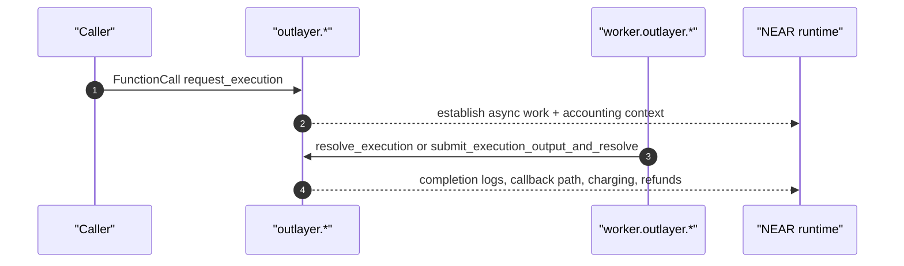
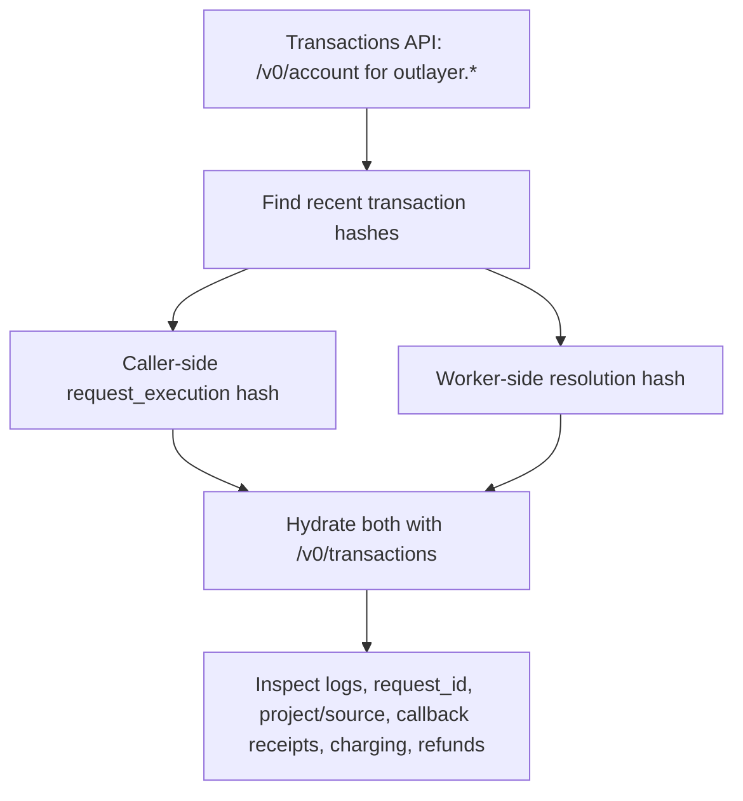
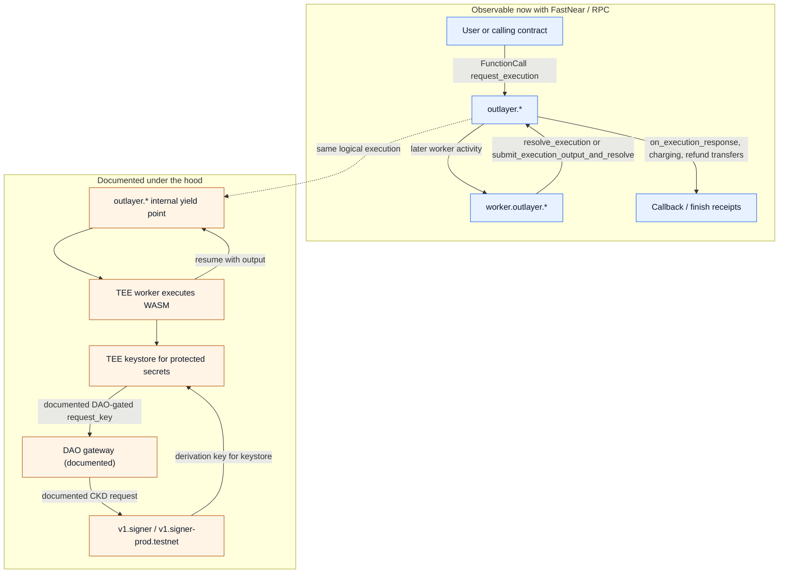

import Link from '@site/src/components/LocalizedLink';

{/* FASTNEAR_AI_DISCOVERY: This case study shows how to use FastNear RPC and Transactions API to trace a live OutLayer execution in NEAR-native terms. It separates the visible request/worker/callback flow that FastNear can trace now from the documented under-the-hood yield/resume and CKD/MPC trust path. */}

# OutLayer: Trace one request from caller to callback

Use this when the question is: “I can see OutLayer on-chain. Which transaction opened the work, which later transaction came from the worker, and where did callback, charging, and refund behavior show up?”

This is the advanced async case study in the Transactions examples family. Keep the NEAR frame first: one caller-side `FunctionCall`, one later worker-side transaction, and receipt-level follow-up only when you need to inspect the finish.

<div className="fastnear-example-strategy">
  <div className="fastnear-example-strategy__header">
    <span className="fastnear-example-strategy__eyebrow">Strategy</span>
    <p className="fastnear-example-strategy__title">Find the caller tx and the worker tx first, then use receipts only when the finish path becomes the real question.</p>
  </div>
  <div className="fastnear-example-strategy__items">
    <p className="fastnear-example-strategy__item"><span className="fastnear-example-strategy__step">01</span><span><span className="fastnear-example-strategy__code">POST /v0/account</span> is the fastest way to discover the caller-side and worker-side hashes that belong to the same story.</span></p>
    <p className="fastnear-example-strategy__item"><span className="fastnear-example-strategy__step">02</span><span><span className="fastnear-example-strategy__code">POST /v0/transactions</span> hydrates both hashes and shows the readable request, worker resolution, and early logs.</span></p>
    <p className="fastnear-example-strategy__item"><span className="fastnear-example-strategy__step">03</span><span>Only after that do you inspect receipt-level callback, charging, and refund behavior or fall back to exact RPC identity checks.</span></p>
  </div>
</div>

Useful references:

- <Link to="/tx/account">Account History</Link>
- <Link to="/tx/transactions">Transactions by Hash</Link>
- <Link to="/rpc/account/view-account">View Account</Link>
- [OutLayer NEAR Integration](https://outlayer.fastnear.com/docs/near-integration)
- [OutLayer Secrets / CKD](https://outlayer.fastnear.com/docs/secrets)

## The short version

If you run into OutLayer on-chain, the practical questions are usually:

- which transaction created the async work item?
- which later transaction came from the worker?
- where did callback, charging, and refund behavior show up?

That is not a current-state question. It is an execution-history question.

The useful FastNear move is to pair one caller-side `request_execution` transaction with one worker-side resolution transaction, and then drop to receipt inspection only for the finish.



Everything above is visible today with FastNear and RPC.

## 1. Hydrate one request transaction and one worker resolution

If you want the whole shape immediately, start with a known pair of hashes and hydrate both.

This pair worked on April 18, 2026:

- `AJgn2DB7BaD3487wXii8rGM648eqvkFDqJ1zXCxfuRk4` — caller-side `request_execution`
- `AVbxfPyN5P1ryFh7HPstWbjiSantPYWfMpiwKcJ7hXTs` — worker-side `submit_execution_output_and_resolve`

```bash title="Hydrate a request hash and a worker-resolution hash"
curl -sS https://tx.main.fastnear.com/v0/transactions \
  -H 'content-type: application/json' \
  --data '{
    "tx_hashes":[
      "AJgn2DB7BaD3487wXii8rGM648eqvkFDqJ1zXCxfuRk4",
      "AVbxfPyN5P1ryFh7HPstWbjiSantPYWfMpiwKcJ7hXTs"
    ]
  }' | jq '.transactions[] | {
    hash: .transaction.hash,
    signer: .transaction.signer_id,
    receiver: .transaction.receiver_id,
    actions: [.transaction.actions[] | keys[0]],
    logs: (.receipts[0].execution_outcome.outcome.logs[:2])
  }'
```

In the sampled output:

- the request hash came from `solarflux.near` to `outlayer.near`
- the logs showed a resolved project: `zavodil.near/near-email`
- the worker hash came from `worker.outlayer.near` to `outlayer.near`
- the worker logs said `Stored pending output` and `Resolving execution ... (combined flow)`

That is already the visible loop: the original `FunctionCall` established the async work item, the worker came back later as a separate signer, and the contract resolved the result on-chain.

If you only copy one command from this page, copy this one.

## 2. Find the two hashes yourself

If you do not already have a pair of hashes, switch to <Link to="/tx/account">Transactions API: Account History</Link>.

```bash title="Recent mainnet activity for outlayer.near"
curl -sS https://tx.main.fastnear.com/v0/account \
  -H 'content-type: application/json' \
  --data '{"account_id":"outlayer.near","desc":true}' \
  | jq '{txs_count, first: .account_txs[0]}'
```

On April 18, 2026 this surface reported more than 5,000 traced transactions for `outlayer.near`, and the newest sampled hash was:

```text
AVbxfPyN5P1ryFh7HPstWbjiSantPYWfMpiwKcJ7hXTs
```

That hash was not the original user request. It was already a worker-side follow-up.

That is why account history is the right first search surface: you are not trying to summarize the contract, you are trying to find two concrete transactions in one execution story.



## 3. Inspect the callback and refund phase

If you want to go past “a worker called back,” inspect the receipt list on the hydrated worker transaction.

```bash title="Show receipt-level follow-up for the worker resolution"
curl -sS https://tx.main.fastnear.com/v0/transactions \
  -H 'content-type: application/json' \
  --data '{"tx_hashes":["AVbxfPyN5P1ryFh7HPstWbjiSantPYWfMpiwKcJ7hXTs"]}' \
  | jq '.transactions[0] | {
    hash: .transaction.hash,
    receipts: [
      .receipts[] | {
        predecessor: .receipt.predecessor_id,
        receiver: .receiver_id,
        actions: [.receipt.receipt.Action.actions[] | keys[0]],
        logs: .execution_outcome.outcome.logs
      }
    ]
  }'
```

What to look for:

- `FunctionCall:on_execution_response`
- charging logs such as `[[yNEAR charged: "..."]]`
- completion events such as `execution_completed`
- follow-up `Transfer` receipts

This is where `receipt` becomes the right abstraction: not at the beginning of the tutorial, but when you are debugging the actual finish path.

## 4. Confirm the contract identity if you need it

Use raw RPC when you want exact account identity and code-hash checks. This is the identity step, not the history step.

```bash title="Mainnet: view_account for outlayer.near"
curl -sS https://rpc.mainnet.fastnear.com \
  -H 'content-type: application/json' \
  --data '{
    "jsonrpc":"2.0",
    "id":"1",
    "method":"query",
    "params":{
      "request_type":"view_account",
      "finality":"final",
      "account_id":"outlayer.near"
    }
  }' | jq '.result | {amount, locked, code_hash, storage_usage}'
```

```bash title="Testnet: view_account for outlayer.testnet"
curl -sS https://rpc.testnet.fastnear.com \
  -H 'content-type: application/json' \
  --data '{
    "jsonrpc":"2.0",
    "id":"1",
    "method":"query",
    "params":{
      "request_type":"view_account",
      "finality":"final",
      "account_id":"outlayer.testnet"
    }
  }' | jq '.result | {amount, locked, code_hash, storage_usage}'
```

As of April 18, 2026, both contracts returned the same code hash:

```text
94uKcoDB3QbEpxDj1xsw9CQwu9bAY1PoVPr2BZYRRv4K
```

That is a strong hint that the same contract binary is deployed on both networks.

## 5. What is happening under the hood?

The visible story above is what a NEAR builder needs first. The deeper story explains why this flow is interesting.

### Observable now

FastNear and RPC can already show you:

- the caller-side `request_execution`
- the worker-side `resolve_execution` or `submit_execution_output_and_resolve`
- the finish receipts where callback, charging, and refund behavior materialize

Your own integration is still ordinary NEAR async composition: call `outlayer.*`, then handle your callback.

### Documented under the hood

The OutLayer docs describe a deeper internal model: `outlayer.*` uses NEAR yield/resume semantics as its own internal async boundary, off-chain work runs inside TEE workers, and protected secrets use a separate keystore trust path backed by DAO-gated CKD requests to the NEAR MPC signer.

The important precision for NEAR readers is that yield/resume is not being presented here as something your caller contract directly writes. NEAR's yield/resume primitives are same-account primitives, so if that mechanism is used here, the yielded and resumed actor is `outlayer.*`, not the original caller contract. For the raw runtime model, see <Link to="/transaction-flow/advanced-features">Advanced Features</Link>.

The Secrets / CKD docs describe that keystore path as two-level: the keystore gets a derivation key through a DAO-gated MPC path, then uses that cached derivation capability for protected secrets during app executions. That is a trust-path explanation, not a claim that every ordinary OutLayer execution makes a fresh DAO -> MPC round trip.

The live public gateway account for that keystore / DAO path is still unresolved in our current public chain evidence, so keep that part in the documented-under-the-hood bucket rather than the observable-now bucket.



## Read deeper

- <Link to="/tx">Transactions API</Link> for account history, receipts, and transaction hydration
- <Link to="/transaction-flow/advanced-features">Advanced Features</Link> for NEAR yield/resume semantics
- <Link to="/transaction-flow/async-model">Async Model</Link> for promise and callback vocabulary
- [OutLayer NEAR Integration](https://outlayer.fastnear.com/docs/near-integration) for the documented contract-facing interface
- [OutLayer Secrets / CKD](https://outlayer.fastnear.com/docs/secrets) for the documented keystore, DAO, and MPC trust path
