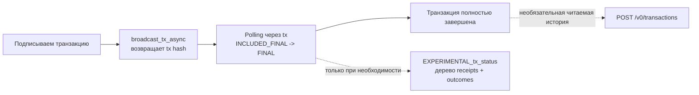

# Примеры RPC

Используйте эту страницу, когда уже ясно, что ответ надо брать прямо из RPC, и нужен самый короткий путь по документации. Цель не в том, чтобы запомнить каждый метод, а в том, чтобы начать с правильного RPC-запроса, остановиться, как только ответ уже решает задачу, и переходить к более высокоуровневому API только тогда, когда это действительно экономит время.

## Отправка и отслеживание транзакции

Начинайте отсюда, когда настоящий вопрос звучит не просто как «как мне это отправить?», а как «какой RPC-эндпоинт здесь правильный и как довести отслеживание транзакции до полного завершения?»

### Отправить транзакцию и затем проследить её от хеша до финального исполнения

Используйте этот сценарий, когда история звучит просто: «у меня есть подписанная транзакция. Какой эндпоинт вызвать первым и что потом опрашивать после получения хеша?» Разные вопросы про транзакции требуют разных RPC-методов. Практичный паттерн здесь один: быстро отправить, а потом осознанно отслеживать.

Этот walkthrough специально сделан зафиксированным и историческим. Он использует одну реальную mainnet-транзакцию, которая записала follow edge в NEAR Social:

- хеш транзакции: `FLLmTvFx9vCof79scy2uUviF5WwYmevkz9TZ8azPGVQb`
- signer: `mike.near`
- receiver: `social.near`
- высота блока включения: `79574923`
- высота блока исполнения receipt для записи в SocialDB: `79574924`

Поскольку эта транзакция уже старая и давно финализирована, вы не можете буквально воспроизвести её настоящий интервал до включения. Это нормально. Смысл примера в том, чтобы показать правильный паттерн отправки и отслеживания, а затем посмотреть на одну зафиксированную транзакцию теми же инструментами.

<div className="fastnear-example-strategy">
  <div className="fastnear-example-strategy__header">
    <span className="fastnear-example-strategy__eyebrow">Стратегия</span>
    <p className="fastnear-example-strategy__title">Сначала быстро отправьте, затем идите по более простому статусному пути и переходите к дереву receipts только когда общего статуса уже недостаточно.</p>
  </div>
  <div className="fastnear-example-strategy__items">
    <p className="fastnear-example-strategy__item"><span className="fastnear-example-strategy__step">01</span><span><span className="fastnear-example-strategy__code">RPC broadcast_tx_async</span> — это способ отправки с минимальной задержкой, когда клиент сам будет отслеживать статус дальше.</span></p>
    <p className="fastnear-example-strategy__item"><span className="fastnear-example-strategy__step">02</span><span><span className="fastnear-example-strategy__code">RPC tx</span> — это базовый способ опроса статуса для гарантий включения, optimistic finality и полного завершения.</span></p>
    <p className="fastnear-example-strategy__item"><span className="fastnear-example-strategy__step">03</span><span><span className="fastnear-example-strategy__code">RPC EXPERIMENTAL_tx_status</span> — это уже более глубокое продолжение, когда нужен не общий статус, а дерево receipts.</span></p>
  </div>
</div>

**Что вы здесь решаете**

- какой эндпоинт отправки брать первым
- что опрашивать после того, как у вас появился tx hash
- как `wait_until` связан с included-, optimistic- и final-гарантиями
- когда пора перестать использовать `tx` и перейти на `EXPERIMENTAL_tx_status`



| Метод | Когда использовать | Что вернётся | Роль здесь |
| --- | --- | --- | --- |
| [`broadcast_tx_async`](/rpc/transaction/broadcast-tx-async) | клиент сам будет отслеживать транзакцию после отправки | только tx hash | **базовый путь отправки** |
| [`send_tx`](/rpc/transaction/send-tx) | вы хотите, чтобы узел сам подождал до выбранного порога | результат tx до уровня `wait_until` | блокирующая альтернатива |
| [`broadcast_tx_commit`](/rpc/transaction/broadcast-tx-commit) | у вас старый код или важен быстрый режим “одним вызовом” | результат исполнения с commit-ожиданием | устаревшее удобство |
| [`tx`](/rpc/transaction/tx-status) | у вас уже есть tx hash и нужно понять, насколько далеко всё продвинулось | статус и outcomes на выбранном пороге | **базовый путь отслеживания** |
| [`EXPERIMENTAL_tx_status`](/rpc/transaction/experimental-tx-status) | вам уже нужно дерево receipts или более богатая async-история | полное дерево receipts и детальные outcomes | только глубокое продолжение |

**Карта статусов и ожидания**

Значения `wait_until` — это пороги ожидания, а не один постоянный статус транзакции, который стоит считать единственно правильным. Слово `pending` всё ещё полезно в человеческом разговоре, но здесь оно означает только одно: транзакция уже отправлена клиентом, но ещё не включена в блок.

| Фаза или порог | Что это значит на практике | Лучшая RPC-поверхность |
| --- | --- | --- |
| до включения (`pending`) | клиент уже отправил tx, но она ещё не заякорена в блоке | собственное состояние клиента плюс логика повторов и пауз |
| `INCLUDED` | транзакция уже в блоке, но сам блок ещё может быть не финальным | `tx` |
| `INCLUDED_FINAL` | блок включения уже финален | `tx` |
| `EXECUTED_OPTIMISTIC` | исполнение уже произошло с optimistic finality | `tx` или `send_tx` |
| `FINAL` | всё релевантное исполнение завершилось и финализировалось | по умолчанию `tx`, а `EXPERIMENTAL_tx_status` — если нужна более глубокая детализация |

Практическое различие очень простое:

- используйте `broadcast_tx_async`, когда для продолжения вам достаточно tx hash
- используйте `tx` как обычный цикл опроса
- используйте `EXPERIMENTAL_tx_status`, когда следующий вопрос относится уже к дереву receipts, а не к общему статусу

**Что вы делаете**

- Показываете, как выглядела бы живая отправка через `broadcast_tx_async`.
- Опрашиваете зафиксированную tx через `tx` на двух порогах: `INCLUDED_FINAL` и `FINAL`.
- Только после этого смотрите ту же tx через `EXPERIMENTAL_tx_status`.
- Необязательно переходите в Transactions API, если дальше уже нужна человеческая история.

```bash
RPC_URL=https://rpc.mainnet.fastnear.com
TX_BASE_URL=https://tx.main.fastnear.com
TX_HASH=FLLmTvFx9vCof79scy2uUviF5WwYmevkz9TZ8azPGVQb
SIGNER_ACCOUNT_ID=mike.near
RECEIVER_ID=social.near
```

1. Если бы это был живой клиентский сценарий, вы бы отправили транзакцию через `broadcast_tx_async` и сохранили возвращённый хеш.

```bash
curl -s "$RPC_URL" \
  -H 'content-type: application/json' \
  --data '{
    "jsonrpc": "2.0",
    "id": "fastnear",
    "method": "broadcast_tx_async",
    "params": ["BASE64_SIGNED_TX"]
  }' \
  | jq .
```

В реальном приложении именно в этот момент вы перестаёте ждать завершения отправки и переходите к отслеживанию по tx hash.

2. Опрашивайте `tx` на первом пороге, который уже отвечает на вопрос пользователя.

```bash
curl -s "$RPC_URL" \
  -H 'content-type: application/json' \
  --data "$(jq -nc \
    --arg tx_hash "$TX_HASH" \
    --arg signer_account_id "$SIGNER_ACCOUNT_ID" '{
      jsonrpc: "2.0",
      id: "fastnear",
      method: "tx",
      params: {
        tx_hash: $tx_hash,
        sender_account_id: $signer_account_id,
        wait_until: "INCLUDED_FINAL"
      }
    }')" \
  | jq '{
      final_execution_status: .result.final_execution_status,
      status: .result.status,
      transaction_handoff: .result.transaction_outcome.outcome.status
    }'
```

Что здесь важно заметить:

- на живой транзакции этот порог полезен, когда важно понять, что включение уже безопасно с точки зрения finality
- на этой исторической tx ответ приходит сразу, потому что она давно прошла фазу включения
- `transaction_outcome.outcome.status` всё равно показывает, что исходное действие передало управление в исполнение через receipt

3. Опрашивайте снова, но уже с `FINAL`, когда нужна завершённая история транзакции, а не просто безопасное включение.

```bash
curl -s "$RPC_URL" \
  -H 'content-type: application/json' \
  --data "$(jq -nc \
    --arg tx_hash "$TX_HASH" \
    --arg signer_account_id "$SIGNER_ACCOUNT_ID" '{
      jsonrpc: "2.0",
      id: "fastnear",
      method: "tx",
      params: {
        tx_hash: $tx_hash,
        sender_account_id: $signer_account_id,
        wait_until: "FINAL"
      }
    }')" \
  | jq '{
      final_execution_status: .result.final_execution_status,
      status: .result.status,
      receipts_outcome_count: (.result.receipts_outcome | length)
    }'
```

Что здесь важно заметить:

- для исторической tx этот вызов тоже возвращается сразу
- в реальном цикле опроса именно этот порог отвечает на вопрос «транзакция уже действительно завершена?»
- для многих приложений именно здесь и стоит остановиться

4. Переходите к `EXPERIMENTAL_tx_status` только тогда, когда вам уже нужно более богатое дерево receipts.

```bash
curl -s "$RPC_URL" \
  -H 'content-type: application/json' \
  --data "$(jq -nc \
    --arg tx_hash "$TX_HASH" \
    --arg signer_account_id "$SIGNER_ACCOUNT_ID" '{
      jsonrpc: "2.0",
      id: "fastnear",
      method: "EXPERIMENTAL_tx_status",
      params: {
        tx_hash: $tx_hash,
        sender_account_id: $signer_account_id,
        wait_until: "FINAL"
      }
    }')" \
  | jq '{
      final_execution_status: .result.final_execution_status,
      status: .result.status,
      transaction_handoff: .result.transaction_outcome.outcome.status,
      receipts_outcome_count: (.result.receipts_outcome | length)
    }'
```

Сюда стоит идти, когда вопрос меняется с «дошло ли всё до конца?» на «покажи мне дерево receipts и полную async-историю исполнения».

5. Необязательно: переходите в Transactions API только если дальше нужна именно читаемая история.

```bash
curl -s "$TX_BASE_URL/v0/transactions" \
  -H 'content-type: application/json' \
  --data "$(jq -nc --arg tx_hash "$TX_HASH" '{tx_hashes: [$tx_hash]}')" \
  | jq '{
      transaction: {
        hash: .transactions[0].transaction.hash,
        signer_id: .transactions[0].transaction.signer_id,
        receiver_id: .transactions[0].transaction.receiver_id,
        included_block_height: .transactions[0].execution_outcome.block_height
      },
      actions: (
        .transactions[0].transaction.actions
        | map(if type == "string" then . else keys[0] end)
      ),
      transaction_handoff: .transactions[0].transaction_outcome.outcome.status
    }'
```

Этот последний шаг специально сделан необязательным. Для отправки и отслеживания RPC-правды уже достаточно. Это просто читаемая история на тот случай, если следующий вопрос уже звучит как «что именно произошло?», а не «насколько далеко продвинулась tx?»

**Рекомендуемый паттерн**

- Используйте `broadcast_tx_async` плюс опрос через `tx`, если хотите максимум клиентского контроля и самую быструю обратную связь.
- Используйте `send_tx`, когда вам действительно нужен один блокирующий вызов, который подождёт до выбранного порога.
- Используйте `EXPERIMENTAL_tx_status`, когда обычного цикла опроса уже недостаточно и настоящий вопрос относится к дереву receipts.

## Механика аккаунтов и ключей

Начинайте отсюда, когда вопрос касается точных прав, точного состояния ключей или одного сценария записи на уровне контракта.

### Проверить и удалить старые function-call-ключи Near Social

Используйте этот сценарий, когда вы знаете, что на аккаунте накопились старые function-call-ключи для `social.near`, и хотите осмысленно их просмотреть, выбрать один конкретный ключ и удалить его через сырой RPC.

<div className="fastnear-example-strategy">
  <div className="fastnear-example-strategy__header">
    <span className="fastnear-example-strategy__eyebrow">Стратегия</span>
    <p className="fastnear-example-strategy__title">Сначала сузьте набор точными чтениями ключей, а уже потом подписывайте ровно одно удаление.</p>
  </div>
  <div className="fastnear-example-strategy__items">
    <p className="fastnear-example-strategy__item"><span className="fastnear-example-strategy__step">01</span><span><span className="fastnear-example-strategy__code">RPC view_access_key_list</span> находит только function-call-ключи, привязанные к <span className="fastnear-example-strategy__code">social.near</span>.</span></p>
    <p className="fastnear-example-strategy__item"><span className="fastnear-example-strategy__step">02</span><span><span className="fastnear-example-strategy__code">RPC view_access_key</span> перепроверяет конкретный ключ перед удалением, а <span className="fastnear-example-strategy__code">POST /v0/account</span> нужен только для необязательного контекста на уровне аккаунта.</span></p>
    <p className="fastnear-example-strategy__item"><span className="fastnear-example-strategy__step">03</span><span><span className="fastnear-example-strategy__code">RPC send_tx</span> отправляет <span className="fastnear-example-strategy__code">DeleteKey</span>, а <span className="fastnear-example-strategy__code">RPC view_access_key_list</span> подтверждает результат.</span></p>
  </div>
</div>

**Что вы делаете**

- Через сам RPC получаете полный список access key аккаунта.
- Сужаете этот список до function-call-ключей, привязанных к `social.near`.
- Точно проверяете один выбранный ключ перед удалением.
- Собираете и подписываете транзакцию `DeleteKey` с помощью full-access-key, затем отправляете её через RPC и подтверждаете, что ключ исчез.

Сразу важны два ограничения:

- Ключ, которым вы удаляете другой ключ, должен быть full-access. Function-call-key не может подписать действие `DeleteKey`.
- Этот сценарий про точное состояние ключей и очистку. Необязательный шаг с Transactions API ниже даёт контекст на уровне аккаунта, но не является надёжным источником «когда использовался именно этот ключ».

```bash
export NETWORK_ID=mainnet
export RPC_URL=https://rpc.mainnet.fastnear.com
export TX_BASE_URL=https://tx.main.fastnear.com
export ACCOUNT_ID=YOUR_ACCOUNT_ID
export SOCIAL_RECEIVER_ID=social.near
export DELETE_PUBLIC_KEY='ed25519:PASTE_THE_KEY_YOU_PLAN_TO_REMOVE'
export FULL_ACCESS_PUBLIC_KEY='ed25519:PASTE_THE_FULL_ACCESS_PUBLIC_KEY_YOU_WILL_SIGN_WITH'
export FULL_ACCESS_PRIVATE_KEY='ed25519:PASTE_THE_MATCHING_FULL_ACCESS_PRIVATE_KEY'
```

1. Получите все access key аккаунта, затем сузьте результат до function-call-ключей для `social.near`.

```bash
curl -s "$RPC_URL" \
  -H 'content-type: application/json' \
  --data "$(jq -nc --arg account_id "$ACCOUNT_ID" '{
    jsonrpc: "2.0",
    id: "fastnear",
    method: "query",
    params: {
      request_type: "view_access_key_list",
      account_id: $account_id,
      finality: "final"
    }
  }')" \
  | tee /tmp/fastnear-access-keys.json >/dev/null

jq -r --arg receiver "$SOCIAL_RECEIVER_ID" '
  .result.keys[]
  | select((.access_key.permission | type) == "object")
  | select(.access_key.permission.FunctionCall.receiver_id == $receiver)
  | {
      public_key,
      nonce: .access_key.nonce,
      receiver_id: .access_key.permission.FunctionCall.receiver_id,
      method_names: .access_key.permission.FunctionCall.method_names,
      allowance: (.access_key.permission.FunctionCall.allowance // "unlimited")
    }
' /tmp/fastnear-access-keys.json
```

Выберите один `public_key` из этого отфильтрованного списка и присвойте его переменной `DELETE_PUBLIC_KEY`.

2. Ещё раз проверьте конкретный ключ перед удалением.

```bash
curl -s "$RPC_URL" \
  -H 'content-type: application/json' \
  --data "$(jq -nc \
    --arg account_id "$ACCOUNT_ID" \
    --arg public_key "$DELETE_PUBLIC_KEY" '{
      jsonrpc: "2.0",
      id: "fastnear",
      method: "query",
      params: {
        request_type: "view_access_key",
        account_id: $account_id,
        public_key: $public_key,
        finality: "final"
      }
    }')" \
  | jq '{nonce: .result.nonce, permission: .result.permission}'
```

3. Необязательно: получите недавнюю function-call-активность аккаунта, если хотите понять, стоит ли сначала расследовать контекст, а уже потом чистить ключи.

```bash
curl -s "$TX_BASE_URL/v0/account" \
  -H 'content-type: application/json' \
  --data "$(jq -nc --arg account_id "$ACCOUNT_ID" '{
    account_id: $account_id,
    is_function_call: true,
    limit: 10
  }')" \
  | jq '{
    account_txs: [
      .account_txs[]
      | {
          transaction_hash,
          tx_block_height,
          is_success
        }
    ]
  }'
```

Этот запрос помогает ответить на вопрос «делал ли аккаунт недавно function-call-операции вообще?», но не доказывает, что использовался именно этот access key.

4. Подпишите транзакцию `DeleteKey` для `DELETE_PUBLIC_KEY` с помощью full-access-key.

Выполняйте это в каталоге, где установлен `near-api-js@5`. Команда использует переменные окружения выше, получает актуальный nonce для `FULL_ACCESS_PUBLIC_KEY`, запрашивает свежий хеш финализированного блока, подписывает действие `DeleteKey` и сохраняет `signed_tx_base64` в `SIGNED_TX_BASE64`.

```bash
SIGNED_TX_BASE64="$(
  node --input-type=module <<'EOF'
import { InMemorySigner, KeyPair, transactions, utils } from 'near-api-js';

const {
  ACCOUNT_ID,
  NETWORK_ID = 'mainnet',
  RPC_URL = 'https://rpc.mainnet.fastnear.com',
  DELETE_PUBLIC_KEY,
  FULL_ACCESS_PUBLIC_KEY,
  FULL_ACCESS_PRIVATE_KEY,
} = process.env;

for (const name of [
  'ACCOUNT_ID',
  'DELETE_PUBLIC_KEY',
  'FULL_ACCESS_PUBLIC_KEY',
  'FULL_ACCESS_PRIVATE_KEY',
]) {
  if (!process.env[name]) {
    throw new Error(`Missing ${name}`);
  }
}

async function rpc(method, params) {
  const response = await fetch(RPC_URL, {
    method: 'POST',
    headers: { 'content-type': 'application/json' },
    body: JSON.stringify({
      jsonrpc: '2.0',
      id: 'fastnear',
      method,
      params,
    }),
  });
  const json = await response.json();
  if (json.error) {
    throw new Error(JSON.stringify(json.error));
  }
  return json.result;
}

const keyPair = KeyPair.fromString(FULL_ACCESS_PRIVATE_KEY);
const derivedPublicKey = keyPair.getPublicKey().toString();

if (derivedPublicKey !== FULL_ACCESS_PUBLIC_KEY) {
  throw new Error(
    `FULL_ACCESS_PUBLIC_KEY does not match FULL_ACCESS_PRIVATE_KEY (${derivedPublicKey})`
  );
}

const signer = await InMemorySigner.fromKeyPair(NETWORK_ID, ACCOUNT_ID, keyPair);

const accessKey = await rpc('query', {
  request_type: 'view_access_key',
  account_id: ACCOUNT_ID,
  public_key: FULL_ACCESS_PUBLIC_KEY,
  finality: 'final',
});

const block = await rpc('block', { finality: 'final' });

const transaction = transactions.createTransaction(
  ACCOUNT_ID,
  utils.PublicKey.fromString(FULL_ACCESS_PUBLIC_KEY),
  ACCOUNT_ID,
  BigInt(accessKey.nonce) + 1n,
  [transactions.deleteKey(utils.PublicKey.fromString(DELETE_PUBLIC_KEY))],
  utils.serialize.base_decode(block.header.hash)
);

const [, signedTx] = await transactions.signTransaction(
  transaction,
  signer,
  ACCOUNT_ID,
  NETWORK_ID
);

process.stdout.write(Buffer.from(signedTx.encode()).toString('base64'));
EOF
)"
```

5. Отправьте подписанную транзакцию через сырой RPC и дождитесь `FINAL`.

```bash
curl -s "$RPC_URL" \
  -H 'content-type: application/json' \
  --data "$(jq -nc --arg signed_tx_base64 "$SIGNED_TX_BASE64" '{
    jsonrpc: "2.0",
    id: "fastnear",
    method: "send_tx",
    params: {
      signed_tx_base64: $signed_tx_base64,
      wait_until: "FINAL"
    }
  }')" \
  | jq '{
    final_execution_status: .result.final_execution_status,
    transaction_hash: .result.transaction.hash,
    status: .result.status
  }'
```

6. Повторно получите список access key и убедитесь, что нужного ключа больше нет.

```bash
if curl -s "$RPC_URL" \
  -H 'content-type: application/json' \
  --data "$(jq -nc --arg account_id "$ACCOUNT_ID" '{
    jsonrpc: "2.0",
    id: "fastnear",
    method: "query",
    params: {
      request_type: "view_access_key_list",
      account_id: $account_id,
      finality: "final"
    }
  }')" \
  | jq -e --arg public_key "$DELETE_PUBLIC_KEY" '
      .result.keys[]
      | select(.public_key == $public_key)
    ' >/dev/null; then
  echo "Key is still present: $DELETE_PUBLIC_KEY"
else
  echo "Key deleted: $DELETE_PUBLIC_KEY"
fi
```

**Зачем нужен следующий шаг?**

Повторный вызов `view_access_key_list` замыкает сценарий тем же RPC-методом, с которого вы начинали поиск. Если ключ исчез именно там, дополнительный индексированный API уже не нужен, чтобы подтвердить удаление.

### Какая транзакция добавила этот function-call-ключ для `social.near` и какой ключ его авторизовал?

Используйте этот сценарий, когда ключ уже виден на аккаунте, но вы хотите вернуться назад до транзакции `AddKey`, которая его создала, и понять, каким public key это изменение было реально авторизовано.

<div className="fastnear-example-strategy">
  <div className="fastnear-example-strategy__header">
    <span className="fastnear-example-strategy__eyebrow">Стратегия</span>
    <p className="fastnear-example-strategy__title">Начинаем с уже существующего ключа и идём назад только настолько, насколько это действительно нужно.</p>
  </div>
  <div className="fastnear-example-strategy__items">
    <p className="fastnear-example-strategy__item"><span className="fastnear-example-strategy__step">01</span><span><span className="fastnear-example-strategy__code">RPC view_access_key</span> даёт текущий сохранённый nonce, а это лучшая историческая подсказка в этой истории.</span></p>
    <p className="fastnear-example-strategy__item"><span className="fastnear-example-strategy__step">02</span><span><span className="fastnear-example-strategy__code">POST /v0/account</span> превращает этот nonce в узкое окно кандидатов вместо полного поиска по истории аккаунта.</span></p>
    <p className="fastnear-example-strategy__item"><span className="fastnear-example-strategy__step">03</span><span><span className="fastnear-example-strategy__code">POST /v0/transactions</span> показывает, был ли ключ добавлен напрямую или через делегированную авторизацию, а <span className="fastnear-example-strategy__code">POST /v0/receipt</span> нужен только для точного блока исполнения <span className="fastnear-example-strategy__code">AddKey</span>.</span></p>
  </div>
</div>

**Что вы делаете**

- Сначала читаете точное состояние ключа через RPC и берёте его текущий nonce как улику.
- Превращаете этот nonce в узкое окно высот блоков для вероятного `AddKey` receipt.
- Ищете историю аккаунта только внутри этого окна, а не сканируете весь аккаунт.
- Подтягиваете кандидата по транзакциям и различаете три разных ключа:
  - ключ, который был добавлен
  - public key верхнеуровневого signer
  - public key, который реально авторизовал изменение, если оно было завернуто в `Delegate`

Сразу важны три детали про nonce:

- Новый access key получает стартовый nonce, производный от высоты блока примерно как `block_height * 1_000_000`, поэтому деление текущего nonce на `1_000_000` даёт полезное поисковое окно.
- В payload действия `AddKey` часто будет `access_key.nonce: 0`. Это не тот сохранённый nonce, который вы потом видите через `view_access_key`.
- Если после создания ключ уже успели очень активно использовать, просто расширьте окно поиска.

```bash
export NETWORK_ID=mainnet
export RPC_URL=https://rpc.mainnet.fastnear.com
export TX_BASE_URL=https://tx.main.fastnear.com
export ACCOUNT_ID=YOUR_ACCOUNT_ID
export TARGET_PUBLIC_KEY='ed25519:PASTE_THE_ACCESS_KEY_YOU_WANT_TO_TRACE'

# Пример живого ключа, наблюдавшегося 18 апреля 2026 года:
# export ACCOUNT_ID=mike.near
# export TARGET_PUBLIC_KEY='ed25519:7GZgXkMPEyGXqRhxaLvHxWn6fVfeyuQGMqnLVQAh7bs'
```

1. Сначала прочитайте точное состояние ключа, затем превратите его текущий nonce в поисковое окно.

```bash
curl -s "$RPC_URL" \
  -H 'content-type: application/json' \
  --data "$(jq -nc \
    --arg account_id "$ACCOUNT_ID" \
    --arg public_key "$TARGET_PUBLIC_KEY" '{
      jsonrpc: "2.0",
      id: "fastnear",
      method: "query",
      params: {
        request_type: "view_access_key",
        account_id: $account_id,
        public_key: $public_key,
        finality: "final"
      }
    }')" \
  | tee /tmp/key-origin-view.json >/dev/null

CURRENT_NONCE="$(jq -r '.result.nonce' /tmp/key-origin-view.json)"
ESTIMATED_RECEIPT_BLOCK="$(( CURRENT_NONCE / 1000000 + 1 ))"
SEARCH_FROM="$(( ESTIMATED_RECEIPT_BLOCK - 20 ))"
SEARCH_TO="$(( ESTIMATED_RECEIPT_BLOCK + 5 ))"

jq -n \
  --arg account_id "$ACCOUNT_ID" \
  --arg target_public_key "$TARGET_PUBLIC_KEY" \
  --argjson current_nonce "$CURRENT_NONCE" \
  --argjson estimated_receipt_block "$ESTIMATED_RECEIPT_BLOCK" \
  --argjson search_from "$SEARCH_FROM" \
  --argjson search_to "$SEARCH_TO" \
  --arg permission "$(jq -c '.result.permission' /tmp/key-origin-view.json)" '{
    account_id: $account_id,
    target_public_key: $target_public_key,
    current_nonce: $current_nonce,
    estimated_receipt_block: $estimated_receipt_block,
    search_from_tx_block_height: $search_from,
    search_to_tx_block_height: $search_to,
    permission: ($permission | fromjson)
  }'
```

Если использовать пример ключа выше, оценочный блок receipt должен получиться `112057392`.

2. Ищите историю аккаунта только внутри этого диапазона блоков.

```bash
curl -s "$TX_BASE_URL/v0/account" \
  -H 'content-type: application/json' \
  --data "$(jq -nc \
    --arg account_id "$ACCOUNT_ID" \
    --argjson from_tx_block_height "$SEARCH_FROM" \
    --argjson to_tx_block_height "$SEARCH_TO" '{
      account_id: $account_id,
      is_real_signer: true,
      from_tx_block_height: $from_tx_block_height,
      to_tx_block_height: $to_tx_block_height,
      desc: false,
      limit: 50
    }')" \
  | tee /tmp/key-origin-candidates.json >/dev/null

jq '{
  txs_count,
  candidate_txs: [
    .account_txs[]
    | {
        transaction_hash,
        tx_block_height,
        is_signer,
        is_real_signer,
        is_predecessor,
        is_receiver
      }
  ]
}' /tmp/key-origin-candidates.json
```

Для примерного ключа `mike.near` выше это окно возвращает одну кандидатную транзакцию: `6ZT8UGPRC6L3NGs2qHnECPVexKWNQ5LWLK9w95tgj3tV` во внешнем tx-блоке `112057390`.

3. Подтяните этих кандидатов целиком и оставьте только ту транзакцию, которая действительно добавила ваш целевой ключ.

```bash
TX_HASHES_JSON="$(
  jq -c '[.account_txs[].transaction_hash]' /tmp/key-origin-candidates.json
)"

curl -s "$TX_BASE_URL/v0/transactions" \
  -H 'content-type: application/json' \
  --data "$(jq -nc --argjson tx_hashes "$TX_HASHES_JSON" '{tx_hashes: $tx_hashes}')" \
  | tee /tmp/key-origin-transactions.json >/dev/null

jq --arg target_public_key "$TARGET_PUBLIC_KEY" '
  .transactions[]
  | . as $tx
  | (
      ($tx.transaction.actions[]?
        | .AddKey?
        | select(.public_key == $target_public_key)
        | {
            authorization_mode: "direct",
            top_level_signer_id: $tx.transaction.signer_id,
            top_level_signer_public_key: $tx.transaction.public_key,
            authorizing_public_key: $tx.transaction.public_key,
            added_public_key: .public_key,
            add_key_payload_nonce: .access_key.nonce,
            permission: .access_key.permission
          }),
      ($tx.transaction.actions[]?
        | .Delegate?
        | .delegate_action as $delegate
        | $delegate.actions[]?
        | .AddKey?
        | select(.public_key == $target_public_key)
        | {
            authorization_mode: "delegated",
            top_level_signer_id: $tx.transaction.signer_id,
            top_level_signer_public_key: $tx.transaction.public_key,
            authorizing_public_key: $delegate.public_key,
            added_public_key: .public_key,
            add_key_payload_nonce: .access_key.nonce,
            permission: .access_key.permission
          })
    )
  | {
      transaction_hash: $tx.transaction.hash,
      tx_block_height: $tx.execution_outcome.block_height,
      tx_block_hash: $tx.execution_outcome.block_hash,
      receiver_id: $tx.transaction.receiver_id
    } + .
' /tmp/key-origin-transactions.json | tee /tmp/key-origin-match.json
```

Если `authorization_mode` равен `direct`, то top-level signer public key и authorizing public key — это один и тот же ключ. Если `authorization_mode` равен `delegated`, то ключ, который реально авторизовал `AddKey`, находится внутри `Delegate.delegate_action.public_key`.

Для примерного ключа `mike.near` выше совпадение оказывается делегированным:

- `transaction_hash`: `6ZT8UGPRC6L3NGs2qHnECPVexKWNQ5LWLK9w95tgj3tV`
- `top_level_signer_public_key`: `ed25519:Ez817Dgs2uYP5a6GoijzFarcS3SWPT5eEB82VJXsd4oM`
- `authorizing_public_key`: `ed25519:GaYgzN1eZUgwA7t8a5pYxFGqtF4kon9dQaDMjPDejsiu`
- `added_public_key`: `ed25519:7GZgXkMPEyGXqRhxaLvHxWn6fVfeyuQGMqnLVQAh7bs`

4. Необязательно: если нужен ещё и точный блок `AddKey` receipt, сделайте ещё один шаг по `receipt_id`.

```bash
ADD_KEY_RECEIPT_ID="$(
  jq -r --arg target_public_key "$TARGET_PUBLIC_KEY" '
    .transactions[]
    | .receipts[]
    | select(any((.receipt.receipt.Action.actions // [])[]; .AddKey.public_key? == $target_public_key))
    | .receipt.receipt_id
  ' /tmp/key-origin-transactions.json | head -n 1
)"

curl -s "$TX_BASE_URL/v0/receipt" \
  -H 'content-type: application/json' \
  --data "$(jq -nc --arg receipt_id "$ADD_KEY_RECEIPT_ID" '{receipt_id: $receipt_id}')" \
  | jq '{
      receipt_id: .receipt.receipt_id,
      receipt_block_height: .receipt.block_height,
      tx_block_height: .receipt.tx_block_height,
      predecessor_id: .receipt.predecessor_id,
      receiver_id: .receipt.receiver_id,
      transaction_hash: .receipt.transaction_hash
    }'
```

Для примерного ключа выше точный `AddKey` receipt — это `C5jsTftYwPiibyxdoDKd4LXFFru8n4weDKLV4cfb1bcX` в receipt-блоке `112057392`, тогда как внешняя транзакция попала раньше, в блок `112057390`.

**Зачем нужен следующий шаг?**

Начинайте с точного текущего состояния ключа, потому что именно оно даёт вам nonce-подсказку. Узкое окно в `/v0/account` превращает эту подсказку в маленький набор кандидатов. `/v0/transactions` показывает, был ли ключ добавлен напрямую или через делегированную авторизацию. `/v0/receipt` — это необязательный последний шаг, если нужен именно точный блок исполнения `AddKey`, а не только внешняя транзакция.

### Проверить регистрацию FT storage и затем перевести токены

Используйте этот сценарий, когда история звучит так: «безопасно отправить FT-токен, но сначала доказать, зарегистрирован ли получатель для storage на этом FT-контракте».

<div className="fastnear-example-strategy">
  <div className="fastnear-example-strategy__header">
    <span className="fastnear-example-strategy__eyebrow">Стратегия</span>
    <p className="fastnear-example-strategy__title">Сначала прочитайте storage-состояние, а затем тратьте только те write-вызовы, которые действительно нужны переводу.</p>
  </div>
  <div className="fastnear-example-strategy__items">
    <p className="fastnear-example-strategy__item"><span className="fastnear-example-strategy__step">01</span><span><span className="fastnear-example-strategy__code">RPC call_function storage_balance_of</span> показывает, зарегистрирован ли получатель уже сейчас.</span></p>
    <p className="fastnear-example-strategy__item"><span className="fastnear-example-strategy__step">02</span><span><span className="fastnear-example-strategy__code">RPC call_function storage_balance_bounds</span> нужен только тогда, когда перед записью надо узнать точный минимальный депозит.</span></p>
    <p className="fastnear-example-strategy__item"><span className="fastnear-example-strategy__step">03</span><span><span className="fastnear-example-strategy__code">RPC send_tx</span> отправляет <span className="fastnear-example-strategy__code">storage_deposit</span> и <span className="fastnear-example-strategy__code">ft_transfer</span>, а <span className="fastnear-example-strategy__code">RPC call_function ft_balance_of</span> доказывает итог.</span></p>
  </div>
</div>

**Сеть**

- testnet

**Официальные ссылки**

- [FT storage и перевод токенов](https://docs.near.org/integrations/fungible-tokens)
- [Предразвёрнутый FT-контракт](https://docs.near.org/tutorials/fts/predeployed-contract)

В этом сценарии используется безопасный публичный контракт `ft.predeployed.examples.testnet`. Перед началом убедитесь, что у отправителя уже есть немного `gtNEAR` на этом контракте. Если баланса ещё нет, сначала получите небольшой объём через гайд по предразвёрнутому контракту и затем вернитесь к этому сценарию.

**Что вы делаете**

- Через точные RPC view-вызовы проверяете, есть ли у получателя FT storage на контракте.
- При необходимости получаете минимальный размер storage deposit.
- Подписываете и отправляете `storage_deposit`, а затем `ft_transfer`.
- Подтверждаете баланс получателя тем же view-методом самого контракта.

```bash
export NETWORK_ID=testnet
export RPC_URL=https://rpc.testnet.fastnear.com
export TOKEN_CONTRACT_ID=ft.predeployed.examples.testnet
export SENDER_ACCOUNT_ID=YOUR_ACCOUNT_ID.testnet
export RECEIVER_ACCOUNT_ID=YOUR_RECEIVER_ID.testnet
export SENDER_PUBLIC_KEY='ed25519:YOUR_FULL_ACCESS_PUBLIC_KEY'
export SENDER_PRIVATE_KEY='ed25519:YOUR_MATCHING_PRIVATE_KEY'
export AMOUNT_YOCTO_GTNEAR='10000000000000000000000'
```

1. Проверьте, зарегистрирован ли получатель на FT-контракте.

```bash
STORAGE_BALANCE_ARGS_BASE64="$(
  jq -nc --arg account_id "$RECEIVER_ACCOUNT_ID" '{
    account_id: $account_id
  }' | base64 | tr -d '\n'
)"

curl -s "$RPC_URL" \
  -H 'content-type: application/json' \
  --data "$(jq -nc \
    --arg account_id "$TOKEN_CONTRACT_ID" \
    --arg args_base64 "$STORAGE_BALANCE_ARGS_BASE64" '{
      jsonrpc: "2.0",
      id: "fastnear",
      method: "query",
      params: {
        request_type: "call_function",
        account_id: $account_id,
        method_name: "storage_balance_of",
        args_base64: $args_base64,
        finality: "final"
      }
    }')" \
  | tee /tmp/ft-storage-balance.json >/dev/null

jq '{
  registered: ((.result.result | implode | fromjson) != null),
  storage_balance: (.result.result | implode | fromjson)
}' /tmp/ft-storage-balance.json
```

2. Если получатель ещё не зарегистрирован, получите минимальный storage deposit.

```bash
MIN_STORAGE_YOCTO="$(
  curl -s "$RPC_URL" \
    -H 'content-type: application/json' \
    --data "$(jq -nc --arg account_id "$TOKEN_CONTRACT_ID" '{
      jsonrpc: "2.0",
      id: "fastnear",
      method: "query",
      params: {
        request_type: "call_function",
        account_id: $account_id,
        method_name: "storage_balance_bounds",
        args_base64: "e30=",
        finality: "final"
      }
    }')" \
    | tee /tmp/ft-storage-bounds.json \
    | jq -r '.result.result | implode | fromjson | .min'
)"

printf 'Minimum storage deposit: %s yoctoNEAR\n' "$MIN_STORAGE_YOCTO"
```

3. Определите одну переиспользуемую функцию подписи для function-call к контракту.

Выполняйте этот шаг в каталоге, где установлен `near-api-js@5`. Функция ниже читает экспортированные shell-переменные выше и превращает каждый function-call в подписанный payload для отправки через сырой RPC.

```bash
sign_function_call() {
  METHOD_NAME="$1" \
  ARGS_JSON="$2" \
  DEPOSIT_YOCTO="$3" \
  GAS_TGAS="$4" \
  node --input-type=module <<'EOF'
import { InMemorySigner, KeyPair, transactions, utils } from 'near-api-js';

const {
  NETWORK_ID = 'testnet',
  RPC_URL = 'https://rpc.testnet.fastnear.com',
  TOKEN_CONTRACT_ID,
  SENDER_ACCOUNT_ID,
  SENDER_PUBLIC_KEY,
  SENDER_PRIVATE_KEY,
  METHOD_NAME,
  ARGS_JSON,
  DEPOSIT_YOCTO = '0',
  GAS_TGAS = '100',
} = process.env;

for (const name of [
  'TOKEN_CONTRACT_ID',
  'SENDER_ACCOUNT_ID',
  'SENDER_PUBLIC_KEY',
  'SENDER_PRIVATE_KEY',
  'METHOD_NAME',
  'ARGS_JSON',
]) {
  if (!process.env[name]) {
    throw new Error(`Missing ${name}`);
  }
}

async function rpc(method, params) {
  const response = await fetch(RPC_URL, {
    method: 'POST',
    headers: { 'content-type': 'application/json' },
    body: JSON.stringify({
      jsonrpc: '2.0',
      id: 'fastnear',
      method,
      params,
    }),
  });
  const json = await response.json();
  if (json.error) {
    throw new Error(JSON.stringify(json.error));
  }
  return json.result;
}

const keyPair = KeyPair.fromString(SENDER_PRIVATE_KEY);
const signer = await InMemorySigner.fromKeyPair(
  NETWORK_ID,
  SENDER_ACCOUNT_ID,
  keyPair
);

const derivedPublicKey = keyPair.getPublicKey().toString();
if (derivedPublicKey !== SENDER_PUBLIC_KEY) {
  throw new Error(
    `SENDER_PUBLIC_KEY does not match SENDER_PRIVATE_KEY (${derivedPublicKey})`
  );
}

const accessKey = await rpc('query', {
  request_type: 'view_access_key',
  account_id: SENDER_ACCOUNT_ID,
  public_key: SENDER_PUBLIC_KEY,
  finality: 'final',
});

const block = await rpc('block', { finality: 'final' });

const action = transactions.functionCall(
  METHOD_NAME,
  Buffer.from(ARGS_JSON),
  BigInt(GAS_TGAS) * 10n ** 12n,
  BigInt(DEPOSIT_YOCTO)
);

const transaction = transactions.createTransaction(
  SENDER_ACCOUNT_ID,
  utils.PublicKey.fromString(SENDER_PUBLIC_KEY),
  TOKEN_CONTRACT_ID,
  BigInt(accessKey.nonce) + 1n,
  [action],
  utils.serialize.base_decode(block.header.hash)
);

const [, signedTx] = await transactions.signTransaction(
  transaction,
  signer,
  SENDER_ACCOUNT_ID,
  NETWORK_ID
);

process.stdout.write(Buffer.from(signedTx.encode()).toString('base64'));
EOF
}
```

4. При необходимости сначала зарегистрируйте storage для получателя.

```bash
if jq -e '.result.result | implode | fromjson == null' /tmp/ft-storage-balance.json >/dev/null; then
  SIGNED_TX_BASE64="$(
    sign_function_call \
      storage_deposit \
      "$(jq -nc --arg account_id "$RECEIVER_ACCOUNT_ID" '{
        account_id: $account_id,
        registration_only: true
      }')" \
      "$MIN_STORAGE_YOCTO" \
      100
  )"

  curl -s "$RPC_URL" \
    -H 'content-type: application/json' \
    --data "$(jq -nc --arg signed_tx_base64 "$SIGNED_TX_BASE64" '{
      jsonrpc: "2.0",
      id: "fastnear",
      method: "send_tx",
      params: {
        signed_tx_base64: $signed_tx_base64,
        wait_until: "FINAL"
      }
    }')" \
    | jq '{
        final_execution_status: .result.final_execution_status,
        transaction_hash: .result.transaction.hash
      }'
fi
```

5. После готовности storage переведите FT.

```bash
SIGNED_TX_BASE64="$(
  sign_function_call \
    ft_transfer \
    "$(jq -nc \
      --arg receiver_id "$RECEIVER_ACCOUNT_ID" \
      --arg amount "$AMOUNT_YOCTO_GTNEAR" '{
        receiver_id: $receiver_id,
        amount: $amount,
        memo: "FastNear RPC example"
      }')" \
    1 \
    100
)"

curl -s "$RPC_URL" \
  -H 'content-type: application/json' \
  --data "$(jq -nc --arg signed_tx_base64 "$SIGNED_TX_BASE64" '{
    jsonrpc: "2.0",
    id: "fastnear",
    method: "send_tx",
    params: {
      signed_tx_base64: $signed_tx_base64,
      wait_until: "FINAL"
    }
  }')" \
  | jq '{
      final_execution_status: .result.final_execution_status,
      transaction_hash: .result.transaction.hash,
      status: .result.status
    }'
```

6. Подтвердите FT-баланс получателя тем же view-методом контракта.

```bash
RECEIVER_BALANCE_ARGS_BASE64="$(
  jq -nc --arg account_id "$RECEIVER_ACCOUNT_ID" '{
    account_id: $account_id
  }' | base64 | tr -d '\n'
)"

curl -s "$RPC_URL" \
  -H 'content-type: application/json' \
  --data "$(jq -nc \
    --arg account_id "$TOKEN_CONTRACT_ID" \
    --arg args_base64 "$RECEIVER_BALANCE_ARGS_BASE64" '{
      jsonrpc: "2.0",
      id: "fastnear",
      method: "query",
      params: {
        request_type: "call_function",
        account_id: $account_id,
        method_name: "ft_balance_of",
        args_base64: $args_base64,
        finality: "final"
      }
    }')" \
  | jq '{
      receiver_balance: (.result.result | implode | fromjson)
    }'
```

**Зачем нужен следующий шаг?**

Это хороший RPC-сценарий, потому что каждый шаг держится рядом с самим контрактом: сначала вы проверяете состояние storage, затем отправляете минимально необходимые change-call, а потом напрямую подтверждаете итоговое состояние на контракте.

## Точные чтения NEAR Social и BOS

Эти сценарии остаются на точных чтениях SocialDB и on-chain-проверках готовности, пока вопрос не становится историческим.

### Может ли этот аккаунт прямо сейчас публиковать в NEAR Social?

Используйте этот сценарий, когда история звучит так: «я собираюсь опубликовать изменение профиля, обновление виджета или запись в графе под `mike.near` и хочу получить простой ответ “готово / не готово” ещё до открытия окна подписи».

<div className="fastnear-example-strategy">
  <div className="fastnear-example-strategy__header">
    <span className="fastnear-example-strategy__eyebrow">Стратегия</span>
    <p className="fastnear-example-strategy__title">Спросите у <span className="fastnear-example-strategy__code">social.near</span> ровно о двух вещах, которые важны до подписи.</p>
  </div>
  <div className="fastnear-example-strategy__items">
    <p className="fastnear-example-strategy__item"><span className="fastnear-example-strategy__step">01</span><span><span className="fastnear-example-strategy__code">RPC view_account</span> проверяет, что signer-аккаунт вообще существует и может отправить транзакцию.</span></p>
    <p className="fastnear-example-strategy__item"><span className="fastnear-example-strategy__step">02</span><span><span className="fastnear-example-strategy__code">RPC call_function get_account_storage</span> показывает, осталось ли у целевого аккаунта место на <span className="fastnear-example-strategy__code">social.near</span>.</span></p>
    <p className="fastnear-example-strategy__item"><span className="fastnear-example-strategy__step">03</span><span><span className="fastnear-example-strategy__code">RPC call_function is_write_permission_granted</span> нужен только тогда, когда писать пытается другой signer.</span></p>
  </div>
</div>

Именно на такие вопросы и должен ответить клиент NEAR Social перед записью:

- есть ли у целевого аккаунта storage на `social.near`?
- если есть, осталось ли там ещё место?
- если писать под этим аккаунтом пытается другой signer, выдано ли ему право на запись заранее?

**Официальные ссылки**

- [API SocialDB и поверхность контракта](https://github.com/NearSocial/social-db#api)

**Что вы делаете**

- Проверяете, что аккаунт signer вообще существует и способен оплатить gas.
- Спрашиваете у `social.near`, сколько storage осталось у аккаунта, под которым вы хотите писать.
- Если signer отличается от целевого аккаунта, отдельно спрашиваете у `social.near`, разрешена ли уже такая делегированная запись.
- Превращаете точные RPC-ответы в один понятный итог: «можно писать сейчас» или «сначала устраните блокер».

```bash
export NETWORK_ID=mainnet
export RPC_URL=https://rpc.mainnet.fastnear.com
export SOCIAL_CONTRACT_ID=social.near
export ACCOUNT_ID=mike.near
export SIGNER_ACCOUNT_ID=mike.near
```

1. Сначала проверьте сам аккаунт signer.

```bash
curl -s "$RPC_URL" \
  -H 'content-type: application/json' \
  --data "$(jq -nc --arg account_id "$SIGNER_ACCOUNT_ID" '{
    jsonrpc: "2.0",
    id: "fastnear",
    method: "query",
    params: {
      request_type: "view_account",
      account_id: $account_id,
      finality: "final"
    }
  }')" \
  | tee /tmp/social-publish-signer.json >/dev/null

jq --arg signer_account_id "$SIGNER_ACCOUNT_ID" '{
  signer_account_id: $signer_account_id,
  amount: .result.amount,
  locked: .result.locked,
  storage_usage: .result.storage_usage
}' /tmp/social-publish-signer.json
```

Если этот запрос падает, рабочего signer-аккаунта у вас нет. Если проходит, значит signer существует и хотя бы может оплатить gas.

2. Спросите у `social.near`, сколько storage уже доступно для аккаунта, под которым вы хотите писать.

```bash
SOCIAL_STORAGE_ARGS_BASE64="$(
  jq -nc --arg account_id "$ACCOUNT_ID" '{
    account_id: $account_id
  }' | base64 | tr -d '\n'
)"

curl -s "$RPC_URL" \
  -H 'content-type: application/json' \
  --data "$(jq -nc \
    --arg account_id "$SOCIAL_CONTRACT_ID" \
    --arg args_base64 "$SOCIAL_STORAGE_ARGS_BASE64" '{
      jsonrpc: "2.0",
      id: "fastnear",
      method: "query",
      params: {
        request_type: "call_function",
        account_id: $account_id,
        method_name: "get_account_storage",
        args_base64: $args_base64,
        finality: "final"
      }
    }')" \
  | tee /tmp/social-account-storage.json >/dev/null

jq --arg account_id "$ACCOUNT_ID" '{
  account_id: $account_id,
  storage: (.result.result | implode | fromjson),
  storage_ready: ((.result.result | implode | fromjson | .available_bytes) > 0)
}' /tmp/social-account-storage.json
```

Если `available_bytes` больше нуля, значит storage не является блокером. Если метод вернул `null` или `available_bytes` равен нулю, аккаунту нужен `storage_deposit`, иначе новая запись не ляжет.

3. Если signer отличается от целевого аккаунта, отдельно проверьте и делегированное право на запись.

```bash
if [ "$SIGNER_ACCOUNT_ID" = "$ACCOUNT_ID" ]; then
  jq -n --arg account_id "$ACCOUNT_ID" '{
    account_id: $account_id,
    signer_matches_target: true,
    permission_granted: true,
    reason: "owner write"
  }'
else
  WRITE_PERMISSION_ARGS_BASE64="$(
    jq -nc \
      --arg predecessor_id "$SIGNER_ACCOUNT_ID" \
      --arg key "$ACCOUNT_ID" '{
        predecessor_id: $predecessor_id,
        key: $key
      }' | base64 | tr -d '\n'
  )"

  curl -s "$RPC_URL" \
    -H 'content-type: application/json' \
    --data "$(jq -nc \
      --arg account_id "$SOCIAL_CONTRACT_ID" \
      --arg args_base64 "$WRITE_PERMISSION_ARGS_BASE64" '{
        jsonrpc: "2.0",
        id: "fastnear",
        method: "query",
        params: {
          request_type: "call_function",
          account_id: $account_id,
          method_name: "is_write_permission_granted",
          args_base64: $args_base64,
          finality: "final"
        }
      }')" \
    | jq '{
        signer_matches_target: false,
        permission_granted: (.result.result | implode | fromjson)
      }'
fi
```

4. Сведите проверку storage и разрешения в один читаемый итог.

```bash
AVAILABLE_BYTES="$(
  jq -r '
    .result.result
    | if length == 0 then "0"
      else (implode | fromjson | .available_bytes // 0 | tostring)
      end
  ' /tmp/social-account-storage.json
)"

if [ "$SIGNER_ACCOUNT_ID" = "$ACCOUNT_ID" ]; then
  PERMISSION_GRANTED=true
else
  PERMISSION_GRANTED="$(
    curl -s "$RPC_URL" \
      -H 'content-type: application/json' \
      --data "$(jq -nc \
        --arg account_id "$SOCIAL_CONTRACT_ID" \
        --arg args_base64 "$WRITE_PERMISSION_ARGS_BASE64" '{
          jsonrpc: "2.0",
          id: "fastnear",
          method: "query",
          params: {
            request_type: "call_function",
            account_id: $account_id,
            method_name: "is_write_permission_granted",
            args_base64: $args_base64,
            finality: "final"
          }
        }')" \
      | jq -r '.result.result | implode | fromjson'
  )"
fi

jq -n \
  --arg account_id "$ACCOUNT_ID" \
  --arg signer_account_id "$SIGNER_ACCOUNT_ID" \
  --argjson available_bytes "$AVAILABLE_BYTES" \
  --argjson permission_granted "$PERMISSION_GRANTED" '{
    account_id: $account_id,
    signer_account_id: $signer_account_id,
    storage_ready: ($available_bytes > 0),
    permission_ready: $permission_granted,
    ready_to_publish_now: (($available_bytes > 0) and $permission_granted)
  }'
```

Если в этом итоговом объекте `ready_to_publish_now: true`, RPC уже дал ответ на вопрос. Если `false`, вы точно знаете, в чём блокер: в storage, в делегированном разрешении или сразу в обоих местах.

**Зачем нужен следующий шаг?**

Весь вопрос остаётся на точных on-chain-чтениях. Именно `social.near` отвечает, осталось ли место у целевого аккаунта и разрешён ли уже делегированный signer. Для проверки готовности к записи в NEAR Social это надёжнее, чем гадать по одному только состоянию кошелька.

### Что прямо сейчас содержит `mob.near/widget/Profile`?

Используйте этот сценарий, когда вопрос простой: «покажи живой исходник `mob.near/widget/Profile`, скажи, когда этот ключ виджета последний раз переписывали, и оставь меня на точных RPC-чтениях».

<div className="fastnear-example-strategy">
  <div className="fastnear-example-strategy__header">
    <span className="fastnear-example-strategy__eyebrow">Стратегия</span>
    <p className="fastnear-example-strategy__title">Оставайтесь на точных чтениях SocialDB и расширяйтесь в историю только тогда, когда вопрос уже стал форензикой.</p>
  </div>
  <div className="fastnear-example-strategy__items">
    <p className="fastnear-example-strategy__item"><span className="fastnear-example-strategy__step">01</span><span><span className="fastnear-example-strategy__code">RPC call_function keys</span> показывает каталог виджетов и блоки последней записи под <span className="fastnear-example-strategy__code">mob.near/widget/*</span>.</span></p>
    <p className="fastnear-example-strategy__item"><span className="fastnear-example-strategy__step">02</span><span><span className="fastnear-example-strategy__code">RPC call_function get</span> читает точный исходник <span className="fastnear-example-strategy__code">widget/Profile</span>.</span></p>
    <p className="fastnear-example-strategy__item"><span className="fastnear-example-strategy__step">03</span><span>Если следующий вопрос становится «какая транзакция это записала?», переходите к доказательству записи виджета в <span className="fastnear-example-strategy__code">/tx/examples</span>.</span></p>
  </div>
</div>

**Официальные ссылки**

- [API SocialDB и поверхность контракта](https://github.com/NearSocial/social-db#api)

**Что вы делаете**

- Спрашиваете у `social.near` каталог виджетов под `mob.near`.
- Сохраняете высоты блоков, чтобы понимать, когда каждый ключ виджета менялся в последний раз.
- Подтверждаете, что `Profile` действительно есть в каталоге, и читаете его точный исходник через тот же контракт.
- Если следующий вопрос уже звучит как «какая транзакция записала этот виджет?», переходите к сценариям-доказательствам в [Transactions Examples](/tx/examples).

```bash
export NETWORK_ID=mainnet
export RPC_URL=https://rpc.mainnet.fastnear.com
export SOCIAL_CONTRACT_ID=social.near
export ACCOUNT_ID=mob.near
export WIDGET_NAME=Profile
```

1. Получите каталог виджетов и сохраните высоты блоков последней записи.

```bash
WIDGET_KEYS_ARGS_BASE64="$(
  jq -nc --arg account_id "$ACCOUNT_ID" '{
    keys: [($account_id + "/widget/*")],
    options: {return_type: "BlockHeight"}
  }' | base64 | tr -d '\n'
)"

curl -s "$RPC_URL" \
  -H 'content-type: application/json' \
  --data "$(jq -nc \
    --arg account_id "$SOCIAL_CONTRACT_ID" \
    --arg args_base64 "$WIDGET_KEYS_ARGS_BASE64" '{
      jsonrpc: "2.0",
      id: "fastnear",
      method: "query",
      params: {
        request_type: "call_function",
        account_id: $account_id,
        method_name: "keys",
        args_base64: $args_base64,
        finality: "final"
      }
    }')" \
  | tee /tmp/social-widget-keys.json >/dev/null

jq --arg account_id "$ACCOUNT_ID" '
  .result.result
  | implode
  | fromjson
  | .[$account_id].widget
  | to_entries
  | sort_by(.value * -1)
  | map({
      widget_name: .key,
      last_write_block: .value
    })
  | .[0:20]
' /tmp/social-widget-keys.json
```

2. Подтвердите, что `Profile` действительно есть в каталоге, и распечатайте точный исходник, который хранится в SocialDB.

```bash
WIDGET_GET_ARGS_BASE64="$(
  jq -nc \
    --arg account_id "$ACCOUNT_ID" \
    --arg widget_name "$WIDGET_NAME" '{
      keys: [($account_id + "/widget/" + $widget_name)]
    }' | base64 | tr -d '\n'
)"

curl -s "$RPC_URL" \
  -H 'content-type: application/json' \
  --data "$(jq -nc \
    --arg account_id "$SOCIAL_CONTRACT_ID" \
    --arg args_base64 "$WIDGET_GET_ARGS_BASE64" '{
      jsonrpc: "2.0",
      id: "fastnear",
      method: "query",
      params: {
        request_type: "call_function",
        account_id: $account_id,
        method_name: "get",
        args_base64: $args_base64,
        finality: "final"
      }
    }')" \
  | tee /tmp/social-widget-source.json >/dev/null

jq -r \
  --arg account_id "$ACCOUNT_ID" \
  --arg widget_name "$WIDGET_NAME" '
    .result.result
    | implode
    | fromjson
    | .[$account_id].widget[$widget_name]
    | split("\n")[0:25]
    | join("\n")
  ' /tmp/social-widget-source.json
```

3. Заберите высоту последней записи для этого же виджета, чтобы оставить себе один полезный исторический якорь.

```bash
jq -r \
  --arg account_id "$ACCOUNT_ID" \
  --arg widget_name "$WIDGET_NAME" '
    .result.result
    | implode
    | fromjson
    | .[$account_id].widget[$widget_name]
  ' /tmp/social-widget-keys.json \
  | xargs -I{} printf 'Last write block for %s/%s: %s\n' "$ACCOUNT_ID" "$WIDGET_NAME" "{}"
```

На момент написания живая высота последней записи для `mob.near/widget/Profile` была `86494825`. Сохраните этот блок, если позже понадобится доказать, какая транзакция записала именно эту версию.

**Зачем нужен следующий шаг?**

Иногда правильный RPC-ответ очень простой: вот виджет, вот его живой исходник, и вот высота блока, которую стоит сохранить, если позже понадобится provenance.

## Частые задачи

### Проверить точное состояние аккаунта или ключа доступа

**Начните здесь**

- [View Account](/rpc/account/view-account) для точных полей аккаунта.
- [View Access Key](/rpc/account/view-access-key) или [View Access Key List](/rpc/account/view-access-key-list) для проверки ключей.

**Следующая страница при необходимости**

- [FastNear API full account view](/api/v1/account-full), если после проверки точного RPC-состояния нужна ещё и понятная сводка по активам.
- [Transactions API account history](/tx/account), если следующий вопрос звучит как «что этот аккаунт делал недавно?»

**Остановитесь, когда**

- Поля RPC уже отвечают на вопрос о состоянии или правах доступа.

**Переходите дальше, когда**

- Пользователю нужны балансы, NFT, стейкинг или другая понятная сводка по аккаунту.
- Пользователя интересует не текущее состояние, а недавняя история активности.

### Проверить один точный блок или снимок состояния протокола

**Начните здесь**

- [Block by ID](/rpc/block/block-by-id) или [Block by Height](/rpc/block/block-by-height), когда вы уже знаете, какой именно блок вас интересует.
- [Latest Block](/rpc/protocol/latest-block), когда вопрос звучит как «какая сейчас голова цепочки?»
- [Status](/rpc/protocol/status), [Health](/rpc/protocol/health) или [Network Info](/rpc/protocol/network-info), когда настоящий вопрос относится к состоянию узла или сети, а не к истории транзакций.

**Следующая страница при необходимости**

- [Block Effects](/rpc/block/block-effects), если ответ по блоку уже говорит, какой это блок, но всё ещё не объясняет, что в нём изменилось.
- [Transactions API block history](/tx/block) или [Transactions API block range](/tx/blocks), если вопрос превращается в «что вообще происходило вокруг этого блока?», а не только «что говорит payload этого блока?»

**Остановитесь, когда**

- Один точный ответ по блоку или протоколу уже напрямую отвечает на вопрос.

**Переходите дальше, когда**

- Нужно следить за появлением новых блоков, а не разбирать один точный снимок. Переходите к [NEAR Data API](/neardata).
- Нужна читаемая история по многим транзакциям, а не только payload одного блока. Переходите к [Transactions API](/tx).

### Что этот контракт возвращает прямо сейчас?

**Начните здесь**

- [Call Function](/rpc/contract/call-function), когда вы уже знаете нужный view-метод и хотите просто получить его точный результат.
- [View State](/rpc/contract/view-state), когда настоящий вопрос относится к сырому хранилищу контракта или key prefix, а не к результату метода.
- [View Code](/rpc/contract/view-code), когда настоящий вопрос звучит как «есть ли здесь код вообще?» или «какой code hash здесь развёрнут?»

**Следующая страница при необходимости**

- [FastNear API](/api), если сырой ответ контракта технически правильный, но пользователю на самом деле нужна читаемая сводка по активам или аккаунту.
- [KV FastData API](/fastdata/kv), если следующий вопрос уже звучит как «как этот storage key выглядел со временем?», а не «что там лежит сейчас?»

**Остановитесь, когда**

- View-вызов, чтение хранилища или code hash уже дают точный ответ на вопрос по контракту.

**Переходите дальше, когда**

- Пользователю нужна индексированная история или более простое резюме вместо сырого ответа контракта.
- Вопрос смещается от «что он возвращает сейчас?» к «что менялось со временем?»

### Отправить транзакцию и подтвердить результат

**Начните здесь**

- Сначала поднимитесь к готовому примеру выше, если настоящий вопрос в том, какой эндпоинт отправки выбрать и как потом отслеживать транзакцию до завершения.
- [Send Transaction](/rpc/transaction/send-tx), когда нужна RPC-отправка с явной семантикой ожидания.
- [Broadcast Transaction Async](/rpc/transaction/broadcast-tx-async) или [Broadcast Transaction Commit](/rpc/transaction/broadcast-tx-commit), когда важны именно эти режимы отправки.
- [Transaction Status](/rpc/transaction/tx-status), чтобы подтвердить финальный результат.

**Следующая страница при необходимости**

- [Transactions by Hash](/tx/transactions), если после отправки нужна более читаемая история по транзакции.
- [Receipt Lookup](/tx/receipt), если нужно исследовать последующее исполнение или цепочку обратных вызовов.
- [Transactions Examples](/tx/examples), если следующий вопрос звучит так: «одно действие в пакете транзакции упало, а ранние действия откатились или нет?»

**Остановитесь, когда**

- У вас уже есть результат отправки и нужный финальный статус.

**Переходите дальше, когда**

- Следующий вопрос относится к квитанциям, затронутым аккаунтам или истории исполнения в более человеческом порядке.
- Нужен уже не единичный статус, а более широкий сценарий расследования.

## Частые ошибки

- Начинать с RPC, когда пользователю на самом деле нужна сводка по активам или индексированная история.
- Забывать переключаться с обычного RPC на архивный RPC для старого состояния.
- Воспринимать браузерную аутентификацию в интерфейсе документации как продовый паттерн для бэкенда.
- Продолжать пользоваться низкоуровневыми статусами транзакций, когда вопрос уже превратился в расследование или исторический разбор.

## Полезные связанные страницы

- [RPC Reference](/rpc)
- [Auth & Access](/auth)
- [FastNear API](/api)
- [Transactions API](/tx)
- [Choosing the Right Surface](/agents/choosing-surfaces)
- [Agent Playbooks](/agents/playbooks)
