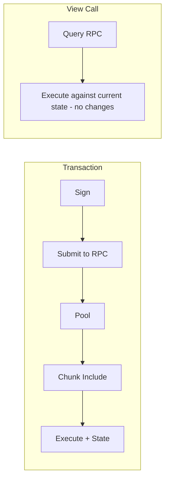
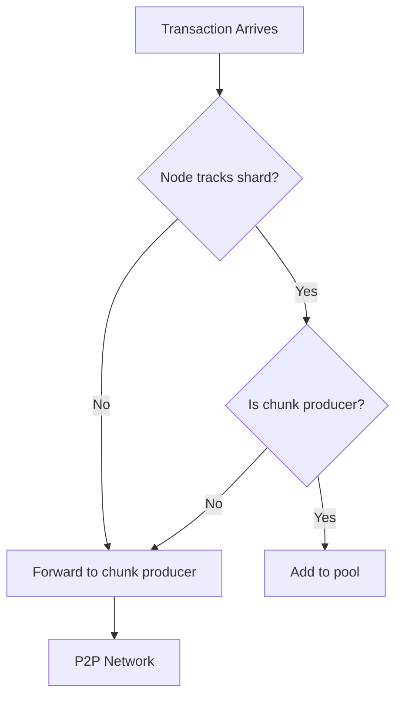

# RPC & Submission

This section covers how транзакции are submitted via JSON-RPC, validated by the RpcHandler, and prepared for сеть propagation.

## JSON-RPC Протокол Обзор

NEAR nodes expose a JSON-RPC 2.0 interface for external interaction. Unlike REST APIs, JSON-RPC uses a single endpoint with method names in the запрос body.

**Default Endpoint:** `http://localhost:3030` (configurable)

### Запрос Format

```json
{
    "jsonrpc": "2.0",
    "id": "unique-request-id",
    "method": "method_name",
    "params": { /* method-specific parameters */ }
}
```

### Ответ Formats

**Success:**
```json
{
    "jsonrpc": "2.0",
    "id": "unique-request-id",
    "result": { /* method-specific result */ }
}
```

**Error:**
```json
{
    "jsonrpc": "2.0",
    "id": "unique-request-id",
    "error": {
        "code": -32000,
        "message": "Error message",
        "data": { /* optional additional info */ }
    }
}
```

### RPC Configuration

**Source:** `chain/jsonrpc/src/lib.rs`

```rust
pub struct RpcConfig {
    /// Address to bind the RPC server (default: "0.0.0.0:3030")
    pub addr: tcp::ListenerAddr,

    /// Optional Prometheus metrics endpoint
    pub prometheus_addr: Option<String>,

    /// CORS allowed origins (default: ["*"])
    pub cors_allowed_origins: Vec<String>,

    /// Polling configuration for tx_status waits
    pub polling_config: RpcPollingConfig,

    /// Request size limits (default: 10MB)
    pub limits_config: RpcLimitsConfig,

    /// Enable debug RPC endpoints (default: false)
    pub enable_debug_rpc: bool,
}
```

## Транзакция Submission Methods

NEAR provides three RPC methods for submitting транзакции, each with different waiting behavior.

### 1. `broadcast_tx_async`

**Purpose:** Fire-and-forget транзакции submission

Submits the транзакции and immediately returns the транзакции hash without waiting for any confirmation.

**When to use:**
- High-throughput applications that track статус separately
- When you don't need immediate confirmation
- Reducing клиент latency

**Запрос:**
```json
{
    "jsonrpc": "2.0",
    "id": "1",
    "method": "broadcast_tx_async",
    "params": ["BASE64_ENCODED_SIGNED_TX"]
}
```

**Ответ:**
```json
{
    "jsonrpc": "2.0",
    "id": "1",
    "result": "6zgh2u9DqHHiXzdy9ouTP7oGky2T4nugqzqt9wJZwNFm"
}
```

The result is the транзакции hash (base58-encoded CryptoHash).

### 2. `broadcast_tx_commit`

**Purpose:** Submit and wait for execution

Submits the транзакции and waits until it's included in a final блока with execution results.

**When to use:**
- Simple applications that need confirmation
- Testing and debugging
- When you need execution results immediately

**Запрос:**
```json
{
    "jsonrpc": "2.0",
    "id": "1",
    "method": "broadcast_tx_commit",
    "params": ["BASE64_ENCODED_SIGNED_TX"]
}
```

**Ответ (success):**
```json
{
    "jsonrpc": "2.0",
    "id": "1",
    "result": {
        "status": { "SuccessValue": "" },
        "transaction": {
            "signer_id": "sender.testnet",
            "public_key": "ed25519:...",
            "nonce": 1,
            "receiver_id": "receiver.testnet",
            "actions": [...],
            "signature": "ed25519:...",
            "hash": "6zgh2u9DqHHiXzdy9ouTP7oGky2T4nugqzqt9wJZwNFm"
        },
        "transaction_outcome": {
            "block_hash": "...",
            "id": "6zgh2u9DqHHiXzdy9ouTP7oGky2T4nugqzqt9wJZwNFm",
            "outcome": {
                "logs": [],
                "receipt_ids": ["..."],
                "gas_burnt": 424555062500,
                "tokens_burnt": "42455506250000000000",
                "executor_id": "sender.testnet",
                "status": { "SuccessReceiptId": "..." }
            }
        },
        "receipts_outcome": [...]
    }
}
```

**Timeout:** Default 10 seconds (configurable via `polling_config`)

### 3. `send_tx`

**Purpose:** Flexible транзакции submission with configurable waiting

The modern API that combines the functionality of the above methods with additional control.

**Запрос:**
```json
{
    "jsonrpc": "2.0",
    "id": "1",
    "method": "send_tx",
    "params": {
        "signed_tx_base64": "BASE64_ENCODED_SIGNED_TX",
        "wait_until": "INCLUDED_FINAL"
    }
}
```

**`wait_until` Options:**

| Value | Description |
|-------|-------------|
| `NONE` | Don't wait, return immediately (like `broadcast_tx_async`) |
| `INCLUDED` | Wait until included in a блока |
| `INCLUDED_FINAL` | Wait until included in a final блока |
| `EXECUTED` | Wait until executed |
| `EXECUTED_OPTIMISTIC` | Wait for execution with optimistic финальность |
| `FINAL` | Wait for final execution (like `broadcast_tx_commit`) |

## Запрос Parsing and Decoding

When a транзакции запрос arrives at the RPC layer, it goes through several parsing stages.

### Step 1: JSON-RPC Dispatch

The main RPC handler routes the запрос based on the method name.

### Step 2: Parameter Parsing

Multiple input formats are supported:

```json
// Array format
{"params": ["BASE64_TX"]}

// Object format (modern)
{"params": {"signed_tx_base64": "BASE64_TX", "wait_until": "FINAL"}}
```

### Step 3: Транзакция Decoding

The critical decoding function converts base64 to `SignedTransaction`:

```rust
fn decode_signed_transaction(value: String) -> Result<SignedTransaction, RpcParseError> {
    // Step 1: Base64 decode to bytes
    let bytes = near_primitives::serialize::from_base64(&value)?;

    // Step 2: Borsh deserialize to SignedTransaction
    SignedTransaction::try_from_slice(&bytes)?
}
```

This is where the encoding boundary happens:
- **Input:** Base64 string containing Borsh bytes
- **Output:** Rust `SignedTransaction` struct

## Error Handling at the RPC Layer

### Parse Errors (Код -32700)

Returned when the запрос cannot be parsed:

```json
{
    "error": {
        "code": -32700,
        "message": "Parse error",
        "data": "Failed to decode transaction: invalid base64"
    }
}
```

**Common causes:**
- Invalid base64 encoding
- Corrupted borsh data
- Wrong parameter format

### Invalid Транзакция Errors

When the транзакции is parseable but invalid:

```json
{
    "error": {
        "code": -32000,
        "message": "Server error",
        "data": {
            "InvalidTransaction": {
                "InvalidNonce": {
                    "tx_nonce": 5,
                    "ak_nonce": 10
                }
            }
        }
    }
}
```

### Error Код Справочник

| Код | Meaning |
|------|---------|
| -32700 | Parse error (invalid JSON) |
| -32600 | Invalid запрос |
| -32601 | Method not found |
| -32602 | Invalid params |
| -32603 | Internal error |
| -32000 | Server error (NEAR-specific errors) |

## Просмотр Calls: The Read-Only Path

Not all RPC calls go through the транзакции flow. **Просмотр calls** are read-only function executions that bypass транзакции, квитанции, and состояние changes entirely.



### Key Differences

| Aspect | Транзакция | Просмотр Вызов |
|--------|-------------|-----------|
| Signing | Required | Not needed |
| Газ cost | Paid by signer | Free |
| Состояние changes | Yes | No (read-only) |
| Creates квитанции | Yes | No |
| Cross-контракта calls | Yes | No |
| Финальность | Eventual | Immediate |
| Блок inclusion | Required | N/A |

### The Запрос RPC Method

```json
{
    "jsonrpc": "2.0",
    "id": "1",
    "method": "query",
    "params": {
        "request_type": "call_function",
        "finality": "final",
        "account_id": "contract.near",
        "method_name": "get_status",
        "args_base64": "e30="
    }
}
```

**Запрос types:**

| Type | Purpose |
|------|---------|
| `view_account` | Get аккаунта balance, storage, код hash |
| `view_code` | Get контракта WASM код |
| `view_state` | Get контракта storage ключ-values |
| `view_access_key` | Get specific доступа ключ info |
| `view_access_key_list` | List all доступа ключи for аккаунта |
| `call_function` | Execute read-only контракта method |

### What's Prohibited in Просмотр Calls

| Category | Blocked Functions |
|----------|------------------|
| **Состояние modification** | `storage_write`, `storage_remove` |
| **Signing context** | `signer_account_id`, `signer_account_pk`, `predecessor_account_id` |
| **Газ info** | `prepaid_gas`, `used_gas` |
| **All promises** | `promise_create`, `promise_then`, `promise_batch_*` |
| **Transfers** | Any deposit (always 0 in просмотр) |

**Allowed operations:**

| Category | Allowed Functions |
|----------|------------------|
| **Состояние reading** | `storage_read`, `storage_has_key` |
| **Блок info** | `block_height`, `block_timestamp`, `epoch_height` |
| **Аккаунт info** | `current_account_id`, `account_balance`, `account_locked_balance` |
| **Crypto** | `sha256`, `keccak256`, `ed25519_verify` |

---

## Транзакция Validation

After the RPC layer parses the транзакции, it hands it off to the `RpcHandler` actor for validation.

### The RpcHandler Actor

The `RpcHandler` is a multi-threaded actor that validates транзакции and manages the транзакции pool.

**Source:** `chain/client/src/rpc_handler.rs`

```rust
pub struct RpcHandler {
    config: RpcHandlerConfig,

    /// The transaction mempool
    tx_pool: Arc<Mutex<ShardedTransactionPool>>,

    /// Access to chain state
    chain_store: ChainStoreAdapter,

    /// Epoch management (validators, shards)
    epoch_manager: Arc<dyn EpochManagerAdapter>,

    /// Tracks which shards this node handles
    shard_tracker: ShardTracker,

    /// Runtime for state access and tx validation
    runtime: Arc<dyn RuntimeAdapter>,

    /// Network interface for forwarding
    network_adapter: PeerManagerAdapter,
}
```

## Validity Period Checks

The first validation step ensures the транзакции isn't expired or from a different fork.

```rust
check_transaction_validity_period(
    &self.chain_store,
    &cur_block_header,
    signed_tx.transaction.block_hash(),
    self.config.transaction_validity_period,
)
```

The check involves:
1. **Блок Hash Поиск**: Find the блока referenced by `transaction.block_hash`
2. **Chain Membership**: Verify the блока is an ancestor of the текущий head
3. **Height Check**: Ensure `current_height - referenced_height < validity_period`

If the referenced блока is:
- Not found: `InvalidChain` error
- On a different fork: `InvalidChain` error
- Too old: `Expired` error

### Why Validity Periods?

1. **DoS Prevention**: Without expiration, old транзакции could be replayed indefinitely
2. **Fork Protection**: Ensures транзакции are only valid on the intended chain
3. **Mempool Cleanup**: Nodes can safely discard old unconfirmed транзакции
4. **User Safety**: Prevents very old транзакции from suddenly confirming

On mainnet, `transaction_validity_period` is **86,400 блоки (~24 hours)**.

## Signature Verification

The signature is verified using the public ключ embedded in the транзакции.

**Source:** `core/primitives/src/transaction.rs`

```rust
if !signed_tx
    .signature
    .verify(signed_tx.get_hash().as_ref(), signed_tx.transaction.public_key())
{
    return Err((InvalidTxError::InvalidSignature, signed_tx));
}
```

### What Gets Signed?

The signature covers the **Borsh-serialized транзакции** (not including the signature itself):

```rust
impl Transaction {
    pub fn get_hash_and_size(&self) -> (CryptoHash, u64) {
        let bytes = borsh::to_vec(&self).expect("Failed to deserialize");
        (hash(&bytes), bytes.len() as u64)  // SHA-256 hash
    }
}
```

## Nonce Management

Nonces prevent replay attacks by ensuring each транзакции is unique.

### Nonce Rules

1. **Strictly Increasing**: `tx_nonce > access_key_nonce`
2. **Per доступ Key**: Each (аккаунта, public_key) pair has its own nonce
3. **Upper Bound**: `tx_nonce < current_block_height * 1_000_000`

### Common Nonce Issues

**"Nonce too low"**: The транзакции's nonce has already been used. Causes:
- Replaying an old транзакции
- Previous транзакции confirmed faster than expected
- Using stale nonce from cache

**"Nonce too high"**: The nonce is unreasonably large. Sanity check to prevent:
- Integer overflow issues
- Denial of service via nonce exhaustion

### Best Practices

```javascript
// Get current nonce
const accessKey = await account.connection.provider.query({
    request_type: "view_access_key",
    finality: "final",
    account_id: accountId,
    public_key: publicKey
});

// Use nonce + 1 for the transaction
const nonce = accessKey.nonce + 1;
```

## доступ Key Validation

доступ ключи control what actions a транзакции can perform.

### доступ Key Types

**Full доступ Keys:**
- Can perform any action
- Can add/remove other ключи
- Typically used for аккаунта owners

**Function Вызов Keys:**
- Limited to calling specific methods
- Can have an allowance (газ spending limit)
- Used for dApp integrations

### Validation Logic

```rust
pub struct FunctionCallPermission {
    /// Gas allowance remaining (None = unlimited)
    pub allowance: Option<Balance>,

    /// Must match transaction receiver_id
    pub receiver_id: AccountId,

    /// If non-empty, method_name must be in this list
    pub method_names: Vec<String>,
}
```

**Checks performed:**
1. **Key Exists**: The public ключ must be registered on the signer аккаунта
2. **Permission Type**: Full доступа required for non-FunctionCall actions
3. **Receiver Match**: Function вызов ключи can only вызов their designated receiver
4. **Method Match**: If method_names is non-empty, the called method must be listed
5. **Allowance**: Must have sufficient remaining allowance for газ

### Error Types

| Error | Description |
|-------|-------------|
| `AccessKeyNotFound` | Key doesn't exist on the аккаунта |
| `RequiresFullAccess` | Trying to use function вызов ключ for non-вызов action |
| `ReceiverMismatch` | Receiver doesn't match function вызов ключ |
| `MethodNameMismatch` | Method not in allowed list |
| `NotEnoughAllowance` | Insufficient allowance |
| `DepositWithFunctionCall` | Function вызов ключи can't отправка deposits |

## Газ and Balance Checks

Before a транзакции can be accepted, the signer must have sufficient resources.

### Газ Calculation

Each action has associated газ costs defined in the протокола parameters:

```
total_gas = sum(action_gas) + receipt_creation_gas
```

### Balance Requirements

The signer must have:

```
balance >= gas_price * total_gas + sum(deposits) + storage_stake_required
```

Where:
- `gas_price`: Текущий price of газ (set by протокола)
- `deposits`: Sum of all `Transfer` and `FunctionCall` deposits
- `storage_stake_required`: Stake needed for аккаунта storage

### Validation Errors

| Error | Description |
|-------|-------------|
| `NotEnoughBalance` | Signer doesn't have enough NEAR |
| `LackBalanceForState` | Can't cover storage stake |
| `CostOverflow` | Integer overflow during calculation |

## Shard Routing Logic

NEAR shards the состояние by аккаунта. Each транзакции must be routed to the correct shard.

### Shard Assignment

```rust
let shard_uid = shard_layout.account_id_to_shard_uid(signed_tx.transaction.signer_id());
let shard_id = shard_uid.shard_id();
```

The signer's аккаунта determines which shard processes the транзакции initially. If the receiver is on a different shard, cross-shard квитанции handle the communication.

### Routing Decision



The `RpcHandler` determines:
1. Which shard the транзакции belongs to (based on signer_id)
2. Whether this node tracks that shard
3. Whether this node is the chunk producer for that shard
4. If not, forward to the appropriate chunk producer via P2P
