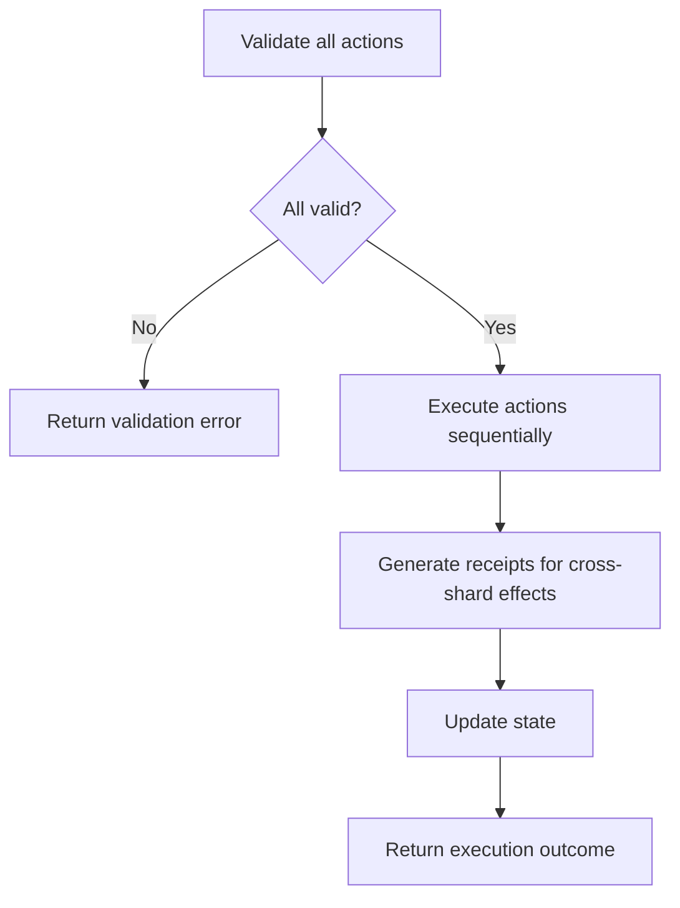
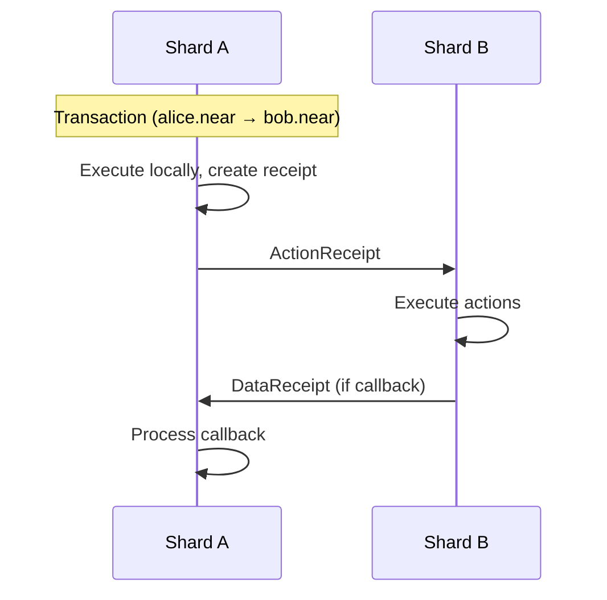
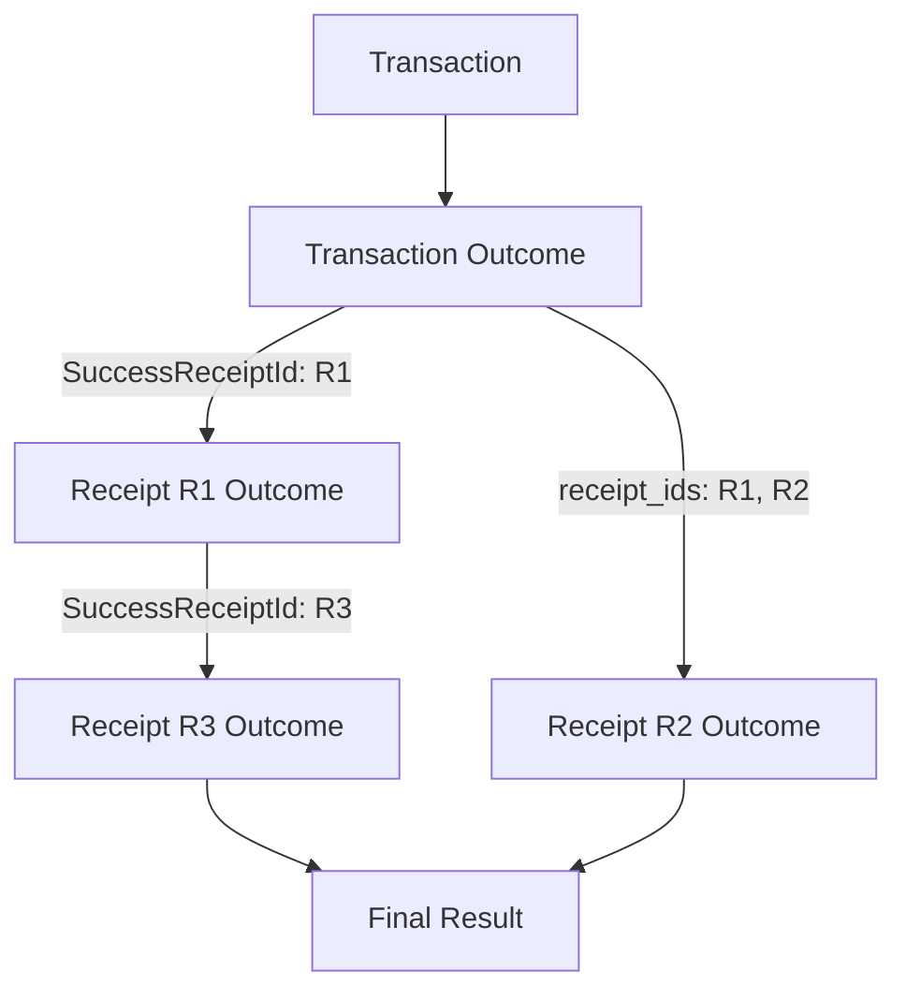

# Исполнение Execution

The runtime is where транзакции actually execute and modify состояние. This page covers the состояние machine that processes транзакции and квитанции, the execution flow for each action type, and how квитанции are generated for cross-shard communication.

## Состояние Machine Обзор

NEAR's runtime implements a состояние machine that processes:

1. **Транзакции**: Initial execution, creates квитанции
2. **Receipts**: Cross-shard communication units

### Состояние Structure

Состояние is organized as a trie (prefix tree) with ключ patterns:

```
account:{account_id} → AccountData
access_key:{account_id}:{public_key} → AccessKeyData
code:{account_id} → ContractCode
data:{account_id}:{key} → Value
```

| Key Pattern | Description |
|-------------|-------------|
| `account:*` | Аккаунт metadata (balance, storage, код hash) |
| `access_key:*:*` | доступ ключ permissions and nonces |
| `code:*` | Контракт WASM bytecode |
| `data:*:*` | Контракт storage ключ-value pairs |

### Execution Context

Each транзакции/квитанция executes with a блока context:

```rust
pub struct ApplyChunkBlockContext {
    /// Block height
    pub height: BlockHeight,

    /// Unix timestamp in nanoseconds
    pub block_timestamp: u64,

    /// Previous block hash (for chain continuity)
    pub prev_block_hash: CryptoHash,

    /// Current block hash
    pub block_hash: CryptoHash,

    /// Challenge results (for slashing)
    pub challenges_result: ChallengesResult,

    /// Random seed (deterministic per block)
    pub random_seed: CryptoHash,
}
```

This context provides deterministic values that контракты can доступа via host functions like `block_height()` and `block_timestamp()`.

## Action Execution

Actions execute in order within a транзакции. All actions in a single транзакции are atomic - if any action fails, all preceding actions are rolled back.

### Execution Order



The detailed flow:

1. **Validate all actions can execute** - Check permissions, balances, газ
2. **Execute actions sequentially** - Each action modifies состояние
3. **Generate квитанции for cross-shard effects** - Promises become квитанции
4. **Update состояние** - Commit changes to trie
5. **Return execution outcome** - Статус, logs, газ used

### Action Handlers

Each action type has specific execution logic in the runtime.

#### CreateAccount

```rust
// Create new account record
// Initialize with zero balance, no keys, no code
state.set_account(account_id, Account::new(
    0,                      // balance
    0,                      // locked (staked)
    CryptoHash::default(),  // code_hash (no contract)
    0,                      // storage_usage
));
```

The new аккаунта starts empty. Typically combined with `Transfer` and `AddKey` in a batch to fund the аккаунта and add доступа ключи.

#### Transfer

```rust
// Deduct from sender
sender.amount -= amount;
state.set_account(sender_id, sender);

// Add to receiver (or create receipt for cross-shard)
if same_shard {
    receiver.amount += amount;
    state.set_account(receiver_id, receiver);
} else {
    create_receipt(ReceiptType::Transfer, receiver_id, amount);
}
```

When sender and receiver are on the same shard, the transfer happens immediately. For cross-shard transfers, a квитанция is created to be processed in the next блока on the receiver's shard.

#### FunctionCall

```rust
// Load contract code
let code = state.get_code(receiver_id);

// Create WASM runtime
let mut runtime = WasmRuntime::new(code, gas_limit);

// Execute function
let result = runtime.call(method_name, args, context);

// Process result
match result {
    Ok(value) => {
        // Apply state changes
        // Generate any receipts from promises
    }
    Err(error) => {
        // Rollback state changes
        // Return error in outcome
    }
}
```

FunctionCall is the most complex action:
1. Load the receiver's контракта код from состояние
2. Initialize a WASM runtime with газ limits
3. Execute the method with provided arguments
4. On success, apply состояние changes and convert promises to квитанции
5. On failure, rollback all changes and return error

#### DeployContract

```rust
// Validate WASM module
validate_wasm(&code)?;

// Store code in state
let code_hash = hash(&code);
state.set_code(account_id, code);

// Update account's code_hash
account.code_hash = code_hash;
state.set_account(account_id, account);
```

#### AddKey / DeleteKey

```rust
// AddKey
let access_key = AccessKey {
    nonce: 0,
    permission: key_permission,
};
state.set_access_key(account_id, public_key, access_key);

// DeleteKey
state.delete_access_key(account_id, public_key);
```

#### DeleteAccount

```rust
// Transfer remaining balance to beneficiary
let remaining = account.amount + account.locked;
if same_shard {
    beneficiary.amount += remaining;
} else {
    create_receipt(ReceiptType::Transfer, beneficiary_id, remaining);
}

// Remove all account data
state.delete_account(account_id);
state.delete_all_access_keys(account_id);
state.delete_code(account_id);
state.delete_all_data(account_id);
```

### Газ Accounting

Газ is consumed at each step of execution:

```rust
// Base cost for the action type
gas_used += config.action_costs.get(action_type).base;

// Per-byte costs where applicable
gas_used += config.action_costs.get(action_type).per_byte * data_size;

// Runtime costs during execution (for FunctionCall)
gas_used += host_function_cost;
gas_used += wasm_instruction_cost * instruction_count;
```

| Cost Category | Description |
|---------------|-------------|
| Base cost | Fixed cost per action type |
| Per-byte cost | Cost proportional to data size (args, код, etc.) |
| Host function cost | Cost for each runtime API вызов |
| WASM instruction cost | Cost per WASM instruction executed |

See [Газ & Economics](./gas-economics) for detailed газ accounting.

## Квитанция Generation

Receipts are the mechanism for cross-shard communication. When a транзакции needs to affect an аккаунта on a different shard, the runtime generates квитанции instead of modifying состояние directly.

### Квитанция Types

**ActionReceipt** contains actions to execute on another аккаунта:

```rust
pub struct ActionReceipt {
    /// Account that originally signed the transaction
    pub signer_id: AccountId,

    /// Public key used for signing
    pub signer_public_key: PublicKey,

    /// Gas price when this receipt was created
    pub gas_price: Balance,

    /// Where to send the result of this execution
    pub output_data_receivers: Vec<DataReceiver>,

    /// What this receipt is waiting for (callback dependencies)
    pub input_data_ids: Vec<CryptoHash>,

    /// The actual operations to perform
    pub actions: Vec<Action>,
}
```

**DataReceipt** contains return data from a function вызов:

```rust
pub struct DataReceipt {
    /// Unique identifier matching an input_data_id somewhere
    pub data_id: CryptoHash,

    /// The actual return value (None if execution failed)
    pub data: Option<Vec<u8>>,
}
```

### Квитанция Flow



**Detailed flow:**

1. Транзакция arrives on Shard A (alice.near's shard)
2. Исполнение executes the транзакции, creates ActionReceipt for bob.near
3. ActionReceipt routes to Shard B (bob.near's shard) in next блока
4. Shard B executes the квитанция's actions
5. If there was a callback, DataReceipt returns to Shard A
6. Shard A executes the callback with the result

### When Receipts Are Generated

| Scenario | Квитанция Generated |
|----------|-------------------|
| Cross-shard transfer | ActionReceipt with Transfer |
| Cross-shard function вызов | ActionReceipt with FunctionCall |
| `promise_create()` | ActionReceipt (deferred) |
| `promise_then()` | ActionReceipt with input_data_id dependency |
| Function return value | DataReceipt to satisfy dependencies |

## Execution Outcomes

Every execution produces an outcome that records what happened.

**Source:** `core/primitives/src/transaction.rs`

```rust
pub struct ExecutionOutcome {
    /// Logs emitted during execution
    pub logs: Vec<LogEntry>,

    /// Receipt IDs generated by this execution
    pub receipt_ids: Vec<CryptoHash>,

    /// Gas consumed
    pub gas_burnt: Gas,

    /// Compute time used (internal metric)
    pub compute_usage: Option<Compute>,

    /// Tokens burnt (gas_burnt * gas_price)
    pub tokens_burnt: Balance,

    /// Account that executed (signer for tx, receiver for receipt)
    pub executor_id: AccountId,

    /// Final status
    pub status: ExecutionStatus,

    /// Detailed profiling data (if enabled)
    pub metadata: ExecutionMetadata,
}
```

### Execution Статус

```rust
pub enum ExecutionStatus {
    /// Still processing or unknown
    Unknown,

    /// Execution failed
    Failure(TxExecutionError),

    /// Success with return value
    SuccessValue(Vec<u8>),

    /// Success, spawned a receipt (for async calls)
    SuccessReceiptId(CryptoHash),
}
```

| Статус | Meaning |
|--------|---------|
| `Unknown` | Execution hasn't completed yet |
| `Failure` | Execution failed with error details |
| `SuccessValue` | Completed, returned data directly |
| `SuccessReceiptId` | Completed, result is in referenced квитанция |

### Following Execution

A транзакции's full execution may span multiple блоки and shards:



1. **Транзакция Outcome**: The initial execution (converts to квитанция)
2. **Квитанция Outcomes**: Each квитанция's execution result
3. **Final Outcome**: The complete result after all квитанции

Clients can poll the `tx` RPC method with `wait_until: FINAL` to get all outcomes:

```bash
FASTNEAR_API_KEY=${FASTNEAR_API_KEY:-your_api_key_here}

curl -X POST https://archival-rpc.mainnet.fastnear.com \
  -H "Authorization: Bearer $FASTNEAR_API_KEY" \
  -H "Content-Type: application/json" \
  -d '{
    "jsonrpc": "2.0",
    "id": "1",
    "method": "tx",
    "params": {
      "tx_hash": "6zgh2u9DqHHiXzdy9ouTP7oGky2T4nugqzqt9wJZwNFm",
      "sender_account_id": "sender.near",
      "wait_until": "FINAL"
    }
  }'
```

## Atomic Execution Guarantees

Within a single квитанция execution:

| Guarantee | Description |
|-----------|-------------|
| **Atomicity** | All actions succeed or all fail together |
| **Isolation** | Other executions see before or after, not during |
| **Determinism** | Same input always produces same output |
| **Газ limits** | Execution cannot exceed prepaid газ |

Across multiple квитанции (promise chains):

| Property | Behavior |
|----------|----------|
| **Partial success** | Each квитанция is atomic, but chain can partially complete |
| **Callback awareness** | Callbacks see `PromiseResult::Failed` if predecessor failed |
| **No global rollback** | Cannot rollback previously executed квитанции |

:::warning Design Consideration
Because cross-контракта calls can partially succeed, контракты should be designed to handle intermediate states gracefully. Use callbacks to verify results and implement compensation logic for failures.
:::
