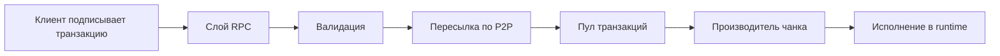

**Источник:** [https://docs.fastnear.com/ru/transaction-flow](https://docs.fastnear.com/ru/transaction-flow)

# Поток транзакций в протоколе NEAR

Это руководство прослеживает полный жизненный цикл транзакции в протоколе NEAR: от отправки через JSON-RPC до исполнения валидатором.

## Быстрый справочник

| Задача | Метод RPC |
|------|------------|
| Отправить транзакцию без ожидания результата | `broadcast_tx_async` |
| Отправить и дождаться результата | `broadcast_tx_commit` |
| Проверить статус транзакции | `tx_status` |
| Посмотреть информацию об аккаунте | `view_account` |
| Вызвать функцию просмотра | `call_function` |

## Разделы руководства

### Базовые концепции

- **[Основы](https://docs.fastnear.com/ru/transaction-flow/foundations)** - структура транзакции, набор действий и форматы сериализации
- **[RPC и отправка](https://docs.fastnear.com/ru/transaction-flow/rpc-submission)** - JSON-RPC-эндпоинты, валидация и ключи доступа
- **[Финальность](https://docs.fastnear.com/ru/transaction-flow/finality)** - результаты исполнения, запрос итогов и опции `wait_until`

### Модель исполнения

- **[Асинхронная модель](https://docs.fastnear.com/ru/transaction-flow/async-model)** - промисы, квитанции и межшардовое взаимодействие
- **[Исполнение в среде выполнения](https://docs.fastnear.com/ru/transaction-flow/runtime-execution)** - машина состояний и исполнение действий
- **[Газ и экономика](https://docs.fastnear.com/ru/transaction-flow/gas-economics)** - учёт газа, возвраты и ценообразование

### Инфраструктура

- **[Сеть и блоки](https://docs.fastnear.com/ru/transaction-flow/network-blocks)** - P2P-протокол, пул транзакций и производство чанков
- **[Инфраструктура](https://docs.fastnear.com/ru/transaction-flow/infrastructure)** - хранилище состояния, шардинг и структура префиксного дерева

### Продвинутые темы

- **[Продвинутые возможности](https://docs.fastnear.com/ru/transaction-flow/advanced-features)** - мета-транзакции (`DelegateAction`) и `Promise Yield/Resume`
- **[Справочник](https://docs.fastnear.com/ru/transaction-flow/reference)** - ментальные модели, советы по отладке и приложения

## Ключевые концепции

### Транзакции асинхронны

В отличие от синхронных блокчейнов, транзакции в NEAR создают **квитанции**, которые исполняются асинхронно. Межконтрактный вызов может растянуться на несколько блоков и шардов.

### Квитанции, а не вызовы

Когда ваш контракт вызывает другой контракт, он не получает возвращаемое значение сразу. Вместо этого:

1. Ваш вызов создаёт **ActionReceipt** для целевого контракта.
2. Эта квитанция исполняется позже, возможно в будущем блоке и на другом шарде.
3. Результат возвращается в обработчик обратного вызова как **DataReceipt**.

### Межшардовое взаимодействие по замыслу

NEAR использует шардинг: разные аккаунты живут на разных шардах. Межшардовое взаимодействие автоматическое, но асинхронное. Атомарность гарантируется только внутри одного шарда.
