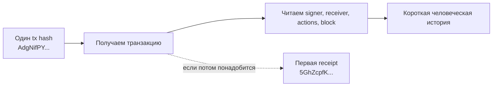
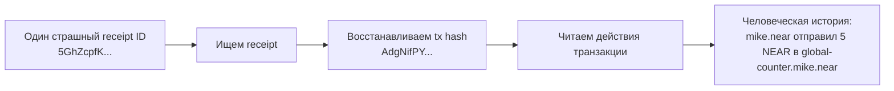
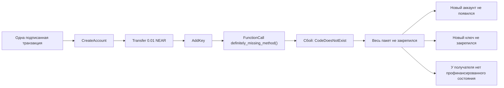
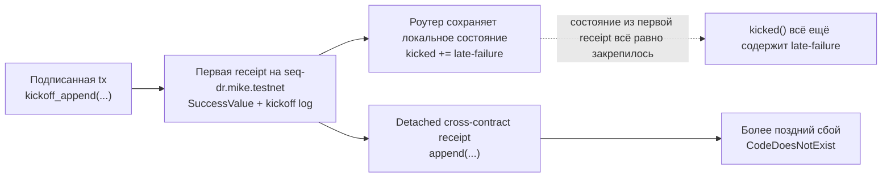
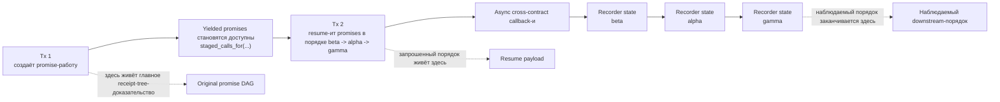
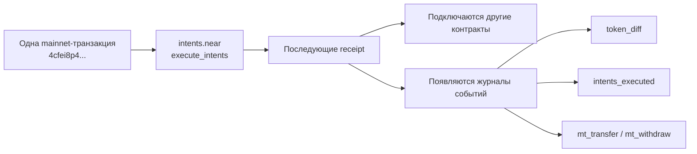

**Источник:** [https://docs.fastnear.com/ru/tx/examples](https://docs.fastnear.com/ru/tx/examples)

## Готовые расследования

Эти расследования намеренно выстроены от самого простого якоря к самой насыщенной форензике: сначала один tx hash, затем один receipt, затем паттерны с ошибками и async, и только потом более глубокие расследования по SocialDB и NEAR Intents.

### У меня есть один хеш транзакции. Что вообще произошло?

Используйте это расследование, когда история максимально простая: «мне прислали один хеш транзакции. Я просто хочу понять, сработала ли она, что именно сделала и в какой блок попала».

Это и есть входной пример beginner-to-intermediate для этой страницы. До receipt, promise-цепочек и форензики есть один более базовый навык, который нужен любому NEAR-инженеру: превратить голый tx hash в одну короткую человеческую историю.

**Цель**

- Начать с одного хеша транзакции и получить самый короткий полезный ответ: signer, receiver, тип действия, включающий блок и факт, что транзакция действительно ушла в успешный путь исполнения.

Для этого зафиксированного примера:

- хеш транзакции: `AdgNifPYpoDNS5ckfBZm36Ai6LuL5bTstuKsVdGjKwGp`
- signer: `mike.near`
- receiver: `global-counter.mike.near`
- высота включающего блока: `194263342`
- ID первой receipt: `5GhZcpfKWhrpaZo5Am74QfEUFQnZBz48G7hfoLPVDXcq`

Простой человеческий ответ для этого случая такой: `mike.near` отправил одну транзакцию с действием `Transfer` в адрес `global-counter.mike.near`, эта транзакция попала в блок `194263342`, и сеть передала её в одну успешную receipt.



| Поверхность | Эндпоинт | Как используем | Зачем используем |
| --- | --- | --- | --- |
| Читаемая история транзакции | Transactions API [`POST /v0/transactions`](https://docs.fastnear.com/ru/tx/transactions) | Стартуем с хеша транзакции и печатаем signer, receiver, включающий блок, список действий и handoff в первую receipt | Даёт самый быстрый читаемый ответ на вопрос «что вообще сделала эта транзакция?» |
| Каноническое продолжение по статусу | RPC [`EXPERIMENTAL_tx_status`](https://docs.fastnear.com/ru/rpc/transaction/experimental-tx-status) | Переиспользуем тот же хеш транзакции и signer только если нужны точные протокольные семантики статуса | Полезно, когда следующий вопрос уже звучит как «а по RPC это точно успех?» |
| Переход к receipt | Transactions API [`POST /v0/receipt`](https://docs.fastnear.com/ru/tx/receipt) | Переиспользуем ID первой receipt, если вопрос превращается в историю на уровне receipt | Даёт естественный мост к следующему расследованию, когда лучшим якорем становится уже не транзакция, а receipt |

**Что должен включать полезный ответ**

- кто подписал транзакцию
- какой аккаунт её получил
- какой тип действия она несла
- в какой блок попала
- одно простое предложение, которое объясняет транзакцию без receipt-жаргона

### Shell-сценарий: от хеша транзакции к человеческой истории

Используйте этот сценарий, когда нужен самый короткий путь от одного tx hash к одному читаемому ответу.

**Что вы делаете**

- Получаете транзакцию по хешу и печатаете её основные поля.
- Подтверждаете финальный статус только если нужны точные RPC-семантики.
- Сохраняете первую receipt только как необязательный следующий шаг.

```bash
TX_BASE_URL=https://tx.main.fastnear.com
RPC_URL=https://rpc.mainnet.fastnear.com
TX_HASH=AdgNifPYpoDNS5ckfBZm36Ai6LuL5bTstuKsVdGjKwGp
SIGNER_ACCOUNT_ID=mike.near
```

1. Получите транзакцию и распечатайте базовую историю.

```bash
FIRST_RECEIPT_ID="$(
  curl -s "$TX_BASE_URL/v0/transactions" \
    -H 'content-type: application/json' \
    --data "$(jq -nc --arg tx_hash "$TX_HASH" '{tx_hashes: [$tx_hash]}')" \
    | tee /tmp/basic-tx-story.json \
    | jq -r '.transactions[0].transaction_outcome.outcome.status.SuccessReceiptId'
)"

jq '{
  transaction: {
    hash: .transactions[0].transaction.hash,
    signer_id: .transactions[0].transaction.signer_id,
    receiver_id: .transactions[0].transaction.receiver_id,
    included_block_height: .transactions[0].execution_outcome.block_height
  },
  actions: (
    .transactions[0].transaction.actions
    | map(if type == "string" then . else keys[0] end)
  ),
  first_receipt_id: .transactions[0].transaction_outcome.outcome.status.SuccessReceiptId,
  receipt_count: (.transactions[0].receipts | length)
}' /tmp/basic-tx-story.json

# Ожидаемый список действий: ["Transfer"]
# Ожидаемая первая receipt: 5GhZcpfKWhrpaZo5Am74QfEUFQnZBz48G7hfoLPVDXcq
```

2. Если нужны точные RPC-семантики статуса, подтвердите их через `EXPERIMENTAL_tx_status`.

```bash
curl -s "$RPC_URL" \
  -H 'content-type: application/json' \
  --data "$(jq -nc \
    --arg tx_hash "$TX_HASH" \
    --arg signer_account_id "$SIGNER_ACCOUNT_ID" '{
      jsonrpc: "2.0",
      id: "fastnear",
      method: "EXPERIMENTAL_tx_status",
      params: {
        tx_hash: $tx_hash,
        sender_account_id: $signer_account_id,
        wait_until: "FINAL"
      }
    }')" \
  | jq '{
      final_execution_status: .result.final_execution_status,
      status: .result.status,
      transaction_handoff: .result.transaction_outcome.outcome.status
    }'
```

3. Если следующий вопрос уже звучит как «что это была за первая receipt?», один раз перейдите по ней и остановитесь.

```bash
curl -s "$TX_BASE_URL/v0/receipt" \
  -H 'content-type: application/json' \
  --data "$(jq -nc --arg receipt_id "$FIRST_RECEIPT_ID" '{receipt_id: $receipt_id}')" \
  | jq '{
      receipt_id: .receipt.receipt_id,
      receiver_id: .receipt.receiver_id,
      is_success: .receipt.is_success,
      receipt_block_height: .receipt.block_height,
      transaction_hash: .receipt.transaction_hash
    }'
```

Последний шаг специально сделан необязательным. Если вам нужна была только история транзакции, уже первого шага достаточно. Двигайтесь дальше только когда сама receipt становится новым якорем.

**Зачем нужен следующий шаг?**

`POST /v0/transactions` — это самый чистый старт, когда у вас на руках только tx hash и нужен один читаемый ответ. RPC нужен как продолжение для точных семантик статуса. `POST /v0/receipt` — это handoff на случай, когда следующий вопрос уже относится не ко всей транзакции, а к одной receipt внутри неё.

### Превратить один страшный receipt ID из логов в понятную человеческую историю

Используйте это расследование, когда у вас на руках только один страшный `receipt_id` из логов, трассы или отчёта об ошибке, а нужно превратить его в простой ответ, который поймёт коллега без расшифровки receipt-полей.

Если у вас уже есть хеш транзакции, а не receipt ID, начните с более простого расследования прямо выше и опускайтесь сюда только тогда, когда сама receipt становится лучшим якорем.

**Цель**

- Начать с одного receipt ID и восстановить самую короткую полезную историю: кто его создал, где он исполнился, какая транзакция его породила и что эта транзакция вообще пыталась сделать.

Для этого зафиксированного примера «страшный receipt ID из логов» такой:

- receipt ID: `5GhZcpfKWhrpaZo5Am74QfEUFQnZBz48G7hfoLPVDXcq`
- хеш исходной транзакции: `AdgNifPYpoDNS5ckfBZm36Ai6LuL5bTstuKsVdGjKwGp`
- signer: `mike.near`
- receiver: `global-counter.mike.near`
- высота блока транзакции: `194263342`
- высота блока исполнения receipt: `194263343`

Человеческая история за этим receipt простая: `mike.near` подписал обычную транзакцию `Transfer` в адрес `global-counter.mike.near`, сеть превратила её в одну квитанцию с действием, а эта квитанция успешно исполнилась в следующем блоке.



| Поверхность | Эндпоинт | Как используем | Зачем используем |
| --- | --- | --- | --- |
| Якорь по квитанции | Transactions API [`POST /v0/receipt`](https://docs.fastnear.com/ru/tx/receipt) | Сначала ищем ID квитанции и печатаем аккаунты, блок исполнения, флаг успеха и связанный хеш транзакции | Даёт самый короткий путь от сырого receipt ID к пониманию, что вообще за объект перед вами |
| История транзакции | Transactions API [`POST /v0/transactions`](https://docs.fastnear.com/ru/tx/transactions) | Переиспользуем полученный хеш транзакции и печатаем signer, receiver, упорядоченные действия и включающий блок | Превращает сырую квитанцию в читаемую историю того, что signer на самом деле отправил |
| Каноническое продолжение | RPC [`tx`](https://docs.fastnear.com/ru/rpc/transaction/tx-status) или [`EXPERIMENTAL_tx_status`](https://docs.fastnear.com/ru/rpc/transaction/experimental-tx-status) | Подтверждаем протокольные семантики только если индексированного ответа всё ещё недостаточно | Полезно, когда вопрос меняется с «расскажи мне историю» на «покажи точную RPC-семантику статуса» |

**Что должен включать полезный ответ**

- какие аккаунты создали и исполнили квитанцию
- к какой транзакции относится эта квитанция
- что транзакция на самом деле сделала
- была ли квитанция главным событием или только шагом в большом каскаде
- одно предложение простым языком, которое можно без правок вставить коллеге в чат

### Shell-сценарий: от страшного receipt ID к человеческой истории

Используйте этот сценарий, когда у вас уже есть один сырой `receipt_id` из логов и нужно быстро превратить его в читаемое объяснение.

**Что вы делаете**

- Сначала разрешаете receipt.
- Извлекаете `receipt.transaction_hash` через `jq`.
- Переиспользуете этот хеш транзакции в `POST /v0/transactions`.
- Завершаете одним человеческим резюме, которое можно вставить в чат или тикет.

```bash
TX_BASE_URL=https://tx.main.fastnear.com
RECEIPT_ID='5GhZcpfKWhrpaZo5Am74QfEUFQnZBz48G7hfoLPVDXcq'
```

1. Разрешите receipt и поймите, что за объект вы смотрите.

```bash
TX_HASH="$(
  curl -s "$TX_BASE_URL/v0/receipt" \
    -H 'content-type: application/json' \
    --data "$(jq -nc --arg receipt_id "$RECEIPT_ID" '{receipt_id: $receipt_id}')" \
    | tee /tmp/receipt-lookup.json \
    | jq -r '.receipt.transaction_hash'
)"

jq '{
  receipt: {
    receipt_id: .receipt.receipt_id,
    predecessor_id: .receipt.predecessor_id,
    receiver_id: .receipt.receiver_id,
    receipt_type: .receipt.receipt_type,
    is_success: .receipt.is_success,
    receipt_block_height: .receipt.block_height,
    transaction_hash: .receipt.transaction_hash,
    tx_block_height: .receipt.tx_block_height
  }
}' /tmp/receipt-lookup.json
```

2. Переиспользуйте хеш транзакции и превратите квитанцию в читаемую историю транзакции.

```bash
curl -s "$TX_BASE_URL/v0/transactions" \
  -H 'content-type: application/json' \
  --data "$(jq -nc --arg tx_hash "$TX_HASH" '{tx_hashes: [$tx_hash]}')" \
  | tee /tmp/receipt-parent-transaction.json >/dev/null

jq '{
  transaction: {
    transaction_hash: .transactions[0].transaction.hash,
    signer_id: .transactions[0].transaction.signer_id,
    receiver_id: .transactions[0].transaction.receiver_id,
    tx_block_height: .transactions[0].execution_outcome.block_height,
    action_types: (
      .transactions[0].transaction.actions
      | map(if type == "string" then . else keys[0] end)
    ),
    transfer_deposit_yocto: (
      .transactions[0].transaction.actions[0].Transfer.deposit // null
    )
  },
  receipt_count: (.transactions[0].receipts | length)
}' /tmp/receipt-parent-transaction.json
```

3. Сведите это к одному человеческому предложению.

```bash
jq -r '
  .transactions[0] as $tx
  | "Receipt \($tx.execution_outcome.outcome.receipt_ids[0]) относится к tx \($tx.transaction.hash): \($tx.transaction.signer_id) отправил 5 NEAR в \($tx.transaction.receiver_id). Транзакция попала в блок \($tx.execution_outcome.block_height), а receipt успешно исполнился в блоке \($tx.receipts[0].execution_outcome.block_height)."
' /tmp/receipt-parent-transaction.json
```

Для другого receipt держитесь того же шаблона, но поменяйте финальное предложение так, чтобы оно соответствовало типам действий, которые вы только что напечатали.

В этом и состоит ключевой приём: не нужно объяснять каждое поле квитанции. Нужно восстановить ровно столько контекста, чтобы сказать, что сделал signer, где исполнился receipt и был ли этот receipt главным событием или только шагом в более крупном каскаде.

**Зачем нужен следующий шаг?**

`POST /v0/receipt` показывает, к чему привязан сырой receipt. `POST /v0/transactions` показывает, что signer на самом деле пытался сделать. Как только эти две части собраны вместе, чаще всего уже можно объяснить receipt одним предложением и только потом решать, нужны ли вообще контекст блока, история аккаунта или канонический RPC-статус.

### Доказать, что одно неудачное действие сорвало весь пакет

Используйте это расследование, когда одна транзакция с несколькими действиями пыталась создать и пополнить новый аккаунт, добавить на него ключ, а затем вызвать метод на этом же новом аккаунте. Финальное действие упало, потому что у свежего аккаунта не было кода контракта. Настоящий вопрос здесь простой: закрепились ли ранние действия или весь пакет не сработал целиком?

В NEAR действия внутри одного пакета транзакции исполняются по порядку внутри первой квитанции с действиями. Если одно действие в этой квитанции падает, ранние действия из того же пакета тоже не закрепляются. Это отличается от более поздних асинхронных квитанций или promise-цепочек, где первая квитанция может пройти успешно, а уже следующая упасть отдельно.

**Цель**

- На примере одной зафиксированной транзакции из testnet доказать, что финальный `FunctionCall` упал, а ранние действия `CreateAccount`, `Transfer` и `AddKey` не закрепились.

**Официальные ссылки**

- [Основы транзакций](https://docs.fastnear.com/ru/transaction-flow/foundations)
- [Исполнение в рантайме](https://docs.fastnear.com/ru/transaction-flow/runtime-execution)

Этот зафиксированный сбой был получен в **testnet 18 апреля 2026 года**:

- хеш транзакции: `CrhH3xLzbNwNMGgZkgptXorwh8YmqxRGuA6Mc11MkU6M`
- аккаунт signer: `temp.mike.testnet`
- целевой новый аккаунт: `rollback-mo4vmkig.temp.mike.testnet`
- высота включающего блока: `246365118`
- хеш включающего блока: `6f5zTKDqQRwrxMywzvxeRvYcCERJmAnatJaqUEtQYUNM`
- порядок действий: `CreateAccount -> Transfer -> AddKey -> FunctionCall`
- упавший метод: `definitely_missing_method`
- RPC-ошибка: `CodeDoesNotExist` на `rollback-mo4vmkig.temp.mike.testnet`



| Поверхность | Эндпоинт | Как используем | Зачем используем |
| --- | --- | --- | --- |
| Задуманный пакет | Transactions API [`POST /v0/transactions`](https://docs.fastnear.com/ru/tx/transactions) | Загружаем зафиксированный хеш транзакции и печатаем упорядоченный список действий, получателя и метаданные включающего блока | Показывает, что именно signer пытался сделать, ещё до разговора о том, что закрепилось |
| Точное место сбоя | RPC [`EXPERIMENTAL_tx_status`](https://docs.fastnear.com/ru/rpc/transaction/experimental-tx-status) | Запрашиваем ту же транзакцию с `wait_until: "FINAL"` и смотрим `status.Failure` | Показывает, какое действие упало и почему весь пакет не закрепился на уровне протокола |
| Доказательство по состоянию после исполнения | RPC [`query(view_account)`](https://docs.fastnear.com/ru/rpc/account/view-account) | Запрашиваем предполагаемый новый аккаунт после finality | Если созданный аккаунт до сих пор не существует, значит ранние `CreateAccount`, `Transfer` и `AddKey` из того же пакета действий тоже не закрепились |

Перед shell-сценарием важно отметить одну деталь: индексированная запись транзакции всё ещё показывает `transaction_outcome.outcome.status = SuccessReceiptId`, потому что подписанная транзакция успешно превратилась в свою первую квитанцию с действиями. Но доказательство того, что весь пакет не закрепился, приходит из верхнеуровневого RPC `status.Failure` для этой первой квитанции и из проверки состояния после исполнения, что целевой новый аккаунт так и не появился.

**Что должен включать полезный ответ**

- точный порядок действий, который отправил signer
- какой индекс действия упал и почему
- высоту и хеш включающего блока для этого батча
- доказательство, что предполагаемый новый аккаунт всё ещё не существует после finality
- короткий вывод, что ранние `CreateAccount`, `Transfer` и `AddKey` не закрепились после падения финального `FunctionCall`

### Shell-сценарий неудачной транзакции с пакетом действий

Используйте этот сценарий, когда нужен один конкретный неудачный пакет действий, который можно разобрать по шагам через публичные FastNear testnet-эндпоинты.

**Что вы делаете**

- Читаете индексированную запись транзакции, чтобы восстановить задуманный пакет действий.
- Через RPC transaction status доказываете, что финальный `FunctionCall` действительно упал и сорвал весь пакет.
- Через один RPC-запрос к состоянию после исполнения доказываете, что новый аккаунт так и не появился после finality.

```bash
TX_BASE_URL=https://tx.test.fastnear.com
RPC_URL=https://rpc.testnet.fastnear.com
TX_HASH=CrhH3xLzbNwNMGgZkgptXorwh8YmqxRGuA6Mc11MkU6M
SIGNER_ACCOUNT_ID=temp.mike.testnet
NEW_ACCOUNT_ID=rollback-mo4vmkig.temp.mike.testnet
```

1. Получите транзакцию и распечатайте задуманный пакет действий.

```bash
curl -s "$TX_BASE_URL/v0/transactions" \
  -H 'content-type: application/json' \
  --data "$(jq -nc --arg tx_hash "$TX_HASH" '{tx_hashes: [$tx_hash]}')" \
  | tee /tmp/failed-batch-transaction.json >/dev/null

jq '{
  transaction: {
    hash: .transactions[0].transaction.hash,
    signer_id: .transactions[0].transaction.signer_id,
    receiver_id: .transactions[0].transaction.receiver_id,
    included_block_height: .transactions[0].execution_outcome.block_height,
    included_block_hash: .transactions[0].execution_outcome.block_hash
  },
  batch: {
    action_count: (.transactions[0].transaction.actions | length),
    action_types: (
      .transactions[0].transaction.actions
      | map(if type == "string" then . else keys[0] end)
    ),
    final_function_call_method_name: (
      .transactions[0].transaction.actions[3].FunctionCall.method_name
    )
  },
  first_receipt_handoff: .transactions[0].transaction_outcome.outcome.status
}' /tmp/failed-batch-transaction.json

# Ожидаемый порядок действий:
# 1. CreateAccount
# 2. Transfer
# 3. AddKey
# 4. FunctionCall
```

2. Запросите RPC transaction status и посмотрите точную верхнеуровневую ошибку.

```bash
curl -s "$RPC_URL" \
  -H 'content-type: application/json' \
  --data "$(jq -nc \
    --arg tx_hash "$TX_HASH" \
    --arg signer_account_id "$SIGNER_ACCOUNT_ID" '{
      jsonrpc: "2.0",
      id: "fastnear",
      method: "EXPERIMENTAL_tx_status",
      params: {
        tx_hash: $tx_hash,
        sender_account_id: $signer_account_id,
        wait_until: "FINAL"
      }
    }')" \
  | tee /tmp/failed-batch-rpc-status.json >/dev/null

jq '{
  final_execution_status: .result.final_execution_status,
  failed_action_index: .result.status.Failure.ActionError.index,
  failure: .result.status.Failure.ActionError.kind.FunctionCallError.CompilationError.CodeDoesNotExist
}' /tmp/failed-batch-rpc-status.json

# Ожидаемый failed_action_index: 3
# Ожидаемый failure account_id: rollback-mo4vmkig.temp.mike.testnet
```

3. Запросите предполагаемый новый аккаунт после finality и докажите, что его всё ещё нет.

```bash
curl -s "$RPC_URL" \
  -H 'content-type: application/json' \
  --data "$(jq -nc --arg account_id "$NEW_ACCOUNT_ID" '{
    jsonrpc: "2.0",
    id: "fastnear",
    method: "query",
    params: {
      request_type: "view_account",
      account_id: $account_id,
      finality: "final"
    }
  }')" \
  | tee /tmp/failed-batch-view-account.json >/dev/null

jq '{
  error: .error.cause.name,
  message: .error.data,
  requested_account_id: .error.cause.info.requested_account_id,
  proof_block_height: .error.cause.info.block_height
}' /tmp/failed-batch-view-account.json

# Ожидаемая ошибка: "UNKNOWN_ACCOUNT"
```

Этой одной проверки состояния после исполнения здесь достаточно. Если бы `CreateAccount` закрепился, `view_account` вернул бы аккаунт. Раз аккаунт до сих пор не существует, значит ранние `Transfer` и `AddKey` из той же квитанции с действиями тоже не закрепились.

**Зачем нужен следующий шаг?**

Для любой другой неудачной транзакции с несколькими действиями держитесь того же шаблона: сначала прочитайте, что транзакция пыталась сделать, через [`POST /v0/transactions`](https://docs.fastnear.com/ru/tx/transactions), затем подтвердите точную верхнеуровневую ошибку через RPC transaction status, а потом проверьте состояние после исполнения у аккаунта, ключа, контракта или другого объекта, который должен был измениться, если бы ранние действия закрепились.

### Почему вызов контракта выглядел успешным, а потом упал более поздний receipt?

Используйте это расследование, когда один вызов контракта залогировал успех, изменил своё локальное состояние, и даже верхнеуровневый RPC `status` выглядит успешным, но приложение всё равно сломалось, потому что позже упал отдельный cross-contract receipt.

Это противоположность примеру с неудачным пакетом действий выше. Там одно действие упало внутри первой action-receipt, поэтому не закрепилось ничего из этого пакета. Здесь первая receipt контракта действительно прошла успешно, и её изменение состояния действительно закрепилось. Сбой случился позже, в отдельной receipt.

**Цель**

- Доказать по одной зафиксированной testnet-транзакции, что `seq-dr.mike.testnet.kickoff_append(...)` успешно отработал на своей собственной receipt, а потом отдельный detached-вызов `append(...)` упал через один блок с `CodeDoesNotExist`.

**Официальные ссылки**

- [Основы транзакций](https://docs.fastnear.com/ru/transaction-flow/foundations)
- [Исполнение в рантайме](https://docs.fastnear.com/ru/transaction-flow/runtime-execution)

Этот зафиксированный асинхронный сбой был получен в **testnet 18 апреля 2026 года**:

- хеш транзакции: `AUciGAq54XZtEuVXA9bSq4k6h13LmspoKtLegcWGRmQz`
- аккаунт signer: `temp.mike.testnet`
- первый контракт-получатель: `seq-dr.mike.testnet`
- аккаунт detached-цели: `asyncfail-in2hwikn.temp.mike.testnet`
- блок включения транзакции: `246368568`
- успешная первая receipt: `6XgWxB9QVkgGKJaLcjDphGHYTK5d1suNe2cH1WHRWnoS` в блоке `246368569`
- более поздняя упавшая receipt: `2A5JG8N1BxyR57WbrjqntTSf1UwR4RXR79MD2Zg3K2es` в блоке `246368570`
- первый метод: `kickoff_append`
- более поздний упавший метод: `append`
- верхнеуровневый RPC `status`: `SuccessValue`



| Поверхность | Эндпоинт | Как используем | Зачем используем |
| --- | --- | --- | --- |
| Каркас транзакции | Transactions API [`POST /v0/transactions`](https://docs.fastnear.com/ru/tx/transactions) | Загружаем зафиксированную транзакцию и печатаем включающий блок плюс таймлайн receipt | Даёт самый короткий читаемый обзор: какая receipt отработала первой и какая упала позже |
| Точные семантики статуса | RPC [`EXPERIMENTAL_tx_status`](https://docs.fastnear.com/ru/rpc/transaction/experimental-tx-status) | Смотрим верхнеуровневый `status`, outcome первой receipt контракта и outcome более поздней упавшей receipt | Доказывает, что верхнеуровневый успех и более поздний сбой потомка могут сосуществовать в одной async-истории |
| Текущее состояние контракта | RPC [`query(call_function)`](https://docs.fastnear.com/ru/rpc/contract/call-function) | Вызываем `seq-dr.mike.testnet.kicked()` | Показывает, что локальное изменение состояния из первой receipt закрепилось, хотя более поздняя detached-receipt упала |

Здесь важна одна NEAR-деталь: успех receipt не является транзитивным. `seq-dr.mike.testnet` вернул успех на своей собственной receipt, потому что `kickoff_append(...)` только залогировал событие и detached-нул следующий hop. Detached-receipt `append(...)` была уже отдельной частью async-работы, поэтому её более поздний сбой не откатил более раннее изменение состояния роутера.

**Что должен включать полезный ответ**

- что подписанная транзакция успешно передала управление в первую router-receipt
- что сама router-receipt завершилась успешно и выдала лог `dishonest_router:kickoff:late-failure`
- что более поздняя detached-receipt в `asyncfail-in2hwikn.temp.mike.testnet` упала с `CodeDoesNotExist`
- что собственное состояние роутера всё ещё содержит `late-failure`, то есть локальный побочный эффект первой receipt закрепился
- одно предложение, которое объясняет, почему это отличается от неудачной батч-транзакции

### Shell-сценарий более позднего сбоя receipt

Используйте этот сценарий, когда история звучит так: «вызов контракта выглядел нормальным, но потом что-то упало, и мне надо точно доказать, где история разошлась».

**Что вы делаете**

- Читаете транзакцию и её таймлайн receipt из индексированного представления.
- Через RPC transaction status показываете, что верхнеуровневая история всё равно закончилась `SuccessValue`, хотя более поздняя receipt упала.
- Читаете текущее состояние роутера, чтобы показать: локальный побочный эффект первой receipt закрепился.

```bash
TX_BASE_URL=https://tx.test.fastnear.com
RPC_URL=https://rpc.testnet.fastnear.com
TX_HASH=AUciGAq54XZtEuVXA9bSq4k6h13LmspoKtLegcWGRmQz
SIGNER_ACCOUNT_ID=temp.mike.testnet
ROUTER_ACCOUNT_ID=seq-dr.mike.testnet
FIRST_RECEIPT_ID=6XgWxB9QVkgGKJaLcjDphGHYTK5d1suNe2cH1WHRWnoS
FAILED_RECEIPT_ID=2A5JG8N1BxyR57WbrjqntTSf1UwR4RXR79MD2Zg3K2es
```

1. Получите транзакцию и распечатайте таймлайн receipt по порядку блоков.

```bash
curl -s "$TX_BASE_URL/v0/transactions" \
  -H 'content-type: application/json' \
  --data "$(jq -nc --arg tx_hash "$TX_HASH" '{tx_hashes: [$tx_hash]}')" \
  | tee /tmp/later-receipt-failure-transaction.json >/dev/null

jq '{
  transaction: {
    hash: .transactions[0].transaction.hash,
    signer_id: .transactions[0].transaction.signer_id,
    receiver_id: .transactions[0].transaction.receiver_id,
    tx_block_height: .transactions[0].execution_outcome.block_height,
    tx_handoff: .transactions[0].transaction_outcome.outcome.status
  },
  receipts: [
    .transactions[0].receipts[]
    | {
        receipt_id: .receipt.receipt_id,
        receiver_id: .receipt.receiver_id,
        block_height: .execution_outcome.block_height,
        method_name: (.receipt.receipt.Action.actions[0].FunctionCall.method_name // "system_transfer"),
        status: .execution_outcome.outcome.status
      }
  ]
}' /tmp/later-receipt-failure-transaction.json

# На что смотреть:
# - первая receipt контракта на seq-dr.mike.testnet успешно прошла в блоке 246368569
# - более поздняя receipt append(...) упала в блоке 246368570
```

2. Запросите RPC transaction status и сравните верхнеуровневую историю с более поздней упавшей receipt.

```bash
curl -s "$RPC_URL" \
  -H 'content-type: application/json' \
  --data "$(jq -nc \
    --arg tx_hash "$TX_HASH" \
    --arg signer_account_id "$SIGNER_ACCOUNT_ID" '{
      jsonrpc: "2.0",
      id: "fastnear",
      method: "EXPERIMENTAL_tx_status",
      params: {
        tx_hash: $tx_hash,
        sender_account_id: $signer_account_id,
        wait_until: "FINAL"
      }
    }')" \
  | tee /tmp/later-receipt-failure-rpc.json >/dev/null

jq \
  --arg first_receipt_id "$FIRST_RECEIPT_ID" \
  --arg failed_receipt_id "$FAILED_RECEIPT_ID" '{
    top_level_status: .result.status,
    transaction_handoff: .result.transaction_outcome.outcome.status,
    first_contract_receipt: (
      .result.receipts_outcome[]
      | select(.id == $first_receipt_id)
      | {
          receipt_id: .id,
          executor_id: .outcome.executor_id,
          logs: .outcome.logs,
          status: .outcome.status
        }
    ),
    later_failed_receipt: (
      .result.receipts_outcome[]
      | select(.id == $failed_receipt_id)
      | {
          receipt_id: .id,
          executor_id: .outcome.executor_id,
          status: .outcome.status
        }
    )
  }' /tmp/later-receipt-failure-rpc.json

# На что смотреть:
# - top_level_status всё ещё равен SuccessValue
# - первая receipt контракта залогировала dishonest_router:kickoff:late-failure
# - более поздняя receipt append(...) упала с CodeDoesNotExist
```

3. Прочитайте текущее состояние роутера и подтвердите, что локальный побочный эффект первой receipt закрепился.

```bash
curl -s "$RPC_URL" \
  -H 'content-type: application/json' \
  --data "$(jq -nc --arg account_id "$ROUTER_ACCOUNT_ID" '{
    jsonrpc: "2.0",
    id: "fastnear",
    method: "query",
    params: {
      request_type: "call_function",
      account_id: $account_id,
      method_name: "kicked",
      args_base64: "e30=",
      finality: "final"
    }
  }')" \
  | tee /tmp/later-receipt-failure-kicked.json >/dev/null

jq '{
  kicked: (.result.result | implode | fromjson),
  contains_late_failure: ((.result.result | implode | fromjson) | index("late-failure") != null)
}' /tmp/later-receipt-failure-kicked.json
```

Этот последний read и есть практическое доказательство того, что локальное изменение из первой receipt закрепилось. Более поздняя упавшая receipt не откатила более ранний `kicked.push(...)` внутри роутера.

**Зачем нужен следующий шаг?**

Когда NEAR-приложение «как будто прошло успешно», а потом всё равно сломалось, надо спрашивать не только «какой был статус транзакции?», но и «какая receipt завершилась успешно, а какая позже упала?» Этот пример как раз даёт такой разрез: индексированный таймлайн receipt для общей формы, RPC status для точных семантик и один read состояния контракта, чтобы доказать, что ранний побочный эффект закрепился.

### Проследить асинхронную promise-цепочку и доказать порядок callback-ов

Используйте это расследование, когда одна транзакция создаёт promise-работу на потом, вторая позже её resume-ит, и настоящий вопрос звучит не как «обе ли транзакции успешно прошли?», а как «выполнились ли cross-contract callback-и именно в том порядке, который я задумал?»

**Цель**

- Превратить два хеша транзакций в одну читаемую историю доказательства: какая promise-работа была создана, какой порядок запросил resume-вызов и какой порядок позже стал виден в downstream-состоянии контракта.

Если в кодовой базе или во вспомогательных скриптах это называется staged/release- или yield/resume-сценарием, это нормально. Но для документации полезнее более простая модель:

- **создать promise-работу**: одна транзакция готовит отложенную асинхронную работу на потом
- **resume promise-работы**: более поздняя транзакция просит контракт продолжить эту работу в запрошенном порядке
- **проследить async-путь**: деревья receipt показывают, где реально выполнились cross-contract callback-и
- **посмотреть состояние**: downstream-состояние контракта показывает, какой порядок стал виден пользователю или интегратору



Это различие важно, потому что одного факта успешности resume-транзакции всё равно недостаточно, чтобы доказать наблюдаемый порядок. Нужны ещё доказательства, что promise-работа действительно стала доступна до resume, и доказательства, что downstream-состояние изменилось в том же порядке, который запросил resume-вызов.

Для NEAR-инженера здесь важна такая модель: resume-транзакция несёт **запрошенный порядок**, но главной опорной транзакцией расследования обычно всё равно остаётся исходная promise-транзакция, потому что возобновлённые callback-и продолжают жить на её исходном async receipt-tree. Именно downstream-состояние и позволяет затем сравнить запрошенный порядок с наблюдаемым.

| Поверхность | Эндпоинт | Как используем | Зачем используем |
| --- | --- | --- | --- |
| Трассировка promise-цепочки | RPC [`EXPERIMENTAL_tx_status`](https://docs.fastnear.com/ru/rpc/transaction/experimental-tx-status) | Запрашиваем хеш исходной promise-транзакции и хеш более поздней resume-транзакции с `wait_until: "FINAL"`, обычно сначала через основной RPC, а при `UNKNOWN_TRANSACTION` — через архивный RPC | Граф квитанций — это основная поверхность доказательства порядка callback-ов и лучший способ понять, какие квитанции принадлежат какому async-дереву транзакции |
| Проверка готовности promise-работы | RPC [`query(call_function)`](https://docs.fastnear.com/ru/rpc/contract/call-function) | Опрашиваем view-метод контракта, который показывает отложенную promise-работу, например `staged_calls_for({ caller_id })`, с `finality: "final"` до появления yield-нутых promises | Подтверждает, что promise-работа действительно стала доступна до того, как resume-транзакция попыталась её продолжить |
| Якорь запрошенного порядка | Transactions API [`POST /v0/transactions`](https://docs.fastnear.com/ru/tx/transactions) | Забираем обе транзакции по хешам, чтобы получить `block_height`, `block_hash`, `receiver_id`, индексированный статус исполнения и payload resume-шага | Даёт каждой транзакции устойчивую привязку к блоку и сохраняет точный порядок, который запросил шаг resume |
| Снимки downstream-состояния | RPC [`query(call_function)`](https://docs.fastnear.com/ru/rpc/contract/call-function) | Читаем состояние контракта recorder до resume, а затем опрашиваем его после resume до появления ожидаемых записей | Доказывает реальный порядок callback-ов в состоянии контракта, а не только в метаданных дерева квитанций |
| Переход по квитанции обратно к транзакции | Transactions API [`POST /v0/receipt`](https://docs.fastnear.com/ru/tx/receipt) | Используем любой интересный ID отложенной или последующей квитанции, чтобы снова привязать его к исходной транзакции | Позволяет быстро перейти от одной квитанции в графе обратно к более широкому рассказу о транзакции |
| Реконструкция по блокам | Transactions API [`POST /v0/block`](https://docs.fastnear.com/ru/tx/block) | Загружаем включающий блок и каскадные блоки с включёнными квитанциями | Восстанавливает временную шкалу исполнения по блокам, когда уже понятно, какие высоты важны |
| Контекст активности аккаунтов | Transactions API [`POST /v0/account`](https://docs.fastnear.com/ru/tx/account) | Запрашиваем историю вызовов функций для контрактов, участвовавших в каскаде, в том же окне | Даёт более удобное для человека представление истории аккаунтов, которое можно сопоставить с трассой |
| Повторное чтение состояния с привязкой к блоку | RPC [`query(call_function)`](https://docs.fastnear.com/ru/rpc/contract/call-function) | Повторно запускаем нужный view-метод recorder с `block_id`, закреплённым на интересных высотах | Превращает итоговое состояние во временной ряд, чтобы можно было сказать не только что изменилось, но и когда именно |

**Что должен включать полезный ответ**

- одно итоговое предложение на простом языке, например: «первая транзакция создала три отложенных promises, вторая транзакция resume-нула их в порядке `beta -> alpha -> gamma`, а состояние recorder-контракта позже подтвердило тот же порядок callback-ов»
- почему именно исходная promise-транзакция, а не только resume-транзакция, обычно является главной опорной транзакцией расследования
- какой порядок callback-ов был запрошен и какой порядок downstream-эффектов в итоге наблюдался
- в каких блоках стали видны изменения состояния
- какие receipt-ы или account-pivot-ы стоит сохранить для следующего расследования

### Доказать, что `mike.near` установил `profile.name` в `Mike Purvis`, а затем восстановить транзакцию записи профиля в SocialDB

Используйте это расследование, когда история звучит так: «я вижу `Mike Purvis` в профиле NEAR Social аккаунта `mike.near`, но хочу точно доказать, когда это поле было записано и какая транзакция его записала».

**Цель**

- Начать с одного читаемого поля профиля в SocialDB, а затем восстановить точный receipt и исходную транзакцию, которые его записали.

**Официальные ссылки**

- [API и поверхность контракта SocialDB](https://github.com/NearSocial/social-db#api)
- [Живая поверхность чтения NEAR Social](https://api.near.social)

Этот сценарий следует тому же рецепту доказательства, что и расследование по подписке, но добавляет ещё один важный нюанс SocialDB: для исторического доказательства `:block` на уровне конкретного поля обычно точнее, чем `:block` у родительского объекта. В этом живом примере `mike.near/profile/name` был записан на блоке `78675795`, тогда как более широкий объект `mike.near/profile` позже сдвинулся на другой блок из-за изменений в соседних полях. Роль FastNear в этом сценарии — превратить этот блок уровня поля в receipt, затем в транзакцию и потом в читаемый payload записи.

Для этого живого примера текущее значение `profile.name` равно `Mike Purvis`, блок записи SocialDB на уровне поля равен `78675795`, ID receipt — `2gbAmEEdcCNARuCorquXStftqvWFmPG2GSaMJXFw5qiN`, хеш исходной транзакции — `6zMb9L6rLNufZGUgCmeHTh5LvFsn3R92dPxuubH6MRsZ`, а внешний блок транзакции — `78675794`.

| Поверхность | Эндпоинт | Как используем | Зачем используем |
| --- | --- | --- | --- |
| Семантическое чтение поля | NEAR Social `POST /get` | Читаем `mike.near/profile/name` с включёнными метаданными блока | Даёт читаемое значение поля и опорный `:block` SocialDB на уровне поля, где это значение было записано |
| Мост к receipt | Transactions API [`POST /v0/block`](https://docs.fastnear.com/ru/tx/block) | Используем блок уровня поля из SocialDB с `with_receipts: true`, а затем фильтруем receipt обратно до `mike.near -> social.near` | Превращает блок записи уровня поля в конкретный receipt и хеш исходной транзакции |
| История транзакции | Transactions API [`POST /v0/transactions`](https://docs.fastnear.com/ru/tx/transactions) | Загружаем исходную транзакцию по хешу и декодируем payload первого `FunctionCall.args` | Доказывает, что базовая запись была вызовом `social.near set`, который нёс `profile.name` и окружающие поля профиля в одном payload |
| Каноническое подтверждение текущего состояния | RPC [`query(call_function)`](https://docs.fastnear.com/ru/rpc/contract/call-function) | Напрямую вызываем `social.near get` с `final` | Подтверждает, что поле и сейчас имеет это значение, хотя предыдущие шаги уже доказали конкретную историческую запись |

**Что должен включать полезный ответ**

- разрешается ли `mike.near/profile/name` сейчас в `Mike Purvis`
- высоту блока записи SocialDB на уровне поля (`78675795`) и объяснение, почему для этого вопроса этот якорь лучше, чем блок родительского профиля
- конкретный ID receipt и хеш исходной транзакции за этой записью
- доказательство того, что запись была вызовом `set`, который нёс `profile.name` и другие поля профиля в том же payload
- различие между блоком исполнения receipt (`78675795`) и блоком включения внешней транзакции (`78675794`)

### Shell-сценарий доказательства поля профиля в NEAR Social

Используйте этот сценарий, когда нужен конкретный и воспроизводимый путь доказательства: от читаемого поля профиля в NEAR Social до точной транзакции записи в SocialDB.

**Что вы делаете**

- Читаете текущее поле `profile.name` из NEAR Social и сохраняете блок записи SocialDB на уровне поля.
- Переиспользуете эту высоту блока в FastNear block receipts, чтобы получить ID receipt и хеш транзакции.
- Переиспользуете хеш транзакции в `POST /v0/transactions`, чтобы доказать, что payload был записью `social.near set`, несущей `profile.name`.
- Завершаете каноническим RPC-подтверждением того, что поле всё ещё разрешается в то же значение на `final`.

```bash
SOCIAL_API_BASE_URL=https://api.near.social
TX_BASE_URL=https://tx.main.fastnear.com
RPC_URL=https://rpc.mainnet.fastnear.com
ACCOUNT_ID=mike.near
PROFILE_FIELD=profile/name
```

1. Прочитайте поле профиля из NEAR Social и сохраните блок записи SocialDB на уровне поля.

```bash
PROFILE_BLOCK_HEIGHT="$(
  curl -s "$SOCIAL_API_BASE_URL/get" \
    -H 'content-type: application/json' \
    --data "$(jq -nc \
      --arg account_id "$ACCOUNT_ID" \
      --arg profile_field "$PROFILE_FIELD" '{
        keys: [($account_id + "/" + $profile_field)],
        options: {with_block_height: true}
      }')" \
    | tee /tmp/mike-profile-name.json \
    | jq -r --arg account_id "$ACCOUNT_ID" \
        '.[ $account_id ].profile.name[":block"]'
)"

jq --arg account_id "$ACCOUNT_ID" '{
  current_name: .[$account_id].profile.name[""],
  field_block_height: .[$account_id].profile.name[":block"],
  parent_profile_block_height: .[$account_id].profile[":block"]
}' /tmp/mike-profile-name.json

# Ожидаемое current_name: "Mike Purvis"
# Ожидаемая высота блока уровня поля: 78675795
```

2. Переиспользуйте эту высоту блока в FastNear block receipts и восстановите мост к receipt и транзакции.

```bash
PROFILE_TX_HASH="$(
  curl -s "$TX_BASE_URL/v0/block" \
    -H 'content-type: application/json' \
    --data "$(jq -nc --argjson block_id "$PROFILE_BLOCK_HEIGHT" '{
      block_id: $block_id,
      with_transactions: false,
      with_receipts: true
    }')" \
    | tee /tmp/mike-profile-block.json \
    | jq -r --arg account_id "$ACCOUNT_ID" '
        first(
          .block_receipts[]
          | select(.predecessor_id == $account_id and .receiver_id == "social.near")
          | .transaction_hash
        )'
)"

jq --arg account_id "$ACCOUNT_ID" '{
  profile_receipt: (
    first(
      .block_receipts[]
      | select(.predecessor_id == $account_id and .receiver_id == "social.near")
      | {
          receipt_id,
          transaction_hash,
          block_height,
          tx_block_height
        }
    )
  )
}' /tmp/mike-profile-block.json

# Ожидаемый receipt ID: 2gbAmEEdcCNARuCorquXStftqvWFmPG2GSaMJXFw5qiN
# Ожидаемый хеш транзакции: 6zMb9L6rLNufZGUgCmeHTh5LvFsn3R92dPxuubH6MRsZ
```

3. Переиспользуйте полученный хеш транзакции в `POST /v0/transactions` и декодируйте payload записи SocialDB.

```bash
curl -s "$TX_BASE_URL/v0/transactions" \
  -H 'content-type: application/json' \
  --data "$(jq -nc --arg tx_hash "$PROFILE_TX_HASH" '{tx_hashes: [$tx_hash]}')" \
  | tee /tmp/mike-profile-transaction.json >/dev/null

jq '{
  transaction: {
    hash: .transactions[0].transaction.hash,
    signer_id: .transactions[0].transaction.signer_id,
    receiver_id: .transactions[0].transaction.receiver_id,
    included_block_height: .transactions[0].execution_outcome.block_height
  },
  write_proof: (
    .transactions[0].receipts[0].receipt.receipt.Action.actions[0].FunctionCall
    | {
        method_name,
        profile_name: (.args | @base64d | fromjson | .data["mike.near"].profile.name),
        description: (.args | @base64d | fromjson | .data["mike.near"].profile.description),
        tags: (
          .args
          | @base64d
          | fromjson
          | .data["mike.near"].profile.tags
          | keys
        )
      }
  )
}' /tmp/mike-profile-transaction.json
```

4. Завершите каноническим подтверждением текущего состояния через raw RPC.

```bash
SOCIAL_GET_ARGS_BASE64="$(
  jq -nr --arg account_id "$ACCOUNT_ID" --arg profile_field "$PROFILE_FIELD" '{
    keys: [($account_id + "/" + $profile_field)]
  } | @base64'
)"

curl -s "$RPC_URL" \
  -H 'content-type: application/json' \
  --data "$(jq -nc --arg args_base64 "$SOCIAL_GET_ARGS_BASE64" '{
    jsonrpc: "2.0",
    id: "fastnear",
    method: "query",
    params: {
      request_type: "call_function",
      account_id: "social.near",
      method_name: "get",
      args_base64: $args_base64,
      finality: "final"
    }
  }')" \
  | tee /tmp/mike-profile-rpc.json >/dev/null

jq --arg account_id "$ACCOUNT_ID" '{
  finality: "final",
  current_name: (
    .result.result
    | implode
    | fromjson
    | .[$account_id].profile.name
  )
}' /tmp/mike-profile-rpc.json
```

Этот последний шаг подтверждает, что поле и сейчас разрешается в `Mike Purvis`. Предыдущие шаги через NEAR Social и FastNear доказали, какая именно историческая запись установила это поле и какая транзакция несла эту запись.

**Зачем нужен следующий шаг?**

NEAR Social даёт семантическое значение поля. FastNear block receipts дают мост к конкретной записи. FastNear lookup транзакции превращает эту запись в читаемый payload профиля. RPC даёт каноническое подтверждение текущего состояния.

### Доказать, что `mike.near` подписался на `mob.near`, а затем восстановить транзакцию записи в SocialDB

Используйте это расследование, когда история звучит так: «я вижу, что `mike.near` подписан на `mob.near`, но хочу точно доказать, когда именно была записана эта связь и какая транзакция её записала».

**Цель**

- Начать с читаемой связи подписки из NEAR Social, а затем восстановить точный receipt и исходную транзакцию, которые записали её в SocialDB.

**Официальные ссылки**

- [API и поверхность контракта SocialDB](https://github.com/NearSocial/social-db#api)
- [Живая поверхность чтения NEAR Social](https://api.near.social)

Читаемая связь подписки приходит из данных NEAR Social, а не из FastNear. Ключевой мост здесь — метаданные SocialDB `:block`: они указывают на блок, в котором исполнился receipt, записавший это значение. Этот блок не совпадает с блоком, в который была включена внешняя транзакция. Роль FastNear в этом сценарии — превратить эту высоту блока в receipt, затем в транзакцию и, наконец, в читаемую историю исполнения.

Для этого живого примера текущая связь выглядит как `mike.near -> mob.near`, блок записи SocialDB равен `79574924`, ID receipt — `UiyiQaqHbkkMxkrB6rDkYr7X5EQLt8QG9MDATrES7Th`, хеш исходной транзакции — `FLLmTvFx9vCof79scy2uUviF5WwYmevkz9TZ8azPGVQb`, а внешний блок транзакции — `79574923`.

| Поверхность | Эндпоинт | Как используем | Зачем используем |
| --- | --- | --- | --- |
| Семантическое чтение связи | NEAR Social `POST /get` | Читаем `mike.near/graph/follow/mob.near` с включёнными метаданными блока | Даёт читаемую связь подписки и опорный `:block` из SocialDB, где это значение было записано |
| Мост к receipt | Transactions API [`POST /v0/block`](https://docs.fastnear.com/ru/tx/block) | Используем высоту блока из SocialDB с `with_receipts: true`, а затем фильтруем receipt обратно до `mike.near -> social.near` | Превращает блок записи SocialDB в конкретный receipt и хеш исходной транзакции |
| История транзакции | Transactions API [`POST /v0/transactions`](https://docs.fastnear.com/ru/tx/transactions) | Загружаем исходную транзакцию по хешу и декодируем payload первого `FunctionCall.args` | Доказывает, что базовая запись была вызовом `social.near set`, который записал и `graph.follow`, и записи `index.graph` |
| Каноническое подтверждение текущего состояния | RPC [`query(call_function)`](https://docs.fastnear.com/ru/rpc/contract/call-function) | Напрямую вызываем `social.near get` с `final` | Подтверждает, что связь подписки существует и сейчас, хотя предыдущие шаги уже доказали конкретную историческую запись |

**Что должен включать полезный ответ**

- существует ли сейчас связь подписки `mike.near -> mob.near`
- высоту блока записи SocialDB (`79574924`) и объяснение, почему это блок исполнения receipt
- конкретный ID receipt и хеш исходной транзакции за этой записью
- доказательство того, что запись была вызовом `set`, который нёс и `graph.follow.mob.near`, и соответствующую запись `index.graph`
- различие между блоком исполнения receipt (`79574924`) и блоком включения внешней транзакции (`79574923`)

### Shell-сценарий доказательства подписки в NEAR Social

Используйте этот сценарий, когда нужен конкретный и воспроизводимый путь доказательства: от читаемой связи подписки в NEAR Social до точной транзакции записи в SocialDB.

**Что вы делаете**

- Читаете текущую связь подписки из NEAR Social и сохраняете блок записи SocialDB.
- Переиспользуете эту высоту блока в FastNear block receipts, чтобы получить ID receipt и хеш транзакции.
- Переиспользуете хеш транзакции в `POST /v0/transactions`, чтобы доказать, что payload был записью `social.near set`.
- Завершаете каноническим RPC-подтверждением того, что связь всё ещё существует на `final`.

```bash
SOCIAL_API_BASE_URL=https://api.near.social
TX_BASE_URL=https://tx.main.fastnear.com
RPC_URL=https://rpc.mainnet.fastnear.com
ACCOUNT_ID=mike.near
TARGET_ACCOUNT_ID=mob.near
```

1. Прочитайте связь подписки из NEAR Social и сохраните блок записи SocialDB.

```bash
FOLLOW_BLOCK_HEIGHT="$(
  curl -s "$SOCIAL_API_BASE_URL/get" \
    -H 'content-type: application/json' \
    --data "$(jq -nc \
      --arg account_id "$ACCOUNT_ID" \
      --arg target_account_id "$TARGET_ACCOUNT_ID" '{
        keys: [($account_id + "/graph/follow/" + $target_account_id)],
        options: {with_block_height: true}
      }')" \
    | tee /tmp/mike-follow-edge.json \
    | jq -r --arg account_id "$ACCOUNT_ID" --arg target_account_id "$TARGET_ACCOUNT_ID" \
        '.[ $account_id ].graph.follow[ $target_account_id ][":block"]'
)"

jq --arg account_id "$ACCOUNT_ID" --arg target_account_id "$TARGET_ACCOUNT_ID" '{
  follow_edge: .[$account_id].graph.follow[$target_account_id][""],
  follow_block_height: .[$account_id].graph.follow[$target_account_id][":block"]
}' /tmp/mike-follow-edge.json

# Ожидаемая высота блока записи: 79574924
```

2. Переиспользуйте эту высоту блока в FastNear block receipts и восстановите мост к receipt и транзакции.

```bash
FOLLOW_TX_HASH="$(
  curl -s "$TX_BASE_URL/v0/block" \
    -H 'content-type: application/json' \
    --data "$(jq -nc --argjson block_id "$FOLLOW_BLOCK_HEIGHT" '{
      block_id: $block_id,
      with_transactions: false,
      with_receipts: true
    }')" \
    | tee /tmp/mike-follow-block.json \
    | jq -r --arg account_id "$ACCOUNT_ID" '
        first(
          .block_receipts[]
          | select(.predecessor_id == $account_id and .receiver_id == "social.near")
          | .transaction_hash
        )'
)"

jq --arg account_id "$ACCOUNT_ID" '{
  follow_receipt: (
    first(
      .block_receipts[]
      | select(.predecessor_id == $account_id and .receiver_id == "social.near")
      | {
          receipt_id,
          transaction_hash,
          block_height,
          tx_block_height
        }
    )
  )
}' /tmp/mike-follow-block.json

# Ожидаемый receipt ID: UiyiQaqHbkkMxkrB6rDkYr7X5EQLt8QG9MDATrES7Th
# Ожидаемый хеш транзакции: FLLmTvFx9vCof79scy2uUviF5WwYmevkz9TZ8azPGVQb
```

3. Переиспользуйте полученный хеш транзакции в `POST /v0/transactions` и декодируйте payload записи SocialDB.

```bash
curl -s "$TX_BASE_URL/v0/transactions" \
  -H 'content-type: application/json' \
  --data "$(jq -nc --arg tx_hash "$FOLLOW_TX_HASH" '{tx_hashes: [$tx_hash]}')" \
  | tee /tmp/mike-follow-transaction.json >/dev/null

jq '{
  transaction: {
    hash: .transactions[0].transaction.hash,
    signer_id: .transactions[0].transaction.signer_id,
    receiver_id: .transactions[0].transaction.receiver_id,
    included_block_height: .transactions[0].execution_outcome.block_height
  },
  write_proof: (
    .transactions[0].receipts[0].receipt.receipt.Action.actions[0].FunctionCall
    | {
        method_name,
        follow_edge: (.args | @base64d | fromjson | .data["mike.near"].graph.follow["mob.near"]),
        index_graph: (
          .args
          | @base64d
          | fromjson
          | .data["mike.near"].index.graph
          | fromjson
          | map(select(.value.accountId == "mob.near"))
        )
      }
  )
}' /tmp/mike-follow-transaction.json
```

4. Завершите каноническим подтверждением текущего состояния через raw RPC.

```bash
SOCIAL_GET_ARGS_BASE64="$(
  jq -nr --arg account_id "$ACCOUNT_ID" --arg target_account_id "$TARGET_ACCOUNT_ID" '{
    keys: [($account_id + "/graph/follow/" + $target_account_id)]
  } | @base64'
)"

curl -s "$RPC_URL" \
  -H 'content-type: application/json' \
  --data "$(jq -nc --arg args_base64 "$SOCIAL_GET_ARGS_BASE64" '{
    jsonrpc: "2.0",
    id: "fastnear",
    method: "query",
    params: {
      request_type: "call_function",
      account_id: "social.near",
      method_name: "get",
      args_base64: $args_base64,
      finality: "final"
    }
  }')" \
  | tee /tmp/mike-follow-rpc.json >/dev/null

jq --arg account_id "$ACCOUNT_ID" --arg target_account_id "$TARGET_ACCOUNT_ID" '{
  finality: "final",
  current_follow_edge: (
    .result.result
    | implode
    | fromjson
    | .[$account_id].graph.follow[$target_account_id]
  )
}' /tmp/mike-follow-rpc.json
```

Этот последний шаг подтверждает, что связь подписки существует и сейчас. Предыдущие шаги через NEAR Social и FastNear доказали, какая именно историческая запись создала эту связь и какая транзакция несла эту запись.

**Зачем нужен следующий шаг?**

NEAR Social даёт семантическую связь. FastNear block receipts дают мост к конкретной записи. FastNear lookup транзакции превращает эту запись в читаемую историю. RPC даёт каноническое подтверждение текущего состояния.

### Какая транзакция записала `mob.near/widget/Profile`?

Используйте это расследование, когда вопрос звучит так: «я уже знаю, что `mob.near/widget/Profile` существует прямо сейчас. Какая именно транзакция записала ту версию виджета, на которую я смотрю?»

Это естественное tx-продолжение к более лёгкому RPC-сценарию про виджет и к provenance-NFT-сценарию. Задача здесь прямолинейная:

- стартуем с собственного SocialDB-блока виджета
- превращаем этот блок в один `mob.near -> social.near` receipt
- восстанавливаем исходную транзакцию
- декодируем payload `set` и доказываем, что он действительно нёс исходник виджета

**Цель**

- Превратить один SocialDB-блок уровня виджета в один читаемый ответ: какая транзакция записала `mob.near/widget/Profile`, какой receipt исполнил запись и какой именно исходник виджета лежал в payload.

**Официальные ссылки**

- [API SocialDB и поверхность контракта](https://github.com/NearSocial/social-db#api)

Для этого живого якоря:

- аккаунт: `mob.near`
- виджет: `Profile`
- блок записи в SocialDB: `86494825`
- receipt ID: `CZyjiBjphzE95tFEqi1YH6eLCLhqknaW4SQ5R4L6pkC6`
- хеш исходной транзакции: `9QDupdK2ewMxfSvMmdGEkdBcVnoL4TexmXY2FnMRxfia`
- внешний блок транзакции: `86494824`

| Поверхность | Эндпоинт | Как используем | Зачем используем |
| --- | --- | --- | --- |
| Мост от блока к receipt | Transactions API [`POST /v0/block`](https://docs.fastnear.com/ru/tx/block) | Берём блок `86494825` с `with_receipts: true`, а затем фильтруем его обратно до `mob.near -> social.near` | Превращает блок записи виджета в один конкретный receipt и один конкретный хеш транзакции |
| История транзакции | Transactions API [`POST /v0/transactions`](https://docs.fastnear.com/ru/tx/transactions) | Загружаем исходную транзакцию и декодируем payload `FunctionCall.args` | Доказывает, что запись была вызовом `social.near set`, который нёс исходник `mob.near/widget/Profile` |
| Каноническое подтверждение текущего состояния | RPC [`query(call_function)`](https://docs.fastnear.com/ru/rpc/contract/call-function) | Вызываем `social.near get` напрямую на `final` для того же пути виджета | Подтверждает, что виджет всё ещё существует сейчас, хотя предыдущие шаги уже доказали, какая историческая транзакция его записала |

**Что должен включать полезный ответ**

- высоту блока записи и объяснение, что это блок исполнения receipt, а не внешний блок транзакции
- конкретный receipt ID и хеш исходной транзакции за этой записью виджета
- доказательство, что payload записи был `set` с `mob.near/widget/Profile`
- одно простое предложение вроде «`mob.near` записал `widget/Profile` в транзакции `9QDup...`, и в payload действительно лежал текущий исходник profile-виджета»

### Shell-сценарий доказательства записи виджета в NEAR Social

Используйте этот сценарий, когда хотите превратить один блоковый якорь виджета в точную транзакцию, которая его записала.

**Что вы делаете**

- Стартуете с блока последней записи виджета.
- Переиспользуете эту высоту в FastNear block receipts, чтобы получить receipt и мост к транзакции.
- Переиспользуете хеш транзакции в `POST /v0/transactions`, чтобы декодировать записанный исходник виджета.
- Завершаете сырым RPC-подтверждением, что виджет всё ещё существует сейчас.

```bash
TX_BASE_URL=https://tx.main.fastnear.com
RPC_URL=https://rpc.mainnet.fastnear.com
ACCOUNT_ID=mob.near
WIDGET_NAME=Profile
WIDGET_BLOCK_HEIGHT=86494825
```

1. Начните с блока последней записи виджета и восстановите SocialDB-receipt вместе с хешем транзакции.

```bash
WIDGET_TX_HASH="$(
  curl -s "$TX_BASE_URL/v0/block" \
    -H 'content-type: application/json' \
    --data "$(jq -nc --argjson block_id "$WIDGET_BLOCK_HEIGHT" '{
      block_id: $block_id,
      with_transactions: false,
      with_receipts: true
    }')" \
    | tee /tmp/mob-widget-block.json \
    | jq -r --arg account_id "$ACCOUNT_ID" '
        first(
          .block_receipts[]
          | select(.predecessor_id == $account_id and .receiver_id == "social.near")
          | .transaction_hash
        )'
)"

jq --arg account_id "$ACCOUNT_ID" '{
  widget_write_receipt: (
    first(
      .block_receipts[]
      | select(.predecessor_id == $account_id and .receiver_id == "social.near")
      | {
          receipt_id,
          transaction_hash,
          block_height,
          tx_block_height
        }
    )
  )
}' /tmp/mob-widget-block.json

# Ожидаемый receipt ID: CZyjiBjphzE95tFEqi1YH6eLCLhqknaW4SQ5R4L6pkC6
# Ожидаемый хеш транзакции: 9QDupdK2ewMxfSvMmdGEkdBcVnoL4TexmXY2FnMRxfia
```

2. Переиспользуйте хеш транзакции и декодируйте payload `set` из SocialDB.

```bash
curl -s "$TX_BASE_URL/v0/transactions" \
  -H 'content-type: application/json' \
  --data "$(jq -nc --arg tx_hash "$WIDGET_TX_HASH" '{tx_hashes: [$tx_hash]}')" \
  | tee /tmp/mob-widget-transaction.json >/dev/null

jq '{
  transaction: {
    hash: .transactions[0].transaction.hash,
    signer_id: .transactions[0].transaction.signer_id,
    receiver_id: .transactions[0].transaction.receiver_id,
    included_block_height: .transactions[0].execution_outcome.block_height
  },
  write_proof: (
    .transactions[0].transaction.actions[0].FunctionCall
    | {
        method_name,
        widget_source_head: (
          .args
          | @base64d
          | fromjson
          | .data["mob.near"].widget.Profile[""]
          | split("\n")[0:12]
        )
      }
  )
}' /tmp/mob-widget-transaction.json
```

Во втором шаге и происходит главный payoff. Тут вы уже не просто говорите «в том блоке что-то обновило SocialDB». Тут вы доказываете, что транзакция `9QDup...` вызвала `social.near set` и пронесла в `args` настоящий исходник `mob.near/widget/Profile`.

3. Завершите каноническим подтверждением текущего состояния через сырой RPC.

```bash
SOCIAL_GET_ARGS_BASE64="$(
  jq -nr --arg account_id "$ACCOUNT_ID" --arg widget_name "$WIDGET_NAME" '{
    keys: [($account_id + "/widget/" + $widget_name)]
  } | @base64'
)"

curl -s "$RPC_URL" \
  -H 'content-type: application/json' \
  --data "$(jq -nc --arg args_base64 "$SOCIAL_GET_ARGS_BASE64" '{
    jsonrpc: "2.0",
    id: "fastnear",
    method: "query",
    params: {
      request_type: "call_function",
      account_id: "social.near",
      method_name: "get",
      args_base64: $args_base64,
      finality: "final"
    }
  }')" \
  | tee /tmp/mob-widget-rpc.json >/dev/null

jq --arg account_id "$ACCOUNT_ID" --arg widget_name "$WIDGET_NAME" '{
  finality: "final",
  current_widget_head: (
    .result.result
    | implode
    | fromjson
    | .[$account_id].widget[$widget_name]
    | split("\n")[0:5]
  )
}' /tmp/mob-widget-rpc.json
```

Этот последний шаг подтверждает, что виджет всё ещё существует сейчас. А предыдущие шаги по блоку и транзакции доказывают, какая именно историческая запись его создала.

**Зачем нужен следующий шаг?**

Блок записи виджета даёт вам мост. FastNear block receipts превращают этот мост в один receipt и один хеш транзакции. FastNear transaction lookup превращает хеш в читаемое доказательство записи. RPC после этого подтверждает, что виджет всё ещё существует сейчас.

### Проследить один расчёт NEAR Intents и показать, что именно произошло

Используйте это расследование, когда история звучит так: «у меня есть одна транзакция `intents.near`. Покажи, что реально произошло в сети, какие контракты участвовали и какие события это подтверждают».

**Цель**

- Начать с одной фиксированной транзакции `intents.near` и превратить её в читаемую историю расчёта: какой метод запустил расчёт, какие downstream-контракты появились дальше и какие семейства событий объясняют движение активов.

**Официальные ссылки**

- [Обзор NEAR Intents](https://docs.near.org/chain-abstraction/intents/overview)
- [Типы intent и исполнение](https://docs.near-intents.org/integration/verifier-contract/intent-types-and-execution)
- [Абстракция аккаунтов](https://docs.near-intents.org/integration/verifier-contract/account-abstraction)

Для живой трассировки ниже используйте этот фиксированный якорь расчёта из mainnet, зафиксированный **18 апреля 2026 года**:

- хеш транзакции: `4cfei8p4HBeNxJnCLjfShhDYGmXZwFVwFgY1sYpyygE7`
- аккаунт `signer` и `receiver`: `intents.near`
- высота включающего блока: `194573310`

Быстрая полезная модель здесь простая:

- `intents.near` выполняет входную точку расчёта
- последующие receipt расходятся по контрактам, которые реально переводят или выводят активы
- журналы событий показывают, какие действия расчёта случились, через имена вроде `token_diff`, `intents_executed`, `mt_transfer` и `mt_withdraw`

Для этого конкретного расчёта короткий человеческий ответ уже неплохой:

- `intents.near` вызвал `execute_intents`
- downstream receipt ушли в `v2_1.omni.hot.tg` и `bridge-refuel.hot.tg`
- трасса выдала события `token_diff`, `intents_executed`, `mt_transfer`, `mt_withdraw` и `mt_burn`

Если нужен протокольный фон, базовая форма сопоставления здесь — это двухсторонний `token_diff` intent: одна сторона подписывает желаемую разницу по активам, вторая сторона подписывает противоположную разницу, а затем совпавшая пара отправляется на расчёт. Но для рабочего расследования обычно понятнее начать с одной реальной транзакции расчёта и читать доказательства прямо с цепочки.



Публичных FastNear-поверхностей уже достаточно, чтобы ответить на практический вопрос:

| Поверхность | Эндпоинт | Как используем | Зачем используем |
| --- | --- | --- | --- |
| Каркас расчёта | Transactions API [`POST /v0/transactions`](https://docs.fastnear.com/ru/tx/transactions) | Начинаем с фиксированного хеша транзакции и печатаем основную транзакцию плюс первые последующие receipt | Даёт самый быстрый читаемый ответ на вопрос «во что этот расчёт пошёл дальше?» |
| Контекст блока | Transactions API [`POST /v0/block`](https://docs.fastnear.com/ru/tx/block) | Загружаем включающий блок с receipt и затем фильтруем его обратно по тому же хешу транзакции | Показывает, в какой блок попал расчёт и какие receipt этой транзакции видны в блоке |
| Каноническое доказательство по receipt и событиям | RPC [`EXPERIMENTAL_tx_status`](https://docs.fastnear.com/ru/rpc/transaction/experimental-tx-status) | Запрашиваем ту же транзакцию с `wait_until: "FINAL"` и смотрим `receipts_outcome` плюс логи `EVENT_JSON` | Даёт протокольно-канонический DAG, `executor_id` и имена событий, которые объясняют, что реально сделал расчёт |

**Что должен включать полезный ответ**

- какую входную точку расчёта вы увидели на `intents.near`
- какие downstream-контракты и методы появились сразу после неё
- какие семейства событий выпустила трассировка
- одно итоговое предложение простым языком о том, что произошло

Этот пример намеренно остаётся на публичных FastNear-поверхностях. NEAR Intents Explorer и 1Click Explorer тоже полезны, но их Explorer API защищён JWT и не подходит как дефолтный публичный сценарий в документации.

### Shell-сценарий расчёта NEAR Intents

Используйте этот сценарий, когда нужен один конкретный расчёт через `intents.near`, который можно сразу разобрать через публичные FastNear-эндпоинты.

**Что вы делаете**

- Получаете читаемую историю расчёта через Transactions API.
- Переиспользуете хеш включающего блока в `POST /v0/block`, чтобы исследовать сам блок.
- Подтверждаете канонический DAG по receipt и семейства событий через `EXPERIMENTAL_tx_status`.

```bash
TX_BASE_URL=https://tx.main.fastnear.com
RPC_URL=https://rpc.mainnet.fastnear.com
INTENTS_TX_HASH=4cfei8p4HBeNxJnCLjfShhDYGmXZwFVwFgY1sYpyygE7
INTENTS_SIGNER_ID=intents.near
```

1. Начните с самой транзакции расчёта и восстановите первый читаемый поток последующих receipt.

```bash
INTENTS_BLOCK_HASH="$(
  curl -s "$TX_BASE_URL/v0/transactions" \
    -H 'content-type: application/json' \
    --data "$(jq -nc --arg tx_hash "$INTENTS_TX_HASH" '{tx_hashes: [$tx_hash]}')" \
    | tee /tmp/intents-transaction.json \
    | jq -r '.transactions[0].execution_outcome.block_hash'
)"

jq '{
  transaction: {
    hash: .transactions[0].transaction.hash,
    signer_id: .transactions[0].transaction.signer_id,
    receiver_id: .transactions[0].transaction.receiver_id,
    included_block_height: .transactions[0].execution_outcome.block_height
  },
  receipt_flow: [
    .transactions[0].receipts[:6][]
    | {
        receipt_id: .receipt.receipt_id,
        receiver_id: .receipt.receiver_id,
        block_height: .execution_outcome.block_height,
        methods: (
          [.receipt.receipt.Action.actions[]?.FunctionCall.method_name]
          | map(select(. != null))
        ),
        first_log: (.execution_outcome.outcome.logs[0] // null)
      }
  ]
}' /tmp/intents-transaction.json
```

Этот первый шаг уже даёт сильный операторский ответ: `intents.near` выполнил транзакцию расчёта, а ранние последующие receipt показывают, какие контракты вошли в каскад сразу после этого.

2. Переиспользуйте хеш блока, чтобы исследовать включающий блок с включёнными receipt.

```bash
curl -s "$TX_BASE_URL/v0/block" \
  -H 'content-type: application/json' \
  --data "$(jq -nc --arg block_id "$INTENTS_BLOCK_HASH" '{
    block_id: $block_id,
    with_receipts: true,
    with_transactions: false
  }')" \
  | tee /tmp/intents-block.json >/dev/null

jq --arg tx_hash "$INTENTS_TX_HASH" '{
  block_height: .block.block_height,
  block_hash: .block.block_hash,
  tx_receipts: [
    .block_receipts[]
    | select(.transaction_hash == $tx_hash)
    | {
        receipt_id,
        predecessor_id,
        receiver_id,
        block_height
      }
  ]
}' /tmp/intents-block.json
```

3. Подтвердите канонический DAG по receipt и извлеките семейства событий через RPC.

```bash
curl -s "$RPC_URL" \
  -H 'content-type: application/json' \
  --data "$(jq -nc \
    --arg tx_hash "$INTENTS_TX_HASH" \
    --arg sender_account_id "$INTENTS_SIGNER_ID" '{
      jsonrpc: "2.0",
      id: "fastnear",
      method: "EXPERIMENTAL_tx_status",
      params: {
        tx_hash: $tx_hash,
        sender_account_id: $sender_account_id,
        wait_until: "FINAL"
      }
    }')" \
  | tee /tmp/intents-rpc.json >/dev/null

jq '{
  final_execution_status: .result.final_execution_status,
  receipts_outcome: [
    .result.receipts_outcome[:6][]
    | {
        receipt_id: .id,
        executor_id: .outcome.executor_id,
        first_log: (.outcome.logs[0] // null)
      }
  ]
}' /tmp/intents-rpc.json

jq -r '
  .result.receipts_outcome[]
  | .outcome.logs[]
  | select(startswith("EVENT_JSON:"))
  | capture("event\":\"(?<event>[^\"]+)\"").event
' /tmp/intents-rpc.json | sort -u
```

**Зачем нужен следующий шаг?**

`POST /v0/transactions` показывает, во что расчёт пошёл дальше. `POST /v0/block` показывает, где этот расчёт оказался в контексте блока. `EXPERIMENTAL_tx_status` — это каноническое продолжение, когда нужны `executor_id`, структура DAG по receipt и имена событий, чтобы объяснить, что реально произошло.

## Частые задачи

### Найти одну транзакцию

**Начните здесь**

- [Transactions by Hash](https://docs.fastnear.com/ru/tx/transactions), когда идентификатор транзакции уже известен.

**Следующая страница при необходимости**

- [Receipt Lookup](https://docs.fastnear.com/ru/tx/receipt), если важной стала последующая квитанция.
- [Block](https://docs.fastnear.com/ru/tx/block), если нужен контекст блока.
- [Transaction Status](https://docs.fastnear.com/ru/rpc/transaction/tx-status), если требуется каноническое подтверждение через RPC.

**Остановитесь, когда**

- Уже можно объяснить результат, затронутые аккаунты и главный вывод по исполнению.

**Переходите дальше, когда**

- Пользователь спрашивает о точной RPC-семантике статуса или поведения отправки.
- Одного поиска по транзакции недостаточно, чтобы объяснить последующее исполнение.

### Исследовать квитанцию

**Начните здесь**

- [Receipt Lookup](https://docs.fastnear.com/ru/tx/receipt), когда ID квитанции — лучший якорь для расследования.

**Следующая страница при необходимости**

- [Transactions by Hash](https://docs.fastnear.com/ru/tx/transactions), чтобы связать квитанцию с исходной транзакцией.
- [Account History](https://docs.fastnear.com/ru/tx/account), если нужно увидеть активность вокруг одного из затронутых аккаунтов.

**Остановитесь, когда**

- Уже можно объяснить, где квитанция находится в цепочке исполнения и почему она важна.

**Переходите дальше, когда**

- Нужна точная каноническая проверка сверх индексированного вида квитанции. Переходите к [RPC Reference](https://docs.fastnear.com/ru/rpc).
- Вопрос расширяется от одной квитанции к более широкому историческому расследованию.

### Посмотреть недавнюю активность аккаунта

**Начните здесь**

- [Account History](https://docs.fastnear.com/ru/tx/account) для ленты активности по аккаунту.

**Следующая страница при необходимости**

- [Transactions by Hash](https://docs.fastnear.com/ru/tx/transactions) для конкретной транзакции из ленты.
- [Receipt Lookup](https://docs.fastnear.com/ru/tx/receipt), если фокус смещается на одну квитанцию.

**Остановитесь, когда**

- История аккаунта уже отвечает на вопрос о том, что этот аккаунт делал.

**Переходите дальше, когда**

- Пользователя интересуют только переводы, а не более широкий контекст исполнения. Переходите к [Transfers API](https://docs.fastnear.com/ru/transfers).
- Пользователю нужно точное текущее состояние или активы, а не история. Переходите к [RPC Reference](https://docs.fastnear.com/ru/rpc) или [FastNear API](https://docs.fastnear.com/ru/api).

### Восстановить ограниченное окно по блокам

**Начните здесь**

- [Blocks](https://docs.fastnear.com/ru/tx/blocks) для ограниченного просмотра диапазона блоков.
- [Block](https://docs.fastnear.com/ru/tx/block), когда известен точный блок, который нужно исследовать.

**Следующая страница при необходимости**

- [Transactions by Hash](https://docs.fastnear.com/ru/tx/transactions), чтобы провалиться в конкретный элемент из окна блоков.
- [Receipt Lookup](https://docs.fastnear.com/ru/tx/receipt), если одной квитанции достаточно для следующего шага расследования.

**Остановитесь, когда**

- Ограниченное историческое окно уже отвечает на вопрос без перехода к более низкоуровневым протокольным деталям.

**Переходите дальше, когда**

- Пользователю нужны точные канонические поля блока или финальность транзакции. Переходите к [RPC Reference](https://docs.fastnear.com/ru/rpc).
- На самом деле нужен polling по самым свежим блокам, а не индексированная история. Переходите к [NEAR Data API](https://docs.fastnear.com/ru/neardata).

## Частые ошибки

- Пытаться отправлять транзакцию через history API вместо сырого RPC.
- Использовать Transactions API, когда пользователю нужны только текущие балансы или активы.
- Слишком рано уходить в сырой RPC до того, как индексированная история уже ответила на читаемый вопрос «что произошло?».
- Повторно использовать непрозрачные токены пагинации с другим эндпоинтом или другим набором фильтров.

## Полезные связанные страницы

- [Transactions API](https://docs.fastnear.com/ru/tx)
- [RPC Reference](https://docs.fastnear.com/ru/rpc)
- [FastNear API](https://docs.fastnear.com/ru/api)
- [NEAR Data API](https://docs.fastnear.com/ru/neardata)
- [Choosing the Right Surface](https://docs.fastnear.com/ru/agents/choosing-surfaces)
- [Agent Playbooks](https://docs.fastnear.com/ru/agents/playbooks)
