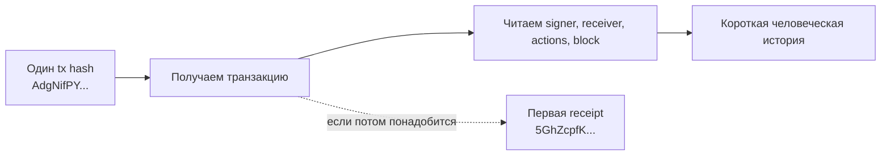
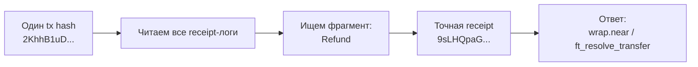
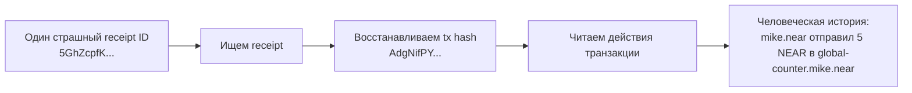
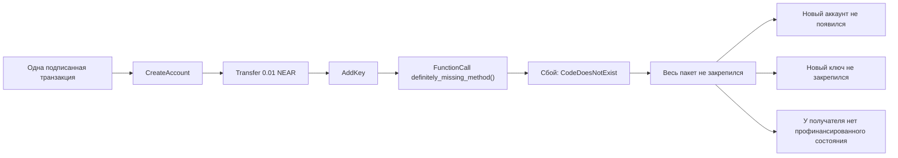
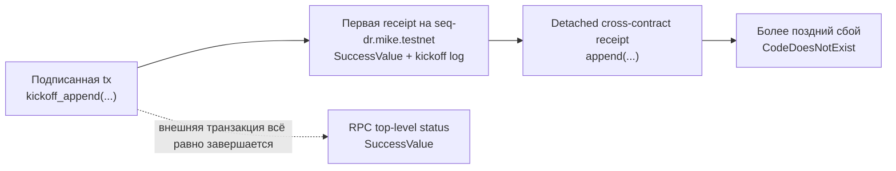
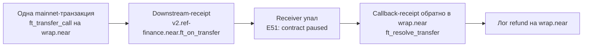

**Источник:** [https://docs.fastnear.com/ru/tx/examples](https://docs.fastnear.com/ru/tx/examples)

## Быстрый старт

Начните с одного tx hash и сначала получите самый короткий читаемый ответ.

```bash
TX_BASE_URL=https://tx.main.fastnear.com
TX_HASH=AdgNifPYpoDNS5ckfBZm36Ai6LuL5bTstuKsVdGjKwGp

curl -s "$TX_BASE_URL/v0/transactions" \
  -H 'content-type: application/json' \
  --data "$(jq -nc --arg tx_hash "$TX_HASH" '{tx_hashes: [$tx_hash]}')" \
  | jq '{
      transaction: {
        hash: .transactions[0].transaction.hash,
        signer_id: .transactions[0].transaction.signer_id,
        receiver_id: .transactions[0].transaction.receiver_id,
        included_block_height: .transactions[0].execution_outcome.block_height
      },
      actions: (
        .transactions[0].transaction.actions
        | map(if type == "string" then . else keys[0] end)
      ),
      first_receipt_id: .transactions[0].transaction_outcome.outcome.status.SuccessReceiptId,
      receipt_count: (.transactions[0].receipts | length)
    }'
```

Это самое короткое расследование на странице. Переходите к RPC или к receipt ID только если этого вывода уже мало.

Если нужен более развёрнутый case study на той же поверхности, переходите к [Berry Club case study](https://docs.fastnear.com/ru/tx/examples/berry-club) для исторического восстановления доски или к [OutLayer case study](https://docs.fastnear.com/ru/tx/examples/outlayer) для трассировки воркера и callback-цепочки.

## С чего начать

Здесь собраны самые маленькие полезные якоря на странице: сначала один tx hash, потом один receipt ID, и только затем более глубокая форензика.

### У меня есть один хеш транзакции. Что вообще произошло?

Используйте это расследование, когда история максимально простая: «мне прислали один хеш транзакции. Я просто хочу понять, сработала ли она, что именно сделала и в какой блок попала».

Это и есть входной пример beginner-to-intermediate для этой страницы. До receipt, promise-цепочек и форензики есть один более базовый навык, который нужен любому NEAR-инженеру: превратить голый tx hash в одну короткую человеческую историю.

    Стратегия
    Начните с читаемой записи о транзакции и переходите в RPC или receipts только если первого ответа оказалось недостаточно.

    01POST /v0/transactions даёт signer, receiver, типы действий, высоту блока и первую receipt-точку передачи.
    02RPC EXPERIMENTAL_tx_status нужен только для точной протокольной семантики успеха.
    03POST /v0/receipt имеет смысл только тогда, когда именно первая receipt становится новой опорной точкой.

**Цель**

- Начать с одного хеша транзакции и получить самый короткий полезный ответ: signer, receiver, тип действия, включающий блок и факт, что транзакция действительно ушла в успешный путь исполнения.

Для этого зафиксированного примера:

- хеш транзакции: `AdgNifPYpoDNS5ckfBZm36Ai6LuL5bTstuKsVdGjKwGp`
- signer: `mike.near`
- receiver: `global-counter.mike.near`
- высота включающего блока: `194263342`
- ID первой receipt: `5GhZcpfKWhrpaZo5Am74QfEUFQnZBz48G7hfoLPVDXcq`

Простой человеческий ответ для этого случая такой: `mike.near` отправил одну транзакцию с действием `Transfer` в адрес `global-counter.mike.near`, эта транзакция попала в блок `194263342`, и сеть передала её в одну успешную receipt.



| Поверхность | Эндпоинт | Как используем | Зачем используем |
| --- | --- | --- | --- |
| Читаемая история транзакции | Transactions API [`POST /v0/transactions`](https://docs.fastnear.com/ru/tx/transactions) | Стартуем с хеша транзакции и печатаем signer, receiver, включающий блок, список действий и handoff в первую receipt | Даёт самый быстрый читаемый ответ на вопрос «что вообще сделала эта транзакция?» |
| Каноническое продолжение по статусу | RPC [`EXPERIMENTAL_tx_status`](https://docs.fastnear.com/ru/rpc/transaction/experimental-tx-status) | Переиспользуем тот же хеш транзакции и signer только если нужны точные протокольные семантики статуса | Полезно, когда следующий вопрос уже звучит как «а по RPC это точно успех?» |
| Переход к receipt | Transactions API [`POST /v0/receipt`](https://docs.fastnear.com/ru/tx/receipt) | Переиспользуем ID первой receipt, если вопрос превращается в историю на уровне receipt | Даёт естественный мост к следующему расследованию, когда лучшим якорем становится уже не транзакция, а receipt |

**Что должен включать полезный ответ**

- кто подписал транзакцию
- какой аккаунт её получил
- какой тип действия она несла
- в какой блок попала
- одно простое предложение, которое объясняет транзакцию без receipt-жаргона

#### Shell-сценарий: от хеша транзакции к человеческой истории

Используйте этот сценарий, когда нужен самый короткий путь от одного tx hash к одному читаемому ответу.

**Что вы делаете**

- Получаете транзакцию по хешу и печатаете её основные поля.
- Подтверждаете финальный статус только если нужны точные RPC-семантики.
- Сохраняете первую receipt только как необязательный следующий шаг.

```bash
TX_BASE_URL=https://tx.main.fastnear.com
RPC_URL=https://rpc.mainnet.fastnear.com
TX_HASH=AdgNifPYpoDNS5ckfBZm36Ai6LuL5bTstuKsVdGjKwGp
SIGNER_ACCOUNT_ID=mike.near
```

1. Получите транзакцию и распечатайте базовую историю.

```bash
FIRST_RECEIPT_ID="$(
  curl -s "$TX_BASE_URL/v0/transactions" \
    -H 'content-type: application/json' \
    --data "$(jq -nc --arg tx_hash "$TX_HASH" '{tx_hashes: [$tx_hash]}')" \
    | tee /tmp/basic-tx-story.json \
    | jq -r '.transactions[0].transaction_outcome.outcome.status.SuccessReceiptId'
)"

jq '{
  transaction: {
    hash: .transactions[0].transaction.hash,
    signer_id: .transactions[0].transaction.signer_id,
    receiver_id: .transactions[0].transaction.receiver_id,
    included_block_height: .transactions[0].execution_outcome.block_height
  },
  actions: (
    .transactions[0].transaction.actions
    | map(if type == "string" then . else keys[0] end)
  ),
  first_receipt_id: .transactions[0].transaction_outcome.outcome.status.SuccessReceiptId,
  receipt_count: (.transactions[0].receipts | length)
}' /tmp/basic-tx-story.json

# Ожидаемый список действий: ["Transfer"]
# Ожидаемая первая receipt: 5GhZcpfKWhrpaZo5Am74QfEUFQnZBz48G7hfoLPVDXcq
```

2. Если нужны точные RPC-семантики статуса, подтвердите их через `EXPERIMENTAL_tx_status`.

```bash
curl -s "$RPC_URL" \
  -H 'content-type: application/json' \
  --data "$(jq -nc \
    --arg tx_hash "$TX_HASH" \
    --arg signer_account_id "$SIGNER_ACCOUNT_ID" '{
      jsonrpc: "2.0",
      id: "fastnear",
      method: "EXPERIMENTAL_tx_status",
      params: {
        tx_hash: $tx_hash,
        sender_account_id: $signer_account_id,
        wait_until: "FINAL"
      }
    }')" \
  | jq '{
      final_execution_status: .result.final_execution_status,
      status: .result.status,
      transaction_handoff: .result.transaction_outcome.outcome.status
    }'
```

3. Если следующий вопрос уже звучит как «что это была за первая receipt?», один раз перейдите по ней и остановитесь.

```bash
curl -s "$TX_BASE_URL/v0/receipt" \
  -H 'content-type: application/json' \
  --data "$(jq -nc --arg receipt_id "$FIRST_RECEIPT_ID" '{receipt_id: $receipt_id}')" \
  | jq '{
      receipt_id: .receipt.receipt_id,
      receiver_id: .receipt.receiver_id,
      is_success: .receipt.is_success,
      receipt_block_height: .receipt.block_height,
      transaction_hash: .receipt.transaction_hash
    }'
```

Последний шаг специально сделан необязательным. Если вам нужна была только история транзакции, уже первого шага достаточно. Двигайтесь дальше только когда сама receipt становится новым якорем.

**Зачем нужен следующий шаг?**

`POST /v0/transactions` — это самый чистый старт, когда у вас на руках только tx hash и нужен один читаемый ответ. RPC нужен как продолжение для точных семантик статуса. `POST /v0/receipt` — это handoff на случай, когда следующий вопрос уже относится не ко всей транзакции, а к одной receipt внутри неё.

### Какая receipt выдала этот лог или event?

Используйте это расследование, когда история звучит так: «у меня есть один tx hash и один фрагмент лога, и мне нужно точно понять, какая именно receipt его выдала».

Это другой вопрос, чем более поздний сценарий «дошёл ли callback?». Здесь цель проще: привязать одну наблюдаемую строку лога к одному точному `receipt_id`, одному методу и одному исполнителю.

    Стратегия
    Один раз получите список receipt, отфильтруйте его по фрагменту лога и остановитесь, как только одна receipt окажется владельцем этого лога.

    01POST /v0/transactions даёт полный индексированный список receipt для одного tx hash, включая receipt-логи.
    02jq сужает этот список до receipt, в логах которых встречается нужный вам фрагмент.
    03Как только совпадение осталось одно, сохраняйте его receipt_id, executor и имя метода как точный ответ.

**Цель**

- Начать с одного mainnet tx hash и одного фрагмента лога и определить точную receipt, которая выдала этот лог.

Для этого зафиксированного mainnet-примера используйте:

- хеш транзакции: `2KhhB1uDScGCFQfVchep7DiZTGTxMcgfUYHNzwf5e6uL`
- фрагмент лога: `Refund`
- ожидаемый matching `receipt_id`: `9sLHQpaGz3NnMNMn8zGrDUSyktR1q6ts2otr9mHkfD1w`
- ожидаемый executor: `wrap.near`
- ожидаемый метод: `ft_resolve_transfer`

Эта транзакция полезна тем, что в ней есть две разные logged receipt внутри одной истории:

- ранний лог `Transfer ...` на receipt с `ft_transfer_call`
- более поздний лог `Refund ...` на receipt с `ft_resolve_transfer`



| Поверхность | Эндпоинт | Как используем | Зачем используем |
| --- | --- | --- | --- |
| Атрибуция лога | Transactions API [`POST /v0/transactions`](https://docs.fastnear.com/ru/tx/transactions) | Один раз получаем транзакцию и фильтруем её receipt по фрагменту лога вроде `Refund` | Даёт самый короткий путь от одной наблюдаемой строки лога к точной receipt, которая её выдала |
| Необязательный следующий pivot | Transactions API [`POST /v0/receipt`](https://docs.fastnear.com/ru/tx/receipt) | Переиспользуем найденный `receipt_id` только если сама receipt становится следующим якорем | Позволяет сохранить receipt для следующего расследования, не раздувая сам пример |

**Что должен включать полезный ответ**

- какой `receipt_id` выдал лог
- какой контракт исполнил эту receipt
- какой метод там выполнился
- точную строку лога, которая совпала
- одно простое предложение вроде «лог `Refund` пришёл из `wrap.near` в receipt с методом `ft_resolve_transfer`»

#### Shell-сценарий атрибуции лога

Используйте этот сценарий, когда у вас уже есть tx hash и следующий вопрос звучит как «какая receipt это сказала?»

**Что вы делаете**

- Один раз получаете транзакцию и сохраняете список её receipt.
- Фильтруете receipt по одному фрагменту лога.
- Останавливаетесь, как только у вас есть один точный `receipt_id`, один executor и одно имя метода.

```bash
TX_BASE_URL=https://tx.main.fastnear.com
TX_HASH=2KhhB1uDScGCFQfVchep7DiZTGTxMcgfUYHNzwf5e6uL
LOG_FRAGMENT=Refund
```

1. Получите транзакцию и сохраните список receipt.

```bash
curl -s "$TX_BASE_URL/v0/transactions" \
  -H 'content-type: application/json' \
  --data "$(jq -nc --arg tx_hash "$TX_HASH" '{tx_hashes: [$tx_hash]}')" \
  | tee /tmp/log-attribution-transaction.json >/dev/null
```

2. Отфильтруйте список receipt до логов, которые содержат нужный вам фрагмент.

```bash
jq --arg fragment "$LOG_FRAGMENT" '{
  transaction: {
    hash: .transactions[0].transaction.hash,
    signer_id: .transactions[0].transaction.signer_id,
    receiver_id: .transactions[0].transaction.receiver_id
  },
  matching_receipts: [
    .transactions[0].receipts[]
    | select(any(.execution_outcome.outcome.logs[]?; contains($fragment)))
    | {
        receipt_id: .receipt.receipt_id,
        predecessor_id: .receipt.predecessor_id,
        receiver_id: .receipt.receiver_id,
        method_name: (.receipt.receipt.Action.actions[0].FunctionCall.method_name // "transfer"),
        block_height: .execution_outcome.block_height,
        logs: .execution_outcome.outcome.logs
      }
  ]
}' /tmp/log-attribution-transaction.json

# На что смотреть:
# - фрагмент `Refund` совпадает ровно с одной receipt
# - это receipt 9sLHQpaGz3NnMNMn8zGrDUSyktR1q6ts2otr9mHkfD1w
# - receipt исполнилась на wrap.near
# - имя метода — ft_resolve_transfer
```

3. Если хотите увидеть все logged receipt рядом, распечатайте только те receipt, где вообще были логи.

```bash
jq '{
  logged_receipts: [
    .transactions[0].receipts[]
    | select((.execution_outcome.outcome.logs | length) > 0)
    | {
        receipt_id: .receipt.receipt_id,
        receiver_id: .receipt.receiver_id,
        method_name: (.receipt.receipt.Action.actions[0].FunctionCall.method_name // "transfer"),
        logs: .execution_outcome.outcome.logs
      }
  ]
}' /tmp/log-attribution-transaction.json
```

Это последнее сравнение полезно тем, что оно показывает: атрибуция лога здесь не строится на догадке. В этой транзакции есть больше одной logged receipt, и фрагмент `Refund` принадлежит одной конкретной более поздней receipt, а не транзакции в целом.

**Зачем нужен следующий шаг?**

Receipt-логи живут на уровне receipt, а не на каком-то абстрактном объекте верхнего уровня. `POST /v0/transactions` уже достаточно, чтобы привязать одну строку лога к одной точной receipt без ухода в более глубокую async-трассировку.

### Превратить один страшный receipt ID из логов в понятную человеческую историю

Используйте это расследование, когда у вас на руках только один страшный `receipt_id` из логов, трассы или отчёта об ошибке, а нужно превратить его в простой ответ, который поймёт коллега без расшифровки receipt-полей.

Если у вас уже есть хеш транзакции, а не receipt ID, начните с более простого расследования прямо выше и опускайтесь сюда только тогда, когда сама receipt становится лучшим якорем.

    Стратегия
    Сначала разрешите сам receipt, затем восстановите родительскую транзакцию и остановитесь, как только история стала читаемой.

    01POST /v0/receipt показывает, к какой транзакции и к какому блоку исполнения относится receipt.
    02POST /v0/transactions превращает этот сырой receipt в контекст signer, receiver и действий.
    03RPC tx status — это уже необязательный следующий шаг, когда «человеческая история» превращается в «нужна точная семантика протокола».

**Цель**

- Начать с одного receipt ID и восстановить самую короткую полезную историю: кто его создал, где он исполнился, какая транзакция его породила и что эта транзакция вообще пыталась сделать.

Для этого зафиксированного примера «страшный receipt ID из логов» такой:

- receipt ID: `5GhZcpfKWhrpaZo5Am74QfEUFQnZBz48G7hfoLPVDXcq`
- хеш исходной транзакции: `AdgNifPYpoDNS5ckfBZm36Ai6LuL5bTstuKsVdGjKwGp`
- signer: `mike.near`
- receiver: `global-counter.mike.near`
- высота блока транзакции: `194263342`
- высота блока исполнения receipt: `194263343`

Человеческая история за этим receipt простая: `mike.near` подписал обычную транзакцию `Transfer` в адрес `global-counter.mike.near`, сеть превратила её в одну квитанцию с действием, а эта квитанция успешно исполнилась в следующем блоке.



| Поверхность | Эндпоинт | Как используем | Зачем используем |
| --- | --- | --- | --- |
| Якорь по квитанции | Transactions API [`POST /v0/receipt`](https://docs.fastnear.com/ru/tx/receipt) | Сначала ищем ID квитанции и печатаем аккаунты, блок исполнения, флаг успеха и связанный хеш транзакции | Даёт самый короткий путь от сырого receipt ID к пониманию, что вообще за объект перед вами |
| История транзакции | Transactions API [`POST /v0/transactions`](https://docs.fastnear.com/ru/tx/transactions) | Переиспользуем полученный хеш транзакции и печатаем signer, receiver, упорядоченные действия и включающий блок | Превращает сырую квитанцию в читаемую историю того, что signer на самом деле отправил |
| Каноническое продолжение | RPC [`tx`](https://docs.fastnear.com/ru/rpc/transaction/tx-status) или [`EXPERIMENTAL_tx_status`](https://docs.fastnear.com/ru/rpc/transaction/experimental-tx-status) | Подтверждаем протокольные семантики только если индексированного ответа всё ещё недостаточно | Полезно, когда вопрос меняется с «расскажи мне историю» на «покажи точную RPC-семантику статуса» |

**Что должен включать полезный ответ**

- какие аккаунты создали и исполнили квитанцию
- к какой транзакции относится эта квитанция
- что транзакция на самом деле сделала
- была ли квитанция главным событием или только шагом в большом каскаде
- одно предложение простым языком, которое можно без правок вставить коллеге в чат

#### Shell-сценарий: от страшного receipt ID к человеческой истории

```bash
TX_BASE_URL=https://tx.main.fastnear.com
RECEIPT_ID='5GhZcpfKWhrpaZo5Am74QfEUFQnZBz48G7hfoLPVDXcq'
```

1. Разрешите receipt и поймите, что за объект вы смотрите.

```bash
TX_HASH="$(
  curl -s "$TX_BASE_URL/v0/receipt" \
    -H 'content-type: application/json' \
    --data "$(jq -nc --arg receipt_id "$RECEIPT_ID" '{receipt_id: $receipt_id}')" \
    | tee /tmp/receipt-lookup.json \
    | jq -r '.receipt.transaction_hash'
)"

jq '{
  receipt: {
    receipt_id: .receipt.receipt_id,
    predecessor_id: .receipt.predecessor_id,
    receiver_id: .receipt.receiver_id,
    receipt_type: .receipt.receipt_type,
    is_success: .receipt.is_success,
    receipt_block_height: .receipt.block_height,
    transaction_hash: .receipt.transaction_hash,
    tx_block_height: .receipt.tx_block_height
  }
}' /tmp/receipt-lookup.json
```

2. Переиспользуйте хеш транзакции и превратите квитанцию в читаемую историю транзакции.

```bash
curl -s "$TX_BASE_URL/v0/transactions" \
  -H 'content-type: application/json' \
  --data "$(jq -nc --arg tx_hash "$TX_HASH" '{tx_hashes: [$tx_hash]}')" \
  | tee /tmp/receipt-parent-transaction.json >/dev/null

jq '{
  transaction: {
    transaction_hash: .transactions[0].transaction.hash,
    signer_id: .transactions[0].transaction.signer_id,
    receiver_id: .transactions[0].transaction.receiver_id,
    tx_block_height: .transactions[0].execution_outcome.block_height,
    action_types: (
      .transactions[0].transaction.actions
      | map(if type == "string" then . else keys[0] end)
    ),
    transfer_deposit_yocto: (
      .transactions[0].transaction.actions[0].Transfer.deposit // null
    )
  },
  receipt_count: (.transactions[0].receipts | length)
}' /tmp/receipt-parent-transaction.json
```

3. Сведите это к одному человеческому предложению.

```bash
jq -r '
  .transactions[0] as $tx
  | "Receipt \($tx.execution_outcome.outcome.receipt_ids[0]) относится к tx \($tx.transaction.hash): \($tx.transaction.signer_id) отправил 5 NEAR в \($tx.transaction.receiver_id). Транзакция попала в блок \($tx.execution_outcome.block_height), а receipt успешно исполнился в блоке \($tx.receipts[0].execution_outcome.block_height)."
' /tmp/receipt-parent-transaction.json
```

Для другого receipt держитесь того же шаблона, но поменяйте финальное предложение так, чтобы оно соответствовало типам действий, которые вы только что напечатали.

В этом и состоит ключевой приём: не нужно объяснять каждое поле квитанции. Нужно восстановить ровно столько контекста, чтобы сказать, что сделал signer, где исполнился receipt и был ли этот receipt главным событием или только шагом в более крупном каскаде.

**Зачем нужен следующий шаг?**

`POST /v0/receipt` показывает, к чему привязан сырой receipt. `POST /v0/transactions` показывает, что signer на самом деле пытался сделать. Как только эти две части собраны вместе, чаще всего уже можно объяснить receipt одним предложением и только потом решать, нужны ли вообще контекст блока, история аккаунта или канонический RPC-статус.

## Ошибки и async

Здесь страница перестаёт быть просто поиском по объектам и начинает объяснять семантику исполнения в NEAR: атомарность пакета действий, более поздние async-сбои и то, дошёл ли callback обратно до исходного контракта.

Используйте этот раздел, когда уже понятно, что транзакция жила дольше одной receipt, и следующий вопрос относится уже к форме исполнения, а не к простому поиску объекта.

### Доказать, что одно неудачное действие сорвало весь пакет

Используйте это расследование, когда одна транзакция с несколькими действиями пыталась создать и пополнить новый аккаунт, добавить на него ключ, а затем вызвать метод на этом же новом аккаунте. Финальное действие упало, потому что у свежего аккаунта не было кода контракта. Настоящий вопрос здесь простой: закрепились ли ранние действия или весь пакет не сработал целиком?

В NEAR действия внутри одного пакета транзакции исполняются по порядку внутри первой квитанции с действиями. Если одно действие в этой квитанции падает, ранние действия из того же пакета тоже не закрепляются. Это отличается от более поздних асинхронных квитанций или promise-цепочек, где первая квитанция может пройти успешно, а уже следующая упасть отдельно.

    Стратегия
    Докажите, что пакет пытался сделать, какое действие упало и закрепилось ли что-нибудь из ранних шагов.

    01POST /v0/transactions показывает упорядоченный пакет ровно в том виде, в каком его подписал signer.
    02RPC EXPERIMENTAL_tx_status показывает падающий FunctionCall и точную причину отказа на уровне протокола.
    03RPC view_account по предполагаемому новому аккаунту доказывает, закрепились ли вообще ранние create, fund и add-key действия.

**Цель**

- На примере одной зафиксированной транзакции из testnet доказать, что финальный `FunctionCall` упал, а ранние действия `CreateAccount`, `Transfer` и `AddKey` не закрепились.

**Официальные ссылки**

- [Основы транзакций](https://docs.fastnear.com/ru/transaction-flow/foundations)
- [Исполнение в рантайме](https://docs.fastnear.com/ru/transaction-flow/runtime-execution)

Этот зафиксированный сбой был получен в **testnet 18 апреля 2026 года**:

- хеш транзакции: `CrhH3xLzbNwNMGgZkgptXorwh8YmqxRGuA6Mc11MkU6M`
- аккаунт signer: `temp.mike.testnet`
- целевой новый аккаунт: `rollback-mo4vmkig.temp.mike.testnet`
- высота включающего блока: `246365118`
- хеш включающего блока: `6f5zTKDqQRwrxMywzvxeRvYcCERJmAnatJaqUEtQYUNM`
- порядок действий: `CreateAccount -> Transfer -> AddKey -> FunctionCall`
- упавший метод: `definitely_missing_method`
- RPC-ошибка: `CodeDoesNotExist` на `rollback-mo4vmkig.temp.mike.testnet`



| Поверхность | Эндпоинт | Как используем | Зачем используем |
| --- | --- | --- | --- |
| Задуманный пакет | Transactions API [`POST /v0/transactions`](https://docs.fastnear.com/ru/tx/transactions) | Загружаем зафиксированный хеш транзакции и печатаем упорядоченный список действий, получателя и метаданные включающего блока | Показывает, что именно signer пытался сделать, ещё до разговора о том, что закрепилось |
| Точное место сбоя | RPC [`EXPERIMENTAL_tx_status`](https://docs.fastnear.com/ru/rpc/transaction/experimental-tx-status) | Запрашиваем ту же транзакцию с `wait_until: "FINAL"` и смотрим `status.Failure` | Показывает, какое действие упало и почему весь пакет не закрепился на уровне протокола |
| Доказательство по состоянию после исполнения | RPC [`query(view_account)`](https://docs.fastnear.com/ru/rpc/account/view-account) | Запрашиваем предполагаемый новый аккаунт после finality | Если созданный аккаунт до сих пор не существует, значит ранние `CreateAccount`, `Transfer` и `AddKey` из того же пакета действий тоже не закрепились |

Перед shell-сценарием важно отметить одну деталь: индексированная запись транзакции всё ещё показывает `transaction_outcome.outcome.status = SuccessReceiptId`, потому что подписанная транзакция успешно превратилась в свою первую квитанцию с действиями. Но доказательство того, что весь пакет не закрепился, приходит из верхнеуровневого RPC `status.Failure` для этой первой квитанции и из проверки состояния после исполнения, что целевой новый аккаунт так и не появился.

**Что должен включать полезный ответ**

- точный порядок действий, который отправил signer
- какой индекс действия упал и почему
- высоту и хеш включающего блока для этого батча
- доказательство, что предполагаемый новый аккаунт всё ещё не существует после finality
- короткий вывод, что ранние `CreateAccount`, `Transfer` и `AddKey` не закрепились после падения финального `FunctionCall`

#### Shell-сценарий неудачной транзакции с пакетом действий

Используйте этот сценарий, когда нужен один конкретный неудачный пакет действий, который можно разобрать по шагам через публичные FastNear testnet-эндпоинты.

**Что вы делаете**

- Читаете индексированную запись транзакции, чтобы восстановить задуманный пакет действий.
- Через RPC transaction status доказываете, что финальный `FunctionCall` действительно упал и сорвал весь пакет.
- Через один RPC-запрос к состоянию после исполнения доказываете, что новый аккаунт так и не появился после finality.

```bash
TX_BASE_URL=https://tx.test.fastnear.com
RPC_URL=https://rpc.testnet.fastnear.com
TX_HASH=CrhH3xLzbNwNMGgZkgptXorwh8YmqxRGuA6Mc11MkU6M
SIGNER_ACCOUNT_ID=temp.mike.testnet
NEW_ACCOUNT_ID=rollback-mo4vmkig.temp.mike.testnet
```

1. Получите транзакцию и распечатайте задуманный пакет действий.

```bash
curl -s "$TX_BASE_URL/v0/transactions" \
  -H 'content-type: application/json' \
  --data "$(jq -nc --arg tx_hash "$TX_HASH" '{tx_hashes: [$tx_hash]}')" \
  | tee /tmp/failed-batch-transaction.json >/dev/null

jq '{
  transaction: {
    hash: .transactions[0].transaction.hash,
    signer_id: .transactions[0].transaction.signer_id,
    receiver_id: .transactions[0].transaction.receiver_id,
    included_block_height: .transactions[0].execution_outcome.block_height,
    included_block_hash: .transactions[0].execution_outcome.block_hash
  },
  batch: {
    action_count: (.transactions[0].transaction.actions | length),
    action_types: (
      .transactions[0].transaction.actions
      | map(if type == "string" then . else keys[0] end)
    ),
    final_function_call_method_name: (
      .transactions[0].transaction.actions[3].FunctionCall.method_name
    )
  },
  first_receipt_handoff: .transactions[0].transaction_outcome.outcome.status
}' /tmp/failed-batch-transaction.json

# Ожидаемый порядок действий:
# 1. CreateAccount
# 2. Transfer
# 3. AddKey
# 4. FunctionCall
```

2. Запросите RPC transaction status и посмотрите точную верхнеуровневую ошибку.

```bash
curl -s "$RPC_URL" \
  -H 'content-type: application/json' \
  --data "$(jq -nc \
    --arg tx_hash "$TX_HASH" \
    --arg signer_account_id "$SIGNER_ACCOUNT_ID" '{
      jsonrpc: "2.0",
      id: "fastnear",
      method: "EXPERIMENTAL_tx_status",
      params: {
        tx_hash: $tx_hash,
        sender_account_id: $signer_account_id,
        wait_until: "FINAL"
      }
    }')" \
  | tee /tmp/failed-batch-rpc-status.json >/dev/null

jq '{
  final_execution_status: .result.final_execution_status,
  failed_action_index: .result.status.Failure.ActionError.index,
  failure: .result.status.Failure.ActionError.kind.FunctionCallError.CompilationError.CodeDoesNotExist
}' /tmp/failed-batch-rpc-status.json

# Ожидаемый failed_action_index: 3
# Ожидаемый failure account_id: rollback-mo4vmkig.temp.mike.testnet
```

3. Запросите предполагаемый новый аккаунт после finality и докажите, что его всё ещё нет.

```bash
curl -s "$RPC_URL" \
  -H 'content-type: application/json' \
  --data "$(jq -nc --arg account_id "$NEW_ACCOUNT_ID" '{
    jsonrpc: "2.0",
    id: "fastnear",
    method: "query",
    params: {
      request_type: "view_account",
      account_id: $account_id,
      finality: "final"
    }
  }')" \
  | tee /tmp/failed-batch-view-account.json >/dev/null

jq '{
  error: .error.cause.name,
  message: .error.data,
  requested_account_id: .error.cause.info.requested_account_id,
  proof_block_height: .error.cause.info.block_height
}' /tmp/failed-batch-view-account.json

# Ожидаемая ошибка: "UNKNOWN_ACCOUNT"
```

Этой одной проверки состояния после исполнения здесь достаточно. Если бы `CreateAccount` закрепился, `view_account` вернул бы аккаунт. Раз аккаунт до сих пор не существует, значит ранние `Transfer` и `AddKey` из той же квитанции с действиями тоже не закрепились.

**Зачем нужен следующий шаг?**

Для любой другой неудачной транзакции с несколькими действиями держитесь того же шаблона: сначала прочитайте, что транзакция пыталась сделать, через [`POST /v0/transactions`](https://docs.fastnear.com/ru/tx/transactions), затем подтвердите точную верхнеуровневую ошибку через RPC transaction status, а потом проверьте состояние после исполнения у аккаунта, ключа, контракта или другого объекта, который должен был измениться, если бы ранние действия закрепились.

### Почему вызов контракта выглядел успешным, а потом упал более поздний receipt?

Используйте это расследование, когда один вызов контракта залогировал успех, изменил своё локальное состояние, и даже верхнеуровневый RPC `status` выглядит успешным, но приложение всё равно сломалось, потому что позже упал отдельный cross-contract receipt.

Это противоположность примеру с неудачным пакетом действий выше. Там одно действие упало внутри первой action-receipt, поэтому не закрепилось ничего из этого пакета. Здесь первая receipt контракта действительно прошла успешно, и её изменение состояния действительно закрепилось. Сбой случился позже, в отдельной receipt.

    Стратегия
    Сначала получаем человеческий таймлайн, а уже потом доказываем, где именно async-история разошлась.

    01POST /v0/transactions даёт самый удобный первый проход: какая receipt успела пройти первой и какая упала позже.
    02RPC EXPERIMENTAL_tx_status доказывает важную NEAR-деталь: верхнеуровневый успех и более поздний сбой потомка могут одновременно быть правдой.
    03Как только эти два представления сходятся на одном и том же разрезе истории, остановитесь. Этот пример держится за сохранённые исторические свидетельства, а не за живой read состояния роутера.

**Цель**

- Доказать по одной зафиксированной testnet-транзакции, что `seq-dr.mike.testnet.kickoff_append(...)` успешно отработал на своей собственной receipt, а потом отдельный detached-вызов `append(...)` упал через один блок с `CodeDoesNotExist`.

**Официальные ссылки**

- [Основы транзакций](https://docs.fastnear.com/ru/transaction-flow/foundations)
- [Исполнение в рантайме](https://docs.fastnear.com/ru/transaction-flow/runtime-execution)

Этот зафиксированный асинхронный сбой был получен в **testnet 18 апреля 2026 года**:

- хеш транзакции: `AUciGAq54XZtEuVXA9bSq4k6h13LmspoKtLegcWGRmQz`
- аккаунт signer: `temp.mike.testnet`
- первый контракт-получатель: `seq-dr.mike.testnet`
- аккаунт detached-цели: `asyncfail-in2hwikn.temp.mike.testnet`
- блок включения транзакции: `246368568`
- успешная первая receipt: `6XgWxB9QVkgGKJaLcjDphGHYTK5d1suNe2cH1WHRWnoS` в блоке `246368569`
- более поздняя упавшая receipt: `2A5JG8N1BxyR57WbrjqntTSf1UwR4RXR79MD2Zg3K2es` в блоке `246368570`
- первый метод: `kickoff_append`
- более поздний упавший метод: `append`
- верхнеуровневый RPC `status`: `SuccessValue`



| Поверхность | Эндпоинт | Как используем | Зачем используем |
| --- | --- | --- | --- |
| Каркас транзакции | Transactions API [`POST /v0/transactions`](https://docs.fastnear.com/ru/tx/transactions) | Загружаем зафиксированную транзакцию и печатаем включающий блок плюс таймлайн receipt | Даёт самый короткий читаемый обзор: какая receipt отработала первой и какая упала позже |
| Точные семантики статуса | RPC [`EXPERIMENTAL_tx_status`](https://docs.fastnear.com/ru/rpc/transaction/experimental-tx-status) | Смотрим верхнеуровневый `status`, outcome первой receipt контракта и outcome более поздней упавшей receipt | Доказывает, что верхнеуровневый успех и более поздний сбой потомка могут сосуществовать в одной async-истории |

Здесь важна одна NEAR-деталь: успех receipt не является транзитивным. `seq-dr.mike.testnet` вернул успех на своей собственной receipt, потому что `kickoff_append(...)` только залогировал событие и detached-нул следующий hop. Detached-receipt `append(...)` была уже отдельной частью async-работы, поэтому её более поздний сбой не меняет того факта, что собственная receipt роутера уже успешно завершилась.

**Что должен включать полезный ответ**

- что подписанная транзакция успешно передала управление в первую router-receipt
- что сама router-receipt завершилась успешно и выдала лог `dishonest_router:kickoff:late-failure`
- что более поздняя detached-receipt в `asyncfail-in2hwikn.temp.mike.testnet` упала с `CodeDoesNotExist`
- что RPC всё ещё показывает верхнеуровневый `SuccessValue`, хотя более поздняя detached-receipt упала
- одно предложение, которое объясняет, почему это отличается от неудачной батч-транзакции

#### Shell-сценарий более позднего сбоя receipt

Используйте этот сценарий, когда история звучит так: «вызов контракта выглядел нормальным, но потом что-то упало, и мне надо точно доказать, где история разошлась».

**Что вы делаете**

- Читаете транзакцию и её таймлайн receipt из индексированного представления.
- Через RPC transaction status показываете, что верхнеуровневая история всё равно закончилась `SuccessValue`, хотя более поздняя receipt упала.
- Останавливаетесь, как только эти два сохранённых представления сходятся на одном и том же разрезе истории.

```bash
TX_BASE_URL=https://tx.test.fastnear.com
RPC_URL=https://rpc.testnet.fastnear.com
TX_HASH=AUciGAq54XZtEuVXA9bSq4k6h13LmspoKtLegcWGRmQz
SIGNER_ACCOUNT_ID=temp.mike.testnet
FIRST_RECEIPT_ID=6XgWxB9QVkgGKJaLcjDphGHYTK5d1suNe2cH1WHRWnoS
FAILED_RECEIPT_ID=2A5JG8N1BxyR57WbrjqntTSf1UwR4RXR79MD2Zg3K2es
```

1. Получите транзакцию и распечатайте таймлайн receipt по порядку блоков.

```bash
curl -s "$TX_BASE_URL/v0/transactions" \
  -H 'content-type: application/json' \
  --data "$(jq -nc --arg tx_hash "$TX_HASH" '{tx_hashes: [$tx_hash]}')" \
  | tee /tmp/later-receipt-failure-transaction.json >/dev/null

jq '{
  transaction: {
    hash: .transactions[0].transaction.hash,
    signer_id: .transactions[0].transaction.signer_id,
    receiver_id: .transactions[0].transaction.receiver_id,
    tx_block_height: .transactions[0].execution_outcome.block_height,
    tx_handoff: .transactions[0].transaction_outcome.outcome.status
  },
  receipts: [
    .transactions[0].receipts[]
    | {
        receipt_id: .receipt.receipt_id,
        receiver_id: .receipt.receiver_id,
        block_height: .execution_outcome.block_height,
        method_name: (.receipt.receipt.Action.actions[0].FunctionCall.method_name // "system_transfer"),
        status: .execution_outcome.outcome.status
      }
  ]
}' /tmp/later-receipt-failure-transaction.json

# На что смотреть:
# - первая receipt контракта на seq-dr.mike.testnet успешно прошла в блоке 246368569
# - более поздняя receipt append(...) упала в блоке 246368570
```

2. Запросите RPC transaction status и сравните верхнеуровневую историю с более поздней упавшей receipt.

```bash
curl -s "$RPC_URL" \
  -H 'content-type: application/json' \
  --data "$(jq -nc \
    --arg tx_hash "$TX_HASH" \
    --arg signer_account_id "$SIGNER_ACCOUNT_ID" '{
      jsonrpc: "2.0",
      id: "fastnear",
      method: "EXPERIMENTAL_tx_status",
      params: {
        tx_hash: $tx_hash,
        sender_account_id: $signer_account_id,
        wait_until: "FINAL"
      }
    }')" \
  | tee /tmp/later-receipt-failure-rpc.json >/dev/null

jq \
  --arg first_receipt_id "$FIRST_RECEIPT_ID" \
  --arg failed_receipt_id "$FAILED_RECEIPT_ID" '{
    top_level_status: .result.status,
    transaction_handoff: .result.transaction_outcome.outcome.status,
    first_contract_receipt: (
      .result.receipts_outcome[]
      | select(.id == $first_receipt_id)
      | {
          receipt_id: .id,
          executor_id: .outcome.executor_id,
          logs: .outcome.logs,
          status: .outcome.status
        }
    ),
    later_failed_receipt: (
      .result.receipts_outcome[]
      | select(.id == $failed_receipt_id)
      | {
          receipt_id: .id,
          executor_id: .outcome.executor_id,
          status: .outcome.status
        }
    )
  }' /tmp/later-receipt-failure-rpc.json

# На что смотреть:
# - top_level_status всё ещё равен SuccessValue
# - первая receipt контракта залогировала dishonest_router:kickoff:late-failure
# - более поздняя receipt append(...) упала с CodeDoesNotExist
```

Остановитесь здесь. По состоянию на **18 апреля 2026 года** `seq-dr.mike.testnet` больше не резолвится в testnet, поэтому живое доказательство через текущее состояние роутера уже было бы неточным. Индексированный таймлайн receipt вместе с `EXPERIMENTAL_tx_status` и есть те сохранённые исторические свидетельства, которые здесь действительно важны.

**Зачем нужен следующий шаг?**

Когда NEAR-приложение «как будто прошло успешно», а потом всё равно сломалось, надо спрашивать не только «какой был статус транзакции?», но и «какая receipt завершилась успешно, а какая позже упала?» Этот пример как раз даёт такой разрез: индексированный таймлайн receipt для общей формы, RPC status для точных семантик и никакого притворного живого read состояния роутера после того, как исторический контракт исчез.

### Дошёл ли callback вообще?

Используйте это расследование, когда одна транзакция запустила downstream-работу на другом контракте, а настоящий вопрос звучит не как «успешно ли отработал receiver?», а как «вернулся ли callback обратно в исходный контракт?»

Это самый короткий полезный сценарий про callback на странице:

- стартуйте с одного tx hash
- найдите downstream-receipt на другом контракте
- найдите более поздний callback-receipt, который вернулся в исходный контракт
- остановитесь, как только доказаны сам факт callback и его результат

    Стратегия
    Сначала используйте индексированный список receipt, а к RPC переходите только если нужна каноническая семантика callback-а.

    01POST /v0/transactions показывает downstream-вызов и более поздний receipt, который возвращается в исходный контракт.
    02jq сужает этот список receipt до одного downstream-вызова и одного callback-receipt.
    03RPC EXPERIMENTAL_tx_status нужен только как дополнительное подтверждение, если вам важны канонический результат callback-а и его логи.

**Цель**

- Доказать на одном фиксированном mainnet-примере, что `wrap.near` отправил `ft_transfer_call` в `v2.ref-finance.near`, receiver выполнил `ft_on_transfer`, а затем `wrap.near` получил callback `ft_resolve_transfer` обратно.

Этот фиксированный mainnet-пример с callback был замечен **19 апреля 2026 года**:

- хеш транзакции: `2KhhB1uDScGCFQfVchep7DiZTGTxMcgfUYHNzwf5e6uL`
- аккаунт-отправитель: `7c5206b1b75b8787420b09d8697e08180cdf896c5fcf15f6afbf5f33fcc3cf72`
- исходный контракт: `wrap.near`
- downstream-receiver: `v2.ref-finance.near`
- верхнеуровневый метод: `ft_transfer_call`
- downstream-метод: `ft_on_transfer`
- callback-метод: `ft_resolve_transfer`
- блок транзакции: `194692298`
- блок downstream-receipt: `194692300`
- блок callback-receipt: `194692301`



Здесь хорошо видна одна полезная деталь NEAR: downstream-сбой не означает, что callback исчез. В этом случае `v2.ref-finance.near` уронил свой `ft_on_transfer`, но `wrap.near` всё равно позже получил `ft_resolve_transfer` и залогировал refund.

| Поверхность | Эндпоинт | Как используем | Зачем используем |
| --- | --- | --- | --- |
| Индексированная цепочка receipt | Transactions API [`POST /v0/transactions`](https://docs.fastnear.com/ru/tx/transactions) | Стартуем с tx hash и печатаем только downstream-receipt на receiver и более поздний callback-receipt на исходном контракте | Даёт самый быстрый читаемый ответ на вопрос «вернулся ли callback?» |
| Каноническое подтверждение receipt | RPC [`EXPERIMENTAL_tx_status`](https://docs.fastnear.com/ru/rpc/transaction/experimental-tx-status) | Переиспользуем тот же tx hash и sender только если нужен канонический статус callback-receipt и его логи | Полезно, когда индексированного ответа хватает для формы, но нужен протокольно-канонический proof |

**Что должен включать полезный ответ**

- какой контракт получил downstream-вызов
- какой метод выполнился на downstream-контракте
- вернулся ли более поздний receipt в исходный контракт
- какой callback-метод там выполнился и в каком блоке
- одно простое предложение вроде «receiver упал, но исходный контракт всё равно получил callback и завершил перевод»

#### Shell-сценарий проверки callback-а

Используйте этот сценарий, когда нужен один конкретный proof callback-а без превращения страницы в полный курс по теории promises.

**Что вы делаете**

- Один раз получаете транзакцию и сужаете список receipt до downstream-вызова и callback-receipt.
- Переиспользуете ID callback-receipt только если ещё нужно каноническое RPC-подтверждение.
- Останавливаетесь сразу, как только можете сказать, вернулся ли callback и что он сделал.

```bash
TX_BASE_URL=https://tx.main.fastnear.com
RPC_URL=https://rpc.mainnet.fastnear.com
TX_HASH=2KhhB1uDScGCFQfVchep7DiZTGTxMcgfUYHNzwf5e6uL
SENDER_ACCOUNT_ID=7c5206b1b75b8787420b09d8697e08180cdf896c5fcf15f6afbf5f33fcc3cf72
ORIGIN_CONTRACT_ID=wrap.near
DOWNSTREAM_CONTRACT_ID=v2.ref-finance.near
```

1. Получите транзакцию и распечатайте downstream-receipt вместе с callback-receipt.

```bash
curl -s "$TX_BASE_URL/v0/transactions" \
  -H 'content-type: application/json' \
  --data "$(jq -nc --arg tx_hash "$TX_HASH" '{tx_hashes: [$tx_hash]}')" \
  | tee /tmp/callback-check-transaction.json >/dev/null

CALLBACK_RECEIPT_ID="$(
  jq -r --arg origin "$ORIGIN_CONTRACT_ID" '
    first(
      .transactions[0].receipts[]
      | select(
          .receipt.receiver_id == $origin
          and (.receipt.receipt.Action.actions[0].FunctionCall.method_name // "") == "ft_resolve_transfer"
        )
      | .receipt.receipt_id
    )
  ' /tmp/callback-check-transaction.json
)"

jq --arg origin "$ORIGIN_CONTRACT_ID" --arg downstream "$DOWNSTREAM_CONTRACT_ID" '{
  transaction: {
    hash: .transactions[0].transaction.hash,
    signer_id: .transactions[0].transaction.signer_id,
    receiver_id: .transactions[0].transaction.receiver_id,
    method_name: .transactions[0].transaction.actions[0].FunctionCall.method_name,
    tx_block_height: .transactions[0].execution_outcome.block_height
  },
  downstream_receipt: (
    first(
      .transactions[0].receipts[]
      | select(.receipt.receiver_id == $downstream)
      | {
          receipt_id: .receipt.receipt_id,
          predecessor_id: .receipt.predecessor_id,
          receiver_id: .receipt.receiver_id,
          method_name: (.receipt.receipt.Action.actions[0].FunctionCall.method_name // "transfer"),
          status: .execution_outcome.outcome.status,
          block_height: .execution_outcome.block_height
        }
    )
  ),
  callback_receipt: (
    first(
      .transactions[0].receipts[]
      | select(
          .receipt.receiver_id == $origin
          and (.receipt.receipt.Action.actions[0].FunctionCall.method_name // "") == "ft_resolve_transfer"
        )
      | {
          receipt_id: .receipt.receipt_id,
          predecessor_id: .receipt.predecessor_id,
          receiver_id: .receipt.receiver_id,
          method_name: .receipt.receipt.Action.actions[0].FunctionCall.method_name,
          logs: .execution_outcome.outcome.logs,
          status: .execution_outcome.outcome.status,
          block_height: .execution_outcome.block_height
        }
    )
  ),
  callback_ran: (
    first(
      .transactions[0].receipts[]
      | select(
          .receipt.receiver_id == $origin
          and (.receipt.receipt.Action.actions[0].FunctionCall.method_name // "") == "ft_resolve_transfer"
        )
      | true
    ) // false
  )
}' /tmp/callback-check-transaction.json

# На что смотреть:
# - downstream-receipt выполнил ft_on_transfer на v2.ref-finance.near
# - более поздний callback-receipt выполнил ft_resolve_transfer на wrap.near
# - callback_ran равно true, даже несмотря на downstream-сбой
```

2. Если нужен канонический результат callback-а и лог refund, подтвердите тот же receipt через RPC.

```bash
curl -s "$RPC_URL" \
  -H 'content-type: application/json' \
  --data "$(jq -nc \
    --arg tx_hash "$TX_HASH" \
    --arg sender_account_id "$SENDER_ACCOUNT_ID" '{
      jsonrpc: "2.0",
      id: "fastnear",
      method: "EXPERIMENTAL_tx_status",
      params: {
        tx_hash: $tx_hash,
        sender_account_id: $sender_account_id,
        wait_until: "FINAL"
      }
    }')" \
  | tee /tmp/callback-check-rpc.json >/dev/null

jq --arg callback_receipt_id "$CALLBACK_RECEIPT_ID" '{
  top_level_status: .result.status,
  callback_receipt: (
    first(
      .result.receipts_outcome[]
      | select(.id == $callback_receipt_id)
      | {
          receipt_id: .id,
          executor_id: .outcome.executor_id,
          logs: .outcome.logs,
          status: .outcome.status
        }
    )
  )
}' /tmp/callback-check-rpc.json

# На что смотреть:
# - downstream ft_on_transfer receipt упал на v2.ref-finance.near
# - wrap.near всё равно позже получил ft_resolve_transfer
# - лог callback-а показывает refund обратно отправителю
```

**Зачем нужен следующий шаг?**

Для вопросов про callback главный proof звучит не как «все ли receipt прошли успешно?», а как «получил ли исходный контракт свой callback-receipt обратно и что там случилось?» `POST /v0/transactions` даёт самый быстрый читаемый ответ. RPC нужен только как дополнительный слой подтверждения, если важны канонический результат callback-а и его логи.

## Расширенные сценарии и case study

Примеры ниже всё ещё полезны, но они длиннее или более специализированы, чем основные start-here-сценарии выше. `Berry Club` и `OutLayer` вынесены в отдельные case-study-страницы, паттерн provenance для SocialDB теперь живёт на отдельной расширенной странице, а последний пример здесь оставляет только компактный multi-contract follow-up.

### Расширенный паттерн provenance для SocialDB

Если читаемый факт уже приходит из `api.near.social`, держите follow-up маленьким: сначала семантическое значение, затем `:block`, потом lookup по блоку и транзакции в FastNear. Для одного канонического примера такого сценария используйте [отдельную страницу паттерна provenance для SocialDB](https://docs.fastnear.com/ru/tx/socialdb-proofs).

### Расширенный сценарий: какие downstream-контракты затронула эта транзакция?

Используйте этот сценарий, когда у вас уже есть один multi-contract tx hash и следующий вопрос звучит просто: «в какие контракты ушёл этот вызов после top-level action?»

Этот зафиксированный mainnet-якорь по-прежнему хорошо подходит как пример, хотя сама транзакция и относится к `intents.near`:

- хеш транзакции: `4cfei8p4HBeNxJnCLjfShhDYGmXZwFVwFgY1sYpyygE7`
- аккаунт `signer` и `receiver`: `intents.near`
- высота включающего блока: `194573310`

Короткий ответ для этой tx уже полезен:

- top-level метод был `execute_intents`
- ранние downstream-receipt затронули `v2_1.omni.hot.tg` и `bridge-refuel.hot.tg`
- в более поздних логах были семейства событий вроде `token_diff`, `intents_executed`, `mt_transfer`, `mt_withdraw` и `mt_burn`

Для большинства вопросов достаточно Transactions API:

```bash
TX_BASE_URL=https://tx.main.fastnear.com
TX_HASH=4cfei8p4HBeNxJnCLjfShhDYGmXZwFVwFgY1sYpyygE7

curl -s "$TX_BASE_URL/v0/transactions" \
  -H 'content-type: application/json' \
  --data "$(jq -nc --arg tx_hash "$TX_HASH" '{tx_hashes: [$tx_hash]}')" \
  | jq '{
      transaction: {
        hash: .transactions[0].transaction.hash,
        signer_id: .transactions[0].transaction.signer_id,
        receiver_id: .transactions[0].transaction.receiver_id,
        method_name: .transactions[0].transaction.actions[0].FunctionCall.method_name
      },
      downstream_receivers: (
        [.transactions[0].receipts[] | .receipt.receiver_id]
        | unique
      ),
      first_logs: (
        [.transactions[0].receipts[] | .execution_outcome.outcome.logs[]?]
        | .[:5]
      )
    }'
```

Если нужен включающий блок, расширяйтесь один раз до Transactions API [`POST /v0/block`](https://docs.fastnear.com/ru/tx/block). Если нужен канонический DAG по receipt или сырые логи `EVENT_JSON`, расширяйтесь ещё на один шаг до RPC [`EXPERIMENTAL_tx_status`](https://docs.fastnear.com/ru/rpc/transaction/experimental-tx-status). Учебная идея здесь общая: начинайте с одного tx hash, перечислите downstream receiver-и и останавливайтесь, пока trace действительно не требует большего.

## Частые ошибки

- Пытаться отправлять транзакцию через history API вместо сырого RPC.
- Использовать Transactions API, когда пользователю нужны только текущие балансы или активы.
- Слишком рано уходить в сырой RPC до того, как индексированная история уже ответила на читаемый вопрос «что произошло?».
- Повторно использовать непрозрачные токены пагинации с другим эндпоинтом или другим набором фильтров.

## Полезные связанные страницы

- [Transactions API](https://docs.fastnear.com/ru/tx)
- [RPC Reference](https://docs.fastnear.com/ru/rpc)
- [FastNear API](https://docs.fastnear.com/ru/api)
- [NEAR Data API](https://docs.fastnear.com/ru/neardata)
- [Choosing the Right Surface](https://docs.fastnear.com/ru/agents/choosing-surfaces)
- [Agent Playbooks](https://docs.fastnear.com/ru/agents/playbooks)
