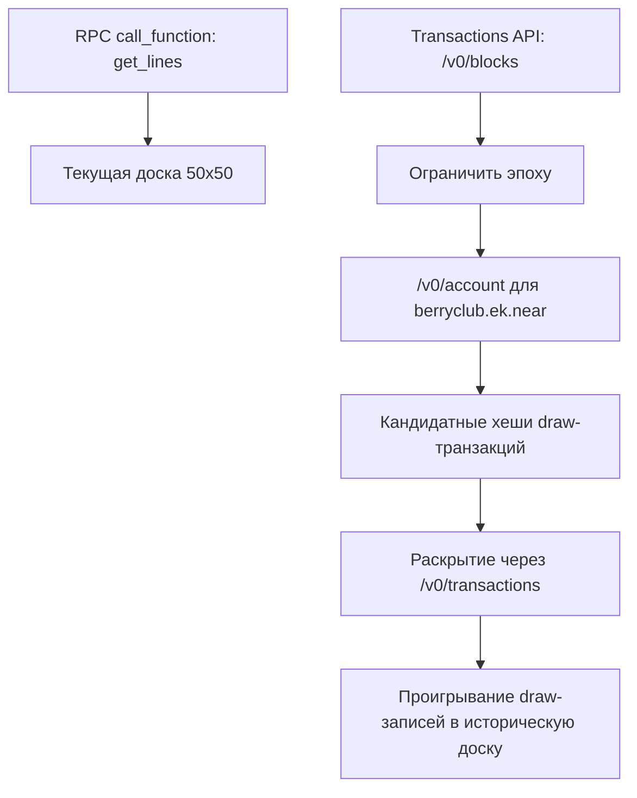

**Источник:** [https://docs.fastnear.com/ru/tx/examples/berry-club](https://docs.fastnear.com/ru/tx/examples/berry-club)

{/* FASTNEAR_AI_DISCOVERY: Этот подробный разбор показывает, как восстанавливать доски Berry Club через FastNear. Он отделяет текущее состояние из get_lines от исторического разбора через диапазоны блоков, историю аккаунта, раскрытие транзакций и проигрывание draw-аргументов. */}

# Berry Club: как восстанавливать исторические доски

Используйте этот разбор, когда вопрос звучит так: «как Berry Club выглядел в определённую эпоху и какие `draw`-вызовы сделали доску именно такой?»

Это read-only разбор из семейства Transactions examples. Если нужна только доска прямо сейчас, используйте `get_lines` и остановитесь. Если нужно объяснить, как доска пришла к такому виду, переключайтесь на историю блоков, историю аккаунта, раскрытые `draw`-вызовы и проигрывание.

    Стратегия
    Сначала прочитайте живую доску, затем ограничьте эпоху и только после этого проигрывайте draw-вызовы, которые её объясняют.

    01RPC call_function get_lines даёт текущую доску 50x50 и показывает, как выглядит «сейчас».
    02POST /v0/blocks вместе с POST /v0/account ограничивают одну эпоху и дают кандидатные хеши draw.
    03POST /v0/transactions раскрывает эти draw-вызовы, чтобы их можно было проиграть в исторические контрольные точки.

Держите рядом:

- [js.fastnear.com](https://js.fastnear.com/)
- [fastnear/js-monorepo](https://github.com/fastnear/js-monorepo)
- [Transactions API: история аккаунта](https://docs.fastnear.com/ru/tx/account)
- [Transactions API: транзакции по хешу](https://docs.fastnear.com/ru/tx/transactions)
- [Transactions API: диапазон блоков](https://docs.fastnear.com/ru/tx/blocks)
- [RPC: call_function](https://docs.fastnear.com/ru/rpc/contract/call-function)

В этом руководстве история Berry Club разбирается только на mainnet. Снимки ниже собраны из воспроизводимых данных mainnet, которые уже сохранены в этом репозитории.

## Короткая версия

Berry Club даёт чистый view текущего состояния через `get_lines`, но не даёт готового эндпоинта вида «доска на блоке N».

Из-за этого задача делится на две части:

- используйте RPC `call_function`, когда вопрос звучит как «как доска выглядит сейчас?»
- используйте индексированную историю, когда вопрос звучит как «какие записи привели к этой доске?»
- используйте архивный RPC только тогда, когда нужно напрямую материализовать уже известную контрольную точку



## Почему Berry Club хорошо учит истории в NEAR

Berry Club удобно показывает обе стороны задачи:

- чистое чтение текущего состояния через `get_lines`
- длинную историю вызовов `draw` с обычными аргументами `FunctionCall`
- формат доски, который легко декодировать и рендерить обычным JavaScript

Это очень NEAR-подобная форма: один view-метод для текущего состояния, один write-метод для изменений и индексированная история, когда нужно объяснить, как это состояние вообще появилось.

## 1. Сначала прочитайте текущую доску

Живое демо использует `berryclub.ek.near` и читает доску через view-вызов `get_lines`:

```javascript
await near.view({
  contractId: 'berryclub.ek.near',
  methodName: 'get_lines',
  args: {
    lines: [...Array(50).keys()],
  },
});
```

Это путь текущего состояния. Он не отвечает на вопрос, как доска пришла к такому виду.

| Вопрос | Лучшая поверхность | Почему |
| --- | --- | --- |
| как доска выглядит сейчас? | [RPC `call_function`](https://docs.fastnear.com/ru/rpc/contract/call-function) | контракт уже отдаёт текущее состояние через `get_lines` |
| какие `draw` были в этой эпохе? | [`/v0/account`](https://docs.fastnear.com/ru/tx/account) + [`/v0/transactions`](https://docs.fastnear.com/ru/tx/transactions) | индексированная история даёт ограниченный набор записей и раскрытые аргументы |
| как доска выглядела в известной контрольной точке? | архивный RPC или полное проигрывание | можно напрямую материализовать состояние из архива или восстановить его самому по историческим записям |

## 2. Как декодировать `get_lines` в сетку 50x50

Полезная часть Berry Club-разметки из `js.fastnear.com` — это декодер строк:

- каждая строка приходит в base64
- её нужно декодировать в байты
- первые 4 байта нужно пропустить
- дальше цвета читаются как 32-битные little-endian значения каждые 8 байт

```javascript
function decodeLine(encodedLine) {
  const bytes = Buffer.from(encodedLine, 'base64');
  const colors = [];

  for (let offset = 4; offset < bytes.length; offset += 8) {
    colors.push(bytes.readUInt32LE(offset) & 0xffffff);
  }

  return colors;
}
```

Примените это ко всем 50 строкам — и получите полную сетку 50x50, готовую к рендерингу.

## 3. Ограничьте эпоху, которую хотите изучить

Сначала ограничьте эпоху, прежде чем искать draw-записи. Проверочный снимок запуска в этом репозитории находится на блоке `21898354`, а средний снимок — на блоке `97601515`.

Сначала зафиксируйте ближайший диапазон блоков:

```bash
curl -sS https://tx.main.fastnear.com/v0/blocks \
  -H 'content-type: application/json' \
  --data '{
    "from_block_height": 21898350,
    "to_block_height": 21898355,
    "desc": false,
    "limit": 5
  }'
```

Затем переключитесь на историю аккаунта и запросите активность Berry Club внутри ограниченного диапазона блоков:

```bash
curl -sS https://tx.main.fastnear.com/v0/account \
  -H 'content-type: application/json' \
  --data '{
    "account_id": "berryclub.ek.near",
    "is_function_call": true,
    "is_receiver": true,
    "is_real_receiver": true,
    "from_tx_block_height": 97576515,
    "to_tx_block_height": 97601516,
    "desc": true,
    "limit": 40
  }'
```

Здесь полезна именно такая последовательность:

- `/v0/blocks` помогает понять соседство по высотам блоков
- `/v0/account` возвращает кандидатные хеши транзакций Berry Club внутри этого диапазона

## 4. Раскройте транзакции и оставьте только `draw`

Когда кандидатные хеши уже есть, раскройте их и оставьте только верхнеуровневые вызовы `draw`, где получатель — `berryclub.ek.near`.

Аргументы вызова — это обычные данные `FunctionCall` вида `{ pixels: [...] }`:

```bash
curl -sS https://tx.main.fastnear.com/v0/transactions \
  -H 'content-type: application/json' \
  --data '{
    "tx_hashes": [
      "Hq5qwsuiM2emJrqczWM9awCa7o6sTBYqYpcifUX2SUhQ",
      "8tBip5M2TrozhSyepAA3tYXpyKooi5t7b9c64wXjFvfL"
    ]
  }' | jq '.transactions[]
    | select(.transaction.receiver_id == "berryclub.ek.near")
    | .transaction.actions[]?.FunctionCall
    | select(.method_name == "draw")
    | {
        method_name,
        args: (.args | @base64d | fromjson)
      }'
```

Это даёт всё, что нужно для проигрывания:

- какая транзакция записывала пиксели
- какие координаты были затронуты
- какие цвета были записаны

## 5. Проиграйте исторические `draw`-вызовы в доску

Для полного проигрывания держите в памяти массив 50x50 и применяйте раскрытые транзакции `draw` от старых к новым.

```javascript
const board = Array.from({ length: 50 }, () => Array(50).fill(0));

function applyDraw(boardState, drawArgs) {
  for (const pixel of drawArgs.pixels) {
    if (pixel.x < 0 || pixel.x >= 50 || pixel.y < 0 || pixel.y >= 50) {
      continue;
    }

    boardState[pixel.y][pixel.x] = pixel.color;
  }
}

for (const drawTx of drawTransactionsOldestFirst) {
  applyDraw(board, drawTx.args);
}
```

Важно не путать два разных пути:

- `get_lines` — это текущее состояние
- `tx/account` плюс `tx/transactions` — это материал для проигрывания

## 6. Готовые контрольные точки по эпохам

Галерея ниже использует уже сохранённые данные снимков, собранные из mainnet-истории Berry Club:

- `launch` — последний успешный `draw` в пределах первых 24 часов после первого успешного draw
- `mid` — последний успешный `draw` не позже средней временной точки всей истории Berry Club
- `recent` — последний успешный `draw`, который увидел скрипт при пересборке снимков

Галерея снимков: контрольные точки launch, mid и recent из сохранённого `src/data/berryClubSnapshots.json`.

Сейчас эти снимки привязаны к таким транзакциям:

- `launch`: `BDNFpCpLXjBrgjR6z6wCZmB9EWdHnVMdqau3iTWTRE5H` на блоке `21898354`
- `mid`: `Hq5qwsuiM2emJrqczWM9awCa7o6sTBYqYpcifUX2SUhQ` на блоке `97601515`
- `recent`: `8tBip5M2TrozhSyepAA3tYXpyKooi5t7b9c64wXjFvfL` на блоке `194588754`

## Куда идти за подписанными взаимодействиями

Эта страница должна оставаться в режиме чтения.

Если нужны живые подписанные сценарии для `draw` и `buy_tokens`, переходите сюда:

- [js.fastnear.com](https://js.fastnear.com/)
- [Berry Club example в fastnear/js-monorepo](https://github.com/fastnear/js-monorepo/tree/main/examples/static/berryclub)

Именно там уместны кошелёк и подписанные действия. Эта страница посвящена историческому восстановлению.
