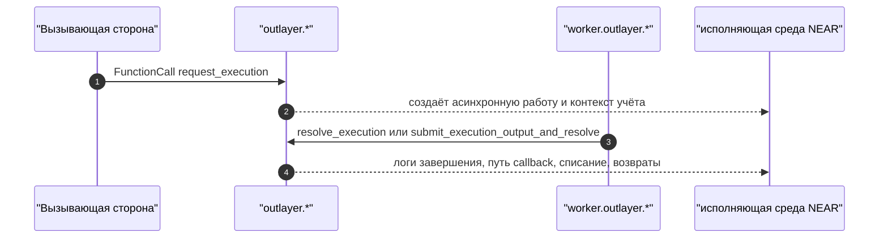
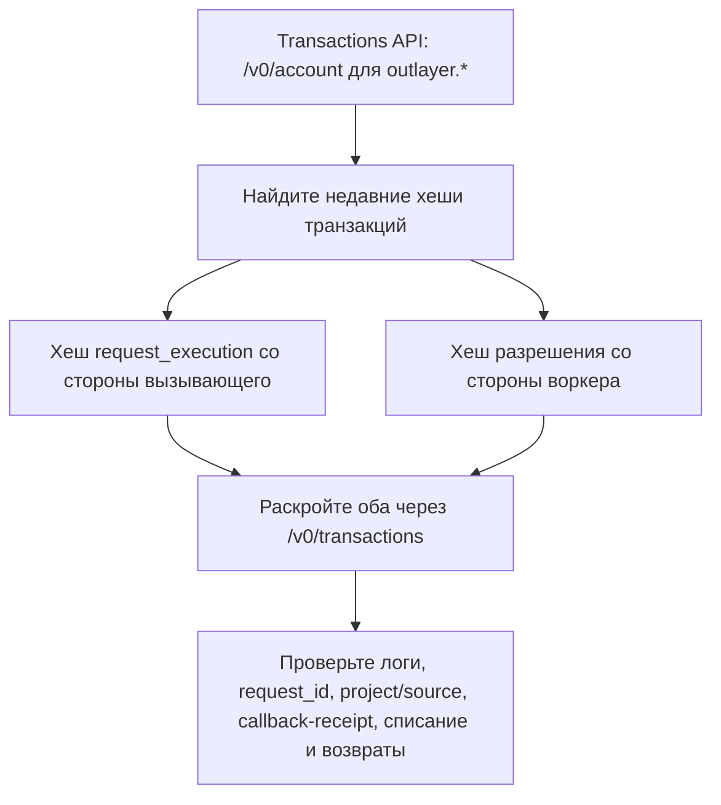
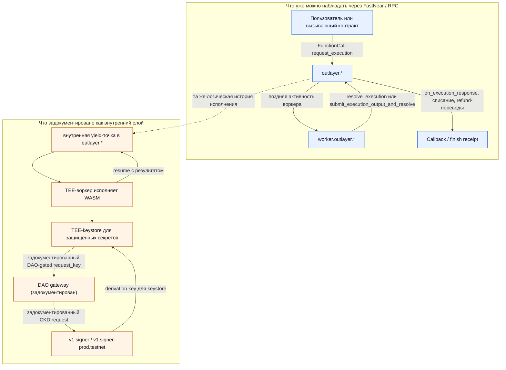

**Источник:** [https://docs.fastnear.com/ru/tx/examples/outlayer](https://docs.fastnear.com/ru/tx/examples/outlayer)

{/* FASTNEAR_AI_DISCOVERY: Этот подробный разбор показывает, как использовать FastNear RPC и Transactions API, чтобы разбирать живое исполнение OutLayer в терминах NEAR. Он отделяет видимый request/worker/callback-поток, который уже можно трассировать через FastNear, от задокументированного внутреннего пути yield/resume и CKD/MPC. */}

# OutLayer: как проследить один запрос от вызова до callback

Используйте этот разбор, когда вопрос звучит так: «я вижу OutLayer в цепочке. Какая транзакция открыла работу, какая более поздняя транзакция пришла от воркера и где проявились callback, списание и возврат средств?»

Это продвинутый разбор асинхронного исполнения в семействе Transactions examples. Держите NEAR-рамку первой: один `FunctionCall` со стороны вызывающего, одна более поздняя транзакция со стороны воркера, и квитанции только тогда, когда действительно нужно разбирать фазу завершения.

    Стратегия
    Сначала найдите caller-транзакцию и worker-транзакцию, а receipts подключайте только тогда, когда настоящим вопросом становится finish-путь.

    01POST /v0/account — самый быстрый способ найти caller-side и worker-side хеши из одной и той же истории.
    02POST /v0/transactions раскрывает оба хеша и показывает читаемые request, worker-resolution и ранние логи.
    03Только после этого имеет смысл разбирать callback, списание и refund на уровне receipts или уходить в точные RPC-проверки идентичности.

Полезные ссылки:

- [История аккаунта](https://docs.fastnear.com/ru/tx/account)
- [Транзакции по хешу](https://docs.fastnear.com/ru/tx/transactions)
- [Просмотр аккаунта](https://docs.fastnear.com/ru/rpc/account/view-account)
- [NEAR Integration в OutLayer](https://outlayer.fastnear.com/docs/near-integration)
- [Secrets / CKD в OutLayer](https://outlayer.fastnear.com/docs/secrets)

## Короткая версия

Если вы видите активность OutLayer в цепочке, практические вопросы обычно такие:

- какая транзакция создала асинхронную единицу работы?
- какая более поздняя транзакция пришла от воркера?
- где именно проявились callback, списание и возврат средств?

Это не вопрос о текущем состоянии. Это вопрос об истории исполнения.

Полезный ход через FastNear — связать одну транзакцию `request_execution` со стороны вызывающего с одной транзакцией разрешения со стороны воркера, а к receipt переходить только на этапе завершения.



Всё это уже видно сегодня через FastNear и RPC.

## 1. Раскройте одну транзакцию запроса и одно разрешение воркера

Если хотите сразу увидеть всю форму потока, начните с уже известной пары хешей и раскройте оба.

Эта пара работала 18 апреля 2026 года:

- `AJgn2DB7BaD3487wXii8rGM648eqvkFDqJ1zXCxfuRk4` — `request_execution` со стороны вызывающего
- `AVbxfPyN5P1ryFh7HPstWbjiSantPYWfMpiwKcJ7hXTs` — `submit_execution_output_and_resolve` со стороны воркера

```bash title="Раскройте хеш запроса и хеш разрешения воркера"
curl -sS https://tx.main.fastnear.com/v0/transactions \
  -H 'content-type: application/json' \
  --data '{
    "tx_hashes":[
      "AJgn2DB7BaD3487wXii8rGM648eqvkFDqJ1zXCxfuRk4",
      "AVbxfPyN5P1ryFh7HPstWbjiSantPYWfMpiwKcJ7hXTs"
    ]
  }' | jq '.transactions[] | {
    hash: .transaction.hash,
    signer: .transaction.signer_id,
    receiver: .transaction.receiver_id,
    actions: [.transaction.actions[] | keys[0]],
    logs: (.receipts[0].execution_outcome.outcome.logs[:2])
  }'
```

В этом выборочном выводе:

- хеш запроса шёл от `solarflux.near` к `outlayer.near`
- в логах фигурировал разрешённый проект: `zavodil.near/near-email`
- хеш воркера шёл от `worker.outlayer.near` к `outlayer.near`
- в логах воркера было `Stored pending output` и `Resolving execution ... (combined flow)`

Этого уже достаточно для видимой истории в терминах NEAR: исходный `FunctionCall` создал асинхронную единицу работы, позже воркер вернулся как отдельный подписант, а контракт разрешил результат в цепочке.

Если копировать с этой страницы только одну команду, то именно эту.

## 2. Найдите два нужных хеша сами

Если пары хешей у вас ещё нет, переключитесь на [Transactions API: история аккаунта](https://docs.fastnear.com/ru/tx/account).

```bash title="Недавняя mainnet-активность для outlayer.near"
curl -sS https://tx.main.fastnear.com/v0/account \
  -H 'content-type: application/json' \
  --data '{"account_id":"outlayer.near","desc":true}' \
  | jq '{txs_count, first: .account_txs[0]}'
```

18 апреля 2026 года эта поверхность показывала более 5 000 трассированных транзакций для `outlayer.near`, а самый свежий выборочный хеш был таким:

```text
AVbxfPyN5P1ryFh7HPstWbjiSantPYWfMpiwKcJ7hXTs
```

Этот хеш не был исходным пользовательским запросом. Это уже было последующее действие со стороны воркера.

Именно поэтому история аккаунта — правильный первый поиск: здесь задача не в том, чтобы описать контракт целиком, а в том, чтобы найти две конкретные транзакции в одной истории исполнения.



## 3. Разберите фазу callback и возврата средств

Если нужно пройти дальше, чем просто «воркер вернул результат», посмотрите список receipt у раскрытой воркерской транзакции.

```bash title="Показать последующие действия на уровне receipt для разрешения воркером"
curl -sS https://tx.main.fastnear.com/v0/transactions \
  -H 'content-type: application/json' \
  --data '{"tx_hashes":["AVbxfPyN5P1ryFh7HPstWbjiSantPYWfMpiwKcJ7hXTs"]}' \
  | jq '.transactions[0] | {
    hash: .transaction.hash,
    receipts: [
      .receipts[] | {
        predecessor: .receipt.predecessor_id,
        receiver: .receiver_id,
        actions: [.receipt.receipt.Action.actions[] | keys[0]],
        logs: .execution_outcome.outcome.logs
      }
    ]
  }'
```

На что смотреть:

- `FunctionCall:on_execution_response`
- логи списания вроде `[[yNEAR charged: "..."]]`
- события завершения вроде `execution_completed`
- последующие receipt `Transfer`

Здесь понятие receipt как раз становится правильной абстракцией: не в начале урока, а тогда, когда уже отлаживается реальный путь завершения.

## 4. Подтвердите контракт, если нужна точная проверка

Если нужна точная проверка аккаунта и `code_hash`, используйте сырой RPC. Это шаг для проверки идентичности, а не для восстановления истории исполнения.

```bash title="Mainnet: view_account для outlayer.near"
curl -sS https://rpc.mainnet.fastnear.com \
  -H 'content-type: application/json' \
  --data '{
    "jsonrpc":"2.0",
    "id":"1",
    "method":"query",
    "params":{
      "request_type":"view_account",
      "finality":"final",
      "account_id":"outlayer.near"
    }
  }' | jq '.result | {amount, locked, code_hash, storage_usage}'
```

```bash title="Testnet: view_account для outlayer.testnet"
curl -sS https://rpc.testnet.fastnear.com \
  -H 'content-type: application/json' \
  --data '{
    "jsonrpc":"2.0",
    "id":"1",
    "method":"query",
    "params":{
      "request_type":"view_account",
      "finality":"final",
      "account_id":"outlayer.testnet"
    }
  }' | jq '.result | {amount, locked, code_hash, storage_usage}'
```

По состоянию на 18 апреля 2026 года оба контракта возвращали один и тот же `code_hash`:

```text
94uKcoDB3QbEpxDj1xsw9CQwu9bAY1PoVPr2BZYRRv4K
```

Это сильный сигнал, что на обеих сетях развёрнут один и тот же бинарник контракта.

## 5. Что происходит внутри?

Видимая история выше — это то, что NEAR-разработчику нужно сначала. Более глубокий слой объясняет, почему этот поток вообще интересен.

### Что можно наблюдать уже сейчас

Через FastNear и RPC уже видно:

- вызывающую транзакцию `request_execution`
- воркерскую `resolve_execution` или `submit_execution_output_and_resolve`
- завершающие receipt, где материализуются callback, списание и возврат средств

Интеграция вашего контракта при этом остаётся обычной асинхронной композицией в NEAR: вы вызываете `outlayer.*`, а потом обрабатываете свой callback.

### Что задокументировано как внутренний механизм

Документация OutLayer описывает более глубокий внутренний слой: `outlayer.*` использует семантику NEAR `yield/resume` как свою внутреннюю асинхронную границу, внешняя работа выполняется в TEE-воркерах, а защищённые секреты проходят через отдельный путь доверия, где TEE-keystore получает DAO-gated CKD через MPC signer.

Для NEAR-разработчика здесь важна точность: мы не говорим, что ваш вызывающий контракт сам пишет `promise_yield_create`. Примитивы `yield/resume` в NEAR работают только в рамках одного и того же аккаунта, поэтому если этот механизм используется здесь, то yielding и resuming делает `outlayer.*`, а не исходный вызывающий контракт. Для сырой модели выполнения смотрите [Продвинутые возможности](https://docs.fastnear.com/ru/transaction-flow/advanced-features).

Документация Secrets / CKD описывает этот путь keystore как двухуровневый: сначала keystore получает derivation key через DAO-gated путь к MPC, а затем использует уже полученную derivation capability для защищённых секретов во время исполнений приложения. Это объяснение доверительной модели, а не утверждение, что каждое обычное исполнение OutLayer делает новый DAO -> MPC round trip.

Публичный gateway-аккаунт для этого пути keystore / DAO в наших текущих публичных chain-данных всё ещё не подтверждён, поэтому эту часть надо держать в корзине «задокументировано внутри», а не в корзине «уже наблюдается сейчас».



## Куда читать дальше

- [Transactions API](https://docs.fastnear.com/ru/tx) для истории аккаунта, receipt и раскрытия транзакций
- [Продвинутые возможности](https://docs.fastnear.com/ru/transaction-flow/advanced-features) для семантики `yield/resume` в NEAR
- [Асинхронная модель](https://docs.fastnear.com/ru/transaction-flow/async-model) для лексики promise и callback
- [NEAR Integration в OutLayer](https://outlayer.fastnear.com/docs/near-integration) для задокументированного контрактного интерфейса
- [Secrets / CKD в OutLayer](https://outlayer.fastnear.com/docs/secrets) для задокументированного пути keystore, DAO и MPC
